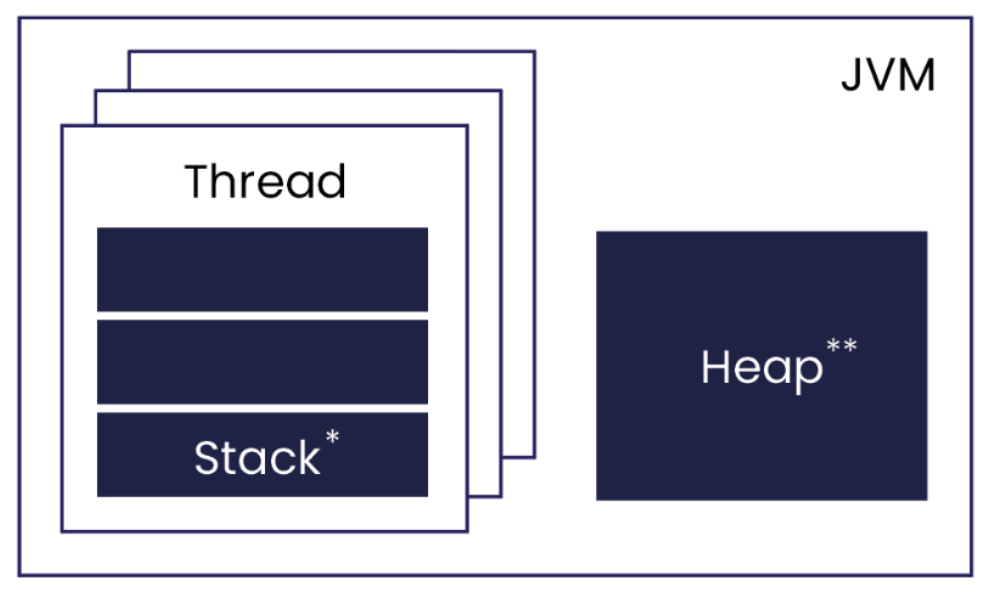
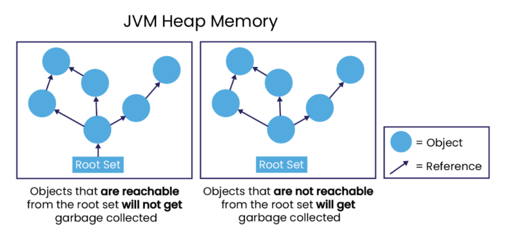
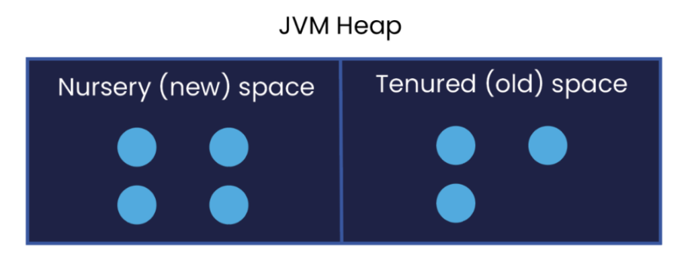

***Understanding memory management in Java, and particularly the role of object allocation is essential when optimising system performance.***

In Java, memory management is an automatic process that is managed by the Java Virtual Machine (JVM), and one that does not need explicit intervention. Java, being a block-structured language, uses a model where its memory is divided into two main types: stack and heap.

Local variables and method parameters use memory based on a 'stack'. This area of memory grows and shrinks automatically when a code block or method is entered or exited, respectively. In situations where a request is made to the system for an amount of memory, whose size is only known at runtime, or when creating an object, these requests are usually satisfied by an area of the process' memory known as 'dynamic memory' or the 'heap'. Strictly speaking -- there is an occasion when an object that may be destined for the heap is instead written to the stack, however we will leave this discussion for a later document.

These two memory areas are depicted below:

  

Figure 1. JVM Stack and Heap Memory Areas  

\*Where method parameters and local variables live

### Where objects live

NOTE: All threads in a program will have their own stack, but share a single heap. Threads also can have their own small heap buffer called a Thread Local Allocation Buffer (TLAB).

The issue with this dynamic heap memory is that memory must be released when the program is finished with it. Without this, the size of a process would grow until it reached a point where there were no more memory resources available. To help address this issue, when heap memory is becoming used up and an object is considered to no longer be required by the program, objects in Java have their memory reclaimed by a group of threads performing a task known as '[Garbage Collection](https://www.ibm.com/docs/en/ztpf/1.1.0.15?topic=management-garbage-collection "Garbage Collection")'.

In short, a programmer does not need to worry about releasing memory in Java.

Great! So why do I need to learn about it?

While this process is automatic in Java, this does not guarantee optimal system performance. By understanding how the memory management process works in Java, you can be more sympathetic to the JVM, and adjust your approach to object creation so that the load on the JVM and Garbage Collector is reduced, thereby achieving slight performance gains.

Aside from garbage collection, part of understanding Java memory management is grasping the process of 'object allocation'. As such, this article aims to explore what this is, and provides an analogy for object allocation. By understanding what it is and its role in memory management, you can better analyse how your system's performance might be affected by object allocation.

### Object Allocation and Garbage Collection

In Java, references are used to access objects, which are variables that hold the "address" of an area of memory in which the attributes of an object will be stored. This memory is allocated on the heap area.

When you declare a field or local variable, this is only a reference to an object on the heap, not the object itself. When it comes to creating an object, the required amount of memory is requested from the heap, and this object can then be accessed through the reference variable.

To note, as long as an object is "reachable", it is 'live' and the garbage collector cannot destroy it. When an object is no longer "reachable", this memory is eligible to be reclaimed for the heap by the garbage collector. Worth clarifying here is the concept of "reachability", an object's references must be reachable from something known as the "root set", as seen in Figure 2.

The root set includes all local variables and method parameters that are currently on all thread stacks. If two objects referenced each other, but could not be reached by the root set, they would be garbage collected.

  
*Figure 2. Object Reachability*

The time between an object's creation and the time it is destroyed is encapsulated by the term '[object lifetime](https://en.wikipedia.org/wiki/Object_lifetime "object lifetime")'. With 'short-lived' objects, these remain in a part of the heap memory known as the '[Nursery](https://docs.oracle.com/cd/E15289_01/JRSDK/garbage_collect.htm#i1087437 "Nursery")', this is also known as the 'Young Space', or as 'Eden'. With longer living objects, typically these are moved to the part of the heap known as 'Tenured' (the 'Old Space') in order to free up the nursery for new objects to be allocated.

It's worth mentioning that in most programs, most objects that are created are short-lived; in other words, they are created and freed up relatively quickly so they never reach the Tenured space. In any case, garbage collection usually happens when there is the need for more memory to be freed. The Nursery is where more objects are allocated, these are generally short-lived, and as it's typically a smaller region, cleaning up the Nursery is much faster than cleaning up the Tenured space.

It is important to aim for either short lived objects that have a lifetime shorter than the time between young collections, or that they live for the life of the program in Tenured space, as this reduces overhead on the overall application.

In the case that object allocation is very low, and the heap is sized appropriately for a system, garbage collection happens so rarely that it doesn't impact the running of the application, which is something that we aim for at [Chronicle](https://chronicle.software/ "Chronicle"). For more details on the different areas of memory and how objects are stored in them, see [here](https://docs.oracle.com/cd/E13150_01/jrockit_jvm/jrockit/geninfo/diagnos/garbage_collect.html "here").

  
*Figure 3. Nursery and Tenured space within the JVM Heap*

In short, when field and local variables are declared, in your class only enough memory is allocated for the reference. The reference is usually 4 or 8 bytes per object, regardless of the size of the object itself, which is allocated elsewhere on the heap. Object allocation is the process of allocating object memory, which is allocated when the 'new' operator is used.

Still unclear? Let's take a look at an analogy.

### Analogy

To illustrate object allocation, let's imagine a set of shelves, which you want to add your coffee mugs to:

  
*Image 1. Mugs organised on a shelf, representing objects in a system*

Each coffee mug represents an object in a system, and the person organising the shelves can symbolise the JVM managing memory. Similar to a computer's memory having limited space, the shelf too has limited capacity for storing your mugs.

When you decide you want to put a new mug on the shelf, you firstly need to ensure that there is enough room for this mug on the shelf. In the case that there is no space for the mug, you can't proceed. If there is space, you look for the first available space that is large enough for your mug and start from the same point every time, perhaps always starting from the bottom shelf.

Mugs that no longer need to be stored will be collected for reuse (removed). This frees up space for future mugs that we may want to store on the shelves. For further efficiency, we could then rearrange the remaining mugs so that there is space again at the bottom of the shelves, in preparation for future mugs.

Likewise, when an object is created in Java, the JVM must first determine if there is memory space ('shelf space') for it. If there is space, object allocation can continue as there is memory that can be allocated to it. To ensure that there is enough memory, the JVM will run the garbage collector when it decides that memory is becoming more scarce, similar to if we are noticing that there is not a lot of space left on our shelves.

The garbage collector rearranges objects in the allocated memory of the nursery so that there is space at the beginning of the Nursery. An even more clever feature of the garbage collector is that it knows how many times it has checked and found an object that is still being used. When this number passes some threshold, the object is moved to a different part of the heap; the Tenured region. In our shelf analogy, this would be like moving the long-standing mugs to further up the shelves, which frees up the bottom shelf for new mugs to be added.

The reason for doing this in memory management is so that enough memory can be made available for allocations by scanning only the Nursery (only the bottom shelf) rather than the whole heap. Sometimes the garbage collector must look at, and collect from, the Tenured region, but this should happen less frequently than checking just the nursery. With this approach, garbage collection does not create such large overhead to performance.

If you kept buying mugs that needed storing, you would quickly run into the issue of not having enough shelf space. Comparably, if a program uses up all available memory without careful object lifecycle management, performance issues arise. What we want to avoid is a scenario where we need memory from the Nursery for an object (or space on the bottom shelf for a new mug) but this is not available. If this happens, the program has to stop everything so that objects that need retaining can be copied and all the memory in the Nursery can be released. At [Chronicle](https://chronicle.software/ "Chronicle"), to make this copying process cheaper, we aim to create less objects in the first place, or have almost all objects die in the first region so that they do not need copying.

### Conclusion

This article offered an introduction to memory management in Java, as well as a simple analogy of object allocation, and why it is important to consider.

Enabling the JVM to efficiently manage dynamic memory is fundamental to ensuring optimal system performance.

For further details on potential costs of object creation in the process of object allocation, [this article](https://chronicle.software/java-is-very-fast/ "this article") explores why it can be worth avoiding excessive, unnecessary object creation when building low-latency applications in Java. For other articles that were consulted, see below.

#### Articles

1. [How Object Reuse can Reduce Latency and Improve Performance](https://chronicle.software/how-object-reuse-can-reduce-latency-and-improve-performance/ "How Object Reuse can Reduce Latency and Improve Performance")
2. [Chronicle Wire: Object Marshalling](https://chronicle.software/chronicle-wire-object-marshalling/ "Chronicle Wire: Object Marshalling")
3. [Unix Philosophy for Low-Latency](https://chronicle.software/unix-philosophy-for-low-latency/ "Unix Philosophy for Low-Latency")
