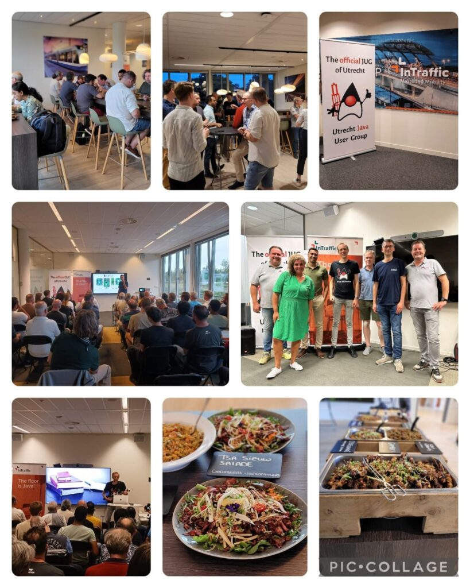

On September 12th, I was invited to speak at the Utrecht JUG together with Hanno Embrechts.

That was an ideal moment to grab my camera and microphones to interview the organisers and some of the guests.

So, this is a bit of a special edition of the Foojay Podcast as it's also available with video!

An experiment that brought me great pleasure. I hope you like it too!

So… let's time travel and get back to Utrecht when I got the organizers before the camera just minutes before the first guests arrived!

### Video



## Podcast Apps

You can listen and subscribe to the Foojay Podcast on:

* [Spotify](https://open.spotify.com/show/6CpTfgn9LirzJGAtc4ICdQ)
* [Apple Podcasts](https://podcasts.apple.com/be/podcast/foojay-io-the-friends-of-openjdk/id1652281304)
* And most others...

## Guests

### Michel van Dongen

* [https://www.linkedin.com/in/michelvandongen/](https://www.linkedin.com/in/michelvandongen/%0A)
* <https://twitter.com/VanDongenM>

### Willem van de Griendt

* <https://www.linkedin.com/in/willemvandegriendt/>
* <https://twitter.com/Willemvdg>

### Elias Nogueira

* <https://www.linkedin.com/in/eliasnogueira/>
* <https://twitter.com/eliasnogueira>

### Gerard Meijwaard

* [https://www.linkedin.com/in/gerard-meijwaard-83a5827/](https://www.linkedin.com/in/gerard-meijwaard-83a5827/%0A)
* <https://twitter.com/GerardMei>

### Hanno Embregts

* <https://www.linkedin.com/in/hannoembregts/>
* [https://twitter.com/hannotify](https://twitter.com/hannotify%0Ahttps://foojay.social/@hannotify)
* [https://foojay.social/@hannotify](https://twitter.com/hannotify%0Ahttps://foojay.social/@hannotify)

## Podcast

### Host: Frank Delporte

* <https://foojay.social/@frankdelporte>
* <https://twitter.com/FrankDelporte>

## Links

* <https://www.meetup.com/Utrecht-Java-User-Group/>
* <https://www.linkedin.com/company/javautrecht/>
* <https://twitter.com/utrechtjug>

## Content

00:00 Intro  

00:45 Michel van Dongen about the history and organisation of UtrechtJUG  

03:10 Impact of Covid and meeting in person  

04:24 Motivation to organise a JUG  

05:57 Relationship with NLJUG and other Dutch JUGs  

07:18 Willem van de Griendt about his role in UtrechtJUG  

08:23 Why Willem loves the Java community  

09:40 What to learn from JUG events  

10:56 Future plans for UtrechtJUG  

12:05 Guests are arriving  

12:18 Interview with guest, Elias Nogueira  

13:27 Interview with guest, Gerard Meijwaard  

14:40 Introduction of Hanno Embregts  

16:01 About speaking at JUGs and conferences  

16:47 Being editor of the NLJUG Java Magazine  

18:11 Hanno on stage  

18:30 Outro
