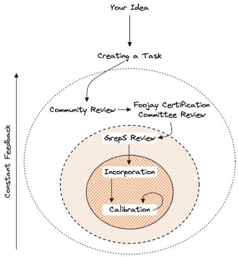

### ***The recent announcement of Foojay's intention to create a community-driven certification exam for Java software development has spurred a lot of interest. This article explains how any member of the Java community can participate in the creation of tasks for the certification.***

**In the [previous article](https://foojay.io/today/foojay-developer-certification-measure-skills/ "previous article") about the Foojay Developer Certification, we introduced the need for an objective way to measure the skills of Java developers. While there are many assessments and certifications that test the theoretical knowledge of a developer, very few measure the practical ability to write code, find and fix bugs and apply proper design principles. As a community, we have a large collection of de facto best practices and common sense about what makes a developer good at their job. That is why we need your help in creating a certificate that actually communicates a Developer's skill.**

Right from the start, we planned on including community members in the creative process that is necessary to create the tasks that will be used to certify the skill level of a developer. In such a process, it is important to maintain a balance between openness and quality. In order to make sure the certification can be held to the highest standards, we are proposing a process that allows you to submit your idea for a task.

## The Process

Any community member can come up with an idea for a task. This allows for everyone to contribute ideas from their own expertise and help build the variety of tasks that makes up a good certification test. At this point we are not yet offering any categories to which tasks must conform, so any idea really is welcome.

There is an inherent contradiction between open sourcing the creation of a certification test and keeping the actual tests confidential. The final result will have to be treated as confidential so people cannot game the system. To overcome this obstacle to the creation of tasks, we have come up with a process that makes the actual source of the tasks available to a decreasing number of people as it progresses towards incorporation into tests.

The diagram below outlines this process and visualizes it as an outside-in flow. Each circle is a smaller context of people with access to the source and with each advancement, the task comes closer to incorporation into the actual testing environment.

To bring your idea into the certification exams, it will have to go through these steps:

1. **Inception** - You think of a great task
2. **Creation** - You create a project that follows the Task Format and think about what solutions would be considered "good"
3. **Community Review** - You submit the task for community review, accept review and possibly perform some tweaking
4. **FCC Review** - The task is submitted to the Foojay Certificationi Committe for review and may undergo some changes
5. **GrepS Review** - If the task has been selected for inclusion, it will go through one final round of review at the GrepS-platform. Changes here will be to make sure the task can operate properly inside the platform
6. **Incorporation** - The task has been incorporated into the platform. When the task is new, it will enter a phase of calibration and finally become part of the scoring process

## The Task Format

Since we are using the GrepS platform to determine the skills of candidates, we need to create tasks that fit into this platform. At the FCC (Foojay Certification Committee), we are in the process of providing a repository containing a skeleton project with the basic layout. It will also include a README explaining the structure in more depth than this post allows.

In this post, I will provide an overview of the components inside a task-project, to give you an idea of what needs to be created for your idea to become part of the certification.

* `description/` - A folder containing Markdown files, which explain the idea behind the task and give instructions to the test-taker. There is a naming strategy that allows different files to be displayed at each sub-task.
* `src/` - This folder contains the source files that will be copied into the workspace of the candidate and is sometimes referred to as the "initial" code for the project.
* `src_common/` - This folder contains sources that are part of the initial code given to a candidate and a part of the solution. A candidate may not alter these files, but they are copied into the workspace, so they can be referenced from the initial code of the project.
* `src_solution/` - A reference solution for the task which also has access to the files in the `src_common` folder. The sources in this folder combined with the common sources are used during development to ensure the unit tests are working properly and they are available when reviewing a candidate's work.
* `test/` - Test code for automated tests that will initially be executed towards the reference solution.
* `test_extra/` - Additional code that will allow tests in the `test/` folder to be compiled against the initial code of the project (i.e. files that a candidate is expected to create).
* Score definition – A file containing the description of the scoring of a task. This is defined using a DSL that allows for the use of different "graders", able to assign a partial score through analysis of the solution (e.g. number of correct tests, specific test outcomes, etc).
* Workflow definition – A file containing the flow of the entire task. A DSL allows you to define the number of sub-tasks, which instruction file to show, which files to copy into the candidate's workspace, how much time they have etc.

## Your Contributions

The above description should be enough to give you the ability to generate ideas for tasks. That then raises the question of what sort of tasks would be good submissions. The GrepS-platform is based on the science that developer skill is best tested using regular, everyday tasks that any developer would do as part of their day job. While some consider it fun to create algorithms for balanced trees, those tasks actually are not the best indicators.

It is better to create small projects that perform some simplified task in a (possibly fictional) domain and ask a candidate to either add a feature to it, or solve a bug that is hidden in there. Please do keep in mind the code should be safe to execute and while the use of dependencies is possible, the fewer dependencies, the more stable your task will be.

While you are coming up with ideas, it is also a good idea to think about how the particular task can be best graded. The GrepS-platform is capable of automated grading for a lot of types of tasks. Creating a series of unit tests that check if a candidate has fixed an issue, or to see if they caught a potential regression in time are excellent ways to allow for automatic scoring. In some cases however, automatic scoring is not enough and it might be necessary to include a manual grading. In that case, we need quantifiable questions that say something about the quality of the submission and that a human grader should be able to answer by looking at the code.

Finally, to give the calibration of a new task an initial value, it needs a number representing how difficult/complex the task is. This number should be relative to other tasks already in the platform. Once the GrepS-platform has started collecting actual data, this number will be refined automatically.

We will be setting up the processes described above and supply you with names of people responsible for reviewing tasks. In the meantime, you can always contact us through the Foojay Slack.

We can't wait to see what tasks you come up with!
