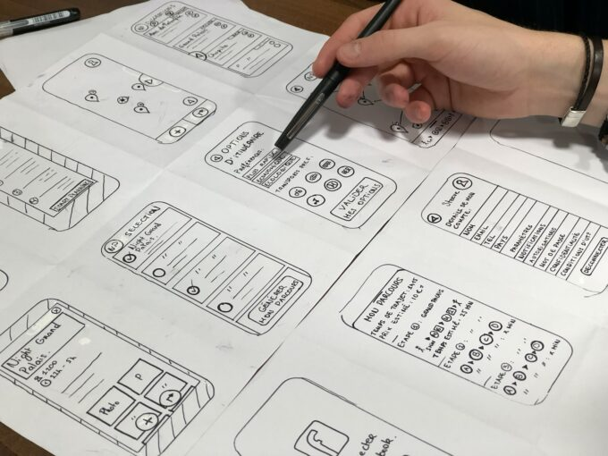

Design patterns plays a pivotal role in designing and solving the commonly occurring problems in software application. It is guiding principle or template to the solve any designing problems.

It applies to the Microservices architectural style as well. These patterns provide a structured approach to designing and implementing Microservice architectures, ensuring **scalability** , **maintainability** , and **reusability**. By adhering to these design patterns, developers can proficiently tackle the common challenges encountered during Microservices development.

  

Source: unsplash

Patterns for the design of Microservices has been broadly divided into five categories

* Decomposition Patterns
* Integration Patterns
* Database Patterns
* Observability Patterns
* Cross-cutting Concern Patterns

The decomposition patterns can be further categorized into four distinct patterns, namely:

1. Decomposition based on business capability
2. Decomposition based on business subdomain
3. Self-contained service
4. Service per team

In the upcoming section, let us engage in a sequential discussion of each topic individually.

## 1.1 Decompose by business capability

In a microservice architecture, we will decompose the services based on business capabilities.  

A business capability is a fundamental concept in business architecture modelling, referring to the specific activities that a business undertakes to create values architecture modelling.

By decomposing based on business capability, we will achieve the cohesive, loosely coupled, and stable servcies. These services can be developed, tested, and deployed independently. Each of the decomposed services adheres to the following design principles [Single Responsiblity Principle](https://en.wikipedia.org/wiki/Single-responsibility_principle "Single Responsiblity Principle") and [Common Closure Principle (CCP)](http://https://blog.devgenius.io/common-closure-principle-the-story-of-an-evolving-architecture-6919b452c8db "Common Closure Principle (CCP)").

Nowadays most of the enterprise applications developed through the Agile methodology, where each service is independently developed by a cross-functional team that is committed to delivering business capabilities

One of the challenges tasks is to identity the business capabilities for the service. It is neccessary to utilize the bounded context based on the organizational strucuture and high-level domain model.

## 1.2 Decompose by business subdomain

Decomposing based on business subdomain which is extension to the business capabilty one. In Domain-Driven Design (DDD) pertains to the problem space of the application, specifically the business domain. A domain comprises various sub domains, each representing a distinct aspect of the business.

Each of the subdomain service also developed through the Agile methodlogy, each service can be indpendently developed a cross-functional team that is committed to delivering business capabilities.  

Like identifying business capabilities, identifying sub domains is quite challenging task.

## 1.3 Self-contained service

In both monolithic and microservices architectures, services requests are typically executed either synchronously or asynchronously.

In a synchronous request, a service request will remain in a waiting state until the transaction is completed, at which point the response is returned to the client. Therefore, upon making a request, we must await a successful response in order to proceed with fulfilling the request. Failure to do so would negatively impact the customer experience while using the product.

In order to circumvent synchronous communications, one can depend on design patterns such as the CQRS Pattern and Saga Pattern, which will be further elaborated upon in forthcoming articles.

On the contrary, in an asynchronous request, a service request is executed intermittently by first transmitting a status update concerning the availability of the service, and subsequently processing the remaining request.

## 1.4 Service per team

Currently, a majority of enterprise applications operate on Agile Methodologies such as Scrum. Through the utilization of Scrum, a dedicated team can be established to assume responsibility for a specific business capability-based and sub domains.

This approach enables the attainment of high-performance, loosely coupled, small team, autonomous, and cross-functional capabilities.

The Integration Patterns can be further categorized into three distinct patterns, namely:

1. API Gateway Pattern
2. Service Aggregator Pattern
3. Client-Side UI Composition Pattern

## 2.1 API Gateway Pattern

Nowadays, the majority of the applications we are currently developing are designed for various user interface (UI) interfaces, such as desktop, mobile, and tablet versions. Consequently, users can access these applications from any of these UI interfaces. Depending on the UI interface being used, the response from the underlying services may vary, as desktop applications may require more fields compared to their mobile counterparts.

In order to achieve this functionality, it is necessary to implement the API Gateway pattern. This pattern allows us to configure throttling, rate-limiting, and handle requests with an appropriate routing mechanism. As a result, the API Gateway becomes the single point of entry for all requests.

In fact, it is possible to create separate API Gateway services for web applications, mobile applications, and third-party applications.

## 2.2 Service Aggregator Pattern

The aggregator pattern, within the context of microservice architecture, serves to amalgamate the responses obtained from various autonomous microservices. By adopting this pattern, the burden of communication between the client and services is diminished. Moreover, it enables the consolidation of distinct functionalities in a manner that is readily understandable from an architectural perspective.

This particular pattern finds extensive application in e-commerce applications, particularly for the purpose of retrieving data from the backend systems.

## 2.3 Client-Side UI Composition Pattern

In the microservices architecture, the majority of applications are constructed using business capabilities or sub-domains, with each respective team being accountable for the user experience.

By utilizing React/Angular technologies, we are able to construct screens/pages based on components, which internally communicate with multiple backend services and present the aggregated outcomes in user interface interfaces.

In the subsequent article, we will delve into the remaining microservice design patterns.

<https://microservices.io/>
