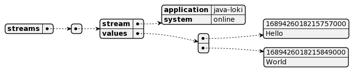
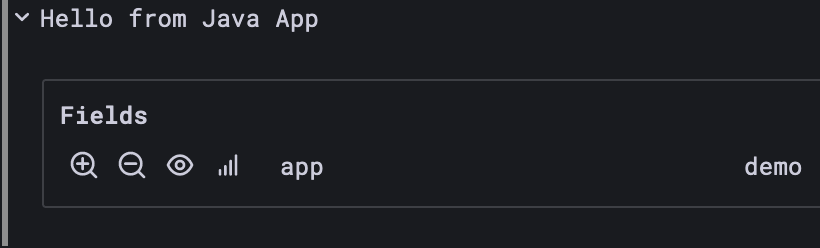
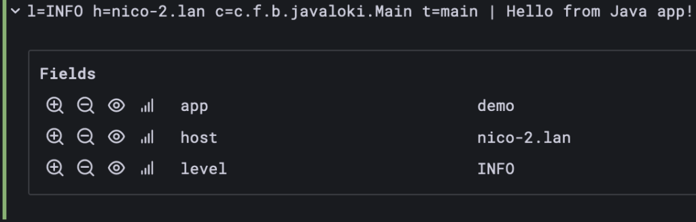
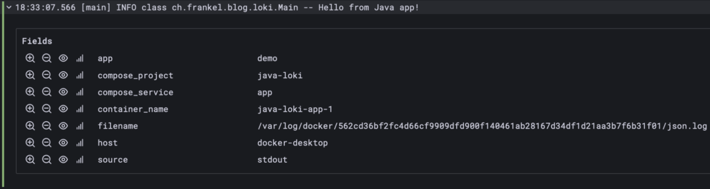

**One of my current talks focuses on Observability in general and Distributed Tracing in particular, with an [OpenTelemetry](https://opentelemetry.io/) implementation. In the demo, I show how you can see the traces of a simple distributed system consisting of: the Apache APISIX API Gateway, a Kotlin app with Spring Boot, a Python app with Flask, and a Rust app with Axum.**

Earlier this year, I spoke and attended the Observability room at FOSDEM. One of the talks demoed the Grafana stack: Mimir for metrics, Tempo for traces, and Loki for logs. I was pleasantly surprised how one could move from one to the other. Thus, I wanted to achieve the same in my demo but via OpenTelemetry to avoid coupling to the Grafana stack.

In this blog post, I want to focus on logs and Loki.

Loki basics and our first program {#h2-0-loki-basics-and-our-first-program}
---------------------------------------------------------------------------

At its core, Loki is a log storage engine:
> Loki is a horizontally scalable, highly available, multi-tenant log aggregation system inspired by Prometheus. It is designed to be very cost effective and easy to operate. It does not index the contents of the logs, but rather a set of labels for each log stream.
>
> [Loki](https://grafana.com/oss/loki/)

Loki provides a [RESTful API](https://grafana.com/docs/loki/latest/api/) to store and read logs. Let's push a log from a Java app. Loki expects the following payload structure:



I'll use Java, but you can achieve the same result with a different stack. The most straightforward code is the following:

```java
public static void main(String[] args) throws URISyntaxException, IOException, InterruptedException {
    var template = "'{' \"streams\": ['{' \"stream\": '{' \"app\": \"{0}\" '}', \"values\": [[ \"{1}\", \"{2}\" ]]'}']'}'"; //1
    var now = LocalDateTime.now().atZone(ZoneId.systemDefault()).toInstant();
    var nowInEpochNanos = NANOSECONDS.convert(now.getEpochSecond(), SECONDS) + now.getNano();
    var payload = MessageFormat.format(template, "demo", String.valueOf(nowInEpochNanos), "Hello from Java App");           //1
    var request = HttpRequest.newBuilder()                                                                                  //2
            .uri(new URI("http://localhost:3100/loki/api/v1/push"))
            .header("Content-Type", "application/json")
            .POST(HttpRequest.BodyPublishers.ofString(payload))
            .build();
    HttpClient.newHttpClient().send(request, HttpResponse.BodyHandlers.ofString());                                         //3
}
```


1. This is how we did String interpolation in the old days
2. Create the request
3. Send it

The prototype works, as seen in Grafana:



However, the code has many limitations:

* The label is hard-coded. You can and must send a single label
* Everything is hard-coded; nothing is configurable, e.g., the URL
* The code sends one request for every log; it's hugely inefficient as there's no buffering
* HTTP client is synchronous, thus blocking the thread while waiting for Loki
* No error handling whatsoever
* Loki offers both gzip compression and Protobuf; none are supported with my code
* Finally, it's completely unrelated to how we use logs, *e.g.* :

  ```java
  var logger = // Obtain logger
  logger.info("My message with parameters {}, {}", foo, bar);
  ```

Regular logging on steroids {#h2-1-regular-logging-on-steroids}
---------------------------------------------------------------

To use the above statement, we need to choose a logging implementation. Because I'm more familiar with it, I'll use SLF4J and Logback. Don't worry; the same approach works for Log4J2.

We need to add relevant dependencies:

```xml
<dependency>
    <groupId>org.slf4j</groupId>
    <artifactId>slf4j-api</artifactId>             <!--1-->
    <version>2.0.7</version>
</dependency>
<dependency>
    <groupId>ch.qos.logback</groupId>
    <artifactId>logback-classic</artifactId>       <!--2-->
    <version>1.4.8</version>
    <scope>runtime</scope>
</dependency>
<dependency>
    <groupId>com.github.loki4j</groupId>
    <artifactId>loki-logback-appender</artifactId> <!--3-->
    <version>1.4.0</version>
    <scope>runtime</scope>
</dependency>
```


1. SLF4J is the interface
2. Logback is the implementation
3. Logback appender dedicated to SLF4J

Now, we add a specific Loki appender:

```xml
<appender name="LOKI" class="com.github.loki4j.logback.Loki4jAppender">                   <!--1-->
    <http>
        <url>http://localhost:3100/loki/api/v1/push</url>                                 <!--2-->
    </http>
    <format>
        <label>
            <pattern>app=demo,host=${HOSTNAME},level=%level</pattern>                     <!--3-->
        </label>
        <message>
            <pattern>l=%level h=${HOSTNAME} c=%logger{20} t=%thread | %msg %ex</pattern>  <!--4-->
        </message>
        <sortByTime>true</sortByTime>
    </format>
</appender>
<root level="DEBUG">
    <appender-ref ref="STDOUT" />
</root>
```


1. The loki appender
2. Loki URL
3. As many labels as wanted
4. Regular Logback pattern

Our program has become much more straightforward:

```java
var who = //...
var logger = LoggerFactory.getLogger(Main.class.toString());
logger.info("Hello from {}!", who);
```


Grafana displays the following:



Docker logging {#h2-2-docker-logging}
-------------------------------------

I'm running most of my demos on Docker Compose, so I'll mention the Docker logging trick. When a container writes on the standard out, Docker saves it to a local file. The `docker logs ` command can access the file content.

However, other options than saving to a local file are available, *e.g.* , `syslog`, Google Cloud, Splunk, etc. To choose a different option, one sets a logging driver. One can configure the driver at the overall Docker level or per container.

Loki offers its own [plugin](https://grafana.com/docs/loki/latest/clients/docker-driver/). To install it:

```bash
docker plugin install grafana/loki-docker-driver:latest --alias loki --grant-all-permissions
```

At this point, we can use it on our container app:

```yaml
services:
  app:
    build: .
    logging:
      driver: loki                                                    #1
      options:
        loki-url: http://localhost:3100/loki/api/v1/push              #2
        loki-external-labels: container_name={{.Name}},app=demo       #3
```


1. Loki logging driver
2. URL to push to
3. Additional labels

The result is the following. Note the default labels.



Conclusion {#h2-3-conclusion}
-----------------------------

From a bird's eye view, Loki is nothing extraordinary: it's a plain storage engine with a RESTful API on top.

Several approaches are available to use the API.

Beyond the naive one, we have seen a Java logging framework appender and Docker.

Other approaches include scraping the log files, *e.g.*, Promtail, via a Kubernetes sidecar.

You could also add an Opentelemetry Collector between your app and Loki to perform transformations.

Options are virtually unlimited. Be careful to choose the one that fits your context the best.

**To go further:**

* [Push log entries to Loki via API](https://grafana.com/docs/loki/latest/api/#push-log-entries-to-loki)
* [Loki Clients](https://grafana.com/docs/loki/latest/clients/)


*Originally published at [A Java Geek](https://blog.frankel.ch/logs-loki/) on August 27^th^, 2023*
