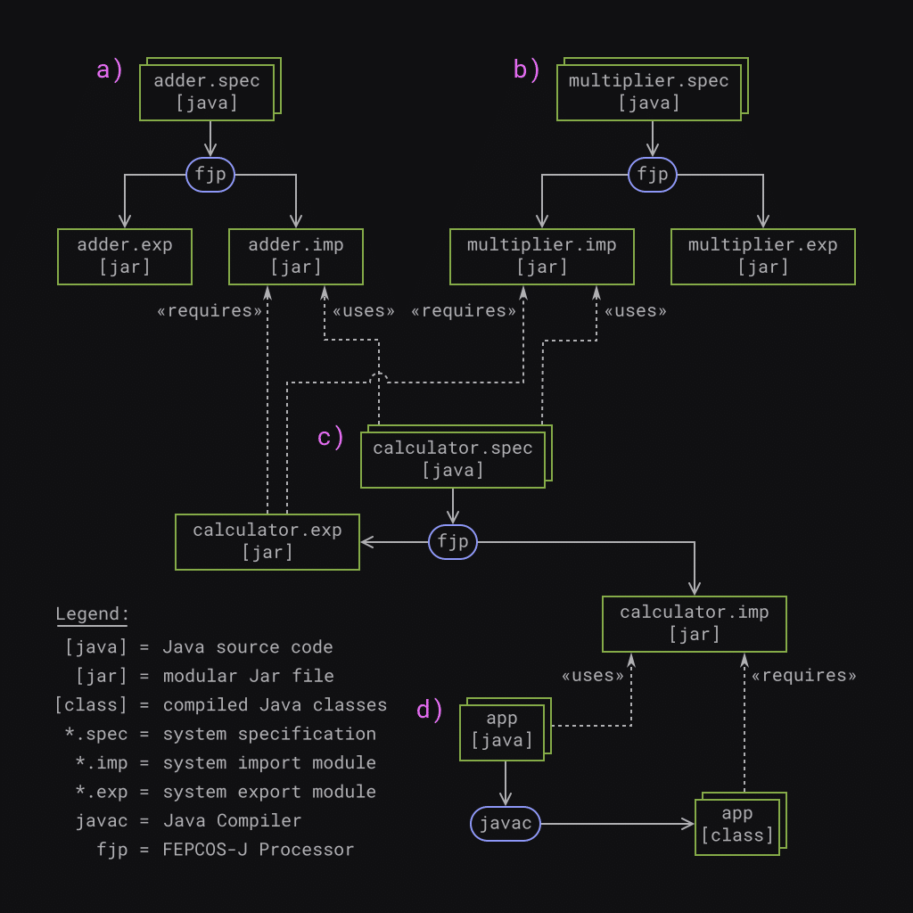
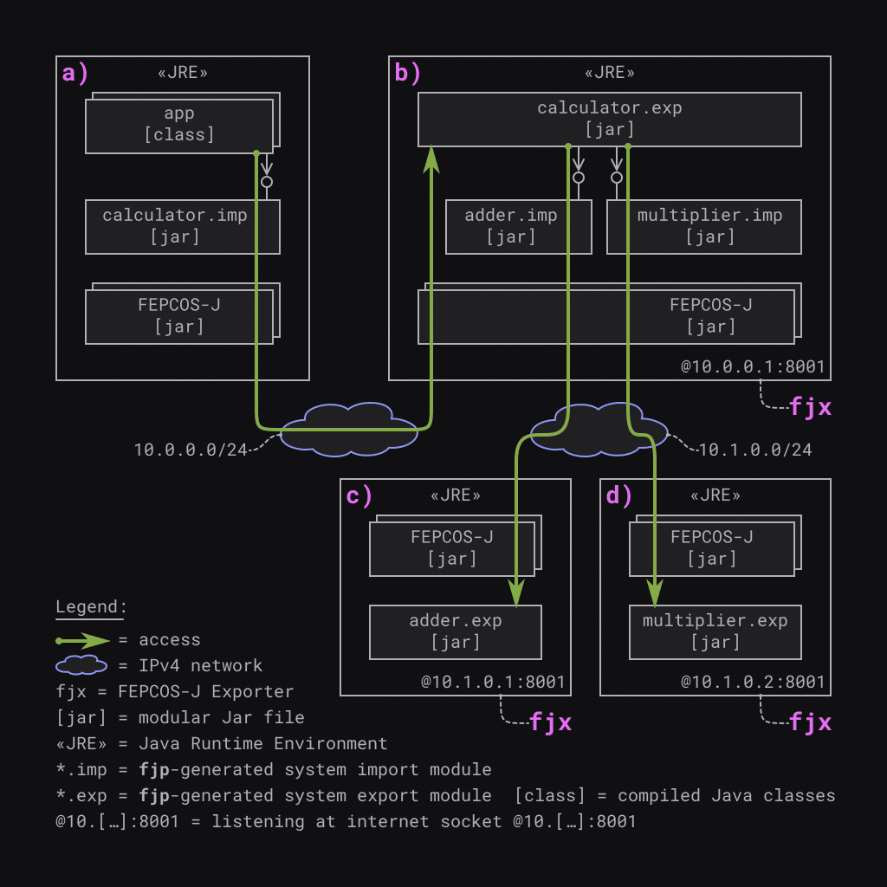
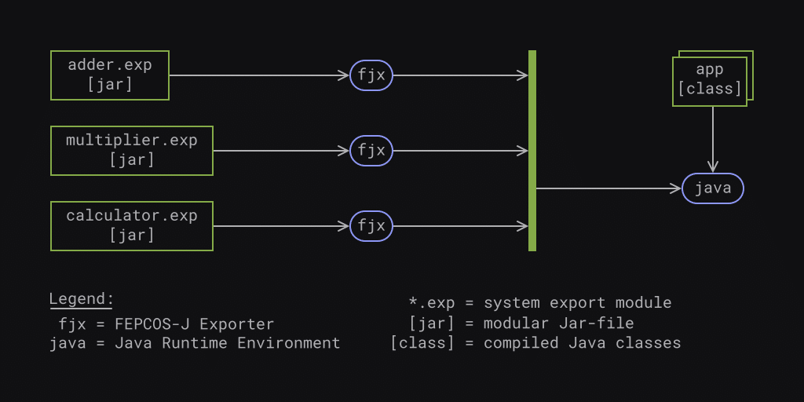
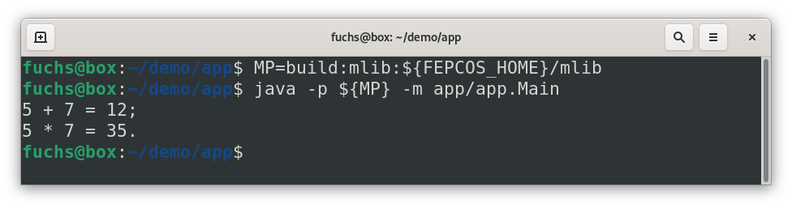

**FEPCOS-J implements a model-based Java language extension that provides the annotation *@Part*, which enables a developer to declaratively compose networked systems. This post introduces the concept and gives you an example of how to use it.**

**Please help me to make FEPCOS-J a Free/Libre and Open-Source Software (FLOSS).**

## Introduction

FEPCOS-J arises in the frame of the FEPCOS-Project [\[1\]](#references), which aims to simplify the programming of composed networked systems.

FEPCOS-J implements a domain-specific Java language extension whose semantic domain is based on the FEPCOS-Model [\[2\]](#references), which extends the composite design pattern [\[3\]](#references) to include networking aspects.

According to the model, a composed networked system is a whole that communicates with its parts via a network. The parts are either basic systems -- the fundamental building blocks -- or other composed networked systems.

My [last post](https://foojay.io/today/fuchs-2023-fepcos-j-01/) explains the exemplary realization of a basic system called *adder*. I have shown you how to:

* program the system specification of a basic system in Java by using FEPCOS-J's annotations *@SYDec* , *@Cap* , *@AYSpec* , *@In* , *@Out* , and *@Behvior*;
* use the FEPCOS-J Processor ***fjp*** to generate a system export module, a system import module, and the system documentation;
* provide access to the system specification within a private IPv4 network by using the FEPCOS-J Exporter ***fjx*** and the system export module;
* access the system specification via an IPv4 network by using jshell and the system import module.

This post extends the example and explains the exemplary realization of a composed networked system called *calculator* . In brief, an application called *app* accesses *calculator* , which uses *adder* and another basic system called *multiplier* as parts.

The post is organized as follows: Firstly, the post introduces [how to use FEPCOS-J to declaratively compose networked systems in Java](#sec1). Afterwards, it explains an [example scenario](#sec2), followed by its [realization](#sec3), [deployment](#sec4), and [execution](#sec5). Finally, it draws a [conclusion](#sec6).

I would also like to ask you to [help me to make FEPCOS-J a Free/Libre and Open-Source Software (FLOSS)](#help).

## Use FEPCOS-J to declaratively compose networked systems in Java

FEPCOS-J enables a Java developer to compose networked systems like building blocks. Having programmed a system as described in my previous post, the developer can use the ***fjp***-generated system interface to compose other systems. This means that systems become parts of other systems.

### FEPCOS-J provides the annotation *@Part* to declare a part of a system

Within the system declaration, the annotation *@Part* allows the developer to declare the parts of a system.

Example:

```java
//…
@SYDec("…")
class SY {
    @Part(ip = "10.0.0.1", port = 8001) foo.S bar;
    @Cap AY usePart;
    // …
}
```

Within the fragment of a system declaration above,

```java
@Part(ip = "10.0.0.1", port = 8001) foo.S bar;
```

declares a system's part named

```java
bar
```

, accessible via internet socket 10.0.0.1:8001 by using the ***fjp*** -generated system interface

```java
foo.S
```

. Further,

```java
@Cap AY usePart;
```

declares a capability

```java
usePart
```

realized by the activity specification

```java
AY
```

to demonstrate how to access the part in the following.

### Declared parts are accessible within activity specifications

The method that specifies the desired behavior of an activity is annotated with *@Behavior* within an activity specification. This method can accept the system declaration as a parameter, which provides access to the declared parts.

Example:

```java
// …
@AYSpec("…")
class AY {
    // …
    @Behavior
    void go(SY sy) throws Exception {
        var r1 = sy.bar.b.soSth(/* … */); // blocking access
        var r2 = sy.bar.c.soSth(/* … */); // concurrent access
    }
}
```

Within the fragment of the activity specification above, the method

```java
@Behavior() void go(SY sy) throws Exception { … }
```

accepts the system declaration

```java
SY sy
```

as a parameter.

As described above,

```java
sy.bar
```

is the member variable of the part, which has the type

```java
foo.S
```

, a ***fjp*** -generated system interface. Thus,

```java
sy.bar
```

provides blocking access via

```java
sy.bar.b
```

and concurrent access via

```java
sy.bar.c
```

. In this example, the part's assumed capability is

```java
doSth(/* … */)
```

.

### The developer declares a system, and FEPCOS-J generates code for him

To sum up, a developer declares a part of a system by using the annotation *@Part* and specifying an IPv4 address, a port, a ***fjp***-generated system interface, and the name of a member variable.

To point out, the developer does not instantiate the system interface. FEPCOS-J, generates the required code.

## Example scenario realized by using FEPCOS-J

### A typical use-case scenario for FEPCOS-J

A composed networked system is a whole that accesses the capabilities of its parts, which are realized as basic systems, via an IPv4 network.

Further, the composed networked system provides its capabilities to a system user via another IPv4 network. This means the composed system is a **kind of facade** that makes its complexity transparent to the system user.

### Exemplary realization

The following post describes an example scenario that realizes the use-case depicted in **Fig. 1** : The composed networked system is called *calculator* . Its parts are the two basic systems: *adder* and *multiplier* . The system user is called *app*.  

{{< img src="fuchs2023-fepcos-j-example-use-case-510x510.png" class="aligncenter size-medium" alt="A networked system calculator provides its capabilities within an IPv4 network to a system user app. Moreover, calculator is a composed networked system, as it is a whole that accesses the capabilities of its parts, the two basic systems, adder and multiplier, via another IPv4 network." width="510" height="510" caption="Fig. 1) A typical use-case scenario for FEPCOS-J: A networked system calculator provides its capabilities within an IPv4 network to a system user app. Moreover, calculator is a composed networked system, as it is a whole that accesses the capabilities of its parts, the two basic systems, adder and multiplier, via another IPv4 network." >}}

**Fig. 2** and **Fig. 3** illustrate the details: *adder* provides the capability to add two numbers. *multiplier* provides the capability to multiply two numbers. *calculator* provides both capabilities for *app* and delegates the requests to the corresponding parts.  
 **Fig. 2) Example scenario, in brief:** A composed system calculator consists of two parts, which are the basic systems *adder* and *multiplier* . Both the composed system and the basic systems can execute activities: Firstly, *adder* can execute *add(x,y)* . Secondly, *multiplier* can execute *mul(x,y)* . Finally, *calculator* can execute *add(x,y)* and *mul(x,y)* . A system user named *app* accesses *calculator* . This causes *calculator* to access *adder* or *multiplier*, thereupon. Both the composing and the accessing are realized via IPv4 networks.  
 **Fig. 3) Example scenario, in detail:** A composed system *calculator* is connected to two separate IPv4 networks: *app* and *calculator* communicate within 10.0.0.0/24; *calculator* and its parts, *adder* and *multiplier* , communicate within 10.1.0.0/24. The systems provide their capabilities via internet sockets: *adder* provides *add(x,y)* via 10.1.0.1:8001; *multiplier* provides *mul(x,y)* via 10.1.0.2:8001; *calculator* provides both *add(x,y)* and *mul(x,y)* via 10.0.0.1:8001.

## FEPCOS-J based realizing of the example scenario

### Development workflow

**Fig. 4** illustrates the development workflow, which realizes the example scenario. The basic systems *adder* and *multiplier* can be realized independently of each other. The composed system *calculator* requires *adder* and *multiplier* . The system user *app* requires *calculator*.  
 **Fig. 4) Development workflow: a)** realize the basic system *adder* ; **b)** realize the basic system *multiplier* ; **c)** realize the composed system *calculator* ; **d)** realize the system user *app*.

The following provides an overview of the development process:

**a)** Implement the basic system *adder* as described in my last post: program the system specification *adder.spec* in Java; generate the system export module *adder.exp.jar* and the system import module *adder.imp.jar* by using ***fjp***.

**b)** Analogous to *adder* , implement the basic system *multiplier* : program the system specification *multiplier.spec* in Java; generate the system export module *multiplier.exp.jar* and the system import module *multiplier.imp.jar* by using ***fjp***.

**c)** Implement the composed system calculator: program the system specification *calculator.spec* in Java by using *adder.imp.jar* and *multiplier.imp.jar* ; use ***fjp*** to generate the system export module *calculator.exp.jar* and the system import module *calculator.imp.jar* . As a result, *calculator.exp.jar* requires *adder.imp.jar* and *multiplier.imp.jar* .

**d)** Implement the system user *app* : program the application *app* in Java by using *calculator.imp.jar* ; use ***javac*** to compile the source code and generate the corresponding class files that require *calculator.imp.jar*.

The next subsections describe the individual implementations.

### Implementing the basic system *multiplier*

The developer realizes *multiplier's* system specification within the directory *multiplier* . The source code is in the subdirectory *src* and consists of the module information *module-info.java* , the system declaration *SY.java* , and the activity specification *Multiply.java*.

```
multiplier/
└── src
    ├── module-info.java
    └── multiplier
        └── spec
            ├── Multiply.java
            └── SY.java

3 directories, 3 files
```

```java
module multiplier.spec {
    requires static fepcos.annotations;
}
```

```java
package multiplier.spec;

import fepcos.sy.*;

@SYDec("A System that multiplies numbers.")
class SY {
    @Cap Multiply mul;
}
```

```java
package multiplier.spec;

import fepcos.ay.*;

@AYSpec("Multiplies two numbers x,y and returns the result z.")
class Multiply {
    @In("First factor.")  int x;
    @In("Second factor.") int y;
    @Out("The product.")  int z;

    @Behavior
    void go(SY sy) {
        z = x*y;
    }
}
```

Since the principle of *multiplier's* source code is essentially the same as that of *adder* , I will not explain it further here and refer you to my [last post](https://foojay.io/today/fuchs-2023-fepcos-j-01/).

#### Processing

After running ***fjp*** , the subdirectory *tgt* contains the system export module *multiplier.exp.jar* , the system import module *multiplier.imp.jar* , and the system documentation *multiplier.imp-doc.zip*.

```
multiplier/tgt/
├── multiplier.exp.jar
├── multiplier.imp-doc.zip
└── multiplier.imp.jar

0 directories, 3 files
```

### Implementing the composed system *calculator*

The developer realizes the system specification within the directory *calculator* and stores the required modular Jar flies in the subdirectory *mlib* and the source code in the subdirectory *src*.

```
calculator/
├── mlib
│   ├── adder.imp.jar
│   └── multiplier.imp.jar
└── src
    ├── calculator
    │   └── spec
    │       ├── Add.java
    │       ├── Multiply.java
    │       └── SY.java
    └── module-info.java

4 directories, 6 files
```

In detail, *adder.imp.jar* and *multiplier.imp.jar* are the required parts´ system import modules that ***fjp*** has generated. Further, the source code of the system specification *calculator.spec* consists of the module information *module-info.java* , the system declaration *SY.java* , and the activity specifications *Add.java* and *Multiply.java*.

The following describes the Java code in detail.

#### Module information: *module-info.java*

The module *calculator.spec* realizes the system specification.

```java
module calculator.spec {
    requires static fepcos.annotations;
    requires adder.imp;
    requires multiplier.imp;
}
```

It requires the annotations FEPCOS-J provides in the module *fepcos.annotations* for compile time. The two packages, *fepcos.sy* and *fepcos.ay* , belong to *fepcos.annotations*. These two packages contain all the annotations for the example.

The composed system *calculator* uses the basic systems *adder* and *multiplier* . Thus, *calculator* requires the corresponding system import modules *adder.imp* and *multiplier.imp*.

#### System declaration: *SY.java*

The class SY belongs to the

*

```
package calculator.spec
```

*
and imports

```java
fepcos.sy.*
```

, which contains the annotations *@SYDec* , *@Cap* , and *@Part* . The following explains their usage.

```java
package calculator.spec;

import fepcos.sy.*;

@SYDec("A simple composed calculator.")
class SY {
    @Part(ip = "10.1.0.1", port = 8001) adder.S adder;
    @Part(ip = "10.1.0.2", port = 8001) multiplier.S multiplier;

    @Cap Add add;
    @Cap Multiply mul;
}
```

*@SYDec* specifies that the annotated

```java
class SY
```

is the system declaration. ***fjp*** generates the system documentation by using the String of the annotation.

*@Cap* declares the capabilities

```java
Add add
```

and

```java
Multiply mul
```

. The next subsection describes these classes' source code.

*@Part* is used to declare the parts of calculator. In detail:

```java
@Part(ip = "10.1.0.1", port = 8001) adder.S adder;
```

declares a part

```java
adder
```

. It is accessible via internet socket 10.1.0.1:8001 by using

```java
adder.S
```

, which is the system interface ***fjp*** has generated. Analogous to the previous expression,

```java
@Part(ip = "10.1.0.2", port = 8001) multiplier.S multiplier;
```

declares part

```java
multiplier
```

. It is accessible via internet socket 10.1.0.2:8001 by using

```java
multiplier.S
```

, which is the system interface ***fjp*** has generated.

#### Activity specifications: *Add.java* and *Multiply.java*

The following code of activity specifications

```java
Add
```

and

```java
Multiply
```

essentially correspond to each other. For that reason, the next paragraph points out the similarities. Details of the activities are described afterwards.

```java
package calculator.spec;

import fepcos.ay.*;

@AYSpec("Add two numbers x,y and returns the result z.")
class Add {
    @In("First summand.")  int x;
    @In("Second summand.") int y;
    @Out("The sum.")       int z;

    @Behavior
    void go(SY sy) throws Exception {
        // cause the part to blockingly add
        var res = sy.adder.b.add(x,y);
        // set the output parameter
        z = res.z;
    }
}
```

```java
package calculator.spec;

import fepcos.ay.*;

@AYSpec("Multiplies two numbers x,y and returns the result z.")
class Multiply {
    @In("First factor.")  int x;
    @In("Second factor.") int y;
    @Out("The product.")  int z;

    @Behavior
    void go(SY sy) throws Exception {
        // cause the part to blockingly multiply
        var res = sy.multiplier.b.mul(x,y);
        // set the output parameter
        z = res.z;
    }
}
```

Both activity specifications are in the

```java
package calculator.spec
```

and import the package

```java
fepcos.ay.*
```

, which contains annotations *@AYSpec* , *@In* , *@Out* , and *@Behavior* . Further, *@AYSpec* expresses that the annotated class is the activity specification.

Both

```java
Add
```

and

```java
Multiply
```

have two input parameters,

```java
x
```

and

```java
y
```

, as the annotation *@In* declares. In addition, both activities have an output parameter

```java
z
```

, as the annotation *@Out* declares.

At this point, it is important to consider the Strings-parameters of the annotations, as they are the input for the generated interface documentation and express important aspects of the semantics.

Finally, *@Behavior* annotates the method

```java
void go(SY sy) throws Exception{…}
```

.

In other words,

```java
go(SY sy)
```

specifies the desired behavior of the activity. The method accepts the system declaration

```java
SY sy
```

. Hence, it is possible to access the declared parts of the composed system. This is necessary, as the parts actually have to execute the activity.

```java
z = res.z;
```

sets the output parameter. The

```java
throws Exception
```

expression passes any exceptions that may occur to FEPCOS-J so that it can handle them.

The activity

```java
Add
```

causes *calculator* to blockingly access the capability

```java
add(x,y)
```

of its part

```java
adder
```

, specified by the following expression:

```java
var res = sy.adder.b.add(x,y);
```

In detail, the instance of the ***fjp***-generated system interface

```java
sy.adder
```

provides a blocking access

```java
b
```

to the activity

```java
add(x,y)
```

.

The activity

```java
Multiply
```

causes *calculator* to blockingly access the capability

```java
mul(x,y)
```

of its part

```java
multiplier
```

, analogous to Add. The following expression specifies this:

```java
var res = sy.multiplier.b.mul(x,y);
```

In detail, the instance of the ***fjp***-generated system interface

```java
sy.multiplier
```

provides a blocking access

```java
b
```

to the activity

```java
mul(x,y)
```

.

#### Processing

After running ***fjp*** , the subdirectory *tgt* contains the system export module *calculator.exp.jar* , the system import module *calculator.imp.jar* , and the system documentation *calculator.imp-doc.zip*.

```
calculator/tgt/
├── calculator.exp.jar
├── calculator.imp-doc.zip
└── calculator.imp.jar

0 directories, 3 files
```

### Implementing the application *app*

The developer realizes the system user *app* within the directory *app* and stores the required modular Jar files in the subdirectory *mlib* and the source code in the subdirectory *src*.

```
app/
├── mlib
│   └── calculator.imp.jar
└── src
    ├── app
    │   └── Main.java
    └── module-info.java

3 directories, 3 files
```

In detail, *calculator.imp.jar* is the composed system's import module, which ***fjp*** has generated. Further, the source code of the system user *app* consists of the module information *module-info.java* and the application *Main.java*.

#### Module information: *module-info.java*

The module *app* realizes the system user, an application.

```java
module app {
    requires calculator.imp;
}
```

It requires the ***fjp*** -generated system import module *calculator.imp*.

#### Application: *Main.java*

The application is realized in

```java
package app
```

by the

```java
class Main
```

.

```java
package app;

public class Main {
    final static int X = 5;
    final static int Y = 7;

    public static void main(String[] args) {
        try(var myCalc = new calculator.S("10.0.0.1", 8001)) {

            var r1 = myCalc.b.add(X,Y);
            var r2 = myCalc.b.mul(X,Y);

            System.out.println(X + " + " + Y + " = " + r1.z + ";");
            System.out.println(X + " * " + Y + " = " + r2.z + ".");

        } catch(Exception e) {
            System.out.println(e);
        }
    }
}
```

```java
Main
```

defines two constants

```java
X
```

and

```java
Y
```

and accesses the composed system

```java
calculator
```

in the method

```java
public static void main(String[] args) {…}
```

The ***fjp***-generated system interface

```java
calculator.S
```

implements the *AutoCloseable* interface [\[4\]](#references), thus it is instantiated within a *try-with-resources* block.

```java
try(var myCalc = new calculator.S("10.0.0.1", 8001)) { … } catch(Exception e) { … }
```

The system interface accepts the IPv4 address 10.0.0.1 and the port 8001 as parameters due to the addressing of the internet socket at which *calculator* is listening for incoming requests.

The variable

```java
var myCalc
```

holds the instance of the system interface and provides blocking access to *calculator* via

```
myCalc.b
```

. The code

```java
var r1 = myCalc.b.add(X,Y);
```

causes *app* to blockingly access calculator's capability add via the network, passing the parameters

```java
X
```

and

```java
Y
```

. It is important to realize that this causes *calculator* to access *adder's* capability add via the network. The variable

```java
r1
```

holds the result.

Analogous to this, the code

```java
var r2 = myCalc.b.mul(X,Y);
```

causes *app* to blockingly access calculator's capability

```java
mul
```

via the network, passing the parameters

```java
X
```

and

```java
Y
```

. This time, *calculator* accesses *multiplier's* capability

```java
mul
```

via the network. The variable

```java
r2
```

holds the result.

Finally, the results

```java
r1.z
```

, which is the sum, and

```java
r2.z
```

, which is the product, are printed by using

```java
System.out.println(…)
```

. Any exceptions thrown are also printed using

```
System.out.println(…)
```

.

#### Processing

The module path for compiling

```
MP=mlib:${FEPCOS_HOME}/mlib
```

contains both the system import module of *calculator* in the directory *mlib* and the modules FEPCOS-J provides in the directory *${FEPCOS_HOME}/mlib*.

After compiling the source code by using the command

```
javac -p ${MP} -d build `find src -name "*.java"`
```

,

the subdirectory *build* contains the compiled Java classes.

```
app/build/
├── app
│   └── Main.class
└── module-info.class

1 directory, 2 files
```

## FEPCOS-J based deployment of the example

Basically, all realized Java classes and modular Jar files are deployed to four diverse networked Java runtime environments (JREs) as shown in **Fig. 5**.  
 **Fig. 5) Deployment:** Four diverse networked Java runtime environments running **a)** the application *app* ; **b)** the composed system *calculator* ; **c)** the basic system *adder* ; and **d)** the basic system *multiplier*.

All JREs require the modular Jar files provided by FEPCOS-J within their module path because they handle network communication and concurrency aspects.

The following lists the details:

**a)** The first JRE runs the application *app* . The module path contains the compiled Java classes of *app* and the module *calculator.imp.jar* for this reason.

**b)** The second JRE runs ***fjx*** , which exports the composed system calculator. The module path contains the modules *adder.imp.jar* , *multiplier.imp.jar* , and *calculator.exp.jar* for this reason.

**c)** The third JRE runs ***fjx*** , which exports the basic system *adder* . The module path contains the module *adder.exp.jar* for this reason.

**d)** The fourth JRE runs ***fjx*** , which exports the basic system multiplier. The module path contains the module *multiplier.exp.jar* for this reason.

*app* communicates with *calculator* via the IPv4 network 10.0.0.0/24, and *calculator* communicates with its parts *adder* and *multiplier* via 10.1.0.0/24.

Further, *app* accesses *calculator.exp* via the ***fjp*** -generated system interface of *calculator.imp*, modules FEPCOS-J provides, the IPv4-network, and modules FEPCOS-J provides.

Accessing *calculator.exp* causes it to access its corresponding parts.

In detail, *calculator.exp* accesses *adder.exp* via the ***fjp*** -generated system interface of *adder.imp* , modules FEPCOS-J provides, the IPv4-network, and modules FEPCOS-J provides. Further, *calculator.exp* accesses *multiplier.exp*, analogous to this.

## FEPCOS-J based execution of the example

As shown in **Fig. 6** , both the composed networked system *calculator* and the basic systems *adder* and *multiplier* must be exported with ***fjx*** before the system user *app* can be executed.  
 **Fig. 6) Execution of the example:** Three instances of ***fjx*** corss-system concurrently export the systems *adder* , *multiplier* and *calculator* before Java executes the system user *app*.

### Exporting the systems: *adder* , *multiplier* , and *calculator*

Executed in the project directory *adder*, the command

```
fjx tgt adder.exp 10.1.0.1:8001
```

causes *adder* to listen at internet socket 10.1.0.1:8001 for incoming requests.

Executed in the project directory *multiplier*, the command

```
fjx tgt multiplier.exp 10.1.0.2:8001
```

causes *multiplier* to listen at internet socket 10.1.0.2:8001 for incoming requests.

Executed in the project directory *calculator*, the command

```
fjx tgt calculator.exp 10.0.0.1:8001
```

causes *calculator* to listen at internet socket 10.0.0.1:8001 for incoming requests.

### Executing the system user: *app*

The system user is executed in the project directory *app*. Thus, the module path for the execution

```
MP=build:mlib:${FEPCOS_HOME}/mlib
```

contains the the *app's* compiled Java classes in the directory *build* , the system import module of *calculator* in the directory *mlib* and the modules FEPCOS-J provides in the directory *${FEPCOS_HOME}/mlib*.

The execution of app by using the command

```
java -p ${MP} -m app/app.Main
```

returns the output as depicted in **Fig .7**.  
 **Fig. 7) Screenshot of the execution of the example:** After setting the module path MP, the execution of the system user *app* using Java returns the expected output.

## Conclusion

FEPCOS-J enables a Java developer to declaratively compose a networked system by providing the annotation *@Part*.

This post introduced the concept and explained its application, using the following example:

A composed networked system *calculator* accesses the capabilities of its parts, *adder* and *multiplier* , via an IPv4 network and provides its capabilities to an application *app* via another IPv4 network.

The post described the realization, deployment, and execution of the example, in particularly explaining the use of the FEPCOS-J processor ***fjp*** and the FEPCOS-J exporter ***fjx***.

In brief, a Java developer can declaratively compose networked systems using FEPCOS-J's annotations. ***fjp*** processes these annotations and generates code. ***fjx*** provides access to the systems via IPv4 networks.

To sum up, a Java developer who uses FEPCOS-J does not need to care about low-level network programming.

## I need your help to make FEPCOS-J a Free/Libre and Open-Source Software (FLOSS).

Have you thought about how FEPCOS-J can support your work?

FEPCOS-J shall become a Free/Libre and Open Source Software (FLOSS).

So far, FEPCOS-J is a prototype that I have independently developed. Now, I need your support, especially regarding legal issues, the testing environment, and funding.

Please let me know what you think about it and provide me with any feedback. Contact information is available on my web page [\[5\]](#references).

Thanks for reading!

## External References

1. fepcos.info: "*Website of the FEPCOS-Project* "; <http:fepcos.info/> (last accessed: 2023-10-12).
2. fepcos.info: "*FEPCOS-Model* "; <http://fepcos.info/en/fepcos-model.html> (last accessed: 2023-10-12).
3. Wikipedia, The Free Encyclopedia: "*Composite pattern* "; <https://en.wikipedia.org/wiki/Composite_pattern> (last accessed: 2023-10-12).
4. Oracle.com: "*Interface AutoCloseable* "; <https://docs.oracle.com/en/java/javase/17/docs/api/java.base/java/lang/AutoCloseable.html> (last accessed: 2023-10-12).
5. fepcos.info: "Gerhard Fuchs"; <http://fepcos.info/en/fuchs.html> (last accessed: 2023-10-12).
