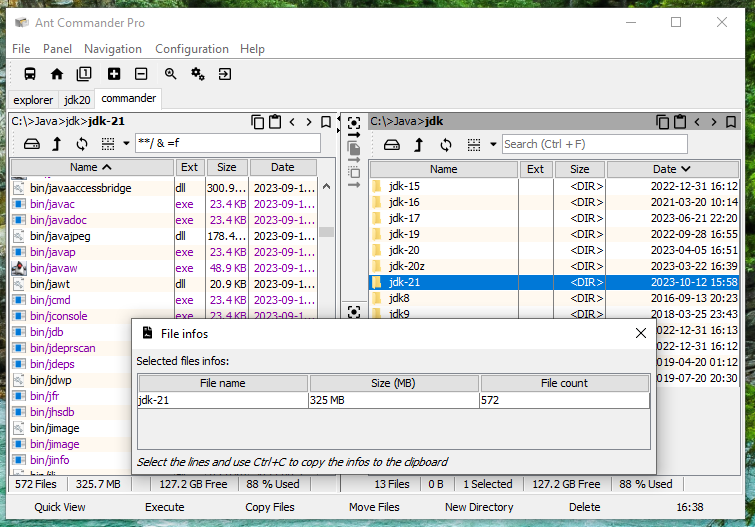
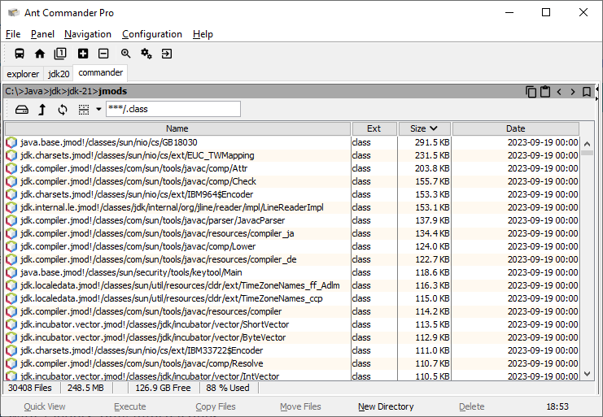
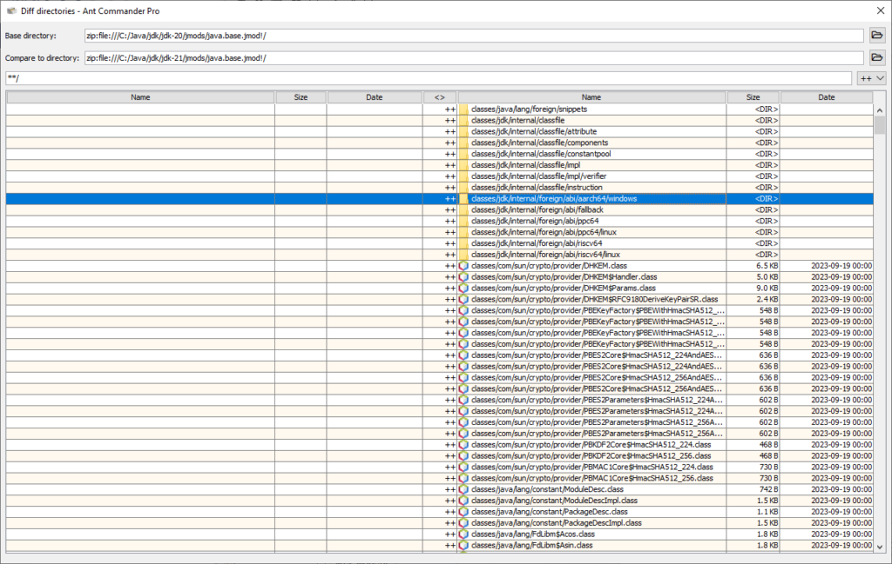

As Java developers, we all have it installed on our computer: the Java Development Kit, also known as the JDK. I remember putting the first version on a few floppy disks back in 1995. Since then it has grown multiple times. In this article, we'll explore the files of the JDK.

For this article, Eclipse Temurin [JDK 21](https://foojay.io/today/java-21-is-available-today-and-its-quite-the-update/) for Windows has been used.

## Files

### The statistics

* Total size: 325 MB
* Number of files: 572
* Number of files including in zip files: 47,629
* Largest file: lib/modules with 134 MB
* Number of class files: 27,929 (was 27,064 in JDK 20)
* Number of Java files (in src.zip): 15,404 (was 15,044 in JDK 20)

### Modules

The first observation is that class files are included twice in the JDK, first in the *jmods/\*.jmod* files and in *lib/modules* file. The JDK includes a *bin/jimage* utility to unpack of list the files in it. There doesn't seem to be that [much documentation](https://docs.oracle.com/en/java/javase/21/docs/specs/man/index.html) about this tool online.

The class files in *lib/modules* are less compressed than in the *jmod* files that are using zip compression.
> **Tip:**
> If you distribute the JDK with your software, for example in a Docker image, create a light version of the JDK with bin/jlink first. The result will be a smaller directory as it won't include files like src.zip (50 MB), jmods/\*.jmod (79 MB), tools and the modules you don't use.

## Classes

### The statistics:

* Total size: 126 MB
* Number of class files: 27,871
* 4,495 are [public classes](https://docs.oracle.com/en/java/javase/21/docs/api/allclasses-index.html) or interfaces
* 12,500 are inner or anonymous classes
* Largest file: *GB18030.class* with 291 KB
* Largest files names: *InternalFrameTitlePaneMaximizeButtonWindowNotFocusedState.class* and *MetaData$java_beans_beancontext_BeanContextSupport_PersistenceDelegate.class*
* 7,275 are less than 1 KB
* 26 are more than 100 KB
* All files are using the same timestamp of 2023-09-19 00:00

Most of the largest class files are related to the internationalization with charsets and time zones but *javac* and the new vector API also have large class files.

## Evolution

Contrary to what I said in the introduction, even if the JDK has grown size since 1.0, this hasn't been the case in the recent years. Post JDK 8, the largest JDK was JDK 9 (JavaFX, Nashorn) with 500 MB and the smallest was JDK 17 with 297 MB.

When comparing new files in the *java.base* module with JDK 20, you see that a lot of new files are related to a new *jdk.internal.classfile* package.

## Conclusion

OpenJDK is an always evolving software mostly composed of a lot of small files. Most of them are not needed at runtime.

Many [OpenJDK distributors](https://javaalmanac.io/jdk/21/) propose also a JRE (Java Runtime Environment) version of Java. For example, for Eclipse Temurin the Windows JDK installer file is 178 MB and the Windows JRE installer file is 34 MB.
