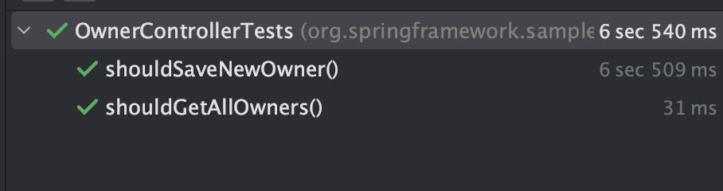
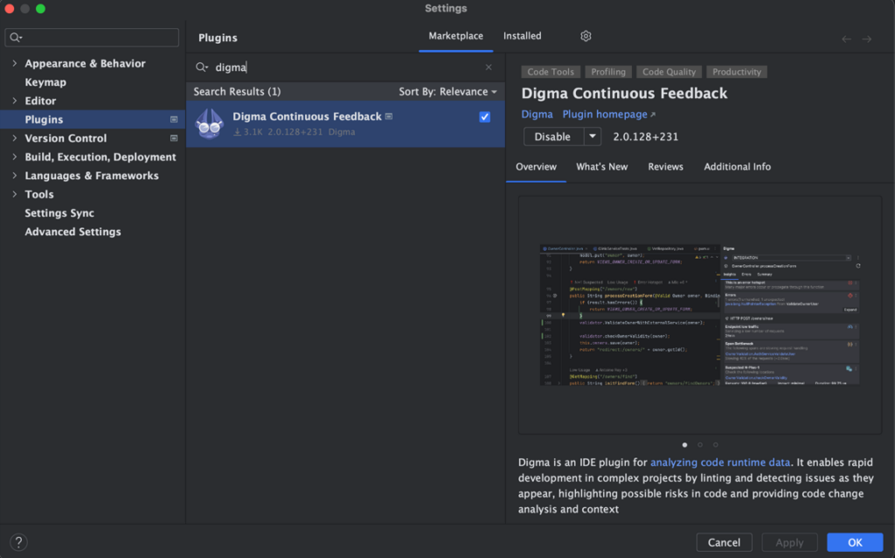
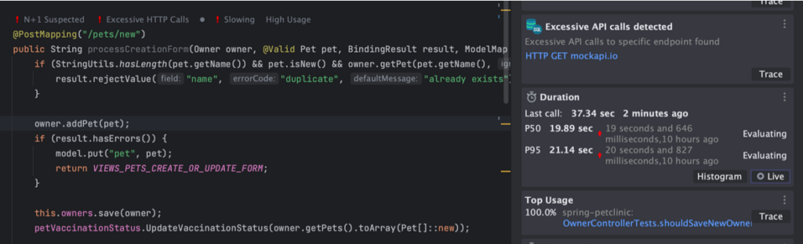
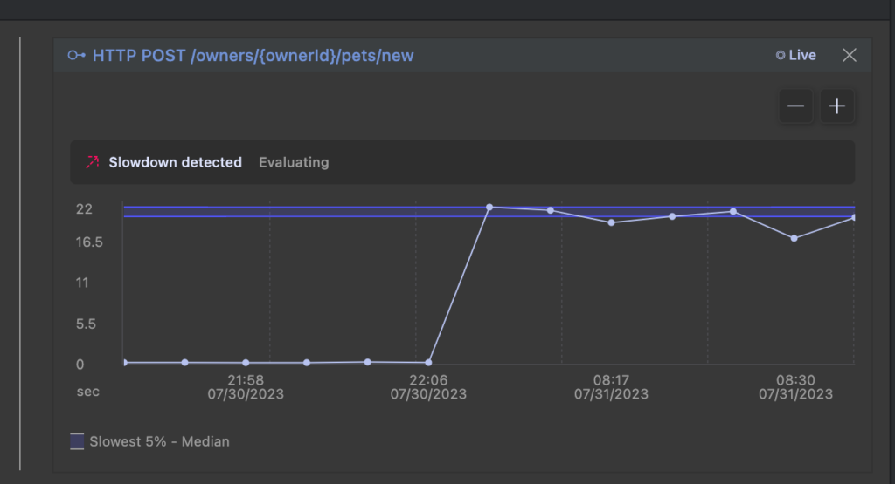
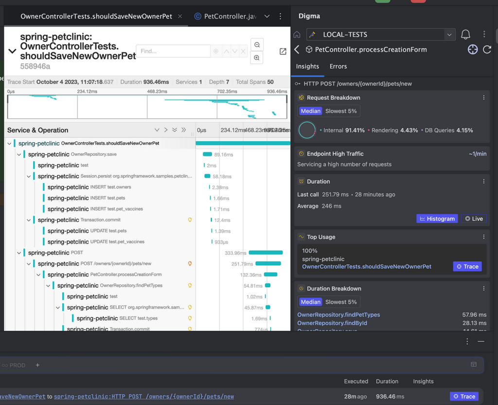

## Tests can run limited sets of assertions on your code, or reveal important insights about how your application really works!


Automated testing will assuredly go down in the annals of software development history as one of these industry-changing trends. Although few actually adhere to full-metal, OCD mode, TDD discipline (I am in awe of those that do, just to be clear), most developers make sure to prioritize and include testing in their dev cycle.

It took some time, but once the benefits of tests finally sunk into the collective developer psyche, tests successfully evolved from a chore, an inevitable victim of procrastination, to an important area of investment in your personal dev cycle.

Deceptively, the phrase 'automated testing' includes a wide gamut of testing techniques and methodologies. From unit tests, often just an echo of your coding assumptions, to integration tests, user-acceptable end-to-end testing, load testing, and more. In fact, early on developers were plagued by hard questions with no definitive answers around exactly that topic: 'how much' and 'what' exactly should be tested. How do you know you've tested enough?
> 2 unit tests. 0 integration tests. [pic.twitter.com/Io3gNI2QwR](https://t.co/Io3gNI2QwR)
> --- DEV Community (@ThePracticalDev) [April 13, 2017](https://twitter.com/ThePracticalDev/status/852508104914874369?ref_src=twsrc%5Etfw)

I doubt there was never a question that 'real' tests were better. Tests with 'more integration' ended up catching way more escape defects, revealing issues that would not reproduce in isolation. API breakage, component interactions, timing miscalculations, and more. They also had a much better coverage-to-test ratio, so you can write a single test to validate an entire workflow involving many classes and components.

However, the extra punch these tests packed came at a cost. The more realistic tests were, the slower the test execution became. To add to that, more code was needed to set up the test environment. Code, which in turn, had its own overhead in complexity and time.

Unit tests were an easy alternative and a cheap substitute. Fast, better suited for creating tests en-mass, especially efficient in testing isolated pieces of logic or data-driven testing use cases, leveraging the quick execution time to cover numerous input permutations. Trying to balance the faster easier-to-write unit tests with the heavy wielder test types resulted in the concept of the 'testing pyramid'. Today it is widely accepted as a best practice in testing your code.  



#### Continuous Integration is not Continuous Unit Testing

Unfortunately, over-investing in unit tests has its downturns. I have seen huge, impressive unit testing projects that deliver very little testing value. Some ended up as mere copies or replications of the very logic that they were testing (essentially having the developer write the logic twice). Other tests, did not black-box any significant functionality, their main contribution being simply in adding another green bulb to the build.

The fact that it was easy to produce so many unit tests turned out to be a two-edged sword. The tests often induced a 'false sense of confidence' that did not take into account the many biases that these tests fall into. Each test would look at a very narrow scope and validate only one happy path in a complex distributed system. A developer, reviewing thousands of green tests in the build would assume that his code change is well tested, often being surprised when real-world issues started occurring soon after merging the code.  



To complicate matters, in some programming languages, injecting dependencies to allow mocking at every level, as unit tests require, entails complex changes, which do not necessarily lead to better design. The practice of 'refactoring for better testability', once vaunted as advantageous in producing less closely coupled components, soon became an obstacle as the cost of that abstraction became clear. Modern dev practices often favor simplicity over multi-layered modular designs and unit tests unfortunately strictly require the latter.

#### Time for a new pyramid

With that under consideration, it could be time to revisit our assumptions and the testing pyramid as a whole. The technology landscape, however, is different and we can reconsider the value and cost of each test kind. Tests that were previously extremely complex are being streamlined by frameworks and tools, and slow infrastructure was been replaced by fast containers. What was true in 2018 when the test pyramid diagram was posted on Martin Fowler's page is not so accurate anymore.

In this post, we'll therefore explore how the landscape has changed in a way that allows us to 're-align- the testing pyramid. Instead of looking at***slow\<-\> fast*** vs.***less integration \<-\> more integration*** , we can focus on two different dimensionalities --- **overhead** and **value** . **Overhead** will include test time, as well as effort in setting up the test environment. **Value** encompasses coverage, types of problems revealed, and insights gleaned from the tests. In both cases, we'll focus on specific technologies that are changing the paradigm.

For our example, we'll use the following stack of tools, libraries, and frameworks:

* [Spring Boot 3.1 ](https://spring.io/projects/spring-boot/)--- as our web framework, DI, data, etc.
* [Testcontainers](https://testcontainers.com/) --- For running the test environment services
* [Rest Assured](https://rest-assured.io/) --- a nice DSL for carrying out integration tests
* [Digma](https://digma.ai/) (with [OTEL](https://opentelemetry.io/docs/instrumentation/java/automatic/) behind the scenes) to get more feedback from the testing

As our code for demonstrating testing practices, we'll use a forked version of the Petclinic Spring Boot sample project where I've added some more functionality.

#### Test overhead: Reducing test setup complexity and time with Spring Boot testing features and Testcontainers

The complexity of the test setup itself has a big impact on determining the 'cost' of the tests. The more heavyweight, slow, high maintenance and brittle the setup is, the more we'll tend to prefer simpler and easier tests. [Testcontainers](https://testcontainers.com/) fit into the test cost equation because they provide an elegant solution to abstracting the setup around any services the test may require.

Testcontainers libraries offer a neat API for orchestrating Docker containers, classically used for creating ephemeral environments for integration tests. They interact with a Docker daemon using the Docker API, thereby abstracting and managing container lifecycles programmatically. This level of programmatic control makes it a highly flexible tool for developers, ensuring that containerized dependencies are reliably available during test execution or for local development environment setups.

For this example, we'll take our [forked](https://github.com/doppleware/spring-petclinic-cf) version of the PetClinic project and use Testcontainers to quickly set up a Postgres database so that we can run our tests against it. Instead of working out the steps to start and configure the background infrastructure and services, the framework helps us inject them as just another dependency into the application. To set the platform up, I created an account on the TestContainers website which has both a cloud and desktop version. I opted for the cloud option which seems to have a free tier which should suffice for this test project.

With that out of the way, let's see what whipping up a quick integration test entails: First, we add a few dependencies. In my case, I'm using Maven so it's pretty straightforward to add the required resources to our `pom.xml`. We add some basic dependencies as well as the Postgres-specific artifact for Testcontainers. I also want to validate the API behavior so I went ahead and added the [rest-assured](https://rest-assured.io/) and [java-faker](https://github.com/DiUS/java-faker) libraries that I will use to assemble my test code.

```xml
<dependency>
      <groupId>org.springframework.boot</groupId>
      <artifactId>spring-boot-testcontainers</artifactId>
      <scope>test</scope>
    </dependency>
    <dependency>
      <groupId>org.testcontainers</groupId>
      <artifactId>junit-jupiter</artifactId>
      <scope>test</scope>
    </dependency>
    <dependency>
      <groupId>org.testcontainers</groupId>
      <artifactId>postgresql</artifactId>
      <scope>test</scope>
    </dependency>
    <dependency>
      <groupId>io.rest-assured</groupId>
      <artifactId>rest-assured</artifactId>
      <scope>test</scope>
    </dependency>
    <dependency>
      <groupId>com.github.javafaker</groupId>
      <artifactId>javafaker</artifactId>
      <version>1.0.2</version>
      <scope>test</scope>
    </dependency>
```

Next, we can create a simple class that tests that will use a real Postgres database on the backend. This project is using Spring Boot 3.1 so there are many convenience functions and handy annotations to help auto-wire everything together with minimal code. The below code is entirely of the boilerplate that had to be put together for an integration test using a real service. With the new `@`[ServiceConnection](https://spring.io/blog/2023/06/23/improved-testcontainers-support-in-spring-boot-3-1) annotation, we can very easily drop in the Postgre database container. Spring Boot's excellent testing infrastructure, also allows us to very easily start the backend service and inject the server port. We'll use that value during the test setup to make sure our `rest-assured` validations are configured properly.

```java
@SpringBootTest(webEnvironment = SpringBootTest.WebEnvironment.RANDOM_PORT)
@Testcontainers
@ActiveProfiles(value = "postgres")
public class OwnerControllerTests {
	@LocalServerPort
	private Integer port;

	@Container
	@ServiceConnection
	static PostgreSQLContainer<?> postgres = new PostgreSQLContainer<>("postgres:15-alpine");

	@BeforeEach
	void setUp() {
		//ownerRepository.deleteAll();

		RestAssured.baseURI = "http://localhost:" + port;
	}
```

Amazingly, the above code represents all of the required boilerplate to set up the test environment. At this point, we can assume that when our test is running the database and server are all up and accessible in our test code. It's especially impressive when I recall how years ago, I was struggling to make my Cucumber UAT tests work, investing in stabilizing and modularizing complex test setup code.

With the test setup out of the way, we can start focusing on what we want to test. Since in my branch, I'm modifying the logic for adding a pet to an owner, this is the first test we'll write:

```java
	@Test
	void shouldSaveNewOwner(){

		Owner owner = CreateOwner();
		String newPetName = faker.dog().name();
		given()
			.contentType("multipart/form-data")
			.multiPart("id", "")
			.multiPart("birthDate", "0222-02-02")
			.multiPart("name", newPetName)
			.multiPart("type","dog")
		.when()
			.post(String.format("/owners/%s/pets/new",owner.getId()))
			.then()
			.statusCode(Matchers.not(Matchers.greaterThan(499)));

		var updatedOwner = ownerRepository.findById(owner.getId());
		assertThat(updatedOwner.getPets())
			.hasSize(2)
			.extracting(Pet::getName)
			.contains(newPetName);

	}
```

This, with a simple request and basic validation we have black-boxed some server logic, creating an integration test. But how fast does it run?


I created two tests so that I could measure the one-time setup time vs. the marginal cost for any additional test. We see a one-time cost of 6.5 seconds for the test run, with almost no penalty at all for each consecutive test.

That's it really! These tests are already providing coverage over some of my controller functionality. We also see that two important boxes were checked: Low effort, minimal code to maintain, and pretty good performance. However, our testing still looks at some very narrow aspects of the system behavior. We are missing an opportunity to take advantage of the fact that the system is running 'for real' in order to validate and learn from its behavior. With that, let's take a look at the other axis we wish to examine: test value.

#### Increasing integration tests value: Digma with OTEL behind-the-scenes

One of the tragedies of integration tests is that they produce a wealth of useful data, that nobody is actually looking at. Unlike unit testing or noisy production environments, they represent the perfect experiment. Repeatedly running the same scenarios, under similar conditions, with only the code changing between runs. In focusing on the pass/fail results of the tests, we are, in fact, ignoring the complete picture of what they have to tell us about our code and the system under test.

Thankfully, this too is an area where the technology landscape is different today. [OpenTelemetry](https://opentelemetry.io/docs/instrumentation/java/automatic/) has made it easy to collect data produced by testing, even without making any code changes. To make that raw data into something more practical that we can use to assess our code changes, we can use tools that can digest and analyze that data.

One such project that I am personally involved in is [Digma](https://digma.ai/), a free tool for developers, which focuses on analyzing the code by studying this type of observability data. It is a simple IDE plugin that runs locally on your machine and completely abstracts the logistics around OTEL and collecting and analyzing metrics and traces. We can set Digma up by installing it into the IDE via the [plugin marketplace](https://plugins.jetbrains.com/plugin/19470-digma-continuous-feedback):


#### Trace-based testing, continuously

We complete the plugin setup and... well that's it really! 😁 We are now collecting information about our code locally which we'll be able to see in a second once we run our tests. This time, instead of looking at simply the functional aspects of the code, we can learn more about what it does. More bluntly put, the integration tests we wrote before are all passing --- but does that mean we can go ahead and check in our code? We can run our test again to find out.


The test passed, but looking at the code we see the test result analysis already revealed some issues in the code. I've previously discussed this specific change and the type of issues it can cause in a [blog post](https://foojay.io/today/effective-coding-with-java-observability/) focusing on improving code using observability. This time, though, this feedback arrives automatically simply by merit of running our test. We can click the 'Live' button to actually see the graph, which in this example shows a very clear picture of the regression.


If I am interested in learning more about exactly what is going on, the tracing integration allows me to to drill into the anatomy of the requests simulated by the tests to understand exactly what is going on and what could be wrong:


#### Enter Continuous Feedback

[Continuous Feedback](https://digma.ai/blog/ci-cd-cf-the-devops-toolchains-missing-link-continuous-feedback/) is a new practice that embraces the concept of getting more out of your code runtime data. In essence, it is a complementary movement to CI and CD which facilitates the flow of information in the opposite direction --- not from your code into production, but instead continually taking code data from testing and production and back to the developer.

Shorter feedback loops accelerate the release process because it reduces the need to troubleshoot, increases developer understanding of the code, and allows dealing with issues much earlier in the process.

#### Striking a new balance between different test types

Given the changes in both the cost and value of integration tests, we can certainly reassess the traditional testing pyramid and seek a better way to balance different types of tests. The diagram below demonstrates how we can start assessing different types of tests based on cost vs. value.

We'll be looking for high-value tests with minimal cost. As such, single service integration tests such as the one we just created seem to represent an optimal balance.  



This means that we can invest in more tests that will be both easier to code, relatively fast to run, and still provide great coverage and real-world scenario validation. In addition, the data produced by these tests can be leveraged for more than simple functional validation --- we can give our code some exercise and see the shape just by running our tests.

#### YMMV

There are numerous approaches to designing your testing projects, that greatly depend on the technology and type of product you are developing.

In this article, we've tried to reassess the testing pyramid, given the changes in the technology landscape to suggest a new default approach for testing your application.

We're extremely curious to learn where you find the best test balance and what inputs are you getting from your tests. Happy to hear your feedback!
