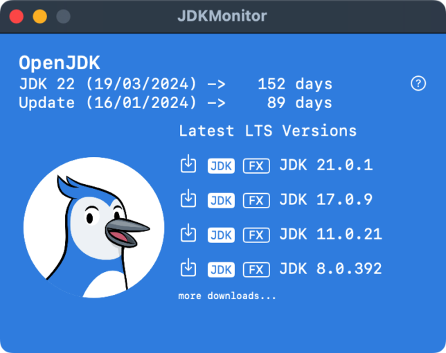
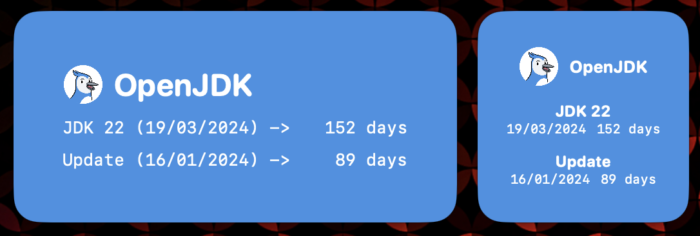

During [Devoxx Morocco](https://devoxx.ma/ "Devoxx Morocco") I've spent some time coding a little new tool where the main reason was to have a widget on my MacOS desktop that shows the days until the next release/update of [OpenJDK](https://openjdk.org/ "OpenJDK").

Because this alone was not enough to get it into the Mac App Store, I needed to add more functionality and so I've decided to also show the latest version of the last 4 LTS (Long Term Support) releases with the ability to download them either as JDK or JRE and if you like bundle JavaFX with it. At the moment that would mean JDK 8, 11, 17 and 21 with their latest versions available.

You need to be on MacOS Sonoma to be able to run the app because of the widgets that are only on Sonoma upwards.

The downloads are based on the free builds of OpenJDK by [Azul](https://www.azul.com/downloads/#zulu "Azul") (Zulu) and will only be downloaded as tar.gz packages to your Downloads folder.

Here are some screenshots...

The application:

The available widgets:

You can find the app on the MacOS app store following [this link](https://apps.apple.com/us/app/jdkmonitor/id6468484792 "this link")...

If you have ideas on how to improve this app... just let me know and ping me on [twitter](https://twitter.com/hansolo_ "twitter").
