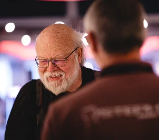

[Devoxx Belgium 2023](https://devoxx.be/), the premier Java developer conference, held in Antwerp, Belgium is an event we eagerly anticipate. As representatives of Payara, a sponsor of the conference, we had the privilege of attending this year's gathering, which took place at the iconic Kinepolis Antwerpen Cinema.

The conference ran seamlessly, reflecting the organizers' dedication to creating a productive environment for learning, networking, and fostering our shared enthusiasm for technology. We were thrilled to participate in an event that was such a focal point for Java developers.  

Our booth was a hub of activity throughout the conference, attracting engaged attendees interested in exploring Payara's contributions to the Java and Jakarta EE development landscape. The reception we received highlighted the active and vibrant Java community at Devoxx Belgium.

Attendees were very interested to learn more about Payara Server and Payara Micro. But [Payara Cloud](https://www.payara.fish/products/payara-cloud/) definitely stole the show for us this time, attendees were very interested to see the innovations we were bringing to Jakarta EE.

Meeting James Gosling, a true luminary in the Java world, was a memorable experience. Conversations with him were enlightening, offering insight into Java's rich history and its evolution. His presence added a touch of history to the event, and we felt honoured to share the same space with him.

Patrik's well-attended talk, "Elementary Full-stack Development with Hypermedia and Java 21," was a key highlight. It provided an opportunity to showcase the capabilities of Java 21 and left the audience inspired to explore the future of Java development. [You can watch the talk on YouTube here](https://youtube.com/watch?v=Ldi1hYQCfFY%3Flist%3DPLRsbF2sD7JVoylItQFt2RKpLsYasx1c3F).

In addition to the formal sessions, we actively engaged in community panel discussions, delving into the latest trends and challenges in Java development. These conversations were a testament to the collaborative spirit of the Java community, enabling us to both share our insights and gain from the collective wisdom.

The conference also offered social gatherings, including the Azul and JetBrains parties, which provided attendees with an opportunity to relax and connect with peers who shared a passion for technology. These social events were a valuable extension of the conference.

Antwerp's architectural beauty and historical significance provided a fascinating backdrop to the event. The interplay of modern technology discussions with the city's rich heritage added depth to the experience.

In conclusion, Devoxx Belgium 2023 was a success. It underlined the commitment and passion of the Java community and celebrated its thriving ecosystem. The well-organized event, valuable connections, and enlightening discussions made our participation truly worthwhile.

Our presence at Kinepolis Antwerpen Cinema underscored Payara's dedication to the Java Community. Devoxx Belgium 2023 left us with enriched knowledge, new acquaintances, and a refreshed enthusiasm for Java. As we look ahead, we are excited to see the path technology, the community, and Payara will take. Until next time, Devoxx!  

