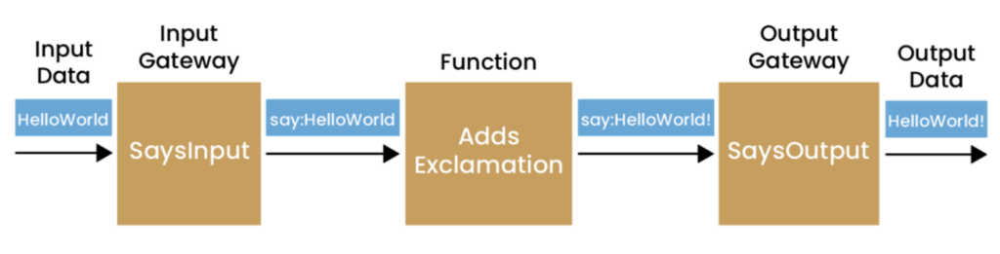
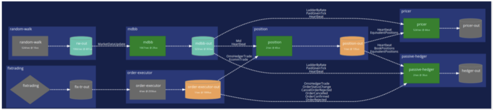

## Two Approaches

There's little doubt that modern software architectures lean towards asynchronous models for communication between distributed components (where "distributed" means components that are not part of the same process, be they on the same or on different physical machines). Synchronous models such as Remote Procedure Call (RPC) are now largely discredited \[[Waldo](https://www.researchgate.net/profile/Ellen-Isaacs/publication/220168963_Why_do_users_like_video/links/02e7e5186b67219c70000000/Why-do-users-like-video.pdf#page=89 "Waldo"), [Vinoski](http://steve.vinoski.net/blog/2008/07/01/convenience-over-correctness/ "Vinoski")\]; even asynchronous variants of these are not seen as desirable.

When we strip away the layers that present the illusion that RPC is really just the same as Local Procedure Call (i.e. a normal method invocation), we find sitting above the transport some form of messaging protocol. And these days, the APIs seem more willing to expose developers to these lower-level details, making it clear to programmers that communication with a remote component is inherently more complex than making a simple procedure call.

Event-driven approaches refine and extend these ideas of basic messaging interactions, by introducing more semantic significance to the actual messages that are being sent between components and also providing support for persisting messages in perpetuity. An event can be posted with minimal overhead to some transport mechanism, and received by one or more recipients from this transport, again with minimal overhead.

Semantically, an event is an indication that something has happened. This could be at the business level, or at the infrastructure level. Either way, an event is intended to be an immutable record of the fact that something has happened, and in a fully Event-Driven Architecture approach, this "fact" will never be lost.

There are numerous advantages to following an Event-Driven Architecture:

* The sender and receiver are decoupled in both time and space – an event can be posted even if no listeners are currently active, and without any knowledge of the physical location of the receiver.
* Minimal overhead in posting and receiving events support higher rates of throughput with better vertical scalability and responsiveness.
* Persistent event stores support replaying scenarios to aid in debugging.
* Diagnostics are easily available from the event stores.
* Components' state is represented as a deterministic sequence of updates rather than simply the most recent values, providing audit trails and making restarting following failover much more straightforward.
* Testing can be performed using data captured from real scenarios.

While the Event Driven Architecture approach provides an effective means of implementing systems, it also works well with the Behaviour Driven Development approach of designing the business logic of an application, [often complementing each other's strengths and weaknesses](https://chronicle.software/how-bdd-works-well-with-eda/ "often complementing each other’s strengths and weaknesses").

Behaviour-Driven Development provides a way of capturing requirements and constructing associated test cases using language that is associated with the problem domain, and is therefore more likely to be accurate from a customer perspective. This focus on a common language leads to an approach for describing tests related to user scenarios, following the following pattern:

**Given:** *the state of the component(s) being tested*

**When:** *the user applies some action*

**Then:** *the state of the components should change to this*

In the Event-Driven Architecture, it is usual to manage the state of a component using an approach known as "Event Sourcing". Since state changes are triggered by and notified to other components using events, we have the ability to (re)construct the state of the component at any point in time, simply by replaying the state-changing events from some known point in time (either from the start of the application of from some state snapshot) to the required time.

So the BDD test pattern described above can be described using events:

**Given:** *the state constructed by applying a sequence of events*

**When:** *a further event is applied to the component(s)*

**Then:** *the component should post an event indicating the state change*

The events used in the test case can be defined and stored in a text format, for example in files. The testing framework may then use these to run the test(s) on the component in a deterministic data-driven fashion.

The scenarios may relate to a single component, a subset of components in the application or to the application as a whole, and present a number of advantages:

* A clearer focus on business requirements, with attendant reduction in ambiguities
* Rapid feedback loops with early detection of issues.
* Continuous integration testing.

While these two approaches do not mandate each other, they do tend to work well together, and the [Chronicle Services](https://chronicle.software/services/ "Chronicle Services") framework provides developers with support in building components and applications that follow the guidelines.

### Events, Events, Events

Some Event-Driven Architecture framework approaches draw differences between certain broad types of messages/events sent between components, for example, CQRS. It is perfectly reasonable to consider that *all* communications between components as events, even given the idea of an event as being an indication that something "has happened":

* A change has occurred in the state of a component
* A "Command" to perform some action was received
* A "Query" was received

It is even possible to implement request/response type communication using events, by using appropriately typed events that are generated and handled with regard to retry and correlation logic.

Reference data and component configuration can be established using events. Normally we would expect such events to be handled before handling other types of events during a component startup (or restart). However, they could also occur during operation, meaning that they would be persisted along with other events allowing analysis of changes in the behaviour of components based on configuration changes in a reproducible way.

The passage of time is something that is normally important to components. It is also something that can be represented through input events to these components. The source of these input events may be a "real" wall clock, or some other means of representing time moving forward that can be substituted during testing and debugging, maintaining determinism during replays of events.

Logging functionality is a natural fit for implementation using events. Indeed some of the most widely used messaging frameworks grew from a requirement to consolidate and manage logs in large distributed applications. Conventional approaches to logging can make it difficult to reproduce issues due to the fact that the log messages occur "out of band" in relation to the component flows, and can affect outcomes. Handling logging of errors through the main event handling infrastructure makes these deterministic and simplifies debugging.

There is also a larger discussion to be had around logging in general, and its frequent overuse to display informational messages, which can pollute output that could still contain messages necessary to identify and help solve error situations. The ability to obtain such information from the event management infrastructure can help reduce this extraneous output, making it easier to see when a situation has occurred that needs attention.

Of course, not every component is necessarily going to follow these guidelines. Some form of interaction with components, for example, external components that are not event-driven, will be likely. This could be talking to a database, or to a UI. Gateway components may be used to manage this interaction, mapping between event-based communication and an alternative, perhaps request-response model without losing any information in our event store.

### Putting it into Practice

At [Chronicle](https://chronicle.software/ "Chronicle"), we have many years of experience in building low-latency Java applications using our world-beating libraries. Distilled from this experience, we have developed [Chronicle Services](https://chronicle.software/services/ "Chronicle Services"), a framework that supports the development of high performance Java microservices, following the guidelines of Event Driven Architecture and Behaviour Driven Development, to build applications that perform with world beating latency performance.

A combination of externalised configuration, powerful APIs and flexible deployment options provides access to enterprise-class features such as high availability and fault tolerance, observability and scalability. Combined with a novel approach to testing based on BDD techniques, this allows developers to concentrate on implementing business logic. Development timelines are shortened without sacrificing quality and ROI is apparent much more quickly.

With Chronicle Services, the primary unit of computation is the Service, which receives inputs in the form of events from zero or more sources, and posts output, again in the form of events, to a single sink. The default transport for events with Chronicle Services is [Chronicle Queue](https://chronicle.software/queue-enterprise/ "Chronicle Queue") – a persisted, shared memory channel for inter-process communication offering class-leading latency performance of under 10 microseconds from write to read at the 99.9 percentile.

Events are represented as POJOs, and are persisted to a Queue using a highly efficient proprietary format, with marshalling and unmarshalling being completely transparent. Chronicle Services does not distinguish between different "types" of events, for example CQRS as described above, preferring instead to consider everything as an event. This simplifies the processing requirements of event management, with an associated reduction in overhead.

Chronicle Services also includes a BDD based testing framework, known as YAMLTester. Tests are written following the guidelines described above, with separate YAML files containing the events used to specify the three components of each test:

**Given:** *setup.yaml*

**When:** *in.yaml*

**Then:** *out.yaml*

A test is run using the JUnit testing framework, with helper classes that:

1. Create an instance of the service, initialising state using the events in the setup.yaml file
2. Pass the events in the in.yaml file to the service instance
3. Capture the output events and compare them with the expected output specified in the out.yaml file.

Results can be displayed in a terminal, or within an IDE such as IntelliJ. Failing tests are reported with additional details of mismatches between expected and actual output.

Having input and output events kept separately makes it easier to keep track of output for variations of invalid input, which in turn makes regression testing easier.

## Summary

The practices of Event-Driven Architecture and Behaviour-Driven Development have more in common than may at first be apparent. At [Chronicle](https://chronicle.software/ "Chronicle"), we have embraced both of these approaches and implemented them through our Chronicle Services Framework.

Experience, both internally within Chronicle and of our customers, has shown that our approach is beneficial in both improving the quality of the software being developed and reducing development timescales.
