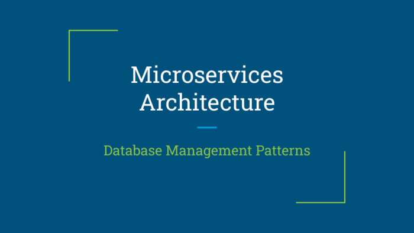

In the [previous article](https://foojay.io/today/patterns-for-the-design-of-microservices-part-1/ "previous article"), we discussed some of the design patterns employed in the creation of microservices. In this subsequent article, we will delve into the remaining patterns that are commonly utilized in the realm of microservices.

Database Patterns

 

There are seven distinct patterns that further categorize the data management.

* **Database per Service**
* **Shared Database**
* **Saga Pattern**
* **Command-Query Responsiblity Segregation (CQRS)**
* **API Composition**
* **Domain Event**
* **Event Sourcing**

In the next section, let's discuss each pattern individually.

1.1 Database per Service {#h2-0-1-1-database-per-service}
---------------------------------------------------------

In monolithic architecture, a single database conducts data persistence and transaction processing, which can sometimes pose challenges in terms of maintenance and upgrades.

In microservice architecture, each service can have a separate database, allowing for independent management without any complications.

Each service keeps the data private, however, it can still access it through an API call. This eliminates the need for the consumer service to maintain the same table as the provider service.

Various methods exist to maintain data privately without the requirement of provisioning a new database server.

In the case of a relational database, the available alternatives are as follows:

* Private tables per service - This collection includes the tables that pertain solely to the specified service and possess minimal overhead.
* Schema per service - This encompasses the database schema that is specific to that service and possesses reduced overhead.
* Database server per service - Each service uses its own individual database server for high throughput.

### **Pros** {#h3-1-pros}

* It has a loose coupling and can achieve modularity.
* Depending on the business requirement, we can use either relational databases such as MySQL, Oracle, and Postgres, or non-relational databases like MongoDB, Neo4j, and Amazon DynamoDB.

### **Cons** {#h3-2-cons}

* It is highly challenging to achieve distributed transactions with multiple services.
* Consolidating data from various databases can be quite a daunting task.
* Managing multiple SQL and NoSQL databases can pose a challenge.

However, we can implement transactions and queries that encompass multiple services by employing alternative patterns and solutions.

* The **Saga Pattern** makes it possible to implement transactions that span multiple services.
* By utilizing **API composition** and the **Command Query Responsibility Segregation (CQRS)** pattern, you can achieve effective data joining, reading, and writing.

1.2 Shared database {#h2-3-1-2-shared-database}
-----------------------------------------------

Consider creating a shared database for small or medium sized microservices, rather than having individual databases per service. This approach enables all services to easily access the data.

**Pros**

* The utilization of ACID transactions can effortlessly attain data consistency.
* Easy to Maintain

**Cons**

* Development and Runtime coupling
* We could possibly encounter difficulties pertaining to the storage of data for all of our services.

1.3 Saga Pattern {#h2-4-1-3-saga-pattern}
-----------------------------------------

The Saga Pattern is a widely adopted design pattern in distributed systems and microservices architectures. Developers widely adopt the Saga Pattern in distributed systems and microservices architectures. Its primary purpose is to manage complex, long-lasting transactions that involve multiple services or components.

The primary purpose of the Saga Pattern is to manage intricate, long-lasting transactions that involve multiple services or components. This pattern offers a reliable approach to maintain data consistency and reliability in a distributed environment where traditional [ACID](https://en.wikipedia.org/wiki/ACID "ACID") transactions may not be feasible or practical.

The pattern offers a reliable approach to maintain data consistency and reliability in a distributed environment where traditional ACID transactions may not be feasible or practical.

In the context of distributed transactions, utilizing this particular pattern proves to be highly advantageous because they are known to be both costly and complex to execute.

Utilizing technologies such as Apache Kafka, ActiveMQ, Amazon SQS, Microsoft Azure Service Bus or RabbitMQ, in conjunction with distributed transaction management frameworks like [Spring Saga](https://github.com/Dilsh0d/SpringBoot-Microservice-Saga "Spring Saga"), effectively implements the Saga Pattern.

1.4 Command Query Responsibility Segregation (CQRS) {#h2-5-1-4-command-query-responsibility-segregation-cqrs}
-------------------------------------------------------------------------------------------------------------

Currently, read and write operations primarily involve a significant number of distributed transactions. To illustrate, within the realm of e-commerce applications, a majority of transactions revolve around writing and persisting data in the database.

Using Command Query Responsibility Segregation architectural pattern that separates the responsibilities for reading and writing data into the persistence system.

In general, a small or medium microservices can utilize a single model to accomplish both reading (queries) and writing (commands) operations. Nonetheless, as the system progresses and expands, the effectiveness of this single model diminishes and complexity arises.

The **Command Model** and the **Query Model** effectively tackle the issue of read and write responsibilities by dividing them into two distinct models.

* We use the Command Model to write or update data within the database.
* The system utilizes the Query Model to retrieve information from the database.

Implementing CQRS enables one to attain scalability, optimized read and write operations, and flexibility. Nevertheless, one finds it challenging to maintain complex and high-performance applications.

1.5 API Composition {#h2-6-1-5-api-composition}
-----------------------------------------------

Contemporary enterprise applications commonly aggregate data from various microservices and present it to customers in a consolidated manner.

The API Composition query designs to establish connections with various microservices, retrieves the necessary data, and combines the results in-memory.

1.6 Domain Event {#h2-7-1-6-domain-event}
-----------------------------------------

In the microservice architecture, every service performs particular actions such as creating or updating via pub/sub, which in turn generates events. Other consumer services must capture and process these events.

The domain is associated with the events pertaining to the CQRS pattern view and is responsible for updating or creating data.

1.7 Event Sourcing {#h2-8-1-7-event-sourcing}
---------------------------------------------

The service command usually involves creating, updating, or deleting aggregates in the database and sending messages or events to a message broker.

A service utilizing the Saga Pattern is required to update business entities and send messages/events. Following this, a consumer service must generate a domain event and aggregate it to update the event for subsequent calls.

This pattern can significantly enhance its effectiveness by utilizing **Event Sourcing** and **CQRS**.

In the upcoming article, we will delve into the patterns of **observability** and **cross-cutting concerns**.

<https://microservices.io/>
