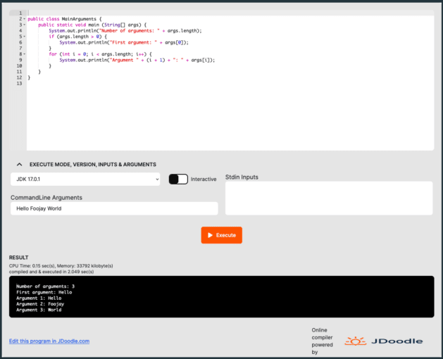

While developing the [Foojay Quickstart Java Tutorial](https://foojay.io/java-quick-start/), I was looking for an easy way to integrate runnable Java code examples into the Foojay pages and blogs. That's when I discovered [jdoodle.com](https://www.jdoodle.com/). I started by using their online editor, but with this blog I want to show you an even easier method to integrate runnable code here on Foojay.

## Integration examples

### Single file code

To integrate "plain" Java code in your post or page, use the following syntax and add it as "Custom HTML" widget:

```
<div data-pym-src='https://www.jdoodle.com/plugin' 
   data-language="java" 
   data-version-index="4">
     // This is the place to put the code
</div>
<script src="https://www.jdoodle.com/assets/jdoodle-pym.min.js" type="text/javascript"></script>
```

For example, this "Custom HTML":

```
<div data-pym-src='https://www.jdoodle.com/plugin' 
   data-language="java" 
   data-version-index="4">
public class MainArguments {
    public static void main (String[] args) {
        System.out.println("Number of arguments: " + args.length);
        if (args.length > 0) {
            System.out.println("First argument: " + args[0]);
        }
        for (int i = 0; i < args.length; i++) {
            System.out.println("Argument " + (i + 1) + ": " + args[i]);
        }
    }
}
</div>
<script src="https://www.jdoodle.com/assets/jdoodle-pym.min.js" type="text/javascript"></script>
```

Will produce the following output. Hit the "Execute" button to run the code.

<div data-pym-src="https://www.jdoodle.com/plugin" data-language="java" data-version-index="4">
 public class MainArguments { public static void main (String[] args) { System.out.println("Number of arguments: " + args.length); if (args.length &gt; 0) { System.out.println("First argument: " + args[0]); } for (int i = 0; i 
 <p class="wp-block-paragraph"></p>
 <p class="wp-block-paragraph">As you can see, the reader of your Foojay post can modify the code, execute it, and even add CommandLine Arguments to change the behavior of the code as you can see in this screenshot:</p>
 <figure class="wp-block-image size-medium">
  
 </figure>
 <h3 class="wp-block-heading">Code with external data files</h3>
 <p class="wp-block-paragraph">In one of the more advanced tutorial steps, I wanted to read data from a text file. This can also be done with JDoodle, but needs a slightly different "Custom HTML" block that looks like this:</p>
 <p>PRESERVEDHTMLBLOCKZZ2ZZEND</p>
 <p class="wp-block-paragraph">The <code>data-client-id</code> is important here to allow the use of external files, but is only valid when used on the Foojay website! Create your own <a target="_blank" href="https://www.jdoodle.com">account on the JDoodle site</a> if you want to use this functionality on another website.</p>
 <p class="wp-block-paragraph">This is a simple example to read data from a CSV file:</p>
 <p>PRESERVEDHTMLBLOCKZZ3ZZEND</p>
 <p class="wp-block-paragraph"></p>
 <p class="wp-block-paragraph">A full example with this approach can be found in the tutorial: <a href="https://foojay.io/java-quick-start/quick-start-tutorial/reading-a-text-file/">"Reading a Text File"</a>.</p>
 <h2 class="wp-block-heading">Conclusion</h2>
 <p class="wp-block-paragraph">JDoodle allows to experiment with code in the browser and provides many other easy tools. Thanks to JDoodle you can now also add executable code to your Foojay content!</p>
 <p class="wp-block-paragraph">In a next post that will be published soon, we'll talk with the creator of JDoodle, <a target="_blank" href="https://www.linkedin.com/in/gokulchandrasekaran-jdoodle?miniProfileUrn=urn%3Ali%3Afs_miniProfile%3AACoAAANJfEYBcRBniUXnKroUIsiftQzJwkwXl4I">Gokul Chandrasekaran</a>.</p>
</div>
