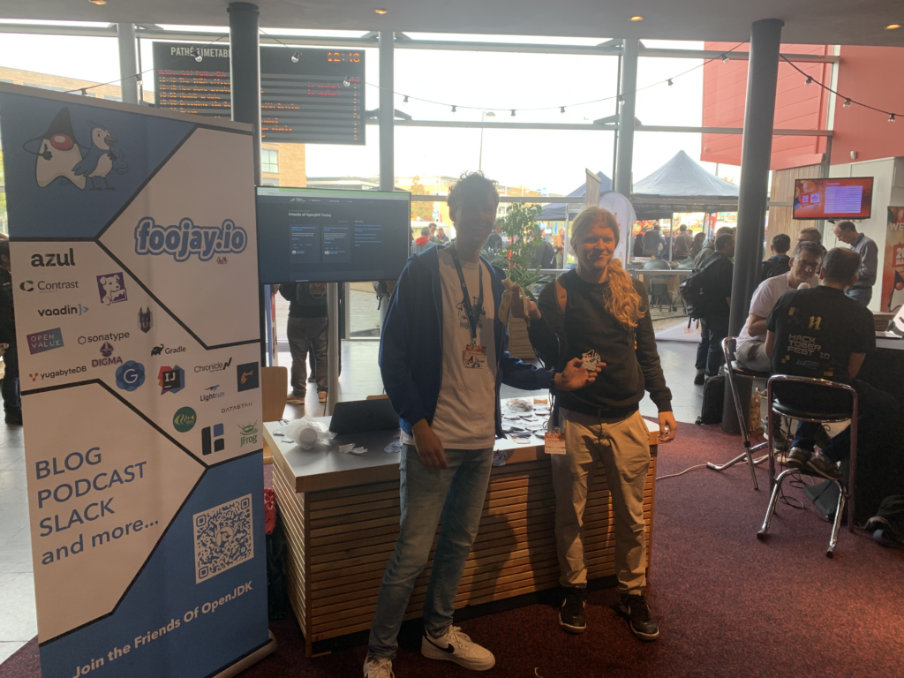
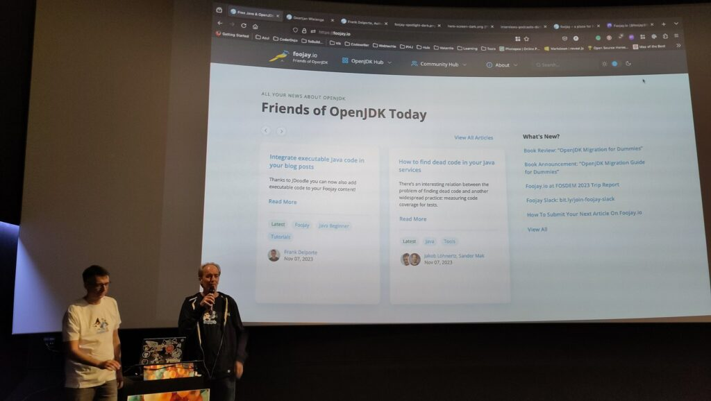

**Last week's JFall 2023 was a high point in the evolution of Foojay.io, the place for friends of OpenJDK.**

We had a very big booth right by the entrance to the venue, consisting of a large rollout banner featuring all the organizations involved in Foojay.io, a table totally covered in stickers (hundreds, maybe thousands, of Foojay.io stickers, as well as sponsor stickers, such as Digma), and a podcast zone, where Frank spent most of the day recording short podcast interviews with a very wide range of Java enthusiasts attending the event.

Below you see the above described setup, featuring Paco and Johannes in the middle, certainly the most actively involved and engaged Foojay.io collaborators at the booth, constantly handing out stickers to promote Foojay.io and the OpenJDK user community at large, showing the website, and talking about how to get involved.

Also, it was very cool to join Frank in a short talk about Foojay.io, which was attended by several people involved in Foojay.io, plus many that heard about it for the first time.

## Many thanks to [Digma](https://digma.ai/) for sponsoring the t-shirts, [Apache APISIX](https://apisix.apache.org/) for sponsoring the stickers, and [OpenValue](https://www.openvalue.eu/) for sponsoring the rental of the booth equipment!

Also, Frank is processing the podcast interviews into multiple podcasts that will be released over the coming months, while [a playlist of them all can be found here](https://www.youtube.com/watch?v=FV1ITrl42mk&list=PL-3Bf_FLNZLCR09uDyIA3CHiOvdw5LU6B)!
