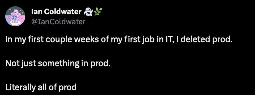
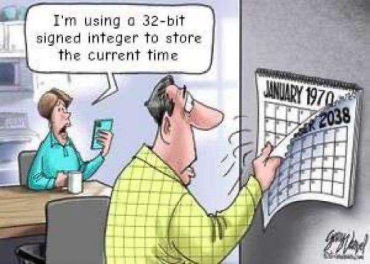
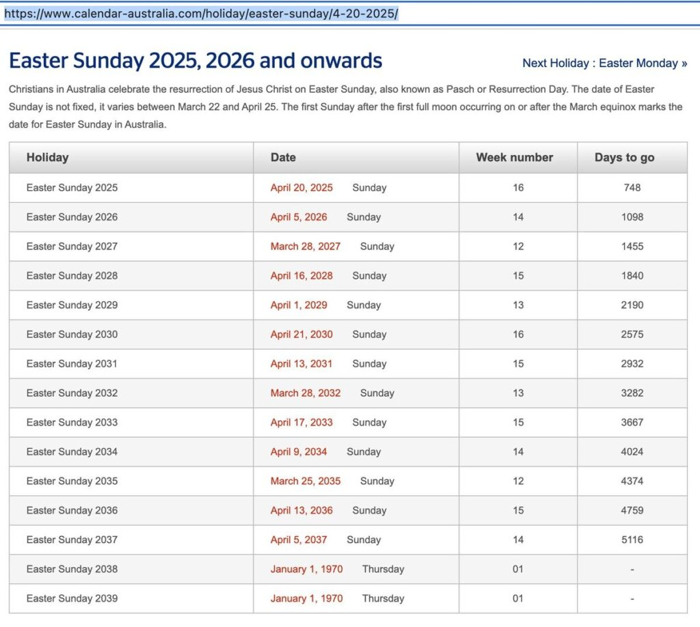
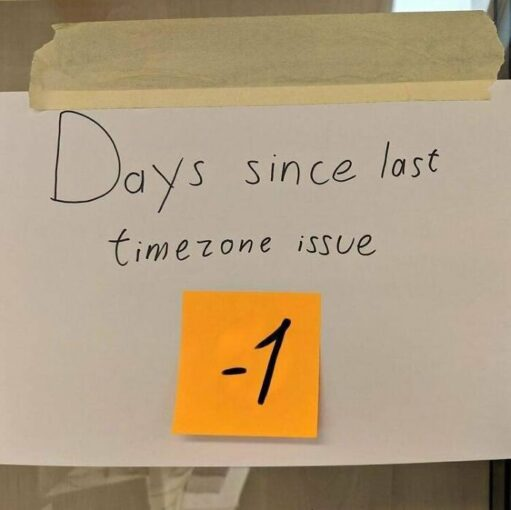

***It's a Friday, late in the afternoon. To end your work week in a clean way, you decide to get rid of some test data and files from your PC. You hit the enter button to drop a table from your local test database. Within a split second, you realize your error. Your body turns hot and cold at the same time. You double-check, but you already know the truth. You were connected to the production database and just deleted the table with all the customers...***

Congratulations! You will never forget this day. It's the day you become a real developer, and all senior developers will welcome you into their world, as they all have made a similar mistake at least once.

## Database Disasters

Dropping a table or a complete database is a mistake that can happen very quickly. Another one is forgetting the `WHERE` part of your SQL statement. There is a big difference between `DELETE FROM clients` and `DELETE FROM clients WHERE id = 1`...

But the main mistake happens when you have multiple connections defined in your database UI and assume you are modifying the test database while having the production database open. And that's a problem that actually should not be possible to happen, or at least not easily. Do developers need access to the production database? While it can be helpful to be able to check data directly in the live system, read-only rights are probably sufficient for most cases...

Another database disaster waiting to happen is when you forget to validate the input. SQL injection should be a well-known problem by now, but still, a lot of errors happen in this field, causing not only disasters but also security nightmares. Or, as XKCD nicely illustrates it:

## Dates and Times

Working with dates and times is the real test that distinguishes beginners from experienced developers. The defining factor is not only their ability to handle them correctly but also the number of "yes, I have seen this problem before" moments.

Before we dive into the problems, let's summarize the most important guideline when working with dates and times in your database: store them completely, including the timezone. [This is an article](https://medium.com/building-the-system/how-to-store-dates-and-times-in-postgresql-269bda8d6403) that goes into more details about `timestamptz` in PostgreSQL.

Here are some interesting situations related to dates, times, and time zones.
 Young developers will probably not remember what the Y2K problem was all about, but let's just mention here that storing a year's value as only two numbers is a bad idea. No, the year 2000 ("00") was not before the year 1999 ("99"). And we may be facing a similar problem in the year 2038, as I wrote in an earlier blog: "[Schedule your holiday for 2038](https://webtechie.be/post/2022-12-01-schedule-holiday-2038/)".  
>
> While writing that article, I never imagined seeing an error being caused by that Y2K38 problem already in 2023!
> \~ Frank
 Of course, if your company only operates in one time zone, you might think that you will escape the problem of having to deal with time zones. And this might be true... Until you move to the cloud. Now you'll have to deal with time zones too!  
>
> And there are many reasons why dates and time zones are fertile ground for [great conference talks](https://www.youtube.com/watch?v=d7KeRjLS5Iw) and [famous blog posts](https://infiniteundo.com/post/25326999628/falsehoods-programmers-believe-about-time).
> \~ Marit

<figure class="wp-block-image size-medium is-resized">
 
</figure>

## Computer System Breakdowns

But be aware, we can not only make mistakes in our code and database! Our whole computer infrastructure is prone to errors!
> Many years ago, I was working on my first big multimedia project for a light fixtures manufacturer to bring their expensive thick catalogs to CD-ROM (for young people, a blinking disk that could contain a whopping 640 MB of data...). We had a strict deadline and had a first working version after three weeks of hard work. But then disaster struck! The hard disk of my fancy blue iMac broke.
>
> 

<figure class="wp-block-image size-medium is-resized">
 
</figure>

>
> After many hours of investigation, I ended up with four conclusions:  
>
> \* The backup tapes on our server that ran daily to ensure we would never lose any work contained not a single file!  
>
> \* It would take weeks and a lot of money to send the hard disk to a data recovery company without any guarantee to be able to recover anything.  
>
> \* Backups must be checked regularly and you must try from time to time if you can recover a deleted file to make sure both the backup and restore process work OK.  
>
> \* I had to start my work again from scratch...
>
> Another lesson I learned from that disaster: weeks of work on a project that you have never done before can be repeated in a few days as you learned a lot during those weeks, and now know how to do things. And in the end, it even gets a cleaner and better result!
> \~ Frank

Another system disaster: never, never, NEVER, type the command `rm -rf /`. The remove command parameter `f` removes all prompts, so you let it go ahead without asking for any confirmations. The `r` lets the remove command work recursively, meaning it will go through all nested directories. Combine this with `/`, being the very root of your hard disk, and you are heading towards a total nightmare...

## Testing Mistakes

In the same category of testing versus production databases: mailing lists! The number of stories of test emails reaching thousands of clients is incredibly long.

It's still amazing how many times one still receives an email with all recipients in the TO field. Any programmed emailing system should generate a single mail per person. And if you really, really need to send to multiple persons with one message, the BCC field is your only friend!

Another well-known example is sending test messages in production, like the time [Airbnb sent test notifications to users around the world](https://metro.co.uk/2022/08/17/airbnb-accidentally-sends-test-notification-to-users-around-the-world-17197284/) or an [intern at HBO Max sent an integration test email to subscribers](https://www.cbsnews.com/news/hbo-max-intern-test-email-mistake-subscribers-respond/).
> I can remember a story, in the early days of the internet, when networks were not that fast, and servers were smaller. Most companies had their own internal email server. But when someone mailed a big PDF report or other file to everyone at the company, the complete system could crash. Suddenly too much storage was needed, and a ping-pong of email error replies, led to a total breakdown of the server.
> \~ Frank

Similarly, I remember several situations where we've had to (re)upload batches of data and somehow miscalculated the size and processing time, leading to queues being full and data processing to be severely delayed.
>  
>
> \~ Marit

## Conclusions

While some of the mistakes mentioned here are honest mistakes made by developers, some of the bad events described here actually reveal a problem within the organization. Do developers need unrestricted access to the production database? Why are they able to access the entire production mailing list for a test? Some data (especially personal data) should be behind heavily closed doors with minimal access. But in many companies, all this data is widely accessible to the whole developer team (or worse). If this is not guarded by the organization, developers should always be professional and handle data with care.

In addition, tooling should be used in such a way as to make mistakes like these harder. For example, environments should be clearly marked so it's easy to see whether you are working on a test environment or the production environment. In some cases, additional steps have to be taken in order to get access to a production environment. Evaluate potential risks in your organization and act accordingly.

But as much as you try to avoid them, mistakes do happen. In the end, it's essential to **keep in mind that people will mostly remember how you reacted to a disaster**. After the initial adrenaline spike has settled down, grab a cup of coffee, cancel your plans for the following days, and fix the problem. Everything will be OK soon. Afterward, you will wear the badge of "Senior Developer" with pride...
