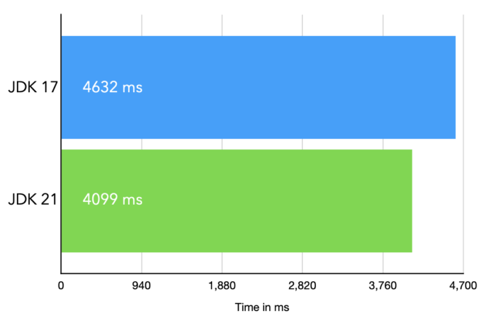
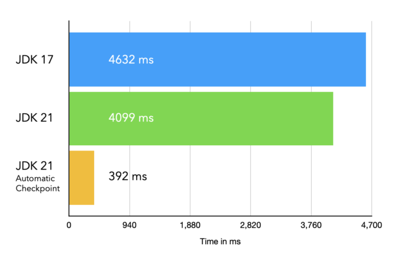
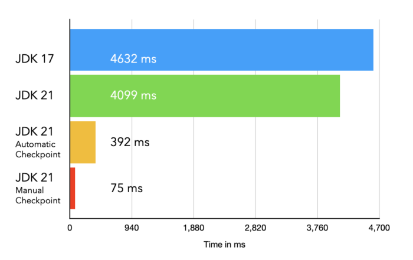

Last week Spring 6.1 and [SpringBoot 3.2](https://spring.io/blog/2023/11/23/spring-boot-3-2-0-available-now "SpringBoot 3.2") were released and they both came with full support for CRaC (Coordinated Restore at Checkpoint).

If you want to learn more about CRaC, feel free to read about it [here](https://docs.azul.com/core/crac/crac-introduction "here").

**CRaC is an [OpenJDK project](https://wiki.openjdk.org/display/crac "OpenJDK project") that can "snapshot" a running JVM (Java Virtual Machine) and store its state, including your application, to disk. Then, at another point in time, you can restore the JVM from the saved checkpoint back to memory. With this, one can start an application, warm it up, and create a checkpoint. Restoring from the saved checkpoint back to memory mainly relies on disk I/O, which means it is really fast (in the range of milliseconds).**

To test the support for CRaC in SpringBoot 3.2, I will use the [SpringBoot Petclinic](https://github.com/spring-projects/spring-petclinic "SpringBoot Petclinic") demo.

For this little test, I run Ubuntu 22.04 in Parallels on my M1 Macbook Pro using 4 cores and 4GB of RAM.

#### **Prerequisites**

To make use of CRaC in SpringBoot 3.2, you need to have three things:

* A JVM with support for CRaC
* A dependency for org.crac
* A folder where the checkpoints can be stored

**The JDK**   

The used JDK (Java Development Kit) is Azul Zulu 21.0.1 + CRaC that you can get [here](https://www.azul.com/downloads/?os=linux&package=jdk-crac#zulu "here"). The JDK is available for x64 and aarch64 cpu architecture and for JDK 17 and JDK 21.

**Permissions**   

It might be needed to set the permissions to be able to use CRIU, meaning to say on the Linux machine you run the demo, you need to execute the following commands once:

```
sudo chown root:root $JAVA_HOME/lib/criu
sudo chmod u+s $JAVA_HOME/lib/criu
```

**org.crac.**   

Clone the petclinic repository to your local machine and add the dependency on the `org.crac` library.

Because CRaC at the moment is only available on Linux, you won't find a JDK that comes with support for CRaC for MacOS and Windows. This means you could not code against the CRaC API if you are on Mac or Windows machines. To solve this problem, the org.crac library offers the same API that is available in CRaC-enabled JDK's but instead of using the \`jdk.crac\` namespace, you will find it in the \`org.crac\` namespace.

With this, you can code against the CRaC API even on MacOS and Windows without having problems and as soon as you run it on a Linux system with a CRaC enabled JDK, it will use the CRaC feature.

You can find `org.crac` on Maven central, so you can add the dependency as follows:

Gradle:

```
implementation 'org.crac:crac:1.4.0'
```

Maven:

```
<dependency>
  <groupId>org.crac</groupId>
  <artifactId>crac</artifactId>
  <version>1.4.0</version>
</dependency>
```

**Create a folder for the checkpoint**   

Before we test that we need to make sure that we have a folder where the checkpoint can be stored e.g. `/tmp_checkpoint` in the project folder.

#### **Startup without using CRaC**

Once you've cloned the petclinic repository, you need to build the project (e.g., gradlew clean build) and then you can run it.

**The only thing we are interested in is the startup time of the application. I did tests on both JDK versions (17 and 21) and first of all, just by switching from 17 to 21 improved the startup time of the petclinic application already by 500ms!**

So, if possible, you should switch the JDK as soon as possible to benefit from the better performance.

Start the application by executing:

```
java -jar spring-petclinic-3.2.0.jar
```

Here are the results when starting up the application without using CRaC:



OK, it's around 500ms faster but still takes some time to start up, so let's take a look at another approach that was implemented in SpringBoot 3.2.

#### **Automatic Checkpoint**

The engineers in the Spring team had a nice idea to improve the startup time of the Spring/SpringBoot framework by creating a checkpoint automatically right before the application is started.

Here is the description from the documentation:

**"*When the -Dspring.context.checkpoint=onRefresh JVM system property is set, a checkpoint is created automatically at startup during the LifecycleProcessor.onRefresh phase. After this phase has completed, all non-lazy initialized singletons have been instantiated, and InitializingBean#afterPropertiesSet callbacks have been invoked; but the lifecycle has not started, and the ContextRefreshedEvent has not yet been published.*"**

To make use of the automatic checkpointing, we start the application as follows:

```
java -Dspring.context.checkpoint=onRefresh -XX:CRaCCheckpointTo=./tmp_checkpoint -jar spring-petclinic-3.2.0.jar
```

After executing the application, it will create the checkpoint, store the checkpoint files in the folder `./tmp_checkpoint`, and will then exit the application.

Now you can restore the application from the checkpoint (which means starting it again) by executing:

```
java -XX:CRaCRestoreFrom=./tmp_checkpoint
```

Here are the results related to the startup time when restoring from the automatic checkpoint



This is pretty cool, we get a startup time that is one order of magnitude faster than the original startup time without the need of changing our code. It also means the checkpoint only contains the framework code and not your application code, because that was not started yet.

#### **Manual Checkpoint**

The automatic checkpoint is already a big improvement related to startup time but we can even go faster than that by using a manual checkpoint.

When using manual checkpoints, you can decide whenever you like to create a checkpoint.

Why is that important?

Well you might want to create a checkpoint after 10 minutes or when your application is completely warmed up (most/all of the code was compiled and optimized) etc.

The procedure to create a manual checkpoint is similar to the automatic checkpoint, the only difference is that you trigger the checkpoint from outside the application instead of having the framework creating the checkpoint automatically.

Before we start, make sure that the folder for the checkpoint is empty.

First you start your application as follows:

```
java -XX:CRaCCheckpointTo=./tmp_checkpoint -jar spring-petclinic-3.2.0.jar
```

Now you wait until the application was completely started up before you open a second shell window.  

In this second shell window, you execute the following command:

```
jcmd spring-petclinic-3.2.0.jar JDK.checkpoint
```

Now you should see that in the first shell window, where you started the petclinic application, a checkpoint is created and the application was shut down.

You could check whether the application was checkpointed by verifiying that the folder `./tmp_checkpoint`contains the checkpoint files.

Now you can close the second shell window.

To restore the application from this checkpoint you execute the same command as for the automatic checkpoint:

```
java -XX:CRaCRestoreFrom=./tmp_checkpoint
```

This manually triggered checkpoint does not only contain the framework code but also the application code which means we should see an even faster startup because the application was already loaded and started by the framework. So here are the results:



As you can see, we have been able to reduce the startup time of the petclinic application by another order of magnitude down to 75ms!

#### **Info**

Because Spring 6.1 and SpringBoot 3.2 fully support CRaC, we didn't need to make modifications to the code. Full support here means that as long as you use Spring resources, the framework will take care about closing resources before a checkpoint and restoring them after a restore.

In case you use other resources, you need to implement the CRaC Resource interface in the related classes and close those other resources (e.g. open files or socket connections) in the \`beforeCheckpoint()\` method and re-open the other resources in the \`afterRestore()' methods.

#### **Verdict**

As we saw, the use of CRaC can dramatically reduce the startup time of a SpringBoot 3.2 application. In case you just would like to try it without touching your code you could reduce the startup time by one order of magnitude by simply using the automatic checkpoint feature in Spring 6.1 / SpringBoot 3.2.

For the fastest possible startup time, you can manually create a checkpoint which can bring down the startup time by two orders of magnitude.

The nice thing about CRaC is that fact that it is still running on a normal JVM and that the code can even further be optimized after a checkpoint/restore.

To get these results I needed to add a few lines of code to the petclinic project and if you would like to reproduce the numbers, feel free to clone my copy of the petclinic project over at my [GitHub repository](https://github.com/HanSolo/spring-petclinic "github repository").

Happy cracing... 😉
