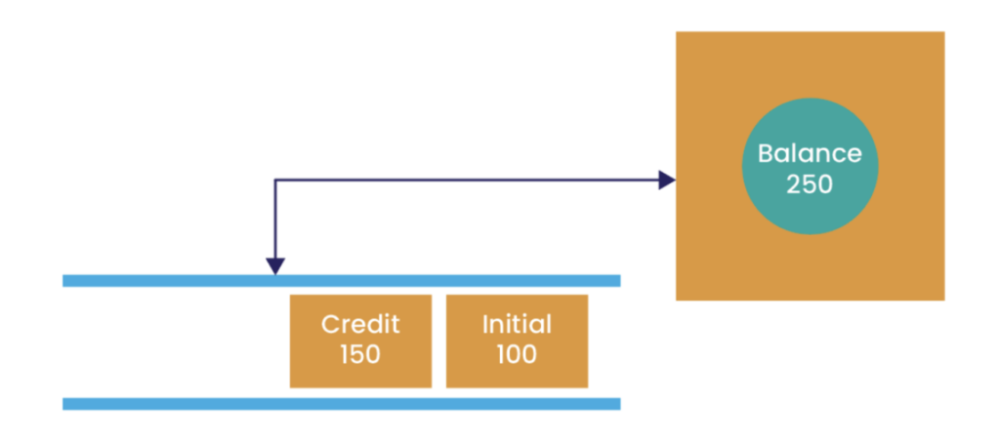
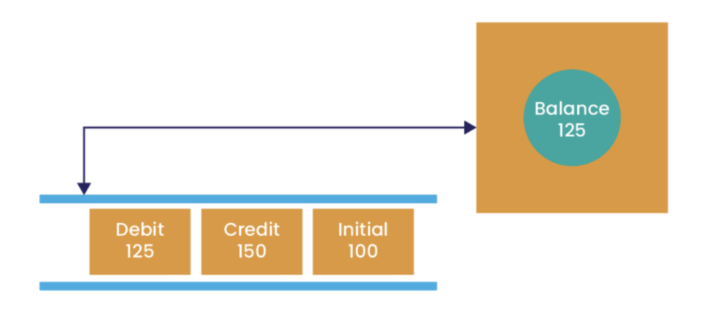
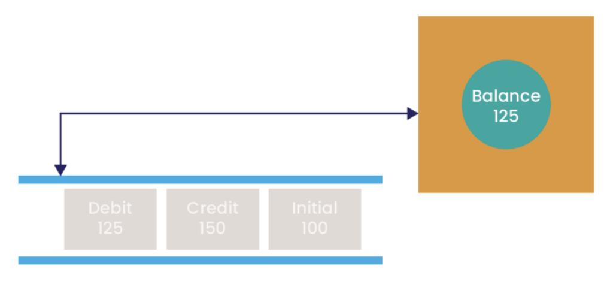

## Introduction

In distributed, microservice-based applications, the management of state is one of the most important, yet difficult aspects of design.

Ensuring the accuracy and consistency of state without introducing excessive complexity that affects performance or flexibility to support evolving requirements requires careful thought.

This article discusses issues around state management and shows how the [Chronicle Services](https://chronicle.software/services/ "Chronicle Services") framework provides support to deal with these in ways that maintain a resilient and high performing microservices architecture.

## What Do We Mean By State?

State is a term used to describe mutable data that is used by a software component to handle incoming requests or messages. One of the most important considerations when designing an application or system composed of a number of independent components is how to handle its state. There are often competing goals, which can affect the approach that is taken:

***Performance***

We want to minimise the overhead of handling data as it passes through the system.

***Safety***

We want to ensure that data is not lost during the normal operation of the system.

***Robustness***

We want to ensure that if a component fails, we can minimise both the loss of service and any data.

Normally the steps taken to optimise safety and robustness have costs that can adversely affect performance. Finding the right balance across these goals is therefore critical to building a system that is both fast and reliable.

## Microservices and State

The Microservices pattern aims to decouple components from each other, in order to maximise the flexibility and resilience of the overall application. A key part of this is to isolate any mutable state to the microservice that will modify it.

There are multiple possibilities for how state impacts the work of a microservice:

1. Incoming messages contain all the necessary information for a component to process its input and generate some form of output.
2. Incoming requests contain some of the information required to process the request, but it is necessary to retrieve some data from another component to generate the output for each request.
3. The component manages information locally that is used in the processing of requests or messages. Such information is usually accumulated over time, for example a total or average value derived from earlier requests.

A further goal of the decoupling advocated by the Microservices pattern is to enable a component to be stopped and restarted at any point, with minimal effect on other components, or on the application as a whole. The ease with which this can be achieved is dependent on the approach taken within the component with respect to its state.

In cases 1 and 2 described above, there is no cumulative state, this pattern is usually referred to as "stateless". A stateless component requires that all information required to process an incoming request or message is either contained within the message or is available by making a call to some other service. There is no reliance on any data within the component itself other than transient state used during processing.

This approach guarantees that no special action is required to create or recreate state when a component starts, simplifying implementation but with a potential cost of complicating the protocol by which messages are transmitted to the component.

Case 3 leads to what are known as "stateful" components. There is a need to preserve state between executions of the component, in order to meet the requirements of continuity of service that are part of the Microservices pattern. Currently, the only way to do this is to store information related to the state in persistent storage. This has normally meant saving changes in state to a database system, so that they can be read again upon the (re)starting of the component.

However, it has become clear that traditional databases, most notably relational database systems, have limitations when operating in a distributed environment. At the very least they introduce a significant overhead as a result of writing state changes to persistent storage.

## Managing State Through Events

In order to deal with the shortcomings of traditional databases, a number of alternative models have evolved for managing state in distributed applications. An increasingly popular approach is to use events as a means of communicating changes in state from one component to others.

Applications that utilise this approach typically follow the guidelines of Event-Driven Architecture, which require events to be persisted indefinitely. Any changes to key application state are notified by the component applying that change using some form of event transport, which will persist the event and notify other components that have registered an interest in the event.

The current value of an element of state is the result of applying all events that have notified a change in its value. This is a radical change from the traditional approach where a change is implemented by overwriting a single value and somehow persisting that change.

There are some important advantages to the event-driven approach, not least that we have the ability to examine the value of state at a given point in time, not just its current value. Essentially we have a built-in audit trail.

This is not to say that there are no disadvantages in using events like this, especially when we have a need to work with the "current value". Rather than replay all change events every time this is required, a component will normally cache the current value. When the component starts, or restarts, it is possible to rebuild the cached value from state change events that have occurred before.

The event-based approach to managing state in applications has evolved into a set of patterns often referred to as "Event Sourcing", and several sophisticated event management systems have evolved to support it.

## The Chronicle Services Approach to State

The basic model of a [Chronicle Services](https://chronicle.software/services/ "Chronicle Services") application is of a number of independent processing components (services), interacting with each other using events that are passed using [Chronicle Queue](https://chronicle.software/queue-enterprise/ "Chronicle Queue") instances. [Chronicle Queue](https://chronicle.software/queue-enterprise/ "Chronicle Queue") is a "store everything" data structure; in other words, all events posted by a service will be retained in perpetuity on persistent storage. As such, it is well suited to following the event-based approach to managing state described above.

Consider a simple stateful service that maintains the balance of some form of account. The service reads and processes events from an input queue to represent changes in the account's balance:

We can see the service maintains state that represents the balance; its current value is the result of processing the two relevant events on the queue. The service maintains a pointer indicating from where the next event will be read:  

Now we can see how the service's local value is updated following the event.

### Service Startup and Event Replay

If the service were to stop for some reason, its local state will be lost. However, [Chronicle Queue](https://chronicle.software/queue-enterprise/ "Chronicle Queue") retains all the events in the queue on persistent storage. On service restart, the local value can be recreated by re-applying these events through the appropriate event handlers.

During event replay, events (shown greyed out in the diagram) are read from the service's input queue(s), and processed in order although not in "real-time" (i.e. without the delays between events that would have occurred before). Due to the performance and efficiency of [Chronicle Queue](https://chronicle.software/queue-enterprise/ "Chronicle Queue"), the overhead of replaying events is kept to a minimum.

Processing the events in "replay" mode also disables the generation of any output events from the service indicating state changes, in order to prevent inconsistencies in downstream services that would see these state update events. When replay is complete, we can see the service's local state has the same value as it had when the services was stopped.

Through service configuration, we can define:

1. If event replay is to be performed (clearly it is not necessary for a stateless service).
2. At what point in the input queues is event replay finished, so that subsequent events are seen as genuine input events to the service and processed normally, with output state update events being posted.

By default, no event replay is performed, and the service will process inputs starting from the point at which the last output event was posted. In the case of a service starting for the first time, this will cause processing to begin with the first input event.

### Queue Replication

[Chronicle Queue Enterprise](https://chronicle.software/queue-enterprise/ "Chronicle Queue Enterprise") offers the capability to replicate a queue to one or more secondary systems, providing a basis for implementing high-availability deployment architectures for applications.

Since the replica queue(s) contain all of the state-changing events posted by the primary service instance, it follows that in the event of the primary service failing, an alternative service instance can be started on one of the backup systems. As it starts, this service instance will be able, through applying the replicated input events, to completely recreate the state that was valid in the failed instance.

A more detailed discussion of the implications of Queue Replication in [Chronicle Services](https://chronicle.software/services/ "Chronicle Services") will be provided in a future article.

### Checkpointing State

[Chronicle Services](https://chronicle.software/services/ "Chronicle Services") applications are designed to operate over long time periods, and often extremely large number of events are posted to queues. Despite the performance of [Chronicle Queue](https://chronicle.software/queue-enterprise/ "Chronicle Queue"), the replaying of especially large numbers of events can introduce a delay in restarting a service instance that has failed, resulting in a lack of availability that may be unacceptable.

As well as providing a high level configuration based approach to state management, [Chronicle Services](https://chronicle.software/services/ "Chronicle Services") offers a lower level API based approach that provides the ability to write snapshots of the services state to a queue, and to use this snapshot as a checkpoint to reduce the amount of time to recreate the state when starting or restarting.In this approach, it is necessary to read only from the last snapshot, handling state-changing input events that occurred after this point.

We will discuss this approach in more detail in a future article.

## Summary

When implementing an application using a Microservice architecture, it is crucially important to be aware of the potential pitfalls of managing mutable state in components.

As a framework, [Chronicle Services](https://chronicle.software/services/ "Chronicle Services") provides comprehensive approaches for doing this in a way that maintains state safely in a robust manner, without sacrificing performance.
