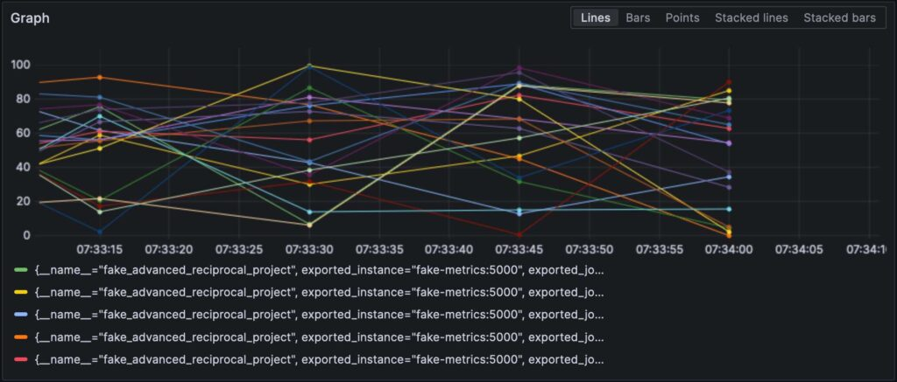
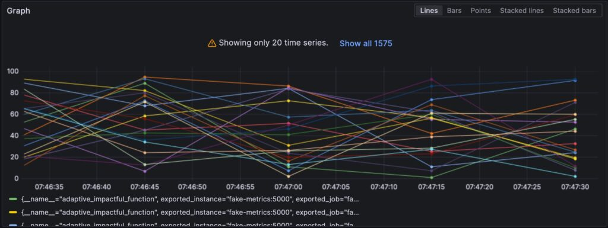

The OpenTelemetry Collector sits at the center of the OpenTelemetry architecture but is unrelated to the W3C Trace Context.

In my [tracing demo](https://github.com/nfrankel/opentelemetry-tracing), I use Jaeger instead of the Collector.

Yet, it's ubiquitous, as in every OpenTelemetry-related post. I wanted to explore it further.

In this post, I explore the different aspects of the Collector:

* The data kind: logs, metrics, and traces
* Push and pull models
* Operations: reads, transformations, and writes

## First steps

A long time ago, *observability* as we know it didn't exist; what we had instead was *monitoring*. Back then, monitoring was a bunch of people looking at screens displaying dashboards. Dashboards themselves consisted of metrics and only system metrics: mainly CPU, memory, and disk usage. For this reason, we will start with metrics.

[Prometheus](https://prometheus.io/) is one of the primary monitoring solutions. It works on a pull-based model: Prometheus scrapes compatible endpoints of your application(s) and stores them internally.

We will use the OTEL Collector to scrape a Prometheus-compatible endpoint and print out the result in the console. Grafana Labs offers a [project](https://github.com/grafana/fake-metrics-generator) that generates random metrics to play with. For simplicity's sake, I'll use Docker Compose; the setup looks like the following:

```yaml
version: "3"

services:
  fake-metrics:
    build: ./fake-metrics-generator                                         #1
  collector:
    image: otel/opentelemetry-collector:0.87.0                              #2
    environment:                                                            #3
      - METRICS_HOST=fake-metrics
      - METRICS_PORT=5000
    volumes:
      - ./config/collector/config.yml:/etc/otelcol/config.yaml:ro           #4
```

1. No Docker image is available for the fake metrics project; hence, we need to build it
2. Latest version of the OTEL Collector at the time of this writing
3. Parameterize the following configuration file
4. Everything happens here

As I mentioned above, the OTEL Collector can do a lot. Hence, configuration is everything.

```yaml
receivers:                                                                  #1
  prometheus:                                                               #2
    config:
      scrape_configs:                                                       #3
        - job_name: fake-metrics                                            #4
          scrape_interval: 3s
          static_configs:
            - targets: [ "${env:METRICS_HOST}:${env:METRICS_PORT}" ]

exporters:                                                                  #5
  logging:                                                                  #6
    loglevel: debug

service:
  pipelines:                                                                #7
    metrics:                                                                #8
      receivers: [ "prometheus" ]                                           #9
      exporters: [ "logging" ]                                              #9
```

1. List of receivers. A receiver reads data; it can be either push-based or pull-based.
2. We use the `prometheus` pre-defined receiver
3. Define pull jobs
4. Job's configuration
5. List of exporters. In contrast to receivers, an exporter writes data.
6. The simplest exporter is to write data on the standard out
7. Pipelines assemble receivers and exporters
8. Define a metric-related pipeline
9. The pipeline gets data from the previously-defined `prometheus` receiver and sends it to the `logging` exporter, *i.e.*, prints them

Here's a sample of the result:

```
2023-11-11 08:28:54 otel-collector-collector-1     | StartTimestamp: 1970-01-01 00:00:00 +0000 UTC
2023-11-11 08:28:54 otel-collector-collector-1     | Timestamp: 2023-11-11 07:28:54.14 +0000 UTC
2023-11-11 08:28:54 otel-collector-collector-1     | Value: 83.090000
2023-11-11 08:28:54 otel-collector-collector-1     | NumberDataPoints #1
2023-11-11 08:28:54 otel-collector-collector-1     | Data point attributes:
2023-11-11 08:28:54 otel-collector-collector-1     |      -> fake__embrace_world_class_systems: Str(concept)
2023-11-11 08:28:54 otel-collector-collector-1     |      -> fake__exploit_magnetic_applications: Str(concept)
2023-11-11 08:28:54 otel-collector-collector-1     |      -> fake__facilitate_wireless_architectures: Str(extranet)
2023-11-11 08:28:54 otel-collector-collector-1     |      -> fake__grow_magnetic_communities: Str(challenge)
2023-11-11 08:28:54 otel-collector-collector-1     |      -> fake__reinvent_revolutionary_applications: Str(support)
2023-11-11 08:28:54 otel-collector-collector-1     |      -> fake__strategize_strategic_initiatives: Str(internet_solution)
2023-11-11 08:28:54 otel-collector-collector-1     |      -> fake__target_customized_eyeballs: Str(concept)
2023-11-11 08:28:54 otel-collector-collector-1     |      -> fake__transform_turn_key_technologies: Str(framework)
2023-11-11 08:28:54 otel-collector-collector-1     |      -> fake__whiteboard_innovative_partnerships: Str(matrices)
2023-11-11 08:28:54 otel-collector-collector-1     | StartTimestamp: 1970-01-01 00:00:00 +0000 UTC
2023-11-11 08:28:54 otel-collector-collector-1     | Timestamp: 2023-11-11 07:28:54.14 +0000 UTC
2023-11-11 08:28:54 otel-collector-collector-1     | Value: 53.090000
2023-11-11 08:28:54 otel-collector-collector-1     | NumberDataPoints #2
2023-11-11 08:28:54 otel-collector-collector-1     | Data point attributes:
2023-11-11 08:28:54 otel-collector-collector-1     |      -> fake__expedite_distributed_partnerships: Str(approach)
2023-11-11 08:28:54 otel-collector-collector-1     |      -> fake__facilitate_wireless_architectures: Str(graphical_user_interface)
2023-11-11 08:28:54 otel-collector-collector-1     |      -> fake__grow_magnetic_communities: Str(policy)
2023-11-11 08:28:54 otel-collector-collector-1     |      -> fake__reinvent_revolutionary_applications: Str(algorithm)
2023-11-11 08:28:54 otel-collector-collector-1     |      -> fake__transform_turn_key_technologies: Str(framework)
2023-11-11 08:28:54 otel-collector-collector-1     | StartTimestamp: 1970-01-01 00:00:00 +0000 UTC
2023-11-11 08:28:54 otel-collector-collector-1     | Timestamp: 2023-11-11 07:28:54.14 +0000 UTC
2023-11-11 08:28:54 otel-collector-collector-1     | Value: 16.440000
2023-11-11 08:28:54 otel-collector-collector-1     | NumberDataPoints #3
2023-11-11 08:28:54 otel-collector-collector-1     | Data point attributes:
2023-11-11 08:28:54 otel-collector-collector-1     |      -> fake__exploit_magnetic_applications: Str(concept)
2023-11-11 08:28:54 otel-collector-collector-1     |      -> fake__grow_magnetic_communities: Str(graphical_user_interface)
2023-11-11 08:28:54 otel-collector-collector-1     |      -> fake__target_customized_eyeballs: Str(extranet)
```

## Beyond printing

The above is an excellent first step, but there's more than printing to the console. We will expose the metrics to be scraped by a regular Prometheus instance; we can add a [Grafana dashboard](https://grafana.com/) to visualize them. While it may seem pointless, bear with it, as it's only a stepstone.

To achieve the above, we only change the OTEL Collector configuration:

```yaml
exporters:
  prometheus:                                                               #1
    endpoint: ":${env:PROMETHEUS_PORT}"                                     #2

service:
  pipelines:
    metrics:
      receivers: [ "prometheus" ]
      exporters: [ "prometheus" ]                                           #3
```

1. Add a `prometheus` exporter
2. Expose a Prometheus-compliant endpoint
3. Replace printing with exposing

That's it. The OTEL Collector is very flexible.

Note that the Collector is multi-input, multi-output. To both print data and expose them via the endpoint, we add them to the pipeline:

```yaml
exporters:
  prometheus:                                                               #1
    endpoint: ":${env:PROMETHEUS_PORT}"
  logging:                                                                  #2
    loglevel: debug

service:
  pipelines:
    metrics:
      receivers: [ "prometheus" ]
      exporters: [ "prometheus", "logging" ]                                #3
```

1. Expose data
2. Print data
3. The pipeline will both print data and expose them

With the Prometheus exporter configured, we can visualize metrics in Grafana.

[](raw-metrics.jpg)Note that receivers and exporters specify their type **and** every one of them must be unique. To comply with the last requirement, we can append a qualifier to distinguish between them, *i.e.* , `prometheus/foo` and `prometheus/bar.`

## Intermediary data processing

A valid question would be why the OTEL Collector is set between the source and Prometheus, as it makes the overall design more fragile. At this stage, we can leverage the true power of the OTEL Collector: data processing. So far, we have ingested raw metrics, but the source format may not be adapted to how we want to visualize data. For example, in our setup, metrics come from our fake generator, "business", and the underlying NodeJS platform, "technical." It is reflected in the metrics' name. We could add a dedicated source label and remove the unnecessary prefix to filter more efficiently.

You declare data processors in the `processors` section of the configuration file. The collector executes them in the order they are declared. Let's implement the above transformation.

The first step toward our goal is to understand that the collector has two flavours: a "bare" one and a contrib one that builds upon it. Processors included in the former are limited, both in number and in capabilities; hence, we need to switch the contrib version.

```yaml
collector:
  image: otel/opentelemetry-collector-contrib:0.87.0                        #1
  environment:
    - METRICS_HOST=fake-metrics
    - METRICS_PORT=5000
    - PROMETHEUS_PORT=8889
  volumes:
    - ./config/collector/config.yml:/etc/otelcol-contrib/config.yaml:ro     #2
```

1. Use the `contrib` flavour
2. For added fun, the configuration file is on another path

At this point, we can add the processor itself:

```yaml
processors:
  metricstransform:                                                         #1
    transforms:                                                             #2
      - include: ^fake_(.*)$                                                #3
        match_type: regexp                                                  #3
        action: update
        operations:                                                         #4
          - action: add_label                                               #5
            new_label: origin
            new_value: fake
      - include: ^fake_(.*)$
        match_type: regexp
        action: update                                                      #6
        new_name: ${1}                                                     #6-7
# Do the same with metrics generated by NodeJS
```

1. Invoke the metrics transform processor
2. List of transforms applied in order
3. Matches all metrics with the defined regexp
4. List of operations applied in order
5. Add the label
6. Rename the metric by removing the regexp group prefix
7. Fun stuff: syntax is `$${x}`

Finally, we add the defined processor to the pipeline:

```yaml
service:
  pipelines:
    metrics:
      receivers: [ "prometheus" ]
      processors: [ "metricstransform" ]
      exporters: [ "prometheus" ]
```

Here are the results:

## [](labeled-metrics.jpg)

## Connecting receivers and exporters

A connector is both a receiver **and** an exporter and connects two pipelines. The example from the documentation receives the number of spans (tracing) and exports the count, which has a metric. I tried to achieve the same with 500 errors - spoiler: it doesn't work as intended.

Let's first add a log receiver:

```yaml
receivers:
  filelog:
    include: [ "/var/logs/generated.log" ]
```

Then, we add a connector:

```yaml
connectors:
  count:
    requests.errors:
      description: Number of 500 errors
      condition: [ "status == 500 " ]
```

Lastly, we connect the log receiver and the metrics exporter:

```
service:
   pipelines:
     logs:
       receivers: [ "filelog" ]
       exporters: [ "count" ]
     metrics:
       receivers: [ "prometheus", "count" ]
```

The metric is named `log_record_count_total`, but its value stays at 1.

## Logs manipulation

Processors allow data manipulation; operators are specialized processors that work on logs. If you're familiar with the stack, they are the equivalent of Logstash.

As of now, the log timestamp is the ingestion timestamp. We shall change it to the timestamp of its creation.

```yaml
receivers:
  filelog:
    include: [ "/var/logs/generated.log" ]
    operators:
      - type: json_parser                                                   #1
        timestamp:                                                          #2
          parse_from: attributes.datetime                                   #3
          layout: "%d/%b/%Y:%H:%M:%S %z"                                    #4
        severity:                                                           #2
          parse_from: attributes.status                                     #3
          mapping:                                                          #5
            error: 5xx                                                      #6
            warn: 4xx
            info: 3xx
            debug: 2xx
      - id: remove_body                                                     #7
        type: remove
        field: body
      - id: remove_datetime                                                 #7
        type: remove
        field: attributes.datetime
      - id: remove_status                                                   #7
        type: remove
        field: attributes.status
```

1. The log is in JSON format; we can use the provided JSON parser
2. Metadata attributes to set
3. Fields to read from
4. Parsing pattern
5. Mapping table
6. Accept a range, *e.g.* , `501-599`. The operator has a special interpreted value `5xx` (and similar) for HTTP statuses.
7. Remove duplicated data

## Logs

At this point, we can send the logs to any log aggregation component. We shall stay in the Grafana Labs sphere and use Loki.

```yaml
exporters:
  loki:
    endpoint: "http://loki:3100/loki/api/v1/push"
```

We can also use logs from the collector itself:

```yaml
service:
  telemetry:
    logs:
```

Finally, let's add another pipeline:

```
service:
  pipelines:
    logs:
      receivers: [ "filelog" ]
      exporters: [ "loki" ]
```

Grafana can also visualize the logs. Choose Loki as a datasource.

## Conclusion

In this post, we delved into the OpenTelemetry collector.

While it's not a mandatory part of the OTEL architecture, it's a useful Swiss knife for all your data processing needs.

In case you're not stuck to a specific stack or don't want to, it's a tremendous help.

The complete source code for this post can be found on [GitHub](https://github.com/ajavageek/otel-collector).

**To go further:**

* [OpenTelemetry Collector](https://opentelemetry.io/docs/collector/)
* [OpenTelemetry Operators](https://github.com/open-telemetry/opentelemetry-collector-contrib/tree/main/pkg/stanza/docs/operators)

*Originally published at [A Java Geek](https://blog.frankel.ch/opentelemetry-collector/) on November 12^th^, 2023*

*[ELK]: Elasticsearch Logstash Kibana
