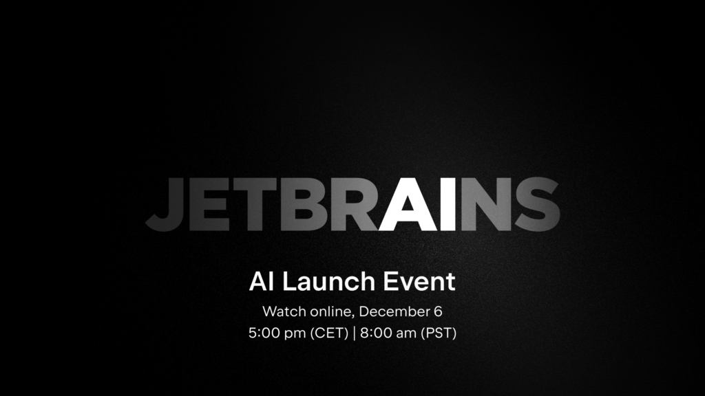

**Don't miss the online [JetBrains](https://www.jetbrains.com/) AI launch event, where we'll release our AI-powered coding companion, JetBrains AI Assistant.**

With JetBrains AI, your favorite tools gain new abilities while you are empowered with more information at your fingertips.

Free yourself from the routine and stay in the flow like never before!

Join the [JetBrains AI launch event online](https://jb.gg/aihere)! **December 6, 5:00 pm (CET) \| 8:00 am (PST).**

Learn more about JetBrains AI and AI Assistant from the creators themselves.

