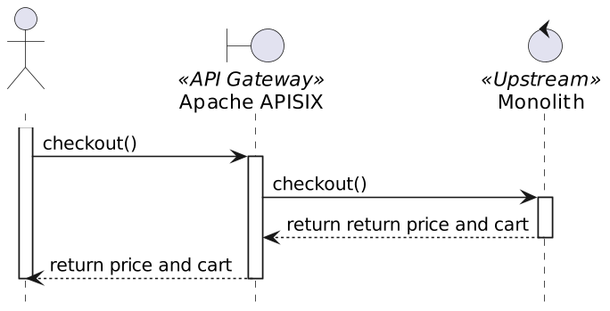
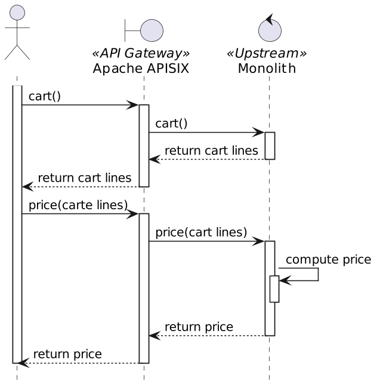
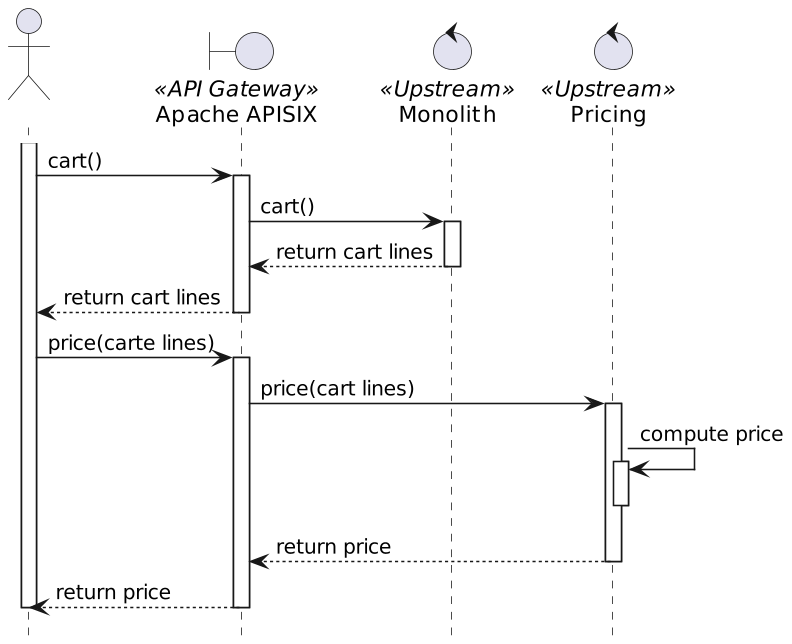
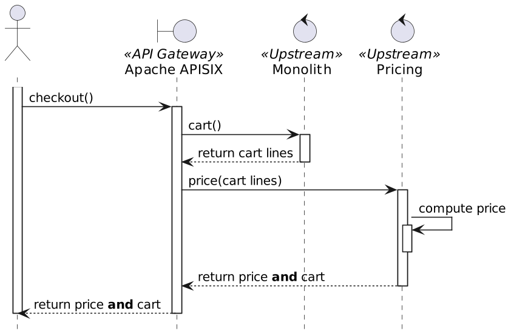

**In my previous post [Chopping the Monolith](https://foojay.io/today/chopping-monolith/), I explained that some parts of a monolith are pretty stable and only the fast-changing parts are worth being "chopped."**

I turned the post into a talk and presented it at several conferences. I think it's pretty well received; I believe it's because most developers understand, or have direct experience, that microservices are not a good fit for traditional organizations, as per [Conway's Law](https://en.wikipedia.org/wiki/Conway%27s_law).

In the talk, I use an e-commerce webapp as an example.

The pricing needs to change often due to business requirements, and it is a good candidate for chopping. The idea is first to expose pricing as an HTTP route.

At this point, we can configure the Gateway to forward pricing calls with the cart payload to another component, *e.g.* , a .

I expected a lot of pushback because we now need twice the number of HTTP calls. Given that the client is remote, it has a non-trivial performance cost. It has yet to be mentioned, but I'd like to offer another better-designed approach today.

In particular, we can move the forked calls from the client to the API Gateway. We still have twice the number of calls, but since the Gateway is much closer to the upstream(s), the performance hit is much lower.

No one will be surprised I'm using apisix-pipeline-request-plugin README for my demos. It implements a plugin architecture and comes bundled with plugins that address most possible requirements.

We need a plugin that pipes an HTTP call's output to another HTTP call's input. It's not part of the current out-of-the-box plugin portfolio; however, when no plugin fits your requirement, you can develop your own - or find one that does. My colleague Zeping Bai has developed such a plugin:
> When handling client requests, the plugin will iterate through the nodes section of the configuration, requesting them in turn.
>
> In the first request, it will send the complete method, query, header, and body of the client request, while in subsequent requests it will only send the last response with the POST method.
>
> The successful response will be recorded in a temporary variable, and each request in the loop will get the response body of the previous request and overwrite the response body of the current request.
>
> When the loop ends, the response body will be sent to the client as the final response.
>
> -- [apisix-pipeline-request-plugin README](https://github.com/bzp2010/apisix-plugin-pipeline-request)

The final sequence is the following:

Note that the `apisix-pipeline-request-plugin` consumes the input. As we want to return all the necessary data, we must return both the cart lines and the price in the payload. The pricing should return the cart lines, which is not an issue since it receives it as an input.

Apache APISIX configuration {#h2-0-apache-apisix-configuration}
---------------------------------------------------------------

The Apache APISIX configuration is the following:

| Route |       URI       |      Plugins       |                                                                                                             Comment                                                                                                             |
|-------|-----------------|--------------------|---------------------------------------------------------------------------------------------------------------------------------------------------------------------------------------------------------------------------------|
| #1    | `/*`            |                    | Catch-all route for front-end resources                                                                                                                                                                                         |
| #2    | `/api*`         | `proxy-rewrite`    | * Catch-all route for back-end API calls * The plugin rewrites URIs to remove the `/api` prefix *                                                                                                                               |
| #3    | `/api/checkout` | `pipeline-request` | The magic happens here: * The first pipeline node calls the monolith to return the cart lines * The second calls the pricing component with the cart lines to return the cart lines and the pricing computed in the component * |
| #4    | `/api/price`    | `azure-functions`  | I implement the pricing in an Azure FaaS, but it's an implementation detail                                                                                                                                                     |

Conclusion {#h2-1-conclusion}
-----------------------------

In this post, I offer another alternative to chop the monolith.

Instead of forking the call on the client side, we fork the call on the Gateway side.

While Apache APISIX doesn't offer such a plugin out-of-the-box, the community fills in the blank with the `apisix-pipeline-request-plugin`.

Compared to the original solution, this alternative has a couple of benefits:

* Better performance, as the fork happens closer to the Gateway
* No impact client-side

The complete source code for this post can be found on [Github](https://github.com/nfrankel/chop-monolith/tree/api).

**To go further:**

* [Chopping the monolith, the original way](https://blog.frankel.ch/chopping-monolith/)
* [apisix-pipeline-request-plugin](https://github.com/bzp2010/apisix-plugin-pipeline-request)
* [Chaining API requests with API Gateway](https://api7.ai/blog/chaining-api-requests-with-api-gateway)

*** ** * ** ***

*Originally published at [A Java Geek](https://blog.frankel.ch/chopping-monolith-smarter-way/) on November 26^th^, 2023*

*[FaaS]: Function-as-a-Service
