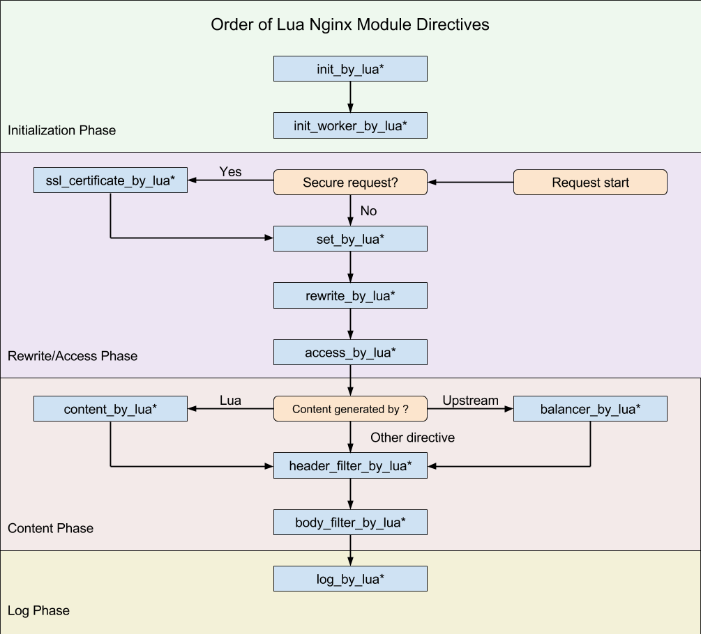
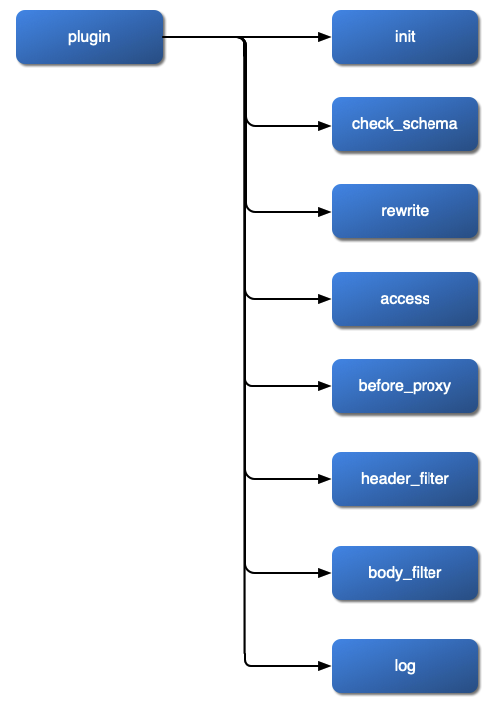

[Apache APISIX](https://apisix.apache.org/) is an API Gateway, which builds upon the [OpenResty](https://openresty.org/en/) reverse-proxy to offer a plugin-based architecture. The main benefit of such an architecture is that it brings structure to the configuration of routes. It's a help at scale, when managing hundreds or thousands of routes.

In this post, I'd like to describe how plugins, priority, and phases play together and what pitfalls you must be aware of.

## APISIX plugin's priority

When you configure a route with multiple plugins, Apache APISIX needs to execute them in a **consistent** order so that the results are the same over time. For this reason, every APISIX plugin has a *harcoded* **priority** . You can check a plugin priority directly in the code. For example, here's the relevant code fragment for the `basic-auth` plugin:

```yaml
local _M = {
    version = 0.1,
    priority = 2520,                                 #1
    type = 'auth',
    name = plugin_name,
    schema = schema,
    consumer_schema = consumer_schema
}
```

1. Priority is 2520

For documentation purposes, the `default-config.yaml` file lists the priority of all out-of-the-box plugins. Here's an excerpt:

```yaml
plugins:
  - ldap-auth                      # priority: 2540
  - hmac-auth                      # priority: 2530
  - basic-auth                     # priority: 2520
  - jwt-auth                       # priority: 2510
  - key-auth                       # priority: 2500
  - consumer-restriction           # priority: 2400
  - forward-auth                   # priority: 2002
  - opa                            # priority: 2001
  - authz-keycloak                 # priority: 2000
  #- error-log-logger              # priority: 1091
  - proxy-cache                    # priority: 1085
  - body-transformer               # priority: 1080
  - proxy-mirror                   # priority: 1010
  - proxy-rewrite                  # priority: 1008
  - workflow                       # priority: 1006
  - api-breaker                    # priority: 1005
  - limit-conn                     # priority: 1003
  - limit-count                    # priority: 1002
  - limit-req                      # priority: 1001
```

Imagine a route configured with `proxy-mirror` and `proxy-rewrite`. Because of their respective priority, `proxy-mirror` would run before `proxy-rewrite`.

```yaml
upstream:
  - id: 1
    nodes:
      "oldapi:8081": 1

routes:
  - id: 1
    uri: "/v1/hello*"
    upstream_id: 1
    plugins:
      proxy-rewrite:                                 #1-3
        regex_uri: ["/v1(.*)", "$1"]
      proxy-mirror:                                  #2
        host: http://new.api:8082
```

1. The plugin ordering in this file is not relevant
2. `proxy-mirror` has priority 1010 and will execute first
3. `proxy-rewrite` has priority 1008 and will run second

The above setup has an issue. For example, if we call `localhost:9080/v1/hello`, APISIX will first mirror the request, then remove the `/v1` prefix. Hence, the new API receives `/v1/hello` instead of `/hello`. It's possible to override the default priority to fix it:

```yaml
routes:
  - id: 1
    uri: "/v1/hello*"
    upstream_id: 1
    plugins:
      proxy-rewrite:
        _meta:
          priority: 1020                             #1
        regex_uri: ["/v1(.*)", "$1"]
      proxy-mirror:
        host: http://new.api:8082
```

1. Override the default priority

Now, `proxy-rewrite` has higher priority than `proxy-mirror`: the former runs before the latter.

In this case, it works flawlessly; in others, it might not. Let's dive further.

## APISIX phases

APISIX runs plugins not only according to their priorities but also through dedicated phases. Because APISIX builds upon OpenResty, which builds upon ngxinx, the phases are very similar to the phases of these two components.

nginx defines several [phases](http://nginx.org/en/docs/dev/development_guide.html#http_phases) an HTTP request goes through:

1. `NGX_HTTP_POST_READ_PHASE`
2. `NGX_HTTP_SERVER_REWRITE_PHASE`
3. `NGX_HTTP_FIND_CONFIG_PHASE`
4. `NGX_HTTP_REWRITE_PHASE`
5. `NGX_HTTP_POST_REWRITE_PHASE`
6. `NGX_HTTP_PREACCESS_PHASE`
7. `NGX_HTTP_ACCESS_PHASE`
8. `NGX_HTTP_POST_ACCESS_PHASE`
9. `NGX_HTTP_PRECONTENT_PHASE`
10. `NGX_HTTP_CONTENT_PHASE`
11. `NGX_HTTP_LOG_PHASE`

Each phase focuses on a task, *i.e.* , `NGX_HTTP_ACCESS_PHASE` verifies that the client is authorized to make the request.

In turn, OpenResty offers similarly named phases.

[From nginx documentation:](https://openresty-reference.readthedocs.io/en/latest/Directives/)



Finally, here are the phases of Apache APISIX:

1. `rewrite`
2. `access`
3. `before_proxy`
4. `header_filter`
5. `body_filter`
6. `log`

[From Apache APISIX documentation:](https://apisix.apache.org/docs/apisix/terminology/plugin/#plugins-execution-lifecycle)



We have seen two ways to order plugins: by priority and by phase. Now comes the most important rule: **order by priority only works inside a phase**!

For example, the `redirect` plugin has a priority of 900 and runs in phase `rewrite`; the `gzip` plugin has a priority of 995 and runs in phase `body_filter`. Regardless of their respective priorities, `redirect` will happen before `gzip`, because `rewrite` happens before `body_filter`. Likewise, changing a priority won't "move" a plugin out of its phase.

The example above with `proxy-mirror` and `proxy-rewrite` worked because both run in the `rewrite` phase.

The main issue is that priority is documented in the [config-default.yaml](https://github.com/apache/apisix/blob/master/conf/config-default.yaml#L438) file, while the phase is buried in the code. Worse, some plugins run across different phases. For example, let's check the proxy `proxy-rewrite` plugin and, more precisely, the functions defined [there](https://github.com/apache/apisix/blob/master/apisix/plugins/proxy-rewrite.lua):

* `local function is_new_headers_conf(headers)`
* `local function check_set_headers(headers)`
* `function _M.check_schema(conf)`
* `function _M.rewrite(conf, ctx)`

The name of the `rewrite()` function is suspiciously similar to one of the phases above. Looking at other plugins, we see the same pattern repeat. Apache APISIX runs plugin functions with the same name as the phase.

I took the liberty of summarizing all plugins and their respective phases in a table.

|         Plugin         |                                   Phase                                    ||||||
|       *General*        | `rewrite` | `access` | `before_proxy` | `header_filter` | `body_filter` | `log` |
|------------------------|-----------|----------|----------------|-----------------|---------------|-------|
| `redirect`             | X         |          |                |                 |               |       |
| `echo`                 |           |          |                | X               | X             |       |
| `gzip`                 |           |          |                | X               |               |       |
| `real-ip`              | X         |          |                |                 |               |       |
| `ext-plugin-pre-req`   | X         |          |                |                 |               |       |
| `ext-plugin-post-req`  |           | X        |                |                 |               |       |
| `ext-plugin-post-resp` |           |          | X              |                 |               |       |
| `workflow`             |           | X        |                |                 |               |       |
| `response-rewrite`     |           |          |                | X               | X             |       |
| `proxy-rewrite`        | X         |          |                |                 |               |       |
| `grpc-transcode`       |           | X        |                | X               | X             |       |
| `grpc-web`             |           | X        |                | X               | X             |       |
| `fault-injection`      | X         |          |                |                 |               |       |
| `mocking`              |           | X        |                |                 |               |       |
| `degraphql`            |           | X        |                |                 |               |       |
| `body-transformer`     | X         |          |                | X               | X             |       |
| `key-auth`             | X         |          |                |                 |               |       |
| `jwt-auth`             | X         |          |                |                 |               |       |
| `basic-auth`           | X         |          |                |                 |               |       |
| `authz-keycloak`       |           | X        |                |                 |               |       |
| `authz-casdoor`        |           | X        |                |                 |               |       |
| `wolf-rbac`            | X         |          |                |                 |               |       |
| `openid-connect`       | X         |          |                |                 |               |       |
| `cas-auth`             |           | X        |                |                 |               |       |
| `hmac-auth`            | X         |          |                |                 |               |       |
| `authz-casbin`         | X         |          |                |                 |               |       |
| `ldap-auth`            | X         |          |                |                 |               |       |
| `opa`                  |           | X        |                |                 |               |       |
| `forward-auth`         |           | X        |                |                 |               |       |
| `cors`                 | X         |          |                | X               |               |       |
| `uri-blocker`          | X         |          |                |                 |               |       |
| `ua-restriction`       |           | X        |                |                 |               |       |
| `referer-restriction`  |           | X        |                |                 |               |       |
| `consumer-restriction` |           | X        |                |                 |               |       |
| `csrf`                 |           | X        |                | X               |               |       |
| `public-api`           |           | X        |                |                 |               |       |
| `chaitin-waf`          |           | X        |                |                 |               |       |
| `limit-req`            |           | X        |                |                 |               |       |
| `limit-conn`           |           | X        |                |                 |               | X     |
| `limit-count`          |           | X        |                |                 |               |       |
| `proxy-cache` (init)   |           | X        |                | X               | X             |       |
| `proxy-cache` (disk)   |           | X        |                | X               |               |       |
| `proxy-cache` (memory) |           | X        |                | X               | X             |       |
| `request-validation`   | X         |          |                |                 |               |       |
| `proxy-mirror`         | X         |          |                |                 |               |       |
| `api-breaker`          |           | X        |                |                 |               | X     |
| `traffic-split`        |           | X        |                |                 |               |       |
| `request-id`           | X         |          |                | X               |               |       |
| `proxy-control`        | X         |          |                |                 |               |       |
| `client-control`       | X         |          |                |                 |               |       |
| `zipkin`               | X         | X        |                | X               |               | X     |
| `skywalking`           | X         |          |                |                 | X             |       |
| `opentelemetry`        | X         |          |                |                 | X             |       |
| `prometheus`           |           |          |                |                 |               |       |
| `node-status`          |           |          |                |                 |               |       |
| `datadog`              |           |          |                |                 |               | X     |
| `http-logger`          |           |          |                |                 | X             | X     |
| `skywalking-logger`    |           |          |                |                 |               | X     |
| `tcp-logger`           |           |          |                |                 |               | X     |
| `kafka-logger`         |           |          |                |                 | X             | X     |
| `rocketmq-logger`      |           |          |                |                 | X             | X     |
| `udp-logger`           |           |          |                |                 |               | X     |
| `clickhouse-logger`    |           |          |                |                 | X             | X     |
| `syslog`               |           |          |                |                 |               | X     |
| `log-rotate`           |           |          |                |                 |               |       |
| `error-log-logger`     |           |          |                |                 |               |       |
| `sls-logger`           |           |          |                |                 |               | X     |
| `google-cloud-logging` |           |          |                |                 |               | X     |
| `splunk-hec-logging`   |           |          |                |                 |               | X     |
| `file-logger`          |           |          |                |                 | X             | X     |
| `loggly`               |           |          |                |                 | X             | X     |
| `elasticsearch-logger` |           |          |                |                 |               | X     |
| `tencent-cloud-cls`    |           | X        |                |                 | X             | X     |
| `loki-logger`          |           |          |                |                 | X             | X     |
| `serverless`           |           | X        |                |                 |               |       |
| `openwhisk`            |           | X        |                |                 |               |       |
| `dubbo-proxy`          |           | X        |                |                 |               |       |
| `kafka-proxy`          |           | X        |                |                 |               |       |

## Conclusion

I've detailed Apache APISIX plugin phases and priorities in this post. I've explained their relationship with one another. Icing on the cake, I documented each out-of-the-box plugin's phase(s). I hope it will prove helpful.

**To go further:**

* [Default plugin priorities](https://github.com/apache/apisix/blob/master/conf/config-default.yaml#L438)
* [Apache APISIX plugin execution lifecycle](https://apisix.apache.org/docs/apisix/terminology/plugin/#plugins-execution-lifecycle)
* [Plugin execution code](https://github.com/apache/apisix/blob/master/apisix/plugin.lua#L1126-L1193)

*Originally published at [A Java Geek](https://blog.frankel.ch/apisix-plugins-priority-leaky-abstraction/) on December 10^th^, 2023*
