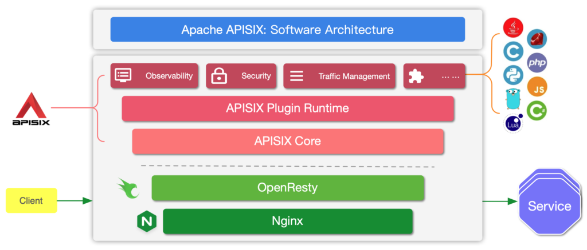
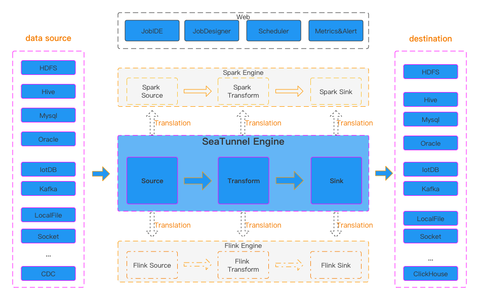
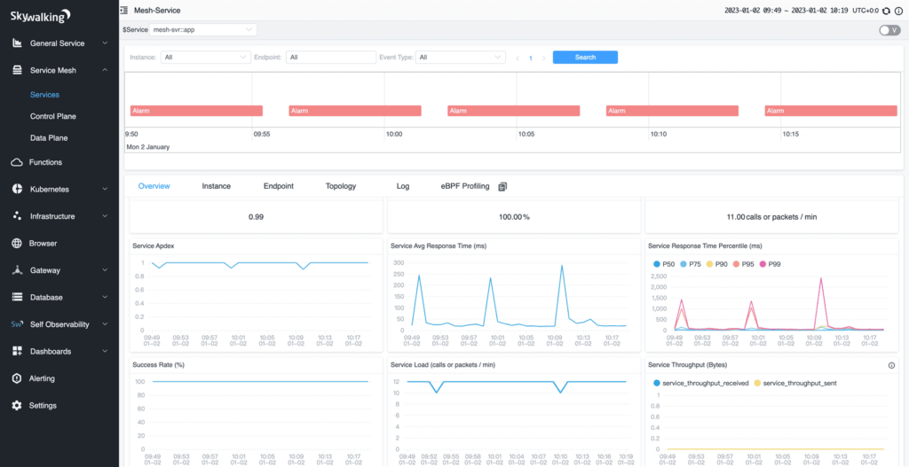
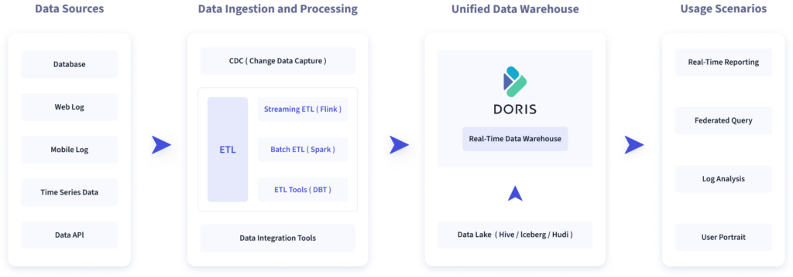

**In early 2021, I started to work on the [Apache APISIX](https://apisix.apache.org/) project. I have to admit that at the time I had never heard about it before.**

As a result, in this article, I'd like to introduce some Apache projects that are less well-known than HTTPD or Kafka.

Apache APISIX
-------------

[APISIX](https://apisix.apache.org/) is an [API Gateway](https://en.wikipedia.org/wiki/API_management). It builds upon [OpenResty](https://openresty.org/en/), a Lua layer built on top of the famous [nginx](https://nginx.org/) reverse-proxy. APISIX adds abstractions to the mix, *e.g.* , `Route`, `Service`, `Upstream`, and offers a plugin-based architecture.

 

Lots of plugins are provided out of the box:

* Transformation: `response-rewrite`, `proxy-rewrite`, gRPC, `body-transformer`, etc.
* Authentication: JWT, OPA, Keycloak, OpenID Connect, etc.
* Observability: metrics, logging, and traces
* Traffic: rate limiting, request validation, canary release, etc.
* Serverless: Azure functions, AWS Lambdas, OpenWhisk, etc.
* Messaging: Kafka, Dubbo, and MQTT
* Pre- and post-processing

If no plugin fits your requirements, writing your own is possible.

You can leverage APISIX on Kubernetes as an Ingress Controller. APISIX provides a Helm Chart for this.

------------------------------------------------------------------------------

Apache ShardingSphere
---------------------

[ShardingSphere](https://shardingsphere.apache.org/) claims to offer an ecosystem able to transform any database into a distributed database system. It acts as a proxy between your code and your database(s). It comes in two flavors:

 

* ShardingSphere-JDBC: a JDBC driver that acts as a proxy to your database(s). It's only available for JVM-based applications.
* ShardingSphere-Proxy: a technology-independent deployable component.

ShardingSphere offers several core features:

* Data Sharding is the core feature, as the project's name implies. Most use cases focus on scaling purposes, but there are others, *e.g.* , [data residency](https://blog.frankel.ch/data-residency/) requirements.
* XA transactions for distributed transactions
* Read/write splitting
* Data encryption
* etc.

Apache SeaTunnel
----------------

[Apache SeaTunnel](https://seatunnel.apache.org/) is a data integration platform that offers the three pillars of data pipelines: sources, transforms, and sinks. It offers an abstract API over three possible engines: the Zeta engine from SeaTunnel or a wrapper around [Apache Spark](https://spark.apache.org/) or [Apache Flink](https://flink.apache.org/). Be careful, as each engine comes with its own set of features.

 

The power of SeaTunnel comes from its rich connector ecosystem. It does provide traditional SQL connectors, *e.g.* , Oracle, PostgreSQL, and MySQL, and NoSQL ones, *e.g.* , MongoDB, Cassandra, and Elasticsearch. However, it also comes bundled with some original ones, including Jira, Google Sheets, and Notion. I have a particular fondness for the connector sources over MongoDB, MySQL, and Microsoft SQL Server.

 

SeaTunnel comes with a web UI, which provides visual management of jobs, scheduling, running, and monitoring capabilities.

Apache SkyWalking
-----------------

[Apache SkyWalking](https://skywalking.apache.org/) is an tool, focusing on microservices, Cloud Native apps, and Kubernetes architectures. It builds its architecture on four kinds of components:

 

* **Probes** collect telemetry data (metrics, logs, traces, and events). They support multiple output formats, including OpenTelemetry.
* The **platform** aggregates and processes data
* The **storage** offers an interface over a supported backend. Supported backends include ElasticSearch, H2, MySQL, TiDB, and BanyanDB, a custom storage engine developed for SkyWalking
* Finally, a web **UI** allows visualizing SkyWalking's data

Skywalking supports a couple of formats, including OpenTelemetry. Given the industry's current focus on OpenTelemetry, I recommend seriously considering this option.

Apache Doris
------------

[Apache Doris](https://doris.apache.org/) is a real-time data warehouse.

 

Doris promotes four primary scenarios:

* Reporting analysis
* Ad-Hoc query
* Unified data warehouse construction
* Data lake query

Doris is mostly MySQL compliant so that you can use a regular MySQL client.

Discussion
----------

The Apache Foundation hosts the projects above, but they have another thing in common: they were all incepted in China. Have a look at the [Apache project list](https://projects.apache.org/projects.html). You'll probably be amazed at the sheer number; it's close to 300!

In recent years, the number of projects incepted at the Apache Foundation has increased drastically. Look again at the list; I'm sure you only know a few of them - lots come from China. The trend is only growing; it's a great move to integrate China with the OpenSource world!

Just as I finish this post, my friend Stefano Fago has posted on another relevant project, [Apache Paimon](https://paimon.apache.org/), a streaming data lake platform.

**To go further:**

* [Apache APISIX](https://apisix.apache.org/)
* [Apache ShardingSphere](https://shardingsphere.apache.org/)
* [Apache SeaTunnel](https://seatunnel.apache.org/)
* [Apache SkyWalking](https://skywalking.apache.org/)
* [Apache Doris](https://doris.apache.org/)

*Originally published at [A Java Geek](https://blog.frankel.ch/five-apache-projects/) on December 17^th^, 2023*

*[CDC]: Change Data Capture
*[APM]: Application Performance Monitor
