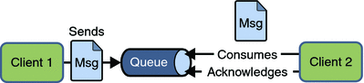
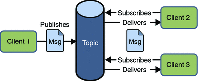

**When using the publish-subscribe domain with JMS, we often want to use durable subscriptions. But how can this be done with Spring Boot?**

What is JMS?
------------

The Java Message Service (JMS) API is a standard for creating, sending, receiving, and reading messages. It enables distributed communication that is loosely coupled, reliable, and asynchronous.

JMS supports two message delivery modes: Point-to-Point and Publish/Subscribe

In the point-to-point domain, a producer can send a message to one consumer through a destination called "queue". A given queue may have multiple receivers, but only one receiver may consume each message.


In the publish-subscribe domain, a producer can send a message to many consumers through a destination called "topic". Consumers can subscribe to a topic and receive a copy of each message.


Durable Subscription
--------------------

Durable subscriptions allow messages to remain on a topic while the message consumer is not active. A durable subscriber registers a durable subscription by specifying a unique identity that is retained by the JMS provider. You establish the unique identity of a durable subscriber by setting the following:

* A client ID for the connection
* A topic and a subscription name for the subscriber

Configuration with Spring Boot and JMS
--------------------------------------

The first thing to configure is that we want to use the publish-subscribe domain in the application.properties:

```
spring.jms.pub-sub-domain=true
```


Next we must configure durable subscription. Unfortunately this cannot be done using a simple property. We have to configure the ConnectionFactory manually:

```java
@Bean
public JmsListenerContainerFactory<?> artemisConnectionFactory(
                                         CachingConnectionFactory connectionFactory,
                                         DefaultJmsListenerContainerFactoryConfigurer configurer) {
    // When using durable subscription the ClientId must be set for reconnect
    // Note that client IDs need to be unique among all active Connections of the underlying JMS provider
    connectionFactory.setClientId(clientId);

    DefaultJmsListenerContainerFactory factory = new DefaultJmsListenerContainerFactory();
    configurer.configure(factory, connectionFactory);
    factory.setPubSubDomain(pubSubDomain);
    factory.setSubscriptionDurable(true);

    return factory;
}
```


The crucial lines in the configuration are line 6, where we set a client ID, which has to be unique among all active connections, and line 11, where we activate the durable subscription mode.

Finally, we must configure the Listener to use this connection factory by setting the containerFactory attribute of the JmsListener annotation. We also set the subscription. If this attribute is not set, Spring JMS will generate a subscription name based on the class and method name.

```java
@JmsListener(destination = "${chat.topic}",
             selector = "user <> '${chat.user}'",
             containerFactory = "artemisConnectionFactory",
             subscription = "chat")
public void onMessage(Message message) {
    ...
}
```


Example Code and References
---------------------------

You can find the source code on GitHub: <https://github.com/simasch/spring-boot-jms-pubsub-durable>

The two pictures are taken from the [Java EE 5 tutorial](https://docs.oracle.com/cd/E19316-01/819-3669/6n5sg7ch2/index.html)
