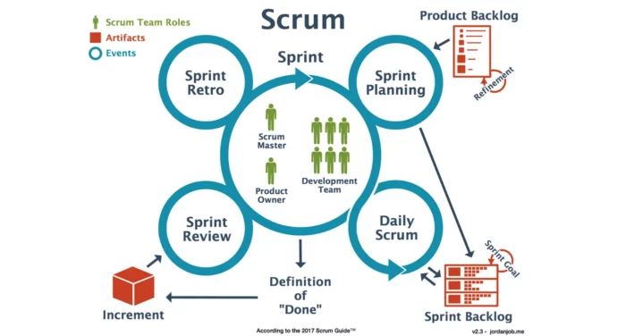

### Introduction

Hey there 🖐️, have you heard of Agile and Scrum?

If not, buckle up because we're about to embark on a journey to Scrumland!

Scrum is a framework under the Agile umbrella that makes software development a breeze (or at least, less of a hurricane 🌪️).

It's all about collaboration, flexibility, and delivering value in small, tasty chunks. 🍫

### Understanding Scrum

Scrum is like a game with its own rules and players. It's anchored on principles like transparency, inspection, and adaptation. Imagine a GPS that reroutes you when you take a wrong turn -- that's Scrum! 🗺️

In Scrum, we have three main roles:

1. The **Product Owner** is like the ship's captain, charting the course and deciding on the destination. They make sure the team is working on the most valuable features. ✈️🚢

2. The **Scrum Master** is like a coach, cheering the team on, keeping everyone on track, and clearing any roadblocks. 🏋️🚧

3. The **Development Team** (that's you, software engineers!) is the engine that powers the ship, turning ideas into reality. 💪🔧

Scrum also has special events (or meetings), like Sprint Planning, Daily Scrum, Sprint Review, and Sprint Retrospective, and artifacts like the Product Backlog, Sprint Backlog, and the Increment. We'll dive into these in more detail later.

### The Role of a Software Engineer in Scrum

As a software engineer in Scrum, you're part of the engine room.

Your mission, should you choose to accept it, is to turn user stories (the "what" and "why" of a feature) into functional, high-quality software. You're like a superhero, using your powers (coding skills) to save the day (deliver value)! 💻

### Technical Excellence in a Scrum Context

Quality is king in Scrum. It's all about creating clean, efficient, and maintainable code.

Practices like Test-Driven Development (TDD), Continuous Integration (CI), and Continuous Delivery (CD) help keep the quality high and the bugs low.

Remember, a bug today could become a monster tomorrow! 🐜👾

### Collaboration and Communication in Scrum

In Scrum, communication and collaboration are your best friends. It's like being part of a band -- you need to listen to each other, play in harmony, and make beautiful music together (or in this case, software!).

### Estimation Techniques in Scrum

In Scrum, we use cool techniques to estimate work, like Planning Poker (not as risky as it sounds! ♠️), T-Shirt Sizes (no actual t-shirts involved, sadly 👕), and more.

Estimation helps us plan sprints and manage our time effectively. After all, time is money! ⌛💰

### Adapting to Change in Scrum

Change is the only constant in life, and Scrum takes this to heart. As a software engineer, you need to be as flexible as a gymnast at the Olympics, ready to adapt to new requirements or priorities. 🤸🤹

### Continuous Learning and Improvement in Scrum

Scrum is all about learning and improving. It's like playing a video game -- with each level, you get better and stronger.

Sprint Retrospectives are your opportunity to level up, identifying what worked, what didn't, and how you can improve. 🎮🆙

### References

Start by familiarizing yourself with the \[[Scrum Guide](https://www.scrumguides.org/scrum-guide.html)\] -- it's your roadmap to everything Scrum.

Then, dive deeper with some great books like "Scrum: The Art of Doing Twice the Work in Half the Time" by Jeff Sutherland or "Essential Scrum: A Practical Guide to the Most Popular Agile Process" by Kenneth Rubin.

Join Scrum communities online, like the \[[Scrum Alliance](https://www.scrumalliance.org/)\] or \[[Scrum.org](http://Scrum.org)\] forums, where you can learn from others' experiences and share your own.

### Conclusion

So, there you have it -- your guide to Scrum as a software engineer! Embrace Scrum, make it your own, and watch as your projects transform from to-do lists to done-and-dusted! 🎉🚀

Remember, Scrum is more than just a framework -- it's a mindset. So, get your Scrum cap on, and happy coding! 💡🧢
