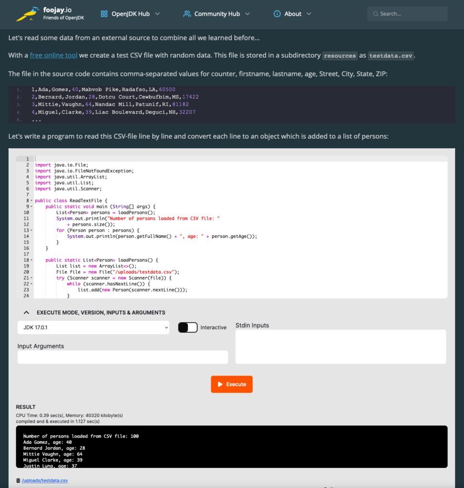
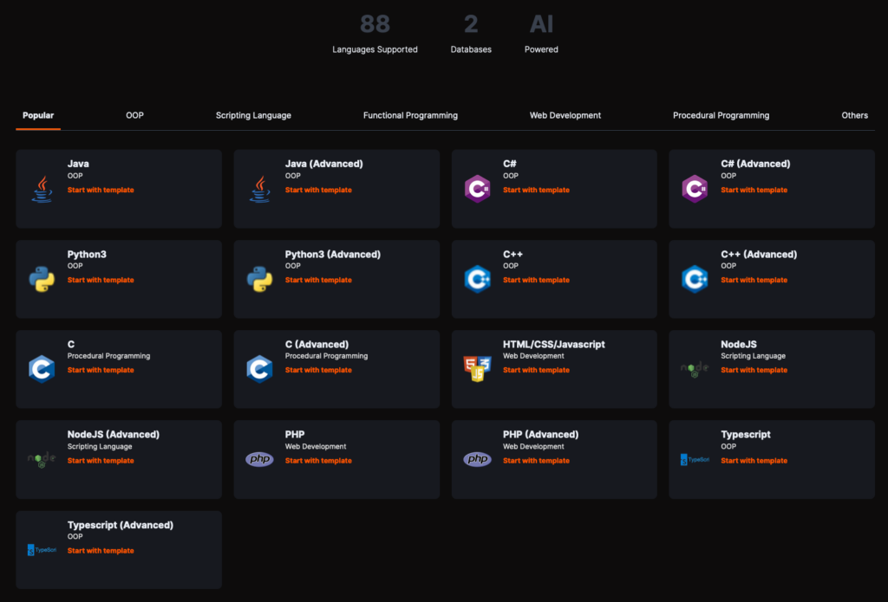

  
In two previous posts, we [explained how you can add executable Java code to your posts here on Foojay](https://foojay.io/today/integrate-executable-java-code-in-your-blog-posts/), including [code with dependencies](https://foojay.io/today/integrate-executable-java-code-in-your-blog-posts-part-2-how-to-use-dependencies/), by using JDoodle.

To achieve this full integration, we got [Gokul Chandrasekaran](https://www.linkedin.com/in/gokulchandrasekaran-jdoodle/)'s support to use the plugin version, and he also gave us some insight into the history and development of JDoodle.

***Thanks, Gokul for your support in bringing*** an online Java editor to Foojay! Can you introduce yourself,***please?***

Certainly! I'm Gokul the founder of JDoodle, and I have over 20 years of experience in the IT sector. My journey began as a Java developer, laying the foundation for my deep-rooted connection with the language.

Over the years, I've transitioned through diverse roles, from engineering management and IT architecture to management consulting. Each of these positions has given me a unique perspective. I'm glad we can help Foojay with this initiative.

***Example of executable code integration with JDoodle into the [Foojay Java Quickstart Tutorial](https://foojay.io/java-quick-start/quick-start-tutorial/reading-a-text-file/):***

***What was your initial goal when you started with JDoodle?***

When I first conceptualized JDoodle, it was rooted in my personal experiences from school and college. Back then, I often struggled to secure access to a computer to practice programming. And on the rare occasions I did get one, the next challenge was sourcing the right software. Significant time was spent on installing and maintaining these tools rather than on the actual coding.

With JDoodle, my primary aim was to build a platform that alleviates these challenges. I envisioned a space where students could single-mindedly focus on their programming education, and seasoned developers could channel their energies into coding without the distractions of dealing with hardware issues, software installations, or maintenance hassles. In essence, JDoodle was born out of a desire to streamline the coding experience for both budding programmers and experienced developers alike.

***How did JDoodle grow, and what can be done with it now?***

JDoodle's growth story has been a testament to the organic pull of genuine utility. It all began with just Java. I never invested in aggressive marketing; instead, users from around the globe started discovering and using JDoodle on their own accord. As they engaged with the platform, many came forward with requests and suggestions. This invaluable feedback from our user base played a pivotal role in shaping the platform's evolution.

One by one, based on demand, we began adding support for different languages. Today, JDoodle is a versatile tool, supporting 75+ programming languages and offering 2 integrated databases. Beyond just being a coding platform, it provides integration options for other applications and educational solutions through our APIs and plugins. One of our proudest additions has been our programming assessment platform, which aids in gauging coding proficiency.

Furthermore, in our constant quest to offer more value to our users, we've introduced an AI-powered code assistant. Think of it as your virtual coding companion—part teacher, peer, and assistant. It's designed to guide, assist, and enhance the overall coding experience, ensuring that every JDoodle user has the resources they need at their fingertips.

***JDoodle supports 80+ languages and 2 databases. Those are big numbers! How did you achieve this?***

Achieving support for 76+ languages and 2 databases on JDoodle was predominantly user-driven. As I mentioned earlier, the platform's growth and direction have been significantly influenced by the needs and feedback of our users. Whenever a user reached out with a request for a new language or a feature, we took it upon ourselves to find a way to accommodate it.

This commitment to our community's requirements and our relentless drive to cater to them led us to the extensive list of languages and databases we support today. And our mission doesn't stop here. We're continuously working to expand our offerings, and I'm excited to share that we're on track to support more than 100 languages soon. This journey is a testament to the symbiotic relationship between JDoodle and its users, where their needs shape our growth, and our platform empowers their coding journey.

***You are advertising JDoodle on your website as the "Programming Ecosystem for the AI Era." What plans do you have, and how is AI influencing your roadmap?***

The tagline "Programming Ecosystem for the AI Era" isn't just a catchphrase for JDoodle—it reflects our forward-thinking vision and commitment to innovation. We're at the cusp of a new age in programming, where AI is set to play an integral role in automating tasks and enhancing the developer experience.

To this end, as I touched upon earlier, we are unveiling an AI-powered coding assistant. This assistant isn't merely a tool but rather a multifaceted companion. It's designed to aid in writing code, assist with debugging, explain complex algorithms, optimize solutions, and even translate code snippets into different languages or a more understandable pseudo-code. The objective is to ensure that every developer, whether a novice learning the ropes or a seasoned professional, feels like they have a teacher, a peer, a friend, and a guide beside them throughout their coding journey.

AI's influence on our roadmap goes beyond just the coding assistant. We're constantly exploring how AI can be harnessed to enhance various facets of the developer experience through predictive coding, intelligent error handling, or even personalized learning paths. Our commitment is to ensure that JDoodle remains at the forefront of this AI-driven transformation, providing our users with the most cutting-edge tools and resources for their coding endeavors.
