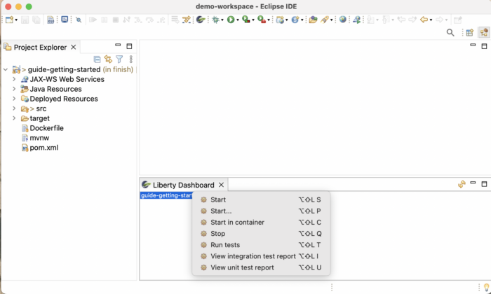
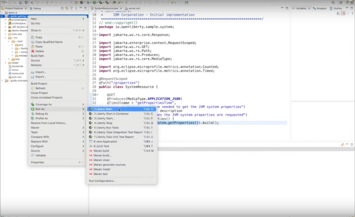
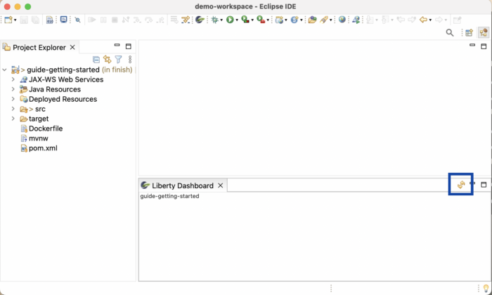

**The Eclipse IDE has been a popular choice with developers for many years, placing 2nd in "most popular IDE of 2022" by [JRebel](http://https://www.jrebel.com/blog/best-java-ide "JRebel"). This mature and fully-featured [IDE](https://www.redhat.com/en/topics/middleware/what-is-ide), with an extensive plugin repository, can help to significantly improve the development experience. However, ensuring that developers have the most appropriate and helpful plugins can be the key to unlocking this improved development experience and enhanced productivity.**

In this article, we'll explore the Liberty Tools plugin for Eclipse IDE and how it can help enable fast, easy, and efficient development of cloud-native Java applications with Open Liberty and WebSphere Liberty.

Open Liberty is a lightweight, open framework, great for building fast and efficient cloud-native Java applications. To learn more about what Liberty can offer, check out the "[Six reasons why Open Liberty](https://developer.ibm.com/articles/6-reasons-why-open-liberty-is-an-ideal-choice-for-developing-and-deploying-microservices/)" and "[Why cloud-native Java developers love Liberty](https://developer.ibm.com/articles/why-cloud-native-java-developers-love-liberty/)" articles. Alternatively, you can get hands-on with this cloud-native runtime with our [Getting started with Open Liberty guide](https://openliberty.io/guides/getting-started.html). WebSphere Liberty is built on Open Liberty and comes with an IBM license and provides additional features for heritage APIs and large-scale deployments on premises in VMs.

The open source [Liberty Tools for Eclipse IDE](https://ibm.biz/LibertyToolsEclipseMarketplace) is a useful plugin when developing your application with Open Liberty. The Liberty Tools are a set of intuitive developer tools that provide a simplified yet powerful development experience and support popular IDEs, including Eclipse IDE, [Visual Studio Code](https://developer.ibm.com/articles/awb-effective-cloud-native-development-open-liberty-vs-code/), and IntelliJ IDEA.

The Liberty Tools for Eclipse IDE plugin can help with all stages of the extended development lifecycle now expected from cloud-native development teams, including helping you to develop, build, test, deploy, and manage your applications -- all within your favorite IDE, Eclipse!



## Key capabilities of Liberty Tools

These tools introduce capabilities that really empower you to develop, test, debug, and manage applications without having to leave your IDE, including:

* **Easily view and access all detected Liberty projects** in your IDE in the Liberty Dashboard
* **Rapid, iterative development** with Liberty dev mode
* **Effective testing and debugging** all within the IDE
* **Editing assistance** for you to easily make changes to their configuration files
* **Coding assistance** for you to write applications that use Jakarta EE (9.x and later) and MicroProfile (3.x and later) APIs, including validations, quick fixes, and completions

In this article, we'll dive further into these capabilities. If you want to view a deep dive tutorial on this tool, then watch the [Developer Deep Dive of Liberty Tools for Eclipse IDE](https://ibm.biz/LibertyToolsForEclipseVideo) video. This video demonstrates many of the features and capabilities referenced in this article.

### View and access all detected Liberty projects in your IDE in the Liberty Dashboard

Liberty Tools automatically detects Liberty Maven or Gradle projects. These projects are added to a special Liberty Dashboard view in the Eclipse IDE. This can be accessed through the Open Liberty logo available in the top menu of the IDE. From this dashboard, you can access a command menu to manage your Liberty projects. Now you don't have to spend time creating and managing Liberty instances, which frees up your time to focus on the code itself.

If you're used to using actions in the Eclipse IDE through the project explorer **Run As** option, this can also be done for the same set of actions offered through the Liberty Tools plugin (if you'd rather use this approach instead of using the dashboard).

### Rapid, iterative development with Liberty dev mode

Liberty dev mode automatically detects, recompiles, and deploys code changes whenever you save a new change. It also runs unit and integration tests on demand and can attach a debugger to the running server to step through your code at any time. Liberty Tools brings these dev mode features directly into the command menu for the Liberty projects in your editor. With just a few clicks, you can start and stop your Liberty application, run tests, and view test reports.

Liberty dev mode enables rapid, iterative development in a manner that aligns with agile development practices that are recommended for cloud-native applications. See how you can get started rapidly with dev mode using Liberty Tools in the following video.

To try this for yourself, follow the steps in the Liberty Tools user guide to [run your app on Liberty using dev mode](https://github.com/OpenLiberty/liberty-tools-vscode/blob/main/docs/user-guide.md#run-your-application-on-liberty-using-dev-mode).

In addition to the standard **Start** action, which enables Liberty to run in dev mode, there is also a **Start...** action that can be used. Once selected, a Run Configurations window is opened within the Eclipse IDE which enables developers to select and customize the run configuration options to use for the application under development that can then be saved and re-used.

You can also run your application in dev mode in a container through the **Start in container** action. When dev mode runs with container support, it builds a container image and runs the container. For more information on dev mode for containers, check out the [Liberty Maven devc goal](https://github.com/OpenLiberty/ci.maven/blob/main/docs/dev.md#devc-container-mode) or the [Liberty Gradle libertyDevc task](https://github.com/OpenLiberty/ci.gradle/blob/main/docs/libertyDev.md#libertydevc-task-container-mode).

### Effective testing and debugging within the IDE

When your application is running on Liberty using dev mode, you can easily run the tests provided by your application. To do this, select the **Run tests** command for your application in the Liberty Dashboard, or alternatively, you can simply press **Enter** in the terminal running Liberty in dev mode. Additionally, you can also configure Liberty to automatically re-run tests after you've made changes. After the application tests finish running, you can access the test reports that were generated. The reports vary depending on what build tool you have used.

You can follow the steps in the Liberty Tools user guide to [run your application tests](https://github.com/OpenLiberty/liberty-tools-eclipse/blob/main/docs/user-guide.md#running-tests) and [view your application test results](https://github.com/OpenLiberty/liberty-tools-eclipse/blob/main/docs/user-guide.md#viewing-test-reports). Or, check out the following video to see for yourself just how easy this can be with Liberty Tools.

### Editing assistance for Liberty configuration files

You can also use Liberty Tools to get editing assistance, such as [code completion, diagnostics, and quick-fixes](https://github.com/OpenLiberty/liberty-language-server#features), for Liberty server.xml, server.env, and bootstrap.properties files.

To use Liberty-specific code completion, press **Ctrl + Space**  or **Cmd + Space** and a drop-down list of completion suggestions will appear. In addition to this, by hovering over existing features defined within the `server.xml`, a description for each of these will also appear, helping developers to know exactly what they're using in their applications. This hover-over support is also enabled for other XML elements too. This assistance all saves developers time, saving them from having to go and find the correct documentation to find this information, which provides further productivity gains.

To see an example of what this editing assistance is like, try following the steps in the Liberty Tools user guide for [editing assistance for Liberty configuration files](https://github.com/OpenLiberty/liberty-tools-eclipse/blob/main/docs/user-guide.md#configuring-a-liberty-server).

### Coding assistance for Jakarta EE and MicroProfile APIs

Another feature enabled through the Liberty Tools plugin is coding assistance. This provides helpful features such as code completion, diagnostics, and quick-fixes for writing Jave code and editing configuration files for Jakarta EE and MicroProfile APIs.

For example, by pressing **Ctrl + Space**  or **Cmd + Space** in context of your Java class files, a drop-down list of code snippet suggestions appears. This can range from an entire REST class, to adding POST, GET, DELETE methods, and more.

You can see this coding assistance in action with Liberty Tools for Eclipse IDE in the following video, which showcases how this can be used to add individual methods or entire classes.

You can follow the steps in the Liberty Tools user guide to [developing with Jakarta EE](https://github.com/OpenLiberty/liberty-tools-eclipse/blob/main/docs/user-guide.md#developing-with-jakarta-ee) and [developing with MicroProfile](https://github.com/OpenLiberty/liberty-tools-eclipse/blob/main/docs/user-guide.md#developing-with-microprofile) APIs with coding assistance.

## Start using Liberty Tools in the Eclipse IDE

Before you can use Liberty Tools in the Eclipse IDE, you must make sure that you satisfy the necessary [software requirements](https://github.com/OpenLiberty/liberty-tools-eclipse/blob/main/docs/user-guide.md#software-requirements), which you can find in the User Guide. These requirements include the minimum version of Java and the Eclipse IDE that are needed. You'll also need to ensure that you have either the [Liberty Maven plugin](https://github.com/OpenLiberty/ci.maven#configuration) or [Liberty Gradle plugin](https://github.com/OpenLiberty/ci.gradle#adding-the-plugin-to-the-build-script) configured in the `pom.xml` or `build.gradle` file for your application project. Use the most recent version of the plugin to get the latest enhancements and fixes.

After you've met these requirements, you'll also need to ensure you have the Liberty Tools for Eclipse IDE plugin installed. There are comprehensive instructions for how to install this plugin available on [GitHub](https://github.com/OpenLiberty/liberty-tools-eclipse/blob/main/docs/installation.md).

When installed, the Liberty Dashboard displays in the Project Explorer. Projects that are already properly configured to run on Liberty and use Liberty dev mode are automatically added to the Liberty Dashboard when it opens.

If you do not have any applications in your current workspace, you can [create a starter application](https://openliberty.io/start/) and import it. After you import an application, refresh the Liberty Dashboard tab by clicking the refresh icon.

## Summary and next steps

With the Liberty Tools plugin, you can efficiently develop, deploy, debug, test, and manage your cloud-native Java applications all within your favourite Eclipse IDE.

Now that you have Liberty Tools set up in your IDE, why not try using it with some of the [Open Liberty guides or tutorials](https://openliberty.io/guides/?utm_source=ibmd&utm_medium=article&utm_content=idevscode)?
