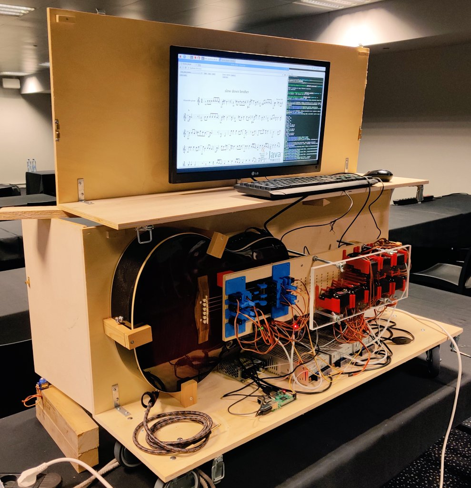

<figure class="alignright size-full">
 
</figure>

Bert Jan is CTO at [OpenValue](https://www.openvalue.eu/) and focuses on Java, software architecture, Continuous Delivery and DevOps.   

Bert Jan is a Java Champion, JavaOne Rock Star speaker, Duke's Choice Award winner and leads NLJUG, the Dutch Java User Group.   

He loves to share his experience by speaking at conferences, writing for the Dutch Java magazine and helping out Devoxx4Kids by teaching kids how to code. Bert Jan is easily reachable on Twitter at [@bjschrijver](https://twitter.com/bjschrijver).  

### Online Profile:

* Home page 🏠: [https://openvalue.eu](https://openvalue.eu/)
* LinkedIn 💼: <https://www.linkedin.com/in/bjschrijver/>
* Twitter 🐦: <https://twitter.com/bjschrijver>
* GitHub 🖥️: <https://github.com/bertjan/>

 

**Fun Fact**🌟: if you know me, you know 😉

**Bazlur: Please tell us about your professional background and how you became involved in the Java community. What motivates you to remain committed to it?**

**Bert:** I have a background as a Java developer and software architect. Around 2012, I went to my first Java conference: J-Fall. I became an [NLJUG](https://nljug.org/) member and started reading the Dutch Java magazine. In 2013, I started contributing to the NLJUG by joining the Java magazine editorial board. I did my first conference talk in 2013 (again at J-Fall).

Because I had become an active contributor to the NLJUG by working on the magazine and speaking, I met a lot of new people in the NLJUG community. As a result, I joined the NLJUG board in 2014 and started working on the organization of a couple of events (J-Fall, J-Spring and more), and later, I joined the Java Community Process (JCP) to start contributing to Java with the NLJUG.

In the meantime, I started speaking internationally, meeting lots of amazing people from the international Java community. I travelled a lot in 2015 and 2016 and met a group of speakers I regularly saw at events that I still consider my "family away from home." 😉

In 2017, I was awarded the title of Java Champion in recognition of my contributions to the Java community. Since then, I've continued my work for the NLJUG board, organizing events and speaking at conferences around the world. In 2017, I founded OpenValue, a Java and full-stack consulting company, together with Roy Wasse -- who I knew from the NLJUG community. So, I think it's safe to say that the Java community has had a major positive impact on my career.

**Bazlur: That's a fantastic journey. Given your extensive experience in the Java community, could you share some insights on how the Java landscape has evolved over the years? And what do you think are the key factors contributing to the continued success and growth of Java as a language and the Java community?**

**Bert:** I wrote my first Java code in 1998 in university. At that time, you had Swing for desktop client applications, and Java applets were supposed to take over the internet. We all know now how that turned out 😉 When I started programming Java professionally in 2006, Java had already evolved a bit more into the server-side space with servlets and JSPs and was becoming one of the most popular languages for server-side programming.

With the rise of cloud computing around 2010 - 2015, Java proved to be a reliable and performant language with a rich ecosystem, very suitable for building cloud-native applications. I think that Java's ability to evolve as a language and as an ecosystem helped enormously in its adoption and popularity.
> *Java's ability to evolve as a language and as an ecosystem helped enormously in its adoption and popularity.*

About the Java community: it's certainly one of the most welcoming and passionate communities I've ever been part of. When I first met some of the people I looked up to, I was surprised by how approachable everyone was and how quickly I became part of that "family" myself.

Obviously, community events like J-Fall, Devoxx and JavaZone play a big part there, and Java User Groups as well. The people behind these conferences and JUGs are doing amazing work in making knowledge about Java and the Java ecosystem accessible to everyone who's interested.

**Bazlur: With the constantly evolving tech industry, how can developers stay updated? Also, what is your opinion on the role of JUGs and conferences in helping developers keep up with emerging technology trends?**

**Bert:** Do whatever works for you, but be prepared to spend time regularly catching up with the latest new developments. Personally, my main sources for this are my Twitter feed and tech conferences. Via Twitter, I get daily updates on what's new in tech. When something big is happening, this is typically tweeted about by multiple people, so big things become hard to miss.

At conferences, I try to focus on visiting talks about new things I'd like to learn about and on catching up with old and new friends, and hearing what they're working on. I think JUGs and conferences play a major role in helping developers keep up with new technology. But be aware - technology is not always about the latest, greatest and newest; it's also about delivering value with boring tech 

That's why I love talks about projects leveraging a piece of technology to fulfill business goals. Everyone can get to a "hello world" stage with a new piece of tech, but when someone is sharing a year or more of experience with using a piece of tech in production, that's where I really find value in those types of talks.
> *Do whatever works for you, but be prepared to spend time regularly catching up with the latest new developments.*

 

**Bazlur: Many experienced developers harbour a wealth of knowledge but are hesitant to share their insights publicly due to fear of public speaking. What advice would you give to these individuals? And in your opinion, should every developer aim to speak at conferences or engage in public speaking in some capacity?**

**Bert:** I organize a couple of events and meetups, and I run a speaker mentoring program, so that I may be a bit biased, but yes, I do think that every developer should aim to share their knowledge. This doesn't necessarily need to be through public speaking, though. Sure, public speaking is great once you get the hang of it, and it really helps you build your personal brand, but if you've tried it and it's really not your thing, you shouldn't force yourself.

Travelling to events and throwing yourself in front of an audience takes quite some effort and energy, so you should only do it if you feel it brings you something. There are countless other ways of knowledge sharing! Think about writing, blogging, Tweeting, coaching others, giving training, etc. I think sharing knowledge is vital for any developer, but you should find a way of sharing that works for you.
> *I think sharing knowledge is vital for any developer, but you should find a way of sharing that works for you.*

**Bazlur: Having been a speaker at many conferences, what advice would you give to someone who is about to give their first conference talk?**

**Bert:** Find a mentor. Through the NLJUG speaker academy, we've mentored well over 100 aspiring speakers, of whom many are now speaking at national and international events. Find someone who's experienced and ask them to help you.

Often, I find that someone only needs a little bit of help with choosing topics, structuring a talk, preparing or practicing. A mentor can help you when you get stuck. In the end, a talk should be about your story, your experience, and what you learned. But a mentor can help you smooth out the kinks and give you that small nudge you need to move on.
> *Find a mentor... Often, someone only needs a little bit of help with choosing topics, structuring a talk, preparing or practicing.*

 

**Bazlur: The financial aspect of travelling and speaking at conferences can be challenging, particularly for independent speakers without some sort of sponsorship. Could you share some effective strategies you've discovered for managing these costs? Are there ways for speakers to offset or subsidize these expenses, and how can they be accessed?**

**Bert:** Good question. There are a couple of sources to help you with making it to an event. The first thing you can do is to contact the organizers and ask them if they can support you with getting to and staying at the event. This is not standard, by the way, and is different for each event. Some conferences pay for travel and hotel, some pay nothing, and most of them are somewhere in between.

For J-Fall, for example, since we're a community event, we have a limited budget for supporting speakers. In the call for papers, we ask speakers to indicate if they need support with travel costs. Once someone gets selected and they have indicated they need support, we reach out to them to discuss this, and we can typically work something out.

Another source can be to ask a company or employer to support you. When you're independent, this may be a bit more difficult, but if you work for an employer, you can always ask. In general, it's of good marketing value for a company when one of their employees speaks at a conference. You may also be able to request support from your employer because you travel to the conference for study/training purposes.

Finally, there may be community programs that you can apply to. I remember that JavaZone used to have diversity grants for supporting people from underrepresented groups even to visit the conference. Also, some community programs exist where the company sponsoring the program has a budget for members to travel to events. I remember getting sponsorship from an Oracle program a while ago to get me to speak at JavaOne.

**Bazlur: A substantial number of conferences host talks from developer relations individuals who represent specific companies. This could potentially influence perceptions about technology trends and best practices. In your view, does this company-led representation risk skewing the reality of technology discussions? How can we ensure a balanced, unbiased perspective in such a commercially influenced environment?**

**Bert**: I think this is a task for all of us. For the conference organizers who need to focus on this when selecting talks. For developer relations, individuals who usually recognize that they are on stage to share knowledge, not to promote a product.

And for attendees to give feedback to the speaker or the organization when this balance is off. Obviously, developer relations roles are sponsored by a company to travel the world to do.. well, developer relations stuff 😉 But in my experience, the best way to sell something is to not focus on selling it. Just share your knowledge and experience, and people will become interested in your product or service anyway.

**Bazlur: Can you tell us about a memorable talk or conference you have been part of? What made it stand out?**

**Bert:** I clearly remember two talks with amazing demos. Coincidentally, both were presented by colleagues of mine 😉

The first one was by Jago de Vreede, who wanted to play a guitar. But instead of learning to play the guitar himself, he automated it using a Raspberry Pi, servo motors and a bit of Java 😉

Here's a picture of Jago and his automatic guitar:

<https://x.com/JagoVreede/status/1192378065516683264?s=20>.

The second one was at J-Fall last year. Berwout de Vries Robles presented about HTTP/3 and reactive streaming.

As a demo, he used the audience's smartphones as an orchestra by having everyone connect to a backend and play music through the phone's speakers!

I was fortunate to be able to record part of that demo so that you can watch it here: <https://x.com/bjschrijver/status/1588207786885873670?s=20>

**Bazlur: Thank you so much for sharing your insights with us. We appreciate your time. Before we end, is there any parting advice or resources you would like to share with our readers, such as a list of recommended books or any other helpful information?**   

**Bert:**I can do books! A list of books that helped me, sorted by topic:

* CD \& DevOps: Everything by Dave Farley, Jez Humble and/or Gene Kim: Continuous delivery, The Phoenix Project, The Unicorn project, Modern software engineering.
* Leadership: The Manager's Path by Camille Fournier
* Software architecture: basically all architecture books by Neal Ford \& others: Fundamentals of Software Architecture, Software Architecture: The Hard Parts and Building Evolutionary Architectures. "The Architect Elevator" by Gregor Hohpe is also really good.

And in general my advice for any developer is: stay curious - and build simple things 😉

In summary, Bert Jan Schrijver's interview sheds light on the significant role of community involvement and continuous learning in the Java and software development realms.

His evolution from a Java developer to a Java Champion underscores the importance of engaging with the community, staying abreast of technological developments, and sharing knowledge in diverse ways.

Bert's experiences and insights offer valuable guidance and inspiration for developers, emphasizing the balance between embracing new technologies and valuing practical, real-world applications.
