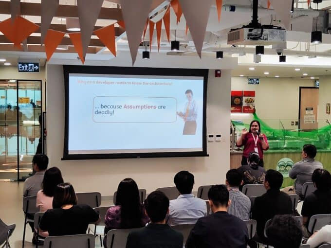
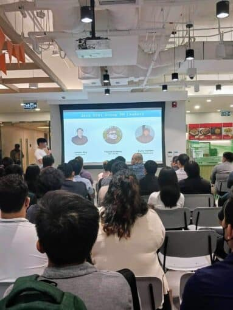
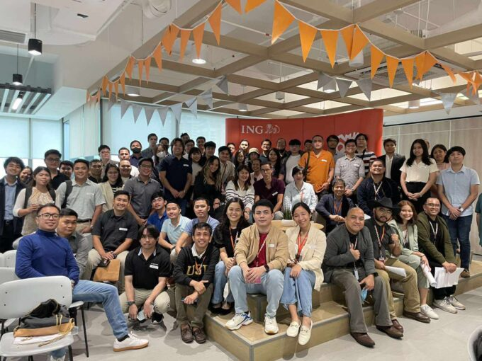
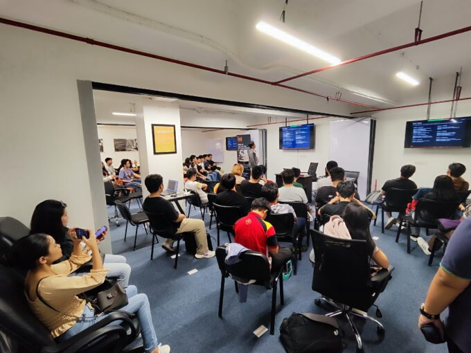
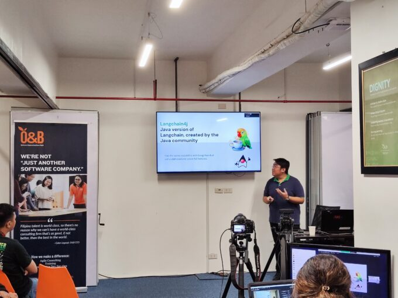
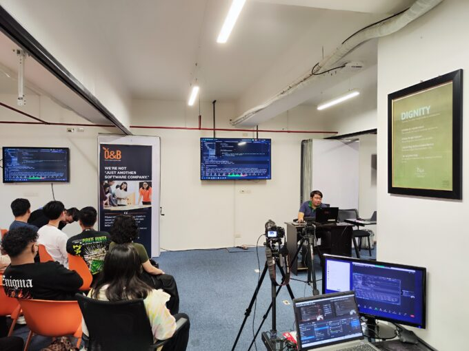
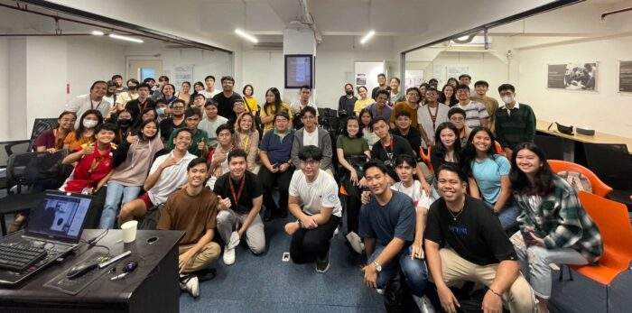

**Continuing the connection with the Java Enthusiasts and the efforts of Java User Group Philippines (JUG PH), we held our 4th and 5th meetup last September and November 2023.**

The speakers of these meetups were composed of [Jansen Ang](https://www.linkedin.com/in/jansen-ang/ "Jansen Ang"), one of the JUG PH Leader, [Kenneth Penarada](https://www.linkedin.com/in/kenpe%C3%B1aranda/ "Kenneth Penarada"), Senior Enterprise Engineer at Orange and Bronze Philippines and [Bang Iguana](https://www.linkedin.com/in/ma-minerva-l-iguana/ "Bang Iguana"), Senior Java Engineer at ING Hubs Philippines.

The 4th meetup discusess the Microservice and Event-driven Architecture. The Bang Iguana started the talk on the history of microservices then explained the pros and cons of the two architectures. She ended the talk with a game.

## Microservices vs Event-driven Architecture

Presentation of the JUG PH Leaders to ING Hubs Philippines by Tristan Mahinay

The Java attendees in the event!

The 5th meetup discussed the topics of Spring Certification and Generative AI using Java. This is the 1st event of JUG PH with 2 speakers in a day.

The presentation of the talks can be accessed here: [Spring Certification and Gen AI in Java](https://github.com/JUGPH/java-presentations/tree/main/event-5 "Spring Certification and Gen AI in Java")

## Spring Certification

Kenneth discussed the contents and expectation in taking the Spring Certification.

## Generative AI in Java

Jansen introduced to the community the LangChain4j library that is used to extend the capability of LLMs in the Java language.

Jansen had a live demonstration in using LangChain4j

The Java attendees in the event!

As of today the JUG PH already completed a total of 5 meetups using a hybrid setup.

These meetups were essential as it gives our Filipino Technical Enthusiasts the knowledge of Modern Java Development. Addtionally, with the use of AI in Java, it attracted the students to join these sessions.

To connect with the Java User Group Leaders and enthusiasts, join us in our social account!

* Facebook Group: <https://www.facebook.com/groups/jugph>
* LinkedIn: <https://www.linkedin.com/company/jugph>
* Twitter: <https://twitter.com/jugphilippines>
* Discord: <https://discord.gg/CGRVuS7XVG>
* GitHub: <https://github.com/JUGPH>
