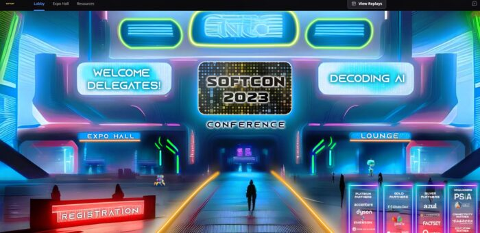
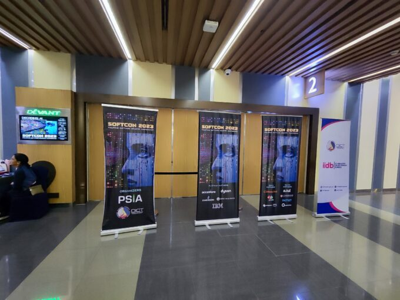
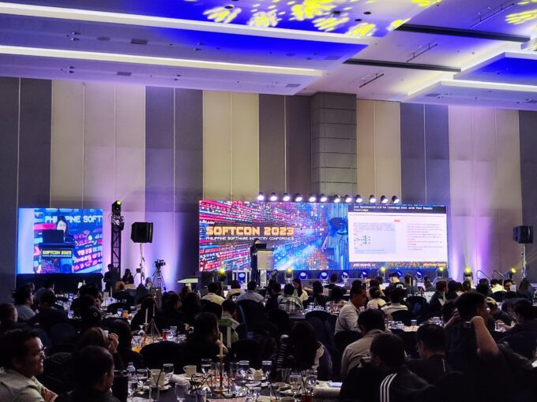
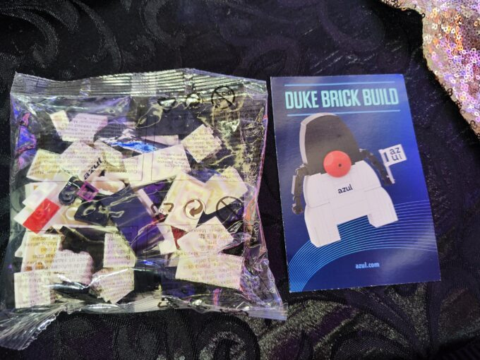
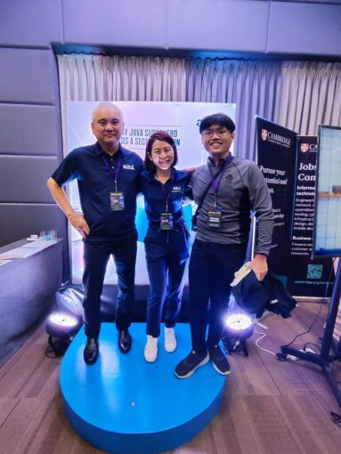
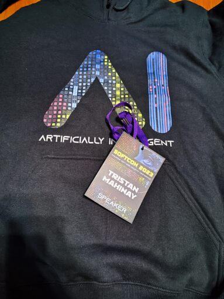
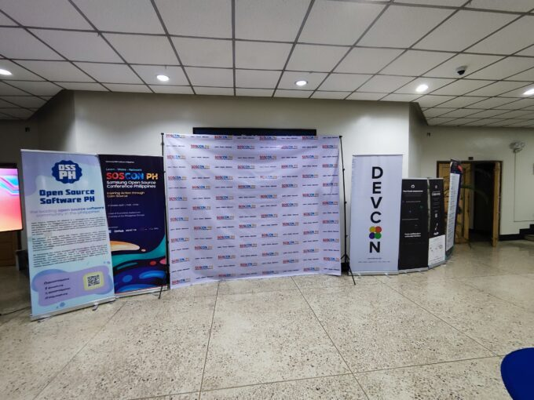
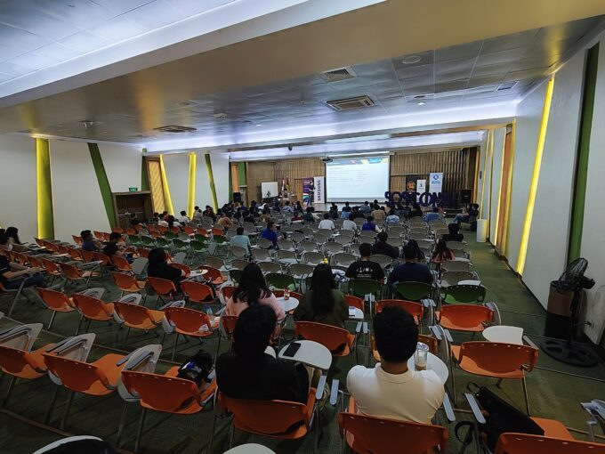
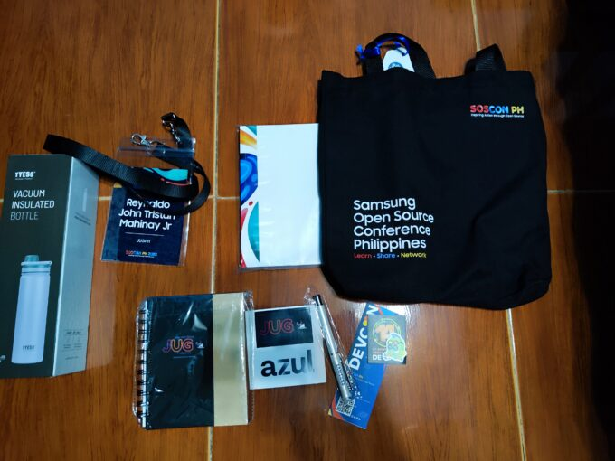

In the last months of 2023, technical conferences took place in the Philippines focusing on Artificial Intelligence (AI), Cloud Computing, Java, Open-source and Data related topics.

The Philippine Java Community were involved in two big conferences namely, Software Conference Philippines and Samsung Open Source Conference.

Members of the Foojay community were included as the speakers of the conferences, including me (Tristan Mahinay). This is the first time that the Friends of OpenJDK is involved in these big conferences. Thanks to [Azul](https://www.azul.com/ "Azul") for being a sponsor of both events.

Software Conference Philippines
-------------------------------

### What is SOFTCON PH?

SOFTCON PH is the biggest software conference in the Philippines. This conference started on 2011 and still continuing to attract speakers locally and internationally. The conference theme is Artificial Intelligence and a variety of other topics:

* Agile/DevOps
* AR/VR
* Architecture
* Cloud
* Front-end
* IT/Cybersecurity
* Java
* Mobile

### Venue

The conference was held on Oct 25-27, 2023 in hybrid format. [Airmeet](https://www.airmeet.com "Airmeet") was used for the online conference and the onsite venue was in SMX Aura, Taguig, Philippines. Below is the virtual lobby of SOFTCON PH in Airmeet and the onsite conference at SMX Aura.

#### Airmeet

#### Entrance View

#### Conference View

### Foojay Speakers

Most of the speakers were part of Friends of OpenJDK community and Java Champions. Check the link below for the full list of speakers.

[SOFTCON PH Speakers](https://softconph.com/speakers "SOFTCON")

Below are the list of invited speakers from our community and their respective talk.

* **Tristan Mahinay** - Modular Monolithic in Practice: Explore Implementations in Java
* **Frank Delporte** - Controlling Electronics With Java and Pi4J Through a Web Interface on the Raspberry Pi
* **Grace Jansen** - Through the Looking Glass: Effective Observability for Cloud Native Applications
* **YK Chang** - Thriving in the Cloud: Venturing Beyond the 12 Factors
* **Ron Veen** - Data-Oriented Programming in Java
* **Gerrit Grunwald** - What the CRaC - Superfast JVM Startup
* **Nicolas Fränkel** - Practical Introduction to Open Telemetry Tracing for Developers
* **Mary Grygleski** - Event Streaming in the Cloud Native World with Apache Puslsar
* **Ties van de Ven** - Empowering Your Development with FP: Understanding and Practice

In the expo hall, I met with the Azul folks and gave me some of their merchandises including the Duke brick!

The speakers in the event were given a hoodie merchandise from the organizers as a token of their appreciation.

Samsung Open Source Conference
------------------------------

### What is SOSCON PH?

SOSCON PH is a conference focusing on open source technologies backed by Samsung R\&D Philippines which was started last 2022. The conference this year will focus on the use of open-source tehnologies for Data Intelligence. In this event, the [Java User Group Philipines (JUG PH)](https://www.meetup.com/java-user-group-ph "Java User Group Philipines") were invited as an event partner.

### Venue

The conference is a one day event held in the University of the Philippines. Below are some images that was taken during the conference.

#### Entrance View

#### Conference View

#### Merchandise

The conference at the end will give their attendees a merchandise. The merchandise was sponsored by Samsung, Open-source Software Philippines, DevCon Philippines, Google Developers Group Philippines and Java User Group Philippines and Azul.

### Speakers

Below is the full list of speakers:

[SOSCON PH Speakers](https://sosconph.net/speakers "SOSCON PH Speakers")

Software Conferences are a great way to discuss different trending and relevant technologies.

It is an opportunity to meet people with common interests and get a different perspective in using a software in a specific domain.

During this year, the Java User Group Philippines was involved in two big conferences that have increased the network of the group, while contributing to the impact of the Java Community as a whole.

* <https://softconph.com>
* <https://sosconph.net>
