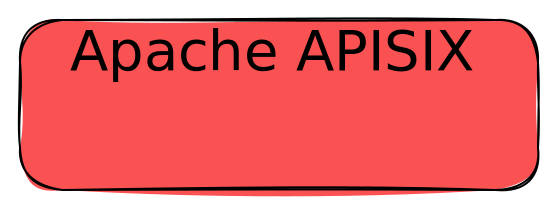

Last year, I started to use [Excalidraw](https://excalidraw.com/) as a diagram tool. However, the SVG images didn't display the font correctly. In this post, I'd like to explain the problem and offer a solution.

Let's create a [sample drawing](https://excalidraw.com/#json=Cyg2f6nY2FejMfAMWt4Xg,FM1MMSQIdjxgud6PUozJfw) with Excalidraw. If you open the link, it should look something like this:


However, in a browser, it looks like this:


*Note that the site doesn't allow uploading SVGs for security reasons. Hence, images in this post are only for illustration purposes. If you want to check the SVGs, please check the [original post](https://blog.frankel.ch/fonts-embedded-svg/)*

The code is straightforward:

```html

```

The font doesn't display correctly. The problem is that the SVG references fonts hosted on the Excalidraw site, but the browser blocks loading external resources within the `` tag.

```xml
<svg version="1.1" xmlns="http://www.w3.org/2000/svg" viewBox="0 0 279 105" width="558" height="210">
  <!-- svg-source:excalidraw -->
  <defs>
    <style class="style-fonts">
      @font-face {
        font-family: "Virgil";
        src: url("https://excalidraw.com/Virgil.woff2");                      <!--1-->
      }
      @font-face {
        font-family: "Cascadia";
        src: url("https://excalidraw.com/Cascadia.woff2");                    <!--1-->
      }
      @font-face {
        font-family: "Assistant";
        src: url("https://excalidraw.com/Assistant-Regular.woff2");           <!--1-->
      }
    </style>

  </defs>
  <g stroke-linecap="round" transform="translate(10 10) rotate(0 129.5 42.5)"><path d="M21.25 0 C81.62 3.8, 139.66 -1.42, 237.75 0 C250.59 -1.17, 259.93 9.64, 259 21.25 C258.51 31.54, 257.14 41.34, 259 63.75 C261.41 78.91, 249.29 82.5, 237.75 85 C158.28 90.09, 75.18 88.25, 21.25 85 C4.94 87.35, 1.58 79.2, 0 63.75 C3.4 45.44, -0.7 30.9, 0 21.25 C0.39 6.4, 9.44 -2.51, 21.25 0" stroke="none" stroke-width="0" fill="#fa5252"></path><path d="M21.25 0 C103.06 -0.09, 187.43 -1.79, 237.75 0 M21.25 0 C79.85 0.05, 137.09 0.77, 237.75 0 M237.75 0 C252.86 -0.57, 257.37 8.56, 259 21.25 M237.75 0 C250.13 -1.01, 259.88 6.36, 259 21.25 M259 21.25 C259.81 34.45, 259.12 44.63, 259 63.75 M259 21.25 C258.68 34.84, 260.14 47.7, 259 63.75 M259 63.75 C260.64 78.64, 250.34 84.63, 237.75 85 M259 63.75 C260.73 78.19, 253.07 86.41, 237.75 85 M237.75 85 C162.07 84.49, 87.43 84.8, 21.25 85 M237.75 85 C190.14 83.44, 142.52 82.96, 21.25 85 M21.25 85 C7.08 83.75, 0.72 78.07, 0 63.75 M21.25 85 C8.98 83.25, -1 77.26, 0 63.75 M0 63.75 C-1.39 49.95, 1.59 36.43, 0 21.25 M0 63.75 C-1.13 54.2, -0.31 42.9, 0 21.25 M0 21.25 C-0.79 8.01, 5.21 -0.77, 21.25 0 M0 21.25 C-0.01 8.56, 8.29 1.26, 21.25 0" stroke="#000000" stroke-width="1" fill="none"></path></g><g transform="translate(34.900001525878906 35) rotate(0 104.5999984741211 17.5)"><text x="0" y="0" font-family="Virgil, Segoe UI Emoji" font-size="28px" fill="#000000" text-anchor="start" style="white-space: pre;" direction="ltr" dominant-baseline="text-before-edge">Apache APISIX</text></g>
</svg>
```

1. Load a font

Here are a couple of possible solutions.

## Inline the SVG

An alternative is to copy-paste the content of the SVG file inside the HTML page.

```xml
<div>
    <svg>
        <!-- SVG content -->
    </svg> 
</div>
```

The result conforms to our expectations:


The downside is that you need to copy-paste the new code when changes happen.

## Embed the font as data

Another alternative is to transform the font to raw Base 64 data. I found [this online tool](https://hellogreg.github.io/woff2base/) very handy. We can update the SVG with the data:

```xml
<svg version="1.1" xmlns="http://www.w3.org/2000/svg" viewBox="0 0 279 105" width="558" height="210">
  <defs>
    <style class="style-fonts">
      @font-face {
        font-family: "Virgil";
        src: url(data:application/octet-stream;base64,d09GMk9UVE8AAO9AAAkAAAABO1AAAO73AAMAAAAAAAAAAAAAAAAAAAAAAAAAAAAA…[81,661 characters of base64 font data elided]…);
      }
    </style>
  </defs>
  <g stroke-linecap="round" transform="translate(10 10) rotate(0 129.5 42.5)"><path d="M21.25 0 C81.62 3.8, 139.66 -1.42, 237.75 0 C250.59 -1.17, 259.93 9.64, 259 21.25 C258.51 31.54, 257.14 41.34, 259 63.75 C261.41 78.91, 249.29 82.5, 237.75 85 C158.28 90.09, 75.18 88.25, 21.25 85 C4.94 87.35, 1.58 79.2, 0 63.75 C3.4 45.44, -0.7 30.9, 0 21.25 C0.39 6.4, 9.44 -2.51, 21.25 0" stroke="none" stroke-width="0" fill="#fa5252"></path><path d="M21.25 0 C103.06 -0.09, 187.43 -1.79, 237.75 0 M21.25 0 C79.85 0.05, 137.09 0.77, 237.75 0 M237.75 0 C252.86 -0.57, 257.37 8.56, 259 21.25 M237.75 0 C250.13 -1.01, 259.88 6.36, 259 21.25 M259 21.25 C259.81 34.45, 259.12 44.63, 259 63.75 M259 21.25 C258.68 34.84, 260.14 47.7, 259 63.75 M259 63.75 C260.64 78.64, 250.34 84.63, 237.75 85 M259 63.75 C260.73 78.19, 253.07 86.41, 237.75 85 M237.75 85 C162.07 84.49, 87.43 84.8, 21.25 85 M237.75 85 C190.14 83.44, 142.52 82.96, 21.25 85 M21.25 85 C7.08 83.75, 0.72 78.07, 0 63.75 M21.25 85 C8.98 83.25, -1 77.26, 0 63.75 M0 63.75 C-1.39 49.95, 1.59 36.43, 0 21.25 M0 63.75 C-1.13 54.2, -0.31 42.9, 0 21.25 M0 21.25 C-0.79 8.01, 5.21 -0.77, 21.25 0 M0 21.25 C-0.01 8.56, 8.29 1.26, 21.25 0" stroke="#000000" stroke-width="1" fill="none"></path></g><g transform="translate(34.900001525878906 35) rotate(0 104.5999984741211 17.5)"><text x="0" y="0" font-family="Virgil, Segoe UI Emoji" font-size="28px" fill="#000000" text-anchor="start" style="white-space: pre;" direction="ltr" dominant-baseline="text-before-edge">Apache APISIX</text></g>
</svg>
```

Because the SVG is self-contained, it now works:


The downside is that we cannot use the image directly; we need the additional transform processing step.

## Use the `<object>` tag

The last option is the most straightforward one and the one I chose: instead of the `` tag, use the `<object>` tag. For some reason, probably profoundly buried in a specification, the browser allows loading external resources from objects. This is the replacement code:

```html
<object type="image/svg+xml" data="sample.svg" width=800></object>
```

Note the same original SVG, without any changes. And here's the result:


The downside is that you don't get any features from the `` tag.

## Conclusion

In this post, I've explained one of the issues of using embedded SVGs in HTML and a couple of alternatives to work around it.

**To go further:**

* [Creating Embeddable Fonts as Data URIs](https://oreillymedia.github.io/Using_SVG/extras/ch07-dataURI-fonts.html)
* [SVG doesn't use font when inside HTML](https://stackoverflow.com/questions/30466610/svg-doesnt-use-font-when-inside-html)

*Originally published at [A Java Geek](https://blog.frankel.ch/fonts-embedded-svg/) on January 21^th^, 2024*
