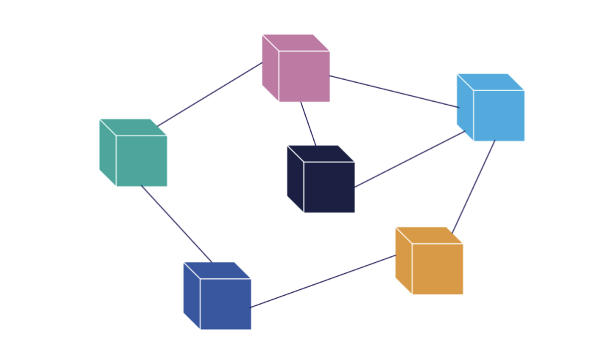
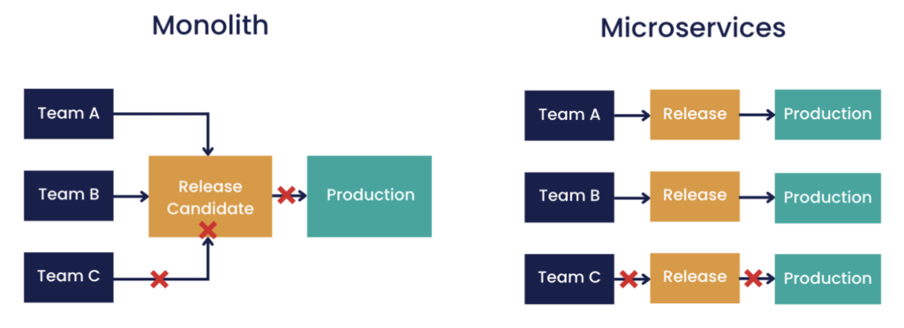

Lately I've been exploring what all the talk around '[microservices architecture](https://semaphoreci.com/blog/microservice-architecture "microservices architecture")' is really about. From it popping up in every other social media debate to it increasingly becoming a must-have skill on job listings, what is it that has caused this strong divide between the proponents of the traditional monolithic approach and those who have embraced the microservices paradigm.

In this article I'm here to break it down for you as I outline the benefits, some common challenges, and offer some insights from microservices experts for those considering this approach.

### Monolith vs Microservices in a Nutshell

If you are not already familiar with monolithic vs microservices architecture, you could imagine your software application as a structure made of lego bricks. With monolithic architecture you have one large lego brick encompassing your entire application and all of its functionality.

On the other hand, microservices architecture would be comparable to having a collection of smaller, specialised lego bricks, each serving as individual components with specific tasks.  

*Image 1. Monolith vs Microservices architecture*

More technically, microservices architecture is an approach to building software that involves breaking applications down into small, independent services.

Each service focuses on a specific and explicit task and interacts with other services through well-defined interfaces. In fact, many of the key concepts of microservices have a lot in common with the [Unix philosophy](https://chronicle.software/unix-philosophy-for-low-latency/ "Unix philosophy"), which [Mike Gancarz](https://en.wikipedia.org/wiki/Unix_philosophy#Mike_Gancarz:_The_UNIX_Philosophy "Mike Gancarz") sums up as:

* Small is beautiful
* Make each program do one thing well
* Build a prototype as soon as possible
* Share or communicate data easily
* Use software leverage to your advantage
* Make every program a filter\*

In a nutshell, [microservices architecture](https://en.wikipedia.org/wiki/Microservices "microservices architecture") encapsulates the Unix philosophy of "Do one thing and do it well", with some key characteristics being:

* Services are small, decentralised and independently deployable
* Services are independent of each other and interact through well defined interfaces, allowing them to be developed in different languages
* Services are organised around business capabilities

*Image 2. Visual representation of microservices*

### Benefits of Microservices Architecture

1. Scalability

As there are clear boundaries between microservices in terms of their code base and functionality, when it comes to adapting your system to meet evolving demands, scaling up or down can be done by adding or removing microservices (lego bricks) without affecting the rest of an application.

This contrasts with monolith applications where modifying or removing functionality can be cumbersome. Moreover, the scalability of microservices architecture lends itself to cloud deployment, for example as it allows for cloud resources to scale at the same rate as the application.

2. Maintainability and Resilience

When it comes to development and maintainability, new features, bug fixes and improvements, teams can focus on doing this for individual microservices without it affecting the rest of an application.

As microservices are independent of each other, there is also greater application resilience, as a failure with one microservice does not lead to a complete system shutdown.

3. Developer Scalability and Team Productivity

At an organisational level, it can often be difficult to scale the number of developers working on a project at the same rate that a project itself may be scaling; microservices structured by functionality can help to tackle this challenge.

For instance, even with just a single developer, having microservices that are separated by functionality is beneficial in terms of having each segment logically arranged from a technical point of view, for reasons we just explored.

With larger development teams, there is often a lack of awareness between different IT segments about each other's projects, which can lead to complexity and confusion, as well as overlap or tasks going unassigned.

Again, by having a microservices architecture that is segmented based on functionality, and which provides clearer boundaries, this allows the structure of your microservices to largely reflect your organisational chart. Teams can work on their tasks largely independently and at their own pace, and by reducing the need for extensive coordination, this translates to increased productivity and improved output quality.

### Challenges of Microservices Architecture

Despite the apparent advantages, there are various challenges that I think are important to highlight. Worth noting is that they are all avoidable when considered and planned around upfront.

A common reason why teams end up sticking with a traditional monolithic approach includes the fact that microservices bring increased complexity. This complexity comes in the form of teams needing to understand how to design, build and manage distributed systems.

More specifically, not knowing how to implement a reliable communication protocol for microservices to be able to communicate is a recurring pain point that leads to decreased system performance, and in turn, has teams switching back to their monolithic system. Another challenge that arises from having an increased number of interactions comes in the form of system testing and debugging.

Aside from these difficulties, another major concern when considering microservices includes that of security. Implementing robust authentication, authorisation and encryption across each and every service is crucial.

As much as these are valid concerns and are very real everyday challenges, working with microservices does not have to be so confusing, and these are all avoidable when considered upfront.

### Microservices Tips and Tricks

If you are considering making the monolithic to microservices switch, one top recommendation from microservices experts is to make sure that your microservices are independently deployable.

More specifically, it is key that a microservice remains simple in terms of its functionality, it should "Do one thing and do it well" and should not depend on other services for its task.

Below we can see how this approach affects the release process for example, whereby in the case of failure, with microservices, only one microservice needs to be retested and redeployed.

  
*Image 3. Comparing the release process for monolithic vs microservices architecture*

While there are a few design approaches to building microservices, one that is recommended is that of [Event-Driven Architecture](https://aws.amazon.com/event-driven-architecture/#:~:text=An%20event%2Ddriven%20architecture%20uses,on%20an%20e%2Dcommerce%20website. "Event-Driven Architecture") (EDA). This design pattern supports the loosely coupled, asynchronised communication and decentralised control that is necessary in microservices architecture.

Briefly, this is due to the fact that microservices can communicate indirectly through events rather than, for example, through direct API calls. For more details on developing with Event-Driven Architecture, see [here](https://chronicle.software/how-to-develop-event-driven-architectures/ "here").

Moreover, if your application has stringent latency requirements and you have performance concerns when it comes to having to communicate between microservices, [this article](https://chronicle.software/low-latency-microservices-for-performance/ "this article") delves into some things to consider when building low-latency systems with a microservices architecture.

For a microservices framework that specialises in low-latency software, Chronicle Services is one that is worth exploring.

### Conclusion

While microservices may be trendy, the benefits of scalability, resilience, and productiveness are anything but temporary.

Despite challenges, software frameworks and mindful architecture design can mitigate complexity.

Ultimately, the decision to switch to a microservices approach depends on specific business needs, but if flexibility and resilience are priorities, embracing the distributed future of software development is worth considering.

*\*A filter is a program that gets most of its data from its standard input (the main input stream) and writes its main results to its standard output (the main output stream).*
