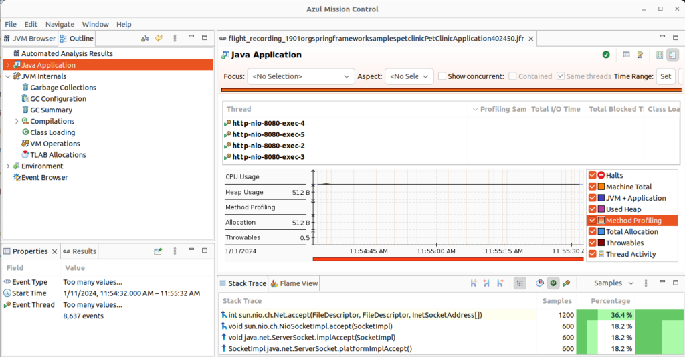
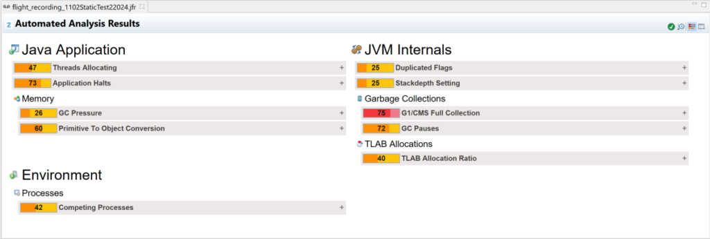

**Java Flight Recording (JFR) is a Java Virtual Machine (JVM) profiling and diagnostics tool. It enables you to collect and analyze data regarding the performance and behavior of a Java application. As JFR is included in the JVM, there is no need for additional tools or installations to make recordings of your applications.**

By utilizing JFR, you gain valuable insights into the runtime behavior of your Java applications. It helps you to optimize performance, identify and troubleshoot issues, and ensure better overall reliability. JFR is designed with very low overhead, allowing its use in production environments with minimal impact on the performance of your application.

You can use a JFR recording to examine your application with various tools, such as Azul Mission Control.

## Azul Mission Control

Based on the open-sourced "JDK Mission Control" tool, Azul Mission Control monitors, profiles, and troubleshoots Java applications running in a JVM.

Leveraging JFR, it provides a detailed and efficient analysis of a running Java application with minimal overhead on the JVM. It can also analyze an existing recording without a live connection with a running application.

As Azul Mission Control is Azul's preferred tool for analyzing events within Java applications, we expanded the [documentation in docs.azul.com](https://docs.azul.com/azul-mission-control) to provide more information about "all things JFR."

This article summarizes that information with direct links to learn more.

## Making a Recording

Azul Mission Control provides you insights into your Java application based on recordings. These can be made as files for later analysis or with live insights into a running application.

### Recording at the Start of the Application to a File

To recording at the start of the application, you can configure the startup of your application with an additional command:

`java -XX:StartFlightRecording=filename=/tmp/rec.jfr,duration=180s -jar my_app.jar`

More information: <https://docs.azul.com/azul-mission-control/recording/jfr-recording-at-startup>

### Recording a Running Application to a File

Use the jcmd tool to start the recording of a running application:

`jcmd JVMID JFR.start filename=rec.jfr`

More information: <https://docs.azul.com/azul-mission-control/recording/jfr-recording-during-run>

### Recording a Running Application with Azul Mission Control

When the JVM is configured to allow remote JMX connections, you can connect directly from Azul Mission Control to make a recording.

More information: <https://docs.azul.com/azul-mission-control/recording/jfr-recording-with-amc>

## Docker Specific Info

As Docker is a "closed environment," creating a JFR recording of an application running in a Docker or Kubernetes environment can be challenging. You can use different approaches, depending on your available connections and where you can store the recording:

* Configure the application to start a recording from startup to a local file or on a volume.
* Use `docker exec` or `kubectl exec` to start a recording in the container to a local file or on a volume.
* Connect directly with Azul Mission Control if the required ports of the container are accessible and JMX has been configured.

More information: <https://docs.azul.com/azul-mission-control/recording/jfr-recording-in-docker>

## Analyze a Recording with Azul Mission Control

When a recording is finished in Azul Mission Control, or a pre-recorded file is opened, an automated analysis result is shown:

The overview screen displays recorded data split into categories. Click a node to investigate the corresponding category details.

* **Java Application**: Includes data about the recorded Java program workflow: threads life cycle, I/O activity, Exceptions thrown, etc.
* **JVM Internals**: Holds JVM activity metrics: Class loading, Garbage collection indices, and other events.
* **Environment**: Holds data about the environment where the JVM runs.
* **Event Browser**: Displays all the JVM recorded events as a tree.

More information: <https://docs.azul.com/azul-mission-control/analyzing/introduction>

## Conclusion

Thanks to the possibilities of recording to a file with JFR or making a remote connection through JMX, you can tailor a solution that fits your use case and how your Java applications are deployed.

With Azul Mission Control, you can delve deep into the recordings to optimize your code and ensure it runs smoothly and error-free.
