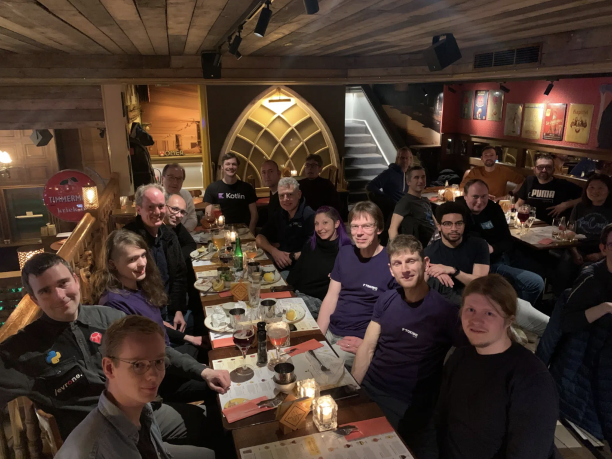

[FOSDEM is here again](https://fosdem.org/2024/), this coming weekend. Many will remember [the great hangout friends of OpenJDK had at Bier Centraal in Brussels](https://foojay.io/today/foojay-io-at-fosdem-2023-trip-report/) last year.

Well, that was a great experience and all those connected in any way to OpenJDK, whether speaking or not at FOSDEM, are extremely welcome to spend time with the friends of OpenJDK community on Saturday evening at the same location, [Bier Centraal](https://maps.app.goo.gl/7w4NY2QLCSVMdoDz5) (Anspachlaan 37).

<https://maps.app.goo.gl/7w4NY2QLCSVMdoDz5>

See you there at **18.30 on Saturday, 3 February**!
