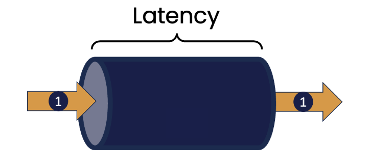
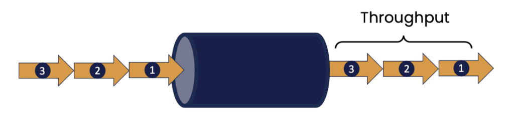
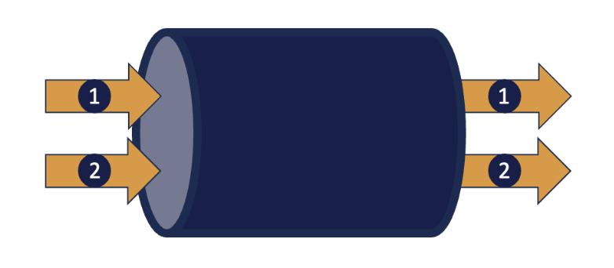
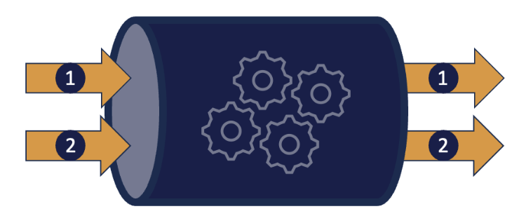
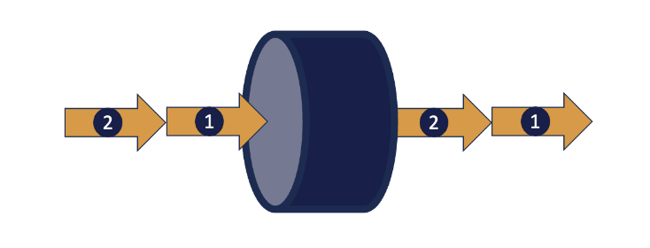
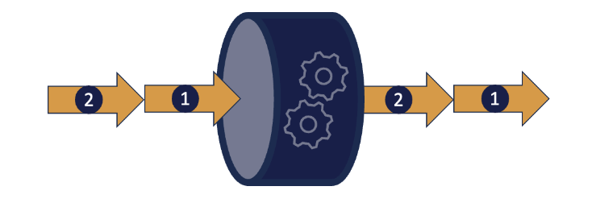

## Latency and Throughput

In discussions on performance, it is common to encounter the terms *Latency* and *Throughput* to describe the characteristics of a software component.

We can define these terms as follows:

**Latency** is a measure of the time taken for one thing to occur. For example, it could be the time taken to respond to a change in the price of a financial instrument that could influence the decision on whether to buy, or sell. It could be the time taken for a component monitoring some external device to respond to an indication of a change in the status of that device (like a change in temperature reported from a thermometer).

We relate the concept of latency to non-IT related areas too. Imagine you visit your favourite fast-food restaurant. Latency can be thought of as the time it takes for you to make your order, have it prepared, pay and then receive the order. Clearly lower values for latency are better.

**Throughput** is a measure of how much work can be done in a given time period, for example, the number of transactions that can be processed in a second. We've all seen examples of systems that struggle with handling high request loads, such as websites that become unresponsive at certain times when the number of requests increases suddenly, for example at the start or end of a business day, or the release of tickets for a highly popular concert.

In the context of the fast-food restaurant, throughput would measure how many customers are served within a given time period, and clearly higher values are better.

## Scaling Out to Improve Throughput

A commonly suggested solution to increase the throughput of a component is to introduce more concurrency into a system, the aim being to process more than one task at the same time. This could be done within a component instance by introducing multiple threads of execution, each of which can handle a single request.

The argument goes that during the processing of a single task, there are likely to be multiple "pauses" because the current task is waiting for something to happen (perhaps reading or writing data, or communicating with another component). When one thread is unable to proceed for some reason, another can continue.

We could also introduce multiple instances of a component across a cluster of different systems - indeed this is one of the factors that is often used to justify following a "cloud-native" architecture for applications.

Modern cloud infrastructure allows new instances of components to be dynamically created on distinct systems platforms when increases in load require this, and for these instances to be shut down when the peak load has passed, in order to minimize additional cost.

The general term for this type of approach is "Scaling Out", or "Horizontal Scaling".

## The Problems with Scaling Out

Scaling out seems to offer an attractive path to increasing the throughput of a system. However, the advantages it brings do not come without cost, and it is important to appreciate this. The basic approach is to make multiple independent instances of a component appear to the outside as if there were only one instance. This is sometimes referred to as the "single-system" approach. Though it may seem an attractive solution, building and managing such an abstraction introduces complexity, which can have a detrimental effect on the time taken to process individual tasks.

1. Some form of routing capability is required, to distribute tasks among available instances of the component. This could be implicit in the case of a single instance with multiple threads, or explicit if using a cluster-based approach. With the implicit approach, some form of shared work queue is used to capture incoming requests and as the instances running in threads become free, they take the first of these off the head of the queue.

With the cluster based approach an explicit router component decides to which instance the request should be sent. The decision is made according to some algorithm; the simplest of these simply cycles through the available instances (sometimes called "round-robin", but other possibilities include routing to the instance that is determined able to handle the request most quickly, or to always route requests from the same source to the same instance.

All of these options have complexities that need to be taken into account. Access to the shared work queue needs to be synchronised, introducing a potential increase in latency for a request. While a separate router component offers the capability of customising the decisions made on which instance is to receive the request, this in itself impacts latency, let alone the introduction of an additional network hop before the message is delivered.

2. It is likely that there will be a requirement to share state among instances. The result of processing a request may depend on data that is held in the component and whose value accumulates in some way over time. A shopping cart is an example of this, where requests include adding or removing items before "checking out".

With a single instance, this shared state would be held in memory that can be seen by all threads running separate component instances. However, access to this shared memory would require synchronization to ensure the consistency of the data.

In the cluster approach, there are different ways of dealing with this. The state related to a single client could be stored in a specific instance, but now all requests that require access to the shared information must be routed to that instance. This is the essence of HTTP's "Session" model, and requires processing at the router level to implement.

Alternatively, we could use a separate database component to store data that is required in multiple instances. This allows any instance to handle a request but at the cost of increased overhead in reading and writing this data from the database when processing a request. At the extreme, the database can become a point of contention between instances, further slowing request processing. If we use a modern distributed database, then we may encounter issues around data consistency (across database instances).

All of these things introduce further complexity into the request processing cycle.

## Increasing Throughput by Reducing Latency

In many cases, it is possible to improve throughput performance in a component without resorting to scaling out. This approach is based on a simple observation. If we can reduce the amount of time to process a single request, then the net result is that we can process more requests in a given timeframe.

Low latency Java software such as that developed by [Chronicle Software](https://chronicle.software/ "Chronicle Software") is built using guidelines that are non-idiomatic, in order to minimise, and ideally eliminate, the pauses that often affect more conventional Java execution.

Of these, the most obvious are pauses introduced by "stop-the-world" garbage collection. Over the years a significant amount of research has been undertaken to minimize pauses of this type, with considerable success. But they may still occur non-deterministically. Low-latency Java techniques aim to remove the pauses altogether by reducing the amount of Java heap-based objects to a level below the threshold for even minor garbage collections. See [this article](https://chronicle.software/how-object-reuse-can-reduce-latency-and-improve-performance/ "this article") for more information.

Perhaps the most significant downside of introducing multiple threads into a Java component is blocking synchronization of access to shared resources, in particular shared memory. Locks of various types allow us to protect mutable state from concurrent access that may introduce corruption, but most of these are based on the idea that if a lock cannot be acquired, then the requesting thread should block until such times as the resource is available.

Nowadays, the advent of multi-core processor architectures allows a thread to "spin", repeatedly attempting to acquire a lock, without being context-switched off a core as happens in blocking synchronization. Somewhat counterintuitively, synchronizing in such a non-blocking way is measurably faster than the traditional approach, since core-specific hardware caches are not required to be flushed and reloaded following a context switch.

The net effect of these approaches is, however, to remove much of the additional complexity introduced in horizontal scaling.

## Conclusion

Low latency coding techniques are designed to keep a processor core as busy as possible, executing at its full potential and so getting work done as quickly as possible. This feeds through to optimising for throughput in a component.

At [Chronicle](https://chronicle.software/ "Chronicle") we have built a suite of products and libraries that implement these ideas and that are deployed in financial institutions across the world. For example [Chronicle Queue](https://chronicle.software/queue/ "Chronicle Queue") is an open source Java library that supports very high speed interprocess communications based on shared memory. Chronicle Queue supports throughputs of millions of messages per second with sub microsecond latency.

An enterprise version adds additional features such as replication of messages across systems using high speed TCP, which offers cross system communication as well as High Availability capabilities, as well as implementations in languages such as C++, Rust and Python. Our [Chronicle Services](https://chronicle.software/services/ "Chronicle Services") framework supports the development of event-driven microservices layered on top of this functionality.

Our products have in many cases enabled solutions that remove the need to implement costly (in time, complexity and often price) scale-out strategies in the systems we have implemented using Chronicle Libraries, showing that the two measures of latency and throughput are more connected than many have at first thought.
