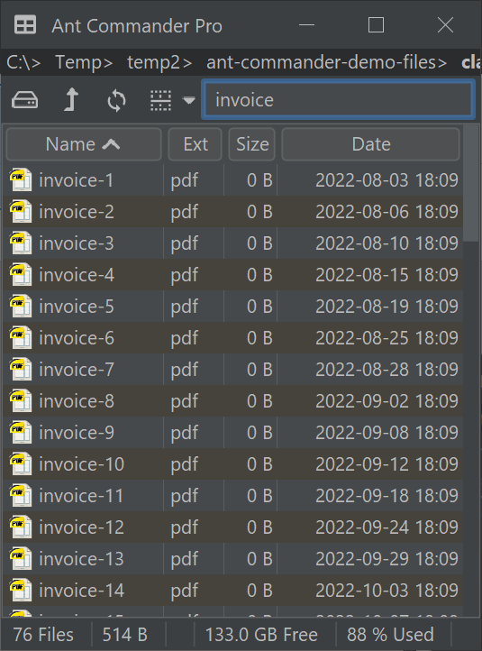
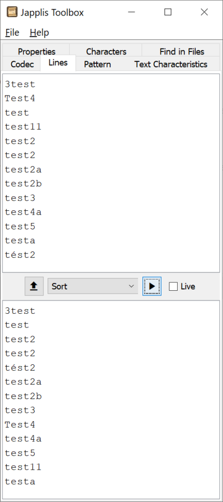

**Sorting text should be easy as String implements the *Comparable* interface. In this article, we'll see that it can be more complicated than that.**

Text is represented by the *String* class in Java. In this article we'll explore how to sort String, the advantages and drawbacks of each possibility.

## Level 1: Comparable

The class String implements *Comparable* so sorting a list of String is as simple as

```java
List<String> textList = new ArrayList<>(List.of("test","test11","test2","Test4","test3","test5","tést2","test2","3test","testa","test2a","test4a","test2b"));
Collections.sort(textList);
```

=\> **\[3test, Test4, test, test11, test2, test2, test2a, test2b, test3, test4a, test5, testa, tést2\]**

#### Advantages:

* Ease of use
* Fast

#### Drawbacks:

* Case sensitive: 'T' is lower than 'a'
* Doesn't sort accents and diacritics correctly: 'f' is lower than 'é'
* Doesn't sort numbers correctly: 'test11' is lower than 'test2'

Another variant of this is

```java
Collections.sort(textList, String.CASE_INSENSITIVE_ORDER);
```

which fixes the case sensitivity problem.  

=\> **\[3test, test, test11, test2, test2, test2a, test2b, test3, Test4, test4a, test5, testa, tést2\]**

## Level 2: Collator

To sort text in a more accurate way, Java includes the class *java.text.[Collator](https://docs.oracle.com/en/java/javase/21/docs/api/java.base/java/text/Collator.html)* (and its direct sub-class *java.text.[RuleBasedCollator](https://docs.oracle.com/en/java/javase/21/docs/api/java.base/java/text/RuleBasedCollator.html)*)

```java
Collator collator = Collator.getInstance();
Collections.sort(textList, collator);
```

Beware that sorting could be locale sensitive so if you want a consistent result you may prefer using `Collator.getInstance(Locale);`.

#### Advantages:

* Ease of use
* Sort lowercase and uppercase correctly
* Sort accents and diacritics correctly

#### Drawbacks:

* Slower
* Doesn't sort numbers correctly: 'test11' is lower than 'test2'

It's possible with Collator to specify the strength of the comparison. Let's show you with examples:

```java
Collator collator = Collator.getInstance(Locale.US);
collator.setStrength(Collator.TERTIARY);
Collections.sort(textList, collator);
```

=\> **\[3test, test, test11, test2, test2, tést2, test2a, test2b, test3, Test4, test4a, test5, testa\]**

Here is some code to better understand the different collator strengths:

```java
collator.setStrength(Collator.PRIMARY);
collator.compare("test", "tést"); => 0
collator.compare("test", "tEst"); => 0
collator.setStrength(Collator.SECONDARY);
collator.compare("test", "tést"); => -1
collator.compare("test", "tEst"); => 0
collator.setStrength(Collator.TERTIARY);
collator.compare("test", "tést"); => -1
collator.compare("test", "tEst"); => -1
```

## Level 3: External library

A good resource for different sorting text algorithms with numbers is the [natural order benchmark](https://github.com/ChristianLutz/natural-order-benchmark/) GitHub project from Christian Lutz.

If it's already in your classpath, the best choice from what I've evaluated is IBM ICU4J Collactor which has a [setNumericCollation](https://unicode-org.github.io/icu-docs/apidoc/released/icu4j/com/ibm/icu/text/RuleBasedCollator.html#setNumericCollation-boolean-) method. It's fast and correct. I didn't use it as the library was too big (\> 10MB) for my purpose.

I noted that a few algorithms were using `Character.isDigit()` which was a big performance bottleneck.

#### Advantages:

* Sort numbers
* No code required

#### Drawbacks:

* May require new external library
* Sorting accents and diacritics unknown
* Performance varies based on library used
* Can be quite complex to read how they work

## Level 4: Custom algorithm

For my file manager [Ant Commander Pro](https://www.antcommander.com) and for my text utilities software [Japplis Toolbox](https://www.japplis.com/toolbox/), I wanted a fast and accurate sorting algorithm.

So here is my algorithm:

What you'll need:

* A method that returns a `Comparator<String>`
* A method that given 2 String objects returns an integer
* A method that given 2 characters objects returns an integer
* A way to remember numbers when comparing 2 digits. As 987 \< 1234.

Let's start with the comparator, that is the easiest part:

```java
public static Comparator<String> stringComparator() {
    return (s1, s2) -> compareStrings(s1, s2);
}
```

For the compare, I like to be on the safe side and if you use a list of String or a String\[\] it may have many values that could be empty or null. So adding a method to take care of empty and null values first.

```java
public static int compareStrings(String s1, String s2) {
    if (s1 == null && s2 == null) return 0;
    if (s1 == null) return 1;
    if (s2 == null) return -1;
    if (s1.isEmpty() && s2.isEmpty()) return 0;
    if (s1.isEmpty()) return 1;
    if (s2.isEmpty()) return -1;
    int compare = compareWithNumbers(s1, s2);
    return compare;
}
```

Now, we need a method to compare characters.

```
private static int compareCharacters(char car1, char car2) {
    // For performance reason
    if (car1 == car2) return 0;
    if (car1 == '.') return -1; // file.txt < file 2.txt
    if (car2 == '.') return 1;
    if (car1 < 128 && car2 < 128) {
        if (car1 >= 65 && car1 <=90) car1 += 32; // uppercase to lowercase
        if (car2 >= 65 && car2 <=90) car2 += 32;
        if (car1 == car2) return 0;
        if ((car1 >= 'a' && car1 <= 'z' && car2 >= 'a' && car2 <= 'z') ||
                (car1 >= '0' && car1 <= '9' && car2 >= '0' && car2 <= '9') ||
                (car1 >= '0' && car1 <= '9' && car2 >= 'a' && car2 <= 'z') ||
                (car1 >= 'a' && car1 <= 'z' && car2 >= '0' && car2 <= '9')) {
            return car1 - car2;
        }
    }
    return getCollactor(1).compare(String.valueOf(car1), String.valueOf(car2));
}

private static Collator PRIMARY_COLLATOR;
private static Collator TERTIARY_COLLATOR;

private static Collator getCollactor(int strenght) {
    if (strenght == 1) {
        if (PRIMARY_COLLATOR == null) {
            PRIMARY_COLLATOR = Collator.getInstance();
            PRIMARY_COLLATOR.setStrength(Collator.PRIMARY);
        }
        return PRIMARY_COLLATOR;
    }
    if (strenght == 3) {
        if (TERTIARY_COLLATOR == null) {
            TERTIARY_COLLATOR = Collator.getInstance();
            TERTIARY_COLLATOR.setStrength(Collator.TERTIARY);
        }
        return TERTIARY_COLLATOR;
    }
    return Collator.getInstance();
}
```

And now, the main compare method that will handle numbers:

```
private static final long MAX_COMPARE = 100_000_000_000_000_000L;

public static int compareWithNumbers(String s1, String s2) {
    int length = Math.min(s1.length(), s2.length());
    int i = 0;
    long number1 = 0;
    long number2 = 0;
    for (; i < length; i++) {
        char car1 = s1.charAt(i);
        char car2 = s2.charAt(i);
        boolean isDigit1 = (number1 > 0 && car1 == '0') || (car1 >= '1' && car1 <= '9');
        boolean isDigit2 = (number2 > 0 && car2 == '0') || (car2 >= '1' && car2 <= '9');
        int compare = compareCharacters(car1, car2);
        // Compute on going numbers
        if (isDigit1) number1 = number1 * 10 + car1 - '0';
        if (isDigit2) number2 = number2 * 10 + car2 - '0';
        if (number1 >= MAX_COMPARE || number2 >= MAX_COMPARE) {
            if (isDigit1) number1 = car1 - '0';
            if (isDigit2) number2 = car2 - '0';
        }
        if (!isDigit1 || !isDigit2) {
            if (number1 != number2) {
                if (number1 == 0 || number2 == 0) return compareCharacters(car1, car2); // compare number to letter
                return number1 < number2 ? -1 : 1; // compare numbers
            }
            if (compare != 0) return compare; // compare letters
            number1 = 0;
            number2 = 0;
        }
    }
    int lengthDiff = s1.length() - s2.length();
    if (lengthDiff == 0 && number1 == number2) return getCollactor(3).compare(s1, s2); // same primary text
    if (number1 > 0 || number2 > 0) {
        if (lengthDiff == 0) return (int) (number1 - number2);
        char nextCar = lengthDiff > 0 ? s1.charAt(i) : s2.charAt(i);
        boolean isDigit = nextCar >= '0' && nextCar <= '9';
        if (isDigit || number1 == number2) return lengthDiff > 0 ? 1 : -1; // the longest number or text loses
        else return (int) (number1 - number2);
    }
    return lengthDiff; // the longest text loses
}
```

```java
Collections.sort(textList, stringComparator());
```

=\> **\[3test, test, test2, test2, tést2, test2a, test2b, test3, Test4, test4a, test5, test11, testa\]**

#### Advantages:

* Fast
* Sort lowercase, uppercase, accents, diacritics and numbers correctly
* No external library

#### Drawbacks:

* More code
* Works with ASCII digits only for numbers.
* Doesn't support fraction numbers
* Not tested with numbers larger than Long.MAX_COMPARE

 File Manager Ant Commander Pro using the sorting algorithm with files with numbers  
[](https://www.japplis.com/toolbox/) Text Utility Japplis Toolbox applying the sort algorithm on text with numbers
