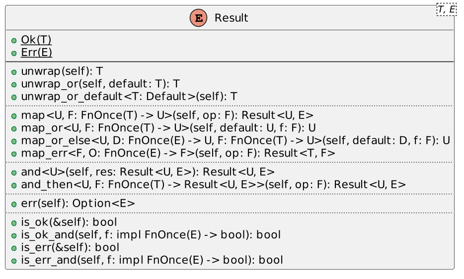
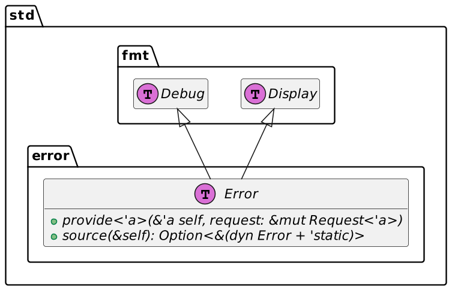
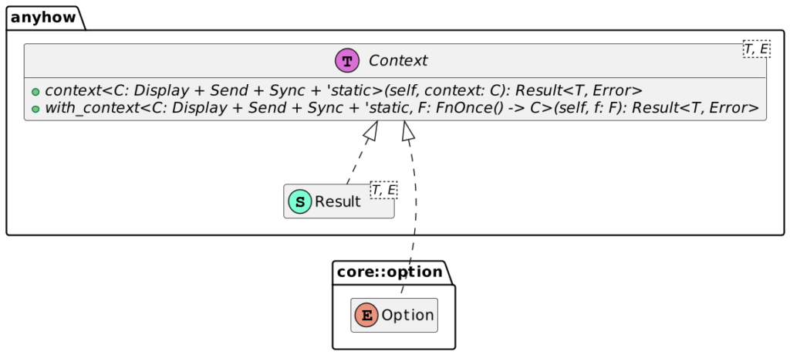

As part of learning the Rust ecosystem, I dedicated the last few days to error management. Here are my findings.

## Error management 101

The [Rust book](https://doc.rust-lang.org/book/ch09-00-error-handling.html) describes the basics of error management. The language separates between recoverable errors and unrecoverable ones.

Unrecoverable errors benefit from the `panic!()` macro. When Rust panics, it stops the program. Recoverable errors are much more enjoyable.

Rust uses the `Either` monad, which stems from Functional Programming. Opposite to exceptions in other languages, FP mandates to return a structure that may contain *either* the requested value *or* the error. The language models it as an `enum` with generics on each value:

```rust
#[derive(Copy, PartialEq, PartialOrd, Eq, Ord, Debug, Hash)]
pub enum Result<T, E> {
    Ok(T),
    Err(E),
}
```

Because Rust manages completeness of matches, matching on `Result` enforces that you handle both branches:

```rust
match fn_that_returns_a_result() {
    Ok(value) => do_something_with_value(value)
    Err(error) => handle_error(error)
}
```

If you omit one of the two branches, compilation fails.

The above code is safe if unwieldy.

But Rust offers a full-fledged API around the `Result` struct. The API implements the monad paradigm.



## Propagating results

Propagating results and errors is one of the main micro-tasks in programming. Here's a naive way to approach it:

```rust
#[derive(Debug)]
struct Foo {}
#[derive(Debug)]
struct Bar { foo: Foo }
#[derive(Debug)]
struct MyErr {}

fn main() {
    print!("{:?}", a(false));
}

fn a(error: bool) -> Result<Bar, MyErr> {
    match b(error) {                                   //1
        Ok(foo) => Ok(Bar{ foo }),                     //2
        Err(my_err) => Err(my_err)                     //3
    }
}

fn b(error: bool) -> Result<Foo, MyErr> {
    if error {
        Err(MyErr {})
    } else {
        Ok(Foo {})
    }
}
```

1. Return a `Result` which contains a `Bar` or a `MyErr`
2. If the call is successful, unwrap the `Foo` value, wrap it again, and return it
3. If it isn't, unwrap the error, wrap it again, and return it

The above code is a bit verbose, and because this construct is quite widespread, Rust offers the `?` operator:
> When applied to values of the `Result` type, it propagates errors. If the value is `Err(e)`, then it will return `Err(From::from(e))` from the enclosing function or closure. If applied to `Ok(x)`, then it will unwrap the value to evaluate to `x`.
>
> --[The question mark operator](https://doc.rust-lang.org/reference/expressions/operator-expr.html)

We can apply it to the above `a` function:

```rust
fn a(error: bool) -> Result<Bar, MyErr> {
    let foo = b(error)?;
    Ok(Bar{ foo })
}
```

## The `Error` trait

Note that `Result` enforces no bound on the right type, the "error" type. However, Rust provides an `Error` trait.



Two widespread libraries help us manage our errors more easily. Let's detail them in turn.

## Implement Error trait with thiserror

In the above section, I described how a `struct` could implement the `Error` trait. However, doing so requires quite a load of boilerplate code. The `thiserror` crate provides macros to write the code for us. Here's the documentation sample:

```rust
#[derive(Error, Debug)]                                                   //1
pub enum DataStoreError {
    #[error("data store disconnected")]                                   //2
    Disconnect(#[from] io::Error),
    #[error("the data for key `{0}` is not available")]                   //3
    Redaction(String),
    #[error("invalid header (expected {expected:?}, found {found:?})")]   //4
    InvalidHeader {
        expected: String,
        found: String,
    }
}
```

1. Base `Error` macro
2. Static error message
3. Dynamic error message, using field index
4. Dynamic error message, using field name

`thiserror` helps you generate your errors.

## Propagate Result with anyhow

The `anyhow` crate offers several features:

* A custom `anyhow::Result` struct. I will focus on this one
* A way to attach context to a function returning an `anyhow::Result`
* Additional backtrace environment variables
* Compatibility with `thiserror`
* A macro to create errors on the fly

Result propagation has one major issue: functions signature across unrelated error types. The above snippet used a single enum, but in real-world projects, errors may come from different crates.

Here's an illustration:

```rust
#[derive(thiserror::Error, Debug)]
pub struct ErrorX {}                                                      //1
#[derive(thiserror::Error, Debug)]
pub struct ErrorY {}                                                      //1

fn a(flag: i8) -> Result<Foo, Box<dyn std::error::Error>> {               //2
    match flag {
        1 => Err(ErrorX{}.into()),                                        //3
        2 => Err(ErrorY{}.into()),                                        //3
        _ => Ok(Foo{})
    }
}
```

1. Two error types, each implemented with a different `struct` with `thiserror`
2. Rust needs to know the size of the return type at compile time. Because the function can return either one or the other type, we must return a fixed-sized pointer; that's the point of the `Box` construct. For a discussion on when to use `Box` compared to other constructs, please read this [StackOverflow question](https://stackoverflow.com/questions/49377231/when-to-use-rc-vs-box).
3. To wrap the struct into a `Box`, we rely on the `into()` method

With `anyhow`, we can simplify the above code:

```rust
fn a(flag: i8) -> anyhow::Result<Foo> {
    match flag {
        1 => Err(ErrorX{}.into()),
        2 => Err(ErrorY{}.into()),
        _ => Ok(Foo{})
}
```

With the `Context` trait, we can improve the user experience with additional details.



The `with_context()` method is evaluated lazily, while the `context()` is evaluated eagerly.

Here's how you can use the latter:

```rust
fn a(flag: i8) -> anyhow::Result<Bar> {
    let foo = b(flag).context(format!("Oopsie! {}", flag))?;              //1
    Ok(Bar{ foo })
}

fn b(flag: i8) -> anyhow::Result<Foo> {
    match flag {
        1 => Err(ErrorX{}.into()),
        2 => Err(ErrorY{}.into()),
        _ => Ok(Foo{})
    }
}
```

1. If the function fails, print the additional `Oopsie!` error message with the `flag` value

## Conclusion

Rust implements error handling via the Either monad of FP and the `Result` enum. Managing such code in bare Rust requires boilerplate code. The `thiserror` crate can easily implement the `Error` trait for your structs, while `anyhow` simplifies function and method signatures.

**To go further:**

* [Rust error handling](https://doc.rust-lang.org/book/ch09-00-error-handling.html)
* [The Error trait](https://doc.rust-lang.org/std/error/trait.Error.html)
* [anyhow crate](https://docs.rs/anyhow/latest/anyhow/)
* [thiserror crate](https://docs.rs/thiserror/latest/thiserror/)
* [What is the difference between context and with_context in anyhow?](https://stackoverflow.com/questions/65459952/what-is-the-difference-between-context-and-with-context-in-anyhow)
* [Error handling across different languages](https://blog.frankel.ch/error-handling/)
* [A retrospective on Errors Management: where do we go from here?](retrospective-error-management)

*Originally published at [A Java Geek](https://blog.frankel.ch/error-management-rust-libs/) on February 11^th^, 2024*
