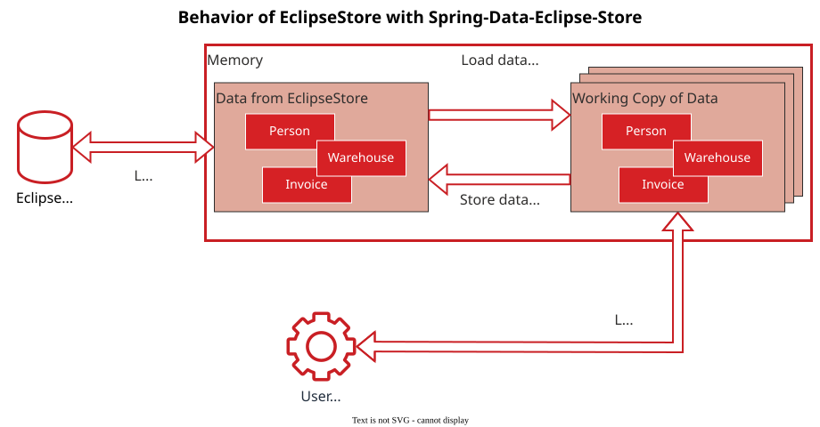

Sooner or later any Spring application needs to store data. And of course, the first and easiest move is to utilize [Spring Data JPA](https://spring.io/projects/spring-data-jpa). You can set up your data storage without knowing which relational database you will use in production and simply start coding without worrying about that.

It is the easiest and most convenient way to store data (in a relational database like PostgreSQL), yet in the cloud environment it is also an expensive way. Pricing at AWS RDS starts at 30$/month with tiny-Instances and always have **fixed monthly costs regardless of its usage**.

## Enter EclipseStore

Relational Databases are optimized for long runtimes. They take quite some time to startup and then should run for days at a time. Then every request is computed within milliseconds.

The folks of [EclipseStore](https://eclipsestore.io/ "EclipseStore") (formerly known as [MicroStream](https://foojay.io/today/microstream-part-1-what-is-it/)) wanted to use a different approach: Starting and managing the database through your native Java application.

This is perfectly in line with the cloud philosophy: **Everything on demand and depending on your workloads.**

An approach like this means that no computing is done if it is not needed. **No costs if there is no demand.**

Even though it is not necessary to have servers with EclipseStore, it still needs storage to place and read the persisted data. Usually this is done on the hard drive, but with a little configuration, EclipseStore can store to a **variety of cloud storage providers** , including AWS S3, Azure Storage, Oracle Cloud Object Storage and [IBM COS](https://github.com/xdev-software/eclipse-store-afs-ibm-cos "IBM COS"). ([see all providers](https://docs.eclipsestore.io/manual/storage/storage-targets/index.html "see all providers"))

### Rethink storage - Good Times Bad Times

EclipseStore stores Java objects as binary data. So instead of mapping Java POJOs to a structure of tables like JPA, it simply serializes the data in a fast and efficient way. This poses a big, initial problem for developers: **They must rethink how the storage is working** . Rethink what they have been taught about databases all their lives. [Rethink when and what to store](https://docs.eclipsestore.io/manual/storage/storing-data/index.html#_storing_modified_objects "Rethink when and what to store").

Not only is this very uncomfortable, but also takes a lot of time to get used to.

Another characteristic of EclipseStore is that all changes are on the live data. That means all your changes are always propagated throughout the whole system. You can't (easily) reload the data from before the change.

In other words: **There are no working copies for your objects.** This enhances performance by taking only the minimal required steps to save data, but might be a concern especially in multi-threaded applications.  



## Spring Integration with Spring-Data-Eclipse-Store

But what if you could have the best of both worlds: The **abstract storing/reading-Repositories of Spring Data JPA** and the **fast serialization** with cloud storages of your choosing?

That's where I'd like to recommend [XDEVs Open-Source Spring-Data-Eclipse-Store library](https://github.com/xdev-software/spring-data-eclipse-store "XDEVs Open-Source Spring-Data-Eclipse-Store library"). With the library you can use the Spring Data pattern of repositories and use EclipseStore as a persistence provider.

This solves two issues that developers have with EclipseStore:

1. **There is no rethinking about storage necessary.** Just like in Spring Data JPA you have your repositories for your different Java classes and you application only queries / saves data through these entry points.
2. **Every time data is queried, a working copy of that data is created.** Meaning that different threads can use different working copies of the same object, make the desired changes and only by storing the working copy back, the data is merged again.

 With Spring-Data-Eclipse-Store the application works with the working copies of the java objects

## Usage

Using Spring-Data-Eclipse-Store is as easy as adding three code snippets:

1. Add the dependency with the latest version in your pom.xml:  
   <https://github.com/xdev-software/spring-data-eclipse-store/releases/latest#Installation>
2. Add the `@EnableEclipseStoreRepositories` annotation to your `@SpringBootApplication` annotation.
3. EclipseStore uses reflection to handle serializing. That's why we need to add the following JVM-Arguments: 

```
--add-opens=java.base/java.lang=ALL-UNNAMED --add-opens=java.base/java.lang.reflect=ALL-UNNAMED --add-opens=java.base/java.util=ALL-UNNAMED --add-opens=java.base/java.time=ALL-UNNAMED
```

If you already have created your repositories, you can start your application right away. Creating a repository only requires you to create an interface that extends a Repository-Interface:

```java
import org.springframework.data.repository.CrudRepository;

public interface CustomerRepository extends CrudRepository<Customer, String>
{...
```

~(from [CustomerRepository.java](https://github.com/xdev-software/spring-data-eclipse-store/blob/develop/spring-data-eclipse-store-demo/src/main/java/software/xdev/spring/data/eclipse/store/demo/simple/CustomerRepository.java))~

This minimal effort makes the Spring-Data-Eclipse-Store library **compatible as drop in replacement**.

## Conclusion

The Spring-Data-Eclipse-Store library helps to set up a **fast and versatile storage system** with **accustomed Spring Data JPA behavior**.

This can speed up development and potentially **save a lot of money in the cloud**.

Check out the GitHub-Repository at <https://github.com/xdev-software/spring-data-eclipse-store>.
