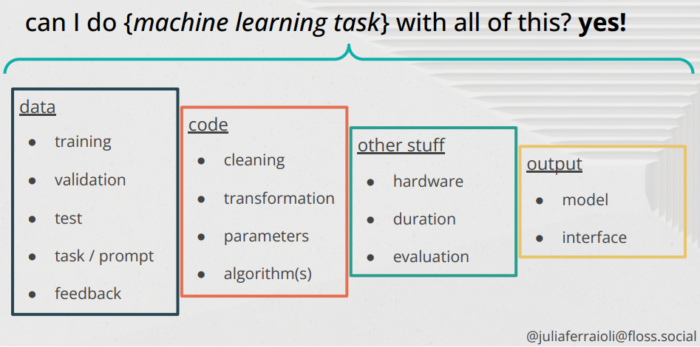
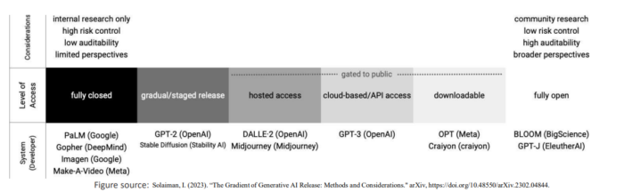
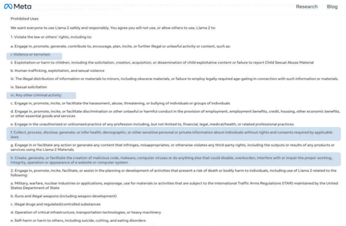
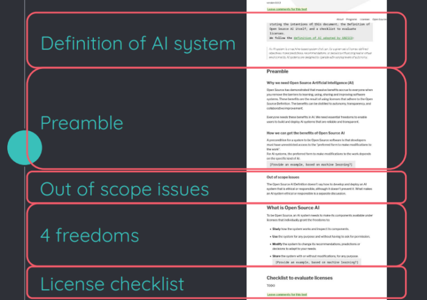
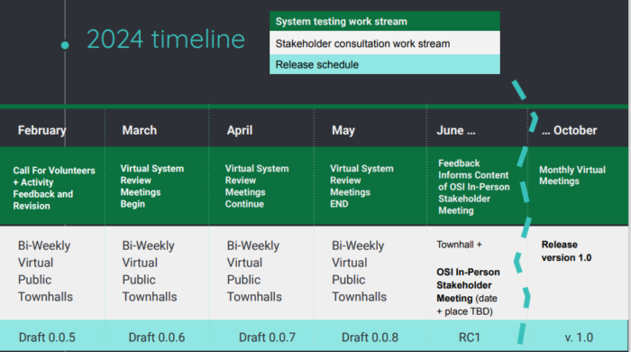
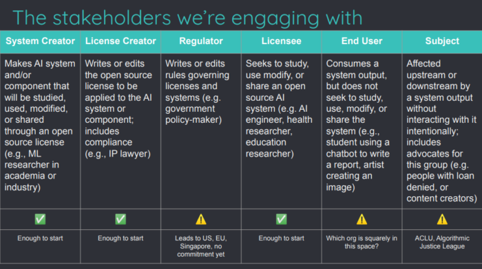

*Disclaimer: This article is on the things I learned/observed spending the day in AI and Machine Learning Developer Room at FOSDEM 24. Opinions and statements are mine and have nothing to do with my employer. This article might raise more questions than answers, but in my opinion, we all need more awareness on this topic and get familiar with the (right) questions that are to be answered.*

### FOSDEM {#h3-0-fosdem}

[FOSDEM](https://fosdem.org/2024/ "FOSDEM") (Free Open-Source Developers'European Meeting) is a community-organised event that is free and non-commercial. The aim is to provide a venue for free and open-source software developers and communities to:

* connect with other developers and projects.
* learn about the newest trends in the free software world.
* learn about the newest trends in the open-source world.
* listen to interesting talks and presentations on diverse topics by project leaders and committers.
* to encourage the development and benefits of free software and open-source solutions.

There were 35 devrooms, ranging from Java, Containers, Go, Rust, Network, Community, and other various topics. Although I am a huge fan of Java and OSS eco-system around it, but I went to FOSDEM this year specifically to understand and discuss about the state and direction of AI in Free and/or Open-Source world. And this article is about that.
> "An AI system is a machine-based system that can, for a given set of human-defined objectives, make predictions, recommendations, or decisions influencing real or virtual environments. AI systems are designed to operate with varying levels of autonomy." -- [Open-Source Initiative, AI definition](https://opensource.org/deepdive/drafts/the-open-source-ai-definition-draft-v-0-0-3/ "Open-Source Initiative, AI definition")

### What is Open (Source) AI? {#h3-1-what-is-open-source-ai}

To be Open Source, an AI system needs to make its components available under licenses that individually grant the freedoms to:

* **Study** how the system works and inspect its components.
* **Use** the system for any purpose and without having to ask for permission.
* **Modify** the system to change its recommendations, predictions, or decisions to adapt to your needs.
* **Share** the system with or without modifications, for any purpose.

The Golden Rule applies "also" to AI \> *If I like an AI system, I must be free to share it with other people.* (Reference #4)

### Why Free and Open? {#h3-2-why-free-and-open}

The term 'open source' means software that is available on an open-source licence that lets anyone see the source code or the code that humans can read and allows anyone using the code on that licence to keep and change the code. They can do this by themselves, or with a skilled third party they choose. The Open-Source Initiative must approve open-source licenses.(Reference #1, #2)

"Free software" is a different term though and it means any piece of software that doesn't cost anything, but there is a difference between free and open-source software. Because open-source software is not only free in terms of money---"free" also means the freedom open-source software gives its users by being easy to modify and more transparent. (Reference #2, #3)

There is a general emphasis on ethics and morals in the open-source community with how developers treat their users. While it's not a sure thing, this can help to make sure you're getting the best experience possible without being exploited for private data. And because the source code is public, it is easy for knowledgeable users to find out if the developers are doing something untrustworthy. (Reference #2, #3)

The supply-side value of widely used Open-Source Software (OSS) is $4.15 billion, but that the demand-side value is much larger at $8.8 trillion.(Reference #5) To put some perspective, this amount is 30% more than the total federal budget of USA in 2023.(Reference #6)

### What are the components of an AI system? {#h3-3-what-are-the-components-of-an-ai-system}

It was easy to categorize a software or the code behind and although it had its complications but the definition of components in a traditional software is straightforward. But it becomes very complicated when we try to define the same for an AI system.

A (current possible) identified components of an AI system:(Reference #7)

1. Data  
   a. The data on which it is trained.  
   b. Description of it.  
   c. Collection methodologies.  
   d. Hosting options and costs.  
   e. Transparency of data quality.  
   f. Ability of opting out.
2. Code  
   a. Data cleaning/processing related.  
   b. Actual training code.  
   c. Assumptions/pre-reqs related to the implementation.
3. External  
   a. Specification of hardware on which it is trained.  
   b. Time spent on training.  
   c. Configurations.  
   d. Definition of correctness.
4. Output  
   a. Model it produces.  
   b. Binary data it comprises of.  
   c. Tasks or results it generates.

This also implies, that the definition of FREE and OPEN might be different for each component or a sub-set of a component. For example, a model which identifies early-stage cancer based on X-Ray or MRI images might want to shield the data it is trained on due to privacy regulations, but at the same time can have the rest of the components FREE and/or OPEN. Modification to this model by the community would be defined differently.

### State of "Open"-ness in AI systems {#h3-4-state-of-open-ness-in-ai-systems}

Currently there is no proper definition of open-ness for AI systems, and they fall under a big spectrum.(Reference #8)  

And for reasons mainly of ethical consideration and on how to engage with whole or parts of AI system, a definitive guide is needed.

Mostly now, the access and usage of an AI systems is managed by individual or additional license restriction.

But this imposes barriers against use, difficulties to adopt and improve, problem in control over the technology and weak oversight and transparency.

What we need is:

1. Open-ness in AI.
2. Interoperable licenses with possibilities of making it free.
3. Accessibility, Reusability and Sustainability of AI systems.
4. Ethical compliance to fall under purview of regulations and not software licenses.

### What is AI system Specification? {#h3-5-what-is-ai-system-specification}

Open-Source shows that when you eliminate the obstacles to learning, using, sharing and enhancing software systems, everyone benefits. These benefits come from using licenses that follow the Open-Source Definition. The benefits can be expressed as autonomy, transparency, and cooperative improvement. They are necessary for everyone in AI. We need basic freedoms to help users create and use AI systems that are trustworthy and clear.(Reference #4)

The current draft version is here \> [The Open Source AI Definition -- draft v. 0.0.5 -- Open Source Initiative](https://opensource.org/deepdive/drafts/the-open-source-ai-definition-draft-v-0-0-5/ "The Open Source AI Definition – draft v. 0.0.5 – Open Source Initiative") and it follows the definition of AI system adopted by the Organization for Economic and Co-operation Development (OECD).  

For each AI systems (such as Pythia, Llama, BLOOM, Mistral, Phi2, Olmo etc.) the Specification target to define:

1. What do you need to give an input and get an output?
2. What do you need to give an input and get a different output?
3. What do you need to understand why given an input, you get that output?
4. What do you need to let others give an input and get an output?
5. What's the preferred form to make modifications to an AI system?

The plan and schedule of Open Initiative about this spec is to have a release candidate (RC) at the end of October'24.

Stakeholders engaged in this varies from system and license creators, regulators, end users and the subject.

Ongoing and following tasks of this spec for Open-Source Initiative are:

1. more publicity to the process
   * public discussion forum <https://discuss.opensource.org>
   * bi-weekly townhalls
   * more opportunities to volunteer.
2. reach out to more stakeholders.
3. raise funds for 2024 meetings.
4. setup the board for review and approval of v. 1.0.

The drafts can be found at \> [Drafts of the Open Source AI Definition -- Open Source Initiative](https://opensource.org/deepdive/drafts/ "Drafts of the Open Source AI Definition – Open Source Initiative")

### TLDR; {#h3-6-tldr}

**What is Open-Source AI and why it matters**: Open-Source AI is an AI system that allows anyone to study, use, modify, and share its components under licenses that follow the Open-Source Definition. Open-Source AI matters because it offers benefits such as autonomy, transparency, and cooperative improvement, and it helps to create and use AI systems that are trustworthy and clear.

**What are the components of an AI system and how to define their openness**: An AI system is composed of data, code, external factors, and output, which can have different levels of openness depending on the licenses and specifications that apply to them. The openness of an AI system can be defined by the freedoms that it grants to its users and the transparency that it provides about its functioning and outcomes.

**What are the challenges and barriers for Open-Source AI**: Open-Source AI faces challenges and barriers such as privacy, quality, interoperability, and ethical compliance of its components, especially data and output. Moreover, Open-Source AI may face difficulties to adopt and improve due to individual or additional license restrictions, lack of control over the technology, and weak oversight and transparency.

**What is the Open-Source AI Definition and its goals**: The Open-Source AI Definition is a draft specification by the Open-Source Initiative that aims to provide a clear and consistent way to assess the openness of an AI system and its components. The goals of the specification are to encourage the development and benefits of Open-Source AI, and to ensure that AI systems respect the basic freedoms of their users.

**What is the Open-Source AI Specification and how to use it**: The Open-Source AI Specification is a set of questions that help to evaluate the openness of an AI system and its components, based on the freedoms to study, use, modify, and share them. The specification can be used by system and license creators, regulators, end users, and subjects to understand and engage with different aspects of an AI system.

### References {#h3-8-references}

1. [About -- Open Source Initiative](https://opensource.org/about/ "About – Open Source Initiative")
2. [Why Should You Use Open-Source Software?](https://www.howtogeek.com/94114/why-should-you-use-open-source-software/ "Why Should You Use Open-Source Software?")
3. [What is open source, and why does it matter today?](https://www.openaccessgovernment.org/open-source-technology/129261/ "What is open source, and why does it matter today?")
4. [FOSDEM 2024 - Open Source AI](https://fosdem.org/2024/events/attachments/fosdem-2024-2805-moving-a-step-closer-to-defining-open-source-ai/slides/22023/FOSDEM_2024_-_Open_Source_AI_SCXe000.pdf "FOSDEM 2024 - Open Source AI")
5. [The Value of Open Source Software by Manuel Hoffmann, Frank Nagle, Yanuo Zhou :: SSRN](https://papers.ssrn.com/sol3/papers.cfm?abstract_id=4693148#:~:text=We%20estimate%20the%20supply-side%20value%20of%20widely-used%20OSS,demand-side%20value%20is%20much%20larger%20at%20%248.8%20trillion. "The Value of Open Source Software by Manuel Hoffmann, Frank Nagle, Yanuo Zhou :: SSRN")
6. [2023 United States federal budget - Wikipedia](https://en.wikipedia.org/wiki/2023_United_States_federal_budget "2023 United States federal budget - Wikipedia")
7. [FOSDEM 2024: A Principled Component Analysis of open source AI](https://fosdem.org/2024/events/attachments/fosdem-2024-2909-a-principled-component-analysis-of-open-source-artificial-intelligence/slides/21982/FOSDEM_2024_A_Principled_Component_Analysis_of_MQHipTT.pdf "FOSDEM 2024: A Principled Component Analysis of open source AI")
8. [Niharika_FOSDEM_2024_419EXpt.pdf](https://fosdem.org/2024/events/attachments/fosdem-2024-2750-codes-bound-by-ethics-the-rising-tide-of-non-free-software-licenses-in-ai-ecosystems/slides/22009/Niharika_FOSDEM_2024_419EXpt.pdf "Niharika_FOSDEM_2024_419EXpt.pdf")
