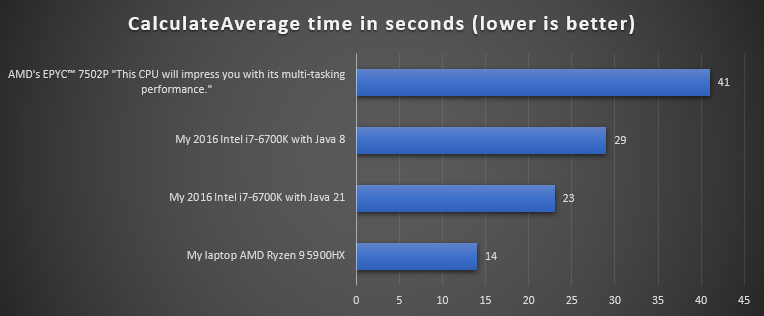
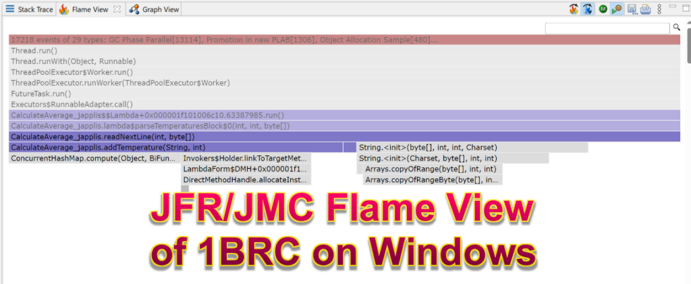
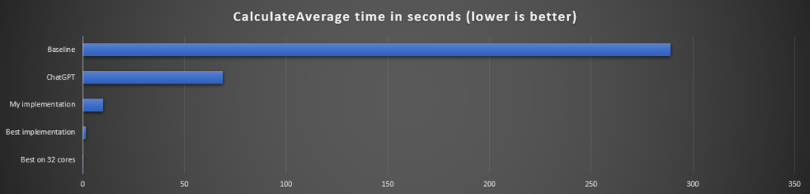

The One Billion Row Challenge or 1BRC or 1️⃣🐝🏎 was a challenge to read a CSV file of one billion rows with "station name;temperature" data and compute the min/average/max temperature per weather station as fast as possible.

If you want to know what is the fastest algorithm, you can go the the [1BRC page](https://github.com/gunnarmorling/1brc). But the real answer is "**it depends**".

It depends:

* The machine you're running it on
* How far are you ready to use hacks in your code
* The JVM
* The data in the file

## It works on my machine

or to be more precise, it's faster on my machine.

### CPU

My first submission was 23 seconds on my 2016 desktop (Intel) so I was quite surprised to hear it was 41 seconds on the "super fast" CPU of the 1BRC server.
 Lesson 1️⃣: Measure performance on production (like) hardware.

To be fair, only 8 cores were used on the 1BRC server instead of the 32 available.  

I then decided to use one `HashMap` per thread and combine them instead of one global `ConcurrentHashMap`. This was 5 seconds faster on my desktop and 29 seconds faster on the 1BRC server.

It also happened during the challenge that changes showing performance improvements on Apple ARM CPU were not resulting in better performance on the 1BRC (AMD) CPU.
> Lesson 2️⃣: Optimizations will produce different results depending on the hardware.

### Hard disk

In the case of the 1BRC server the file was in the disk cache as it's read many times. In a similar production situation, it's quite likely that the big file won't be in the disk cache and that disk I/O will be more time consuming.

I had this problem locally with my CPU at 50% while the hard disk was at 100%.

This was confirmed with my test of reading and parsing the file -\> 18 seconds, reading the file (to `byte[]`) and do nothing with the data -\> 14 seconds.

On my laptop, it was even less significant, reading and parsing the file -\> 5.6 seconds, reading the file and do nothing with the data -\> 5.1 seconds.
> Lesson 3️⃣: The published results are not including file I/O which may be the most time consuming on your machine.

## Hack coding

The goal of the challenge is to get the result as fast as possible with most of the hacks allowed.

### Unsafe

At one point someone decided to use Unsafe to avoid the range checks when reading an array. Unsafe allows also to get more than 1 byte per call. As this is faster, this went quickly viral in the different solutions.

### Long

You could work with bytes but you can also work with longs that contains 8 bytes per value.

You can then use bit operations to find a specific byte inside the long. This could be quite efficient on a 64 bits (= 8 bytes) CPU.

### Hash collisions

Since the default testing file has less than 500 station names, a few thought it would be better to use the hash code as key to a custom hash map instead of the station name.

Even though Gunnar was generous in term of hacks allowed (like starting a new process), this one was not allowed. But if you have a similar problem with a fixed set of keys, you could find a hash that won't conflict between the keys and use it.
> Lesson 4️⃣: Accessing the data or copying the data could be quite CPU intensive.

### Preview API's

Preview API's such as Foreign Function Memory (FFM) and incubator API such as the new Vector API were used quite often.

I joined the challenge to see how fast I could get the job done without any hacks. The answer is 10 seconds.

## The JVM

### The JVM parameters

The challenge allowed you to pass parameters when starting Java to fine tune how the JVM should behave when running your program.

In the case of 1BRC, many decided to go with the **Epsilon garbage collector**, a garbage collector that doesn't do anything. As the program finishes in a few seconds, you need less to worry about the accumulation of unused objects in memory.

Here is a list of some of the JVM parameters used by the participants.

    -XX:+UnlockExperimentalVMOptions -XX:-EnableJVMCI -XX:+UseEpsilonGC -Xmx2G -Xms2G -XX:+AlwaysPreTouch
    -XX:-TieredCompilation -XX:InlineSmallCode=10000 -XX:FreqInlineSize=10000
    -XX:+UseTransparentHugePages
    -XX:+UseShenandoahGC -XX:+UseStringDeduplication -XX:+UseTransparentHugePages -da
    -XX:+TrustFinalNonStaticFields -XX:CICompilerCount=2 -XX:CompileThreshold=1000
    -dsa -XX:+UseNUMA

> Lesson 5️⃣: You have many options to get better performance without the need to change any line of code.

### The JVM Used

The top 3 results are using GraalVM native binary which is known to have a very fast start up time. It also has the advantage to optimize the code at compile time, instead of using a JIT (Just In Time) compiler.

It's then a mix between 21.0.1-graal and 21.0.1-open.

In general GraalVM JIT gave a bit better results. In my case, GraalVM (JIT) gave mixed results, sometimes similar times, sometimes a few seconds (\~10) slower. This was observed on my computer and the 1BRC server.

The fastest "no hacks" implementation from Sam Pullara is faster with GraalVM CE.

Specifying the JVM was quite easy as [SDKMAN](https://sdkman.io/) was used.
> Lesson 6️⃣: You have many JVM distributions at your disposal, maybe one will better suit your needs.

## The Data

Some of the very fast implementations are a few times slower when using the 10K station names, instead of the default 500. Some of the submissions even failed.
> Lesson 7️⃣: Different input data will result in different performances.

The 1BRC project includes a [weather_stations.csv](https://github.com/gunnarmorling/1brc/blob/main/data/weather_stations.csv) as example, I guess that most of the implementations would fail with this file as it starts with comment lines and has 4 digits after the comma for temperatures.
> Lesson 8️⃣: Be aware that optimization could come to the prize of flexibility.

## My implementation

My strategy here was to start with the K.I.S.S. (Keep It Simple Stupid) optimization first and profile for bottlenecks. Using JFR to profile gave me some ideas on where to profile but it didn't result in the expected win quite often.  
 *-XX:StartFlightRecording=duration=15s,settings=profile,name=CalculateAverage_japplis,filename=flight-recorder.jfr,dumponexit=true*   
And *-Dorg.eclipse.swt.browser.DefaultType=edge* in jmc.ini on Windows

What you don't see in the proposed solutions are also the many attempts and code that were producing less performance.

So here are the lessons learned on my implementation:
> * 9️⃣ Using `FileInputStream` and use `new String(byte[], StandardCharset.UTF_8)` for text is faster than using `FileReader`
> * 1️⃣0️⃣ Using a `HashMap` and then sort keys when showing the result is faster than using a `TreeMap`
> * 1️⃣1️⃣ Using one `HashMap` per thread and then combine the result is faster (especially on some machines) than one global `ConcurrentHashMap`
> * 1️⃣2️⃣ Put a `try {} catch {}` outside a loop is way faster than having it in the loop

## Conclusion

* Performance depends on a lot of factors
* Collaboration of ideas between participants gave the best results
* With a bit of effort, you can find a lot of performance improvements, as many of the no hacks implementations were under 20" compared to the baseline implementation of 4'49".

#### Other interesting facts:

* Adding '`.parallel()`' to the baseline implementation stream makes it 73% faster (2'15" -\> 1'18" on my laptop)
* ChatGPT (Antonio Goncalves entry) implementation was slower than most of the results
* Running on the available 32 cores made the fastest implementation to run in 0.3" instead of 1.5"
* All the results are incorrect. The station names should be sorted alphabetically but the last station showing is İzmir and it should be Zürich.

And of course a big thanks to [Gunnar Morling](https://twitter.com/gunnarmorling) for organizing and spending of lot of time running the different proposed solutions.

The community was also great to either help Gunnar in organizing it or each other to get the best performance during the challenge.

#### 1BRC Links:

* [1BRC](https://github.com/gunnarmorling/1brc) Project
* 1BRC---[The Results Are In](https://www.morling.dev/blog/1brc-results-are-in/)!
* [InfoQ interview](https://www.infoq.com/news/2024/01/1brc-fast-java-processing/)
* [Gunnar Morling on the 1BRC](https://www.youtube.com/watch?v=m0dZ_f48fzA) (live from Voxxed Days CERN) - YouTube
* [1 Billion Row Challenge Top Contenders](https://www.twitch.tv/videos/2050175537) - Twitch
