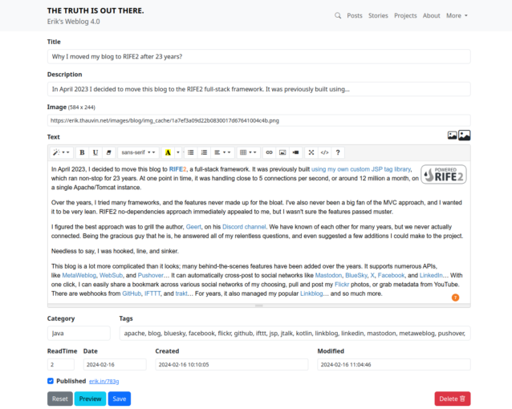
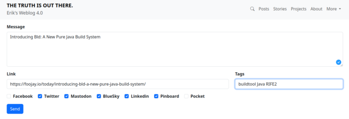
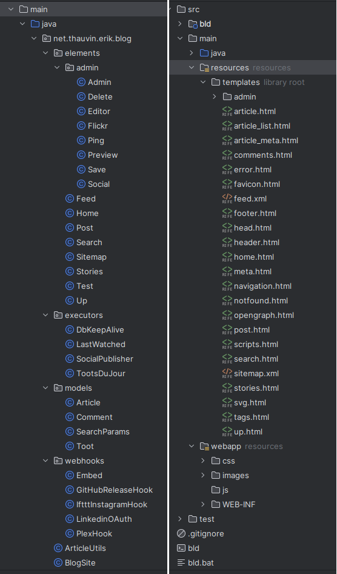

In April 2023, I decided to move [my blog](https://erik.thauvin.net/blog/ "my blog") to [RIFE2](https://rife2.com/), a full-stack framework. It was previously built [using my own custom JSP tag library](https://erik.thauvin.net/blog/stories//15/behind-this-blog), which ran non-stop for 23 years. At one point in time, it was handling close to 5 connections per second, or around 12 million a month, on a single Apache/Tomcat instance.

Over the years, I tried many frameworks, and the features never made up for the bloat. I've also never been a big fan of the MVC approach, and I wanted it to be very lean. RIFE2 no-dependencies approach immediately appealed to me, but I wasn't sure the features passed muster.

I figured the best approach was to grill the author, [Geert](https://foojay.io/today/author/geert-bevin/), on his [Discord channel](https://discord.gg/DZRYPtkb6J). We have known of each other for many years, but we never actually connected. Being the gracious guy that he is, he answered all of my relentless questions, and even suggested a few additions I could make to the project.

Needless to say, I was hooked, line, and sinker.

The blog is more complicated than it looks; many behind-the-scenes features have been added over the years.

It supports numerous APIs, like [MetaWeblog](https://en.wikipedia.org/wiki/MetaWeblog), [WebSub](https://en.wikipedia.org/wiki/WebSub), and [Pushover](https://pushover.net/)... It can automatically cross-post to social networks like [Mastodon](https://mastodon.social/@ethauvin), [BlueSky](https://bsky.app/profile/erik.thauvin.net), [X](https://twitter.com/ethauvin), [Facebook](https://www.facebook.com/ethauvin), and [LinkedIn](https://www.linkedin.com/in/ethauvin/)...

With one click, I can easily share a bookmark across various social networks of my choosing, pull and post my [Flickr](https://www.flickr.com/photos/kire/) photos, or grab metadata from YouTube.

There are webhooks from [GitHub](https://github.com/ethauvin), [IFTTT](https://ifttt.com/), and [trakt](https://trakt.tv/users/ethauvin/)... For years, it also managed my popular [Linkblog](https://erik.thauvin.net/blog/posts/1267/rip-linkblog)... and so much more.

This was the first time in over 20 years I had the opportunity to remove deprecated APIs and seriously clean everything up. My OCD kicked in, and I really went to town. Suddenly, this mammoth of a codebase started to become lean and mean, as I had envisioned. In the process, as Geert had recommended, I created the [RIFE2 Template Renderers](https://github.com/rife2/rife2-template-renderers) library to meet some of my more generic needs.

Now, I'm not going to lie, I had to battle RIFE2 more than a few times. Geert was invaluable at helping with my very specific issues. And within a short amount of time, things just started to just flow, almost zen-like. In retrospect, most of my issues had more to do with my resistance and hardheadedness. I wanted to do things the way I was used to. But once the pieces fell into place, it moved very quickly.

It didn't take long to go live, and I was off to the races.

There are a few things I learned along the way...

* I had been using a lot of Kotlin for years and very little Java, yet I decided to rework the blog entirely in Java as it was originally written. I enjoyed it a lot, just like reconnecting with a friend I hadn't talked to in years. So familiar. I have a whole new appreciation for Java.
* I didn't know as much as I thought about full-stack frameworks. In my long career, I've mostly been the guy who came in to fix things up, at least on the Java side.
* Some RIFE2 concepts, like templates, continuation, etc., are hard to fully grasp by reading the documentation; you have to get your hands dirty to really appreciate them. We're still working on improving the documentation, but in some cases, you just have to try it to really get it.

It's been almost a year, and I couldn't be any happier. Everything works very smoothly, and is low-maintenance. I've even added quite a few new backend features.

If you're going to start a new project, I would highly recommend giving [RIFE2](https://rife2.com/) a try. You won't regret it. I sure haven't.
