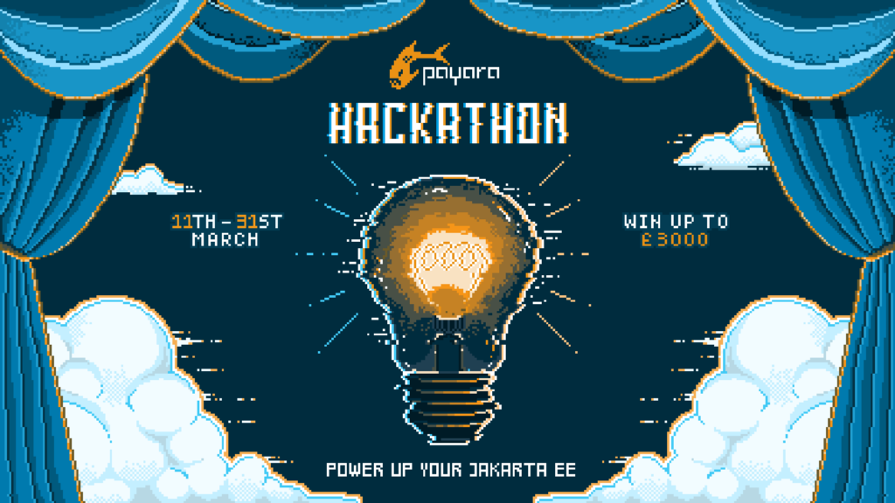

We're excited to announce that the 2nd edition of Payara Hackathon is now open for sign ups! [Find out more and sign up here!](https://www.payara.fish/page/payara-hackathon-2024/)

The Payara Cloud Hackathon will be running from the 11th until the 31st of March and this time, we are looking for applications that tackle environmental, social, and economic sustainability challenges. With a focus on deploying to our Payara as a Service platform Payara Cloud, this is your chance to showcase the power and versatility of Jakarta EE technologies.

Winners will be spotlighted across our platforms, earn money prizes, and present their solutions to a worldwide audience.

## Power up Your Jakarta EE!

### **Your Mission:**

* **Champion Sustainability:** Develop applications that tackle key sustainability issues, from energy conservation and waste reduction to sustainable agriculture and eco-friendly transport.
* **Maximize Jakarta EE:** Display the strength of Jakarta EE and related technologies in creating scalable and impactful solutions.
* **Excel with Payara Cloud:** Highlight the simplicity of deploying Jakarta EE applications on Payara Cloud, showcasing its scalability and reliability.

### **Why Participate?**

* Work solo or team up for a multidisciplinary approach, welcoming participants globally.
* A chance to contribute to sustainability, push the limits of Jakarta EE and Payara Cloud, and gain recognition for your innovative solutions.
* Winners will be spotlighted across our platforms, earn money prizes, and present their solutions to a worldwide audience.

## Awards

* First Place – £3,000
* Second Place – £2,000
* Third Place – £1,000
* Payara \& Eclipse Foundation Swag Bag for the **Top 10** contestants

## How to Enter?

1. Fill in[the signup form on this page.](https://www.payara.fish/page/payara-hackathon-2024/) Make sure you enter all the data!
2. You may want to join our informative webinar on the 8th of March – [register here](https://us02web.zoom.us/webinar/register/WN_EWfDdM0jQeOIcqYOuXNbRA#/registration).
3. Make sure you familiarise yourself with Payara Cloud and Jakarta EE using some useful resources linked on this page.
4. Create your free Payara Cloud account – you will receive an email with the access link on Day 1 of the Hackathon, so look out for it on the 11th of March!
5. You have up to 31 March midnight GMT to deploy your app to Payara Cloud and submit your entry details – all final submission info will be emailed to you on Day 1 of the Hackathon.
6. Winners will be notified via email and publically announced by the end of April 2024.

