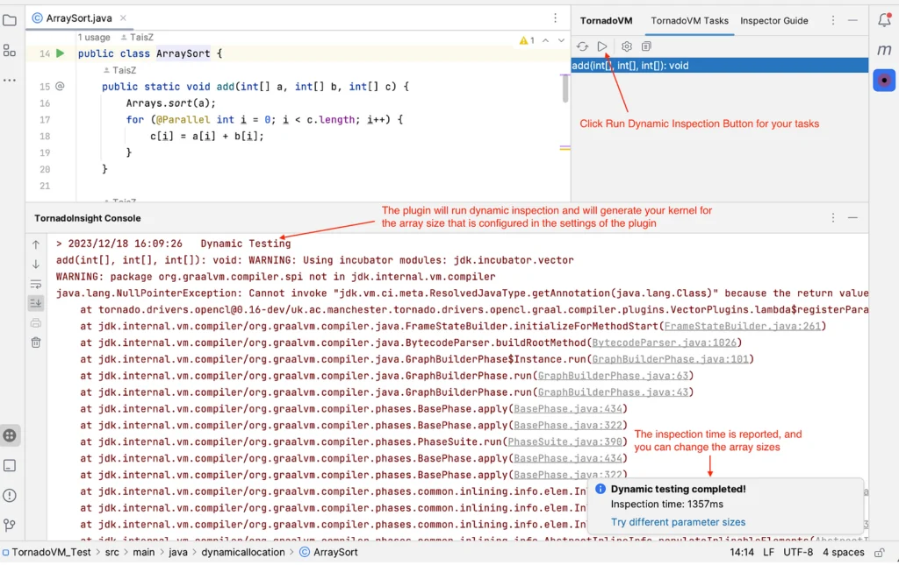

  

**TornadoInsight is an open-source IntelliJ IDEA plugin for enhancing the developer experience when working with TornadoVM.**

It provides a built-in on-the-fly static checker, empowering developers to identify unsupported Java features in TornadoVM and understand the reasons behind these limitations.

Additionally, TornadoInsight introduces a dynamic testing framework that enables developers to easily test individual TornadoVM tasks. It automatically wraps TornadoVM tasks, invoking the native TornadoVM runtime on the developer's machine for seamless debugging and testing. In this blog, we expand on TornadoInsight by:

* Introducing TornadoInsight, and explaining its key features.
* Describing how to use TornadoInsight in IntelliJ.

TornadoInsight has been implemented by Tianyu Zuo for his master thesis at the University of Manchester and is available in the [JetBrains Marketplace](https://plugins.jetbrains.com/plugin/23309-tornadoinsight/) by the University of Manchester. The source code is available in [GitHub](https://github.com/beehive-lab/tornado-insight).

## Key Features:

## 1. On-the-Fly Static Checker

TornadoInsight is equipped with an on-the-fly static checker. This tool scans TornadoVM code in real-time, pinpointing any Java features that are not supported by TornadoVM. Through instant notifications, developers gain immediate insights into potential compatibility issues.

**This plugin enables programmers to perform proactive adjustments in accordance with the TornadoVM guidelines.** Currently, the static checker applies checks for data types, Traps/Exceptions, recursion, native method calls, and assert statements.  



TornadoInsight provides a tool window to view the built-in static inspector for detailed information.  



## 2. Dynamic Testing Framework

TornadoInsight simplifies the testing process for individual TornadoVM tasks. After creating a TornadoVM Task, there is no need to write the main method or initialize the method parameters. You only need to select the method to test from the tool window of TornadoInsight, as shown in the following image.  



**With its dynamic testing framework, developers can seamlessly conduct tests on specific tasks within their codebase.** TornadoInsight dynamically generates a test file, guides the automatic generation of the Main method and TaskGraph objects needed by TornadoVM, and automatically creates and initializes variables based on parameter types.

Then, it invokes the TornadoVM runtime on the developer's machine to run the generated code. This functionality streamlines the debugging process, making it convenient for developers to identify and resolve issues in their TornadoVM applications.

**If a TornadoVM task is compatible with TornadoVM, the test outputs the generated OpenCL kernel code for it.**



If it is not compatible, it will output an exception stack trace. In addition, the elapsed time for running the checks is displayed in the bottom right corner.


## How to use TornadoInsight?

## 1. Installation

Getting started with TornadoInsight is a straightforward process:

* Open IntelliJ IDEA.
* Navigate to "Preferences" or "Settings" depending on your operating system.
* Select "Plugins" from the menu.
* Search for "TornadoInsight" and click "Install."

### 2. Pre-requisites

TornadoInsight invokes Java and TornadoVM on the developers' local machine. Hence, developers must ensure that the following are already installed:

* TornadoVM \>= 1.0
* JDK \>= 21

### 3. Configuration of TornadoInsight

In order to enable the dynamic inspection feature of TornadoInsight, developers need to configure the feature after installation, by performing the following steps:

* Navigate to "Preferences" or "Settings" depending on your operating system.
* Select "TornadoInsight" from the menu.

Developers should configure the TornadoVM root directory (i.e. the path to the TornadoVM cloned repository) and select a JDK which should be \>= JDK 21.

Additionally, developers should indicate a tentative "Max array size" that can be used by TornadoInsight to set the size of the input and output arrays of a TornadoVM task.



In **macOS Catalina** and **later,** there may be the need to remove the quarantine attribute before selecting the JDK. To do this, run the following:

```
$ sudo xattr -r -d com.apple.quarantine path/to/jdk
```

### 4. Utilization of the TornadoInsight On-the-Fly Static Checker

During development, TornadoInsight will actively scan "on-the-fly" for unsupported Java features of TornadoVM in the project. The static checker will pop notifications and detailed explanations that can help developers to address compatibility issues promptly.

### 5. Dynamic Testing Framework for TornadoVM Tasks

TornadoInsight provides a tool window to display TornadoVM tasks in the current editor at real time.

The tool window can be found in the sidebar on the right-hand side of IDEA.

Then developers can select one or more tasks, click the Run button in the Toolbar to run the test, and TornadoInsight will show a console to print the test results.

The plugin is available in the JetBrains [++Marketplace++](https://plugins.jetbrains.com/plugin/23309-tornadoinsight)!

Blog reposted from [tornadovm.org](https://www.tornadovm.org/post/introducing-tornadoinsight-unleashing-the-power-of-tornadovm-in-intellij-idea)
