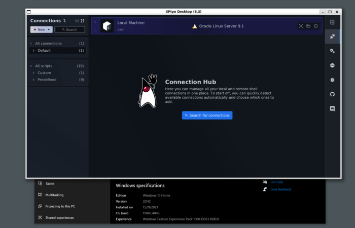

**What does it take to run standalone JavaFX applications on exotic Linux systems like the Windows Subsystem for Linux or some embedded systems? As you will see, not a lot! Familiarizing yourself with the native libraries required by JavaFX and the font loading process is all that is needed. Then, JavaFX applications can run on them out of the box if you set everything up correctly.**

Most graphical Linux systems will automatically come with all the native libraries that are required by Java(FX) as these are pretty standard. Running a standalone Java(FX) application, which has been created with jlink or jpackage for example, on these systems works without having to put in any thought about possible dependencies. However, there are systems where this is not the case.

The best example of such systems that can support graphics but do not come with the necessary libraries by default are the [Windows Subsystem for Linux (WSL)](https://learn.microsoft.com/en-us/windows/wsl/) distributions, more specifically the [WSL2g](https://learn.microsoft.com/en-us/windows/wsl/tutorials/gui-apps) variants which implement X11 support. These variants are available on all up-to-date Windows 10/11 systems nowadays. Other systems that do not come with all required native libraries are minimal installations and some embedded systems.

Note that this article does not refer to other embedded systems without a window system. There is a separate JavaFX implementation called [Monocle](https://wiki.openjdk.org/display/OpenJFX/Monocle) for that. This article is only concerned with more normal windowed systems where you can run the standard JavaFX implementation.

If you have never used WSL or the graphics support of WSL before, you might be surprised how seamless everything works nowadays. The X11 configuration is done automatically and should work out of the box once all necessary packages are installed. Performance is decent and comparably much better than running a Linux VM on your Windows system.

## JavaFX dependencies on Linux

The main thing that can catch you out on these systems is a missing dependency. This will cause the JavaFX platform initialization to fail with library loading errors most of the time.

Sadly, there is not an easily accessible list available for all required native libraries of JavaFX.

The JavaFX native libraries are not linked against all runtime dependencies as some of them are loaded dynamically, so we can't just investigate the binaries. We can, however, take a look at the package manager repositories for openjdk and openjfx development packages.

Inspired by the package manager repositories, we can compile the following dependency list for debian-based systems:

```
// Java
libc6
zlib1g
xdg-utils

// JavaFX from https://packages.debian.org/trixie/libopenjfx-jni
libatomic1
libcairo2
libfreetype6
// Note that we want this package, not libgdk-pixbuf-2.0-0 (Note the -).
// The used package is a transitional package as the naming scheme got switched at some point.
// libgdk-pixbuf-2.0-0 is not available on older debian-based systems
libgdk-pixbuf2.0-0
libgl1
libglib2.0-0
libgtk-3-0
libpango-1.0-0
libpangoft2-1.0-0
libx11-6<code></code>
```

And the following dependency list for RPM-based systems (And yes, that is the proper notation. For simplicity, you can ignore the suffixes when reading the list, but you must specify them for it to be a proper notation.):

```
// Java
libc.so.6()(64bit)
libz.so.1()(64bit)
xdg-utils

// JavaFX from https://rpmfind.net/linux/RPM/fedora/37/x86_64/o/openjfx-17.0.0.1-4.fc37.x86_64.html
libatk-1.0.so.0()(64bit)
libcairo.so.2()(64bit)
libfreetype.so.6()(64bit)
libgdk-3.so.0()(64bit)
libgdk-x11-2.0.so.0()(64bit)
libgdk_pixbuf-2.0.so.0()(64bit)
libgio-2.0.so.0()(64bit)
libglib-2.0.so.0()(64bit)
libgobject-2.0.so.0()(64bit)
libgthread-2.0.so.0()(64bit)
libfontconfig.so.1()(64bit)
libGL.so.1()(64bit)
libgtk-3.so.0()(64bit)
libpango-1.0.so.0()(64bit)
libpangocairo-1.0.so.0()(64bit)
libpangoft2-1.0.so.0()(64bit)
libX11.so.6()(64bit)
libXtst.so.6()(64bit)
libXxf86vm.so.1()(64bit)
```

Note that this list is only compiled for basic purposes. If you are looking into full media support with video and sound, you might have to augment these lists with all other dependencies listed in the links. Also, note that these lists are designed for JavaFX 21+ as there is no GTK2 included anymore. When running older versions, you might have to depend on GTK2 as well.

When generating a .deb or .rpm installer, you just have to list these packages to depend on, and they should be automatically installed by the package manager. The generation of .deb and .rpm installers is not covered in this article. We use the [gradle-ospackage-plugin](https://github.com/nebula-plugins/gradle-ospackage-plugin) for that, which is an easy-to-use gradle plugin. However, any other solution should also work.

## JavaFX font loading on Linux

In contrast to Windows and macOS, font loading on Linux is a lot more dynamic. Especially on non-graphical systems or embedded systems, there might be no fonts at all installed by default. Things are made more complicated by the fact that font package names can vary across distributions and package managers. There's no sure way to install some font package on every system as that package might not exist in some distro package manager repositories or has a different name.

An easy solution is to always bundle fonts with your applications so that you always have a fallback option. Sadly, the font handling of JavaFX is not very flexible regarding an optional fallback font. I.e., it is not possible to instruct JavaFX to attempt to load a system font and then fall back to a bundled one. You can always supply a bundled one but risk that it is used even if your system has other fonts.

In other words, there's no easy way to implement a fixed font loading priority order. You can work around this issue by checking whether the system has any fonts installed and only supply fallback fonts if needed. This can be accomplished by the following implementation:

```
public static void setupFontsIfNeeded() {
    if (OsType.getLocal() != OsType.LINUX) {
        return;
    }

    if (hasFonts()) {
        return;
    }

    System.setProperty("prism.fontdir", <path to your bundled fonts, ideally absolute in your installation data>);
    System.setProperty("prism.embeddedfonts", "true");
}

private static boolean hasFonts() {
    // Run the fontconfig tool to find any font
    var fc = new ProcessBuilder("fc-match").redirectError(ProcessBuilder.Redirect.DISCARD);
    try {
        var proc = fc.start();
        var out = new String(proc.getInputStream().readAllBytes());
        proc.waitFor(1, TimeUnit.SECONDS);
        return proc.exitValue() == 0 && !out.isBlank();
    } catch (Exception e) {
        return false;
    }
}
```

If you make sure that this method is called before the JavaFX platform, or more specifically the font loader, is initialized, your application will always have fonts ready to load, regardless of whether the system has fontconfig or any fonts installed.

It will also only use your custom logical font definitions when your bundled fonts are required, so it does not mess up your existing font configuration on normal systems.

The bundled font directory that you supply should look like this:

*allfonts.properties:*

```
family.0=Roboto
font.0=Roboto Regular
file.0=Roboto-Regular.ttf
```

*logicalfonts.properties:*

```
sans.regular.0.font=Roboto Regular
sans.regular.0.file=Roboto-Regular.ttf
```

And of course, the .ttf font file itself. You can switch this up any way you like with different fonts or multiple ones, even for different styles. You can take a look at the [documentation](https://wiki.openjdk.org/display/OpenJFX/Font+Setup#FontSetup-JavaFXonanEmbeddedLinuxdevicewithoutthefontconfiglibrary) for a full reference. Keep in mind that it is a little bit outdated and not 100% accurate.

It might also be useful for debugging to make the font loader print verbose output. You can do that by passing the property `-Dprism.debugfonts=true`. That will tell you which font is loaded from where.

With all that, we now have created a JavaFX application that can handle situations where no font is installed. This application is then packaged into an installer which lists all required dependency packages for it to work. You can then ship this application to your users knowing that they shouldn't have any trouble running your application even in atypical Linux environments like WSL distributions or embedded systems.

The newly gained flexibility of running your JavaFX application in a Linux environment on a Windows host system without any issues can be a big plus, depending on your use cases. Your application requires some kind of POSIX environment and tooling to realize some functionality, but you don't want to discount Windows users? Follow these steps and tell your Windows users to quickly set it up in a WSL distribution of their choice.

If you're looking for a quick demo, you can attempt to install and run our application [XPipe](https://github.com/xpipe-io/xpipe?tab=readme-ov-file#linux) in a quickly set-up WSL distribution. It is distributed exactly as described in this article, and there are multiple installers available for debian and RPM distros. There is also an installation script that supports apt, dnf, yum, zypper, rpm with `bash <(curl -sL https://raw.githubusercontent.com/xpipe-io/xpipe/master/get-xpipe.sh)`, which does nothing else then run the .deb or .rpm installer.

And that's all for today! Here is how a JavaFX applications looks like in an Oracle Linux WSL instance:


