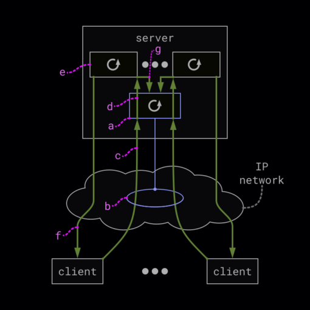
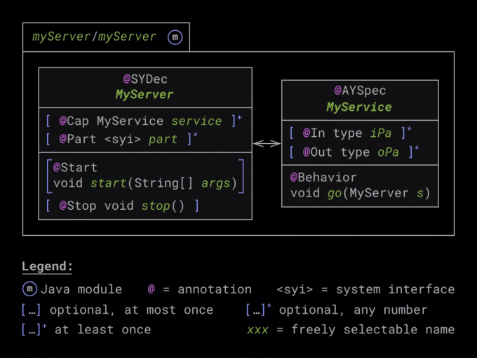
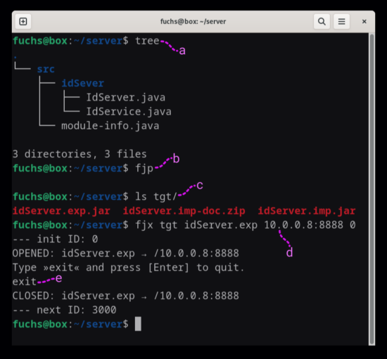

**FEPCOS-J prototypically implements a Java language extension that allows the realization of a multithreaded TCP/IP server in Java without thread or network programming.**

**Please help me to make FEPCOS-J a Free/Libre and Open-Source Software (FLOSS).**

## Introduction

FEPCOS-J [\[1\]](#references) is a Java development tool that prototypes a Java language extension for declarative programming of networked systems. See my previous posts for details [\[2, 3, 4\]](#references).

Firstly, this post briefly defines [the term "multithreaded TCP/IP server"](#what). It then describes [how FEPCOS-J supports programming a multithreaded TCP/IP server in Java](#how). Further, the post explains [what implementing the server with FEPCOS-J looks like](#look) and provides an [example](#example). Finally, the post draws a [conclusion](#conclusion).

I would also like to ask you to [help me make FEPCOS-J a Free/Libre and Open-Source Software (FLOSS)](#help).

## What is a multithreaded TCP/IP server?

The following section defines the term "**multithreaded TCP/IP server**" bottom up:

A **server** is a program that provides a service.

A **client** is a program that can use the services of a server.

A **communication protocol** is an agreement between the client and the server. In particular, the communication protocol specifies:

* a **request** with which a client asks a server for its service;
* a **response** with which a server answers a client's request.

Further, a **multithreaded server** is a server that uses multiple threads to be able to concurrently handle multiple clients' requests.

Finally, a **multithreaded TCP/IP server** is a multithreaded server that communicates with its clients using the TCP/IP protocol [\[5\]](#references).

Using application-specific requests and responses, multithreaded TCP/IP servers are implemented, e.g., as HTTP/2, FTP, or SMTP servers [\[6, 7, 8\]](#references).

**Fig. 1** depicts an abstract example realization.  

<figure class="aligncenter size-medium">
 
 <figcaption class="wp-element-caption">
  <strong>Fig. 1) A multithreaded TCP/IP server</strong> runs a main thread <strong>(a)</strong>. It opens a TCP/IP server socket within an IP network and accepts client requests <strong>(b)</strong>. When a client sends a request to the server via the server socket <strong>(c)</strong>, the main thread <strong>(d)</strong> starts a worker thread <strong>(e)</strong>. It handles the request and sends a response to the client <strong>(f)</strong>. Concurrently, the main thread can immediately accept requests from other clients <strong>(g)</strong>.
 </figcaption>
</figure>

## How does FEPCOS-J support developers programming a multithreaded TCP/IP server in Java?

If you enter "*multi-threaded TCP/IP server in Java*" into a search engine, you will get several results. Many of them explain manual Java programming and provide a lot of source code.

**Compared to manually programming multithreaded servers in Java, FEPCOS-J significantly reduces the amount of source code required. In short, FEPCOS-J relieves Java developers of manual thread or network programming.**

To explain, the programming of multithreaded TCP/IP servers in Java covers both a generic and an application-specific part.

The generic part is the programming of the main-class and multithreading TCP/IP aspects, like:

* the `main()` -- method with the main thread;
* determining of an IP-address, and port [\[9\]](#references);
* creating a ServerSocket [\[10\]](#references) which is bound to the IP-address and the port;
* a `while`-loop which blockingly calls *ServerSocket.accept()* to await client requests;
* starting a Thread [\[11\]](#references) or Virtual Thread [\[12, 13\]](#references) to handle the request;
* Exception handling;
* shutting down the server.

In addition, the application-specific part includes the implementation of the communication protocol and the server's application logic.

It is obvious, that manually programming of all parts is work intensive and requires a lot of source code.

For that reason, FEPCOS-J provides the generic part with a modular Jar file and generates the application-specific communication protocol.

So, a developer who uses FEPCOS-J to implement a multithreaded TCP/IP server in Java only has to program the server's application logic. FEPCOS-J handles the rest.

## What is the implementation of a multithreaded server in Java using FEPCOS-J?

To implement multithreaded servers in Java, FEPCOS-J provides the ***fepcos.j.annotation*** module, the FEPCOS-J Processor ***fjp*** , and the FEPCOS-J Exporter ***fjx***.

A developer uses the Java annotations of *fepcos.j.annotation* to program the server's system specification as a Java module (**Fig. 2**).

After that, the developer runs ***fjp*** to process the source code and generate two modular Jar files. These are a system export module and a system import module. Optionally, ***fjp --native*** also generates a native image [\[4\]](#references).

Finally, the developer starts the server using either ***fjx*** and the system export module or the optionally generated native image.

Moreover, the developer can implement a Java client by using the system import module. It provides both blocking and concurrent access to the server.

In its current state, FEPCOS-J uses Virtual Threads [\[12, 13\]](#references) and therefore requires Java 21. Beyond that, FEPCOS-J has no other dependencies.  

<figure class="aligncenter size-medium">
 
 <figcaption class="wp-element-caption">
  <strong>Fig. 2) FEPCOS-J allows implementing multithreaded servers as Java modules.</strong> Each module contains exactly one class, e.g., <em>MyServer</em>, annotated with <em>@SYDec</em>. In addition, it contains at least one class, e.g., <em>MyService</em>, annotated with <em>@AYSpec</em>. The <em>@SYDec</em> annotated class uses the <em>@Cap</em> annotation to declare the server's services. To point out, the classes annotated with <em>@AYSpec</em> implement these services using the <em>@Behavior</em> annotation. <strong>Tabs. 1 and 2</strong> explain further details, particularly the other annotations shown in this figure.
 </figcaption>
</figure>

### Programming the system declaration of a multithreaded server

| Annotation |                                                                                                                                                      Description                                                                                                                                                       |
|------------|------------------------------------------------------------------------------------------------------------------------------------------------------------------------------------------------------------------------------------------------------------------------------------------------------------------------|
| @SYDec     | It annotates the class of **a multithreaded server's system declaration** . *@SYDec* requires a *String* parameter that ***fjp*** uses to generate system documentation. Example: `@SYDec("My new server") class MyServer{...}`                                                                                        |
| @Cap       | It annotates a member variable that **declares** a capability, which is **a service that the server provides** . Example: `@Cap MyService service;`                                                                                                                                                                    |
| @Part      | It annotates a member variable that declares **another server that the implemented server accesses as a client** . *@Part* requires an *ip address* and a *port* as parameters. The type of the variable must be a system interface generated by ***fjp*** . Example: `@Part("10.0.0.8", 8888) accessedServer.S part;` |
| @Start     | It annotates **a method that the server executes when it starts** . The method optionally accepts the command line parameters as a *String\[\]* . Example: `@Start void start(String[] args){...}`                                                                                                                     |
| @Stop      | It annotates **a method that the server executes when it stops** . Example: `@Stop void stop(){...}`.                                                                                                                                                                                                                  |

**Tab. 1) **The *fepcos.j.annotation* module contains these Java annotations**. Developers can use them to implement the system declaration of a multithreaded server.** Using *@SYDec* and *@Cap* is required. In contrast, the use of *@Part,* *@Start* , and *@Stop* is optional.

### Programming activity specifications of services that a multithreaded server provides

| Annotation |                                                                                                                                                                              Description                                                                                                                                                                               |
|------------|------------------------------------------------------------------------------------------------------------------------------------------------------------------------------------------------------------------------------------------------------------------------------------------------------------------------------------------------------------------------|
| @AYSpec    | It annotates the class of **an activity specification which implements a service** of the server. *@AYSpec* requires a *String* parameter that ***fjp*** uses to generate system documentation. Example: `@AYSpec("My new service") MyService{...}`                                                                                                                    |
| @In        | It annotates a member variable that is **an input parameter of the service** . *@In* requires a *String* parameter that ***fjp*** uses to generate system documentation. *Byte* , *short* , *char* , *int* , *long* , *float* , *double* , *String* , and *byte\[\]* are currently allowed as the type of parameter. Example: `@In("My input parameter") int iPa;`     |
| @Out       | It annotates a member variable that is **an output parameter of the service** . *@Out* requires a *String* parameter that ***fjp*** uses to generate system documentation. *Byte* , *short* , *char* , *int* , *long* , *float* , *double* , *String* , and *byte\[\]* are currently allowed as the type of parameter. Example: `@Out("My output parameter") int oPa;` |
| @Behavior  | It annotates a method, that implements **the desired behavior of the service** . The method optionally accepts the system declaration as a parameter. This allows the manipulation of the server. Example: `@Behavior void go(MyServer s){...}`                                                                                                                        |

**Tab. 2) The *fepcos.j.annotation* module contains these Java annotations. Developers can use them to implement an activity specification for a service that the multithreaded server provides.** Using *@AYSpec* and *@Behavior* is required. In contrast, the use of *@In* and *@Out* is optional.

## Exemplary implementation of a multithreaded server in Java using FEPCOS-J

This section describes how to use FEPCOS-J to implement the following simple example: A server called `idServer`

* concurrently handles requests from multiple clients, providing a service that returns integer IDs.
* accepts the server socket address as a command-line parameter.
* accepts an initial ID as a command-line parameter.
* returns the next ID when shut down.

### Programming

The developer programs *idServer's* system specification within the *idServer* directory.

As can be seen below, the source code is in the *src* subdirectory. It contains the module information *module-info.java* , the system declaration *IdServer.java* , and the activity specification *IdService.java*.

```
idServer/
└── src
    ├── idSever
    │   ├── IdServer.java
    │   └── IdService.java
    └── module-info.java

3 directories, 3 files
```

#### Module descriptor *module-info.java*

The module descriptor describes the *idServer* module. As can be seen below, it requires the *fepcos.j.annotation* module for compile time.

```java
module idServer {
    requires static fepcos.j.annotation;
}
```

#### System declaration *IdServer.java*

The *IdServer* class is the server's system declaration. As can be seen below, it is implemented in the *idServer* package.

```java
package idServer;

import fepcos.j.annotation.*;
import java.util.concurrent.atomic.AtomicInteger;

@SYDec("A simple ID-Server.")
class IdServer {
    @Cap IdService getId;

    final AtomicInteger counter = new AtomicInteger();

    @Start
    void start(String[] args) {
        String init = args[1]; // initial ID returned
        counter.set(Integer.parseInt(init));
        System.out.println("--- init ID: " + counter.get());
    }

    @Stop
    void stop() {
        System.out.println("--- next ID: " + counter.get());
    }
}
```

The class imports ***fepcos.j.annotation.\**** . In particular, this package contains *@SYDec* , *@Cap* , *@Start* , and *@Stop*.

*@SYDec* indicates that the *IdServer* class is the system declaration of the server.

*@Cap* declares the service `IdService getId` whose class's source code is described later.

Further, the *IdServer* class imports `java.util.concurrent.atomic.AtomicInteger` [\[14\]](#references). It is required to realize the server's application logic. Since the `final AtomicInteger counter` member variable is thread-safe, it is used to concurrently generate integer IDs.

*@Start* indicates that the server executes the `void start(String[] args)` method when it starts. The method initializes *counter* by parsing the command line parameters `args`.

*@Stop* indicates that the server executes the `void stop()` method when it stops. The method prints the next ID the server would have returned.

#### Activity Specification *IdService.java*

The *IdService* class is the activity specification of the service. It is also implemented in the *idServer* package.

```java
package idServer;

import fepcos.j.annotation.*;

@AYSpec("Returns an ID.")
class IdService {
    @Out("An ID") int id;

    @Behavior
    void go(IdServer srv) {
        id=srv.counter.getAndIncrement();
    }
}
```

The class imports ***fepcos.j.annotation.\**** . In particular, this package contains *@AYSpec* , *@Out* , and *@Behavior*.

*@AYSpec* indicates that the *IdService* class is the activity specification of the service.

*@Out* declares the output parameter of the service `int id`.

*@Behavior* indicates that the server executes the void `go(IdServer srv)` method to realize the service. The line

`id=srv.counter.getAndIncrement();`

sets the `id` output parameter and increments `srv.counter`.

### Processing, and executing

In order to process the source code, the developer runs ***fjp*** in the project directory (**Fig. 3**).

As a result, the *tgt* directory contains the system export module *idServer.exp.jar* , the system import module *idServer.imp.jar* , and its documentation, *idServer.imp-doc.zip*.

After that, the developer can start the server by using the command:

`fjx tgt idServer.exp 10.0.0.8:8888 0`

To explain:

* *tgt* is the directory containing the system export module.
* *idServer.exp* is the name of the export module.
* *10.0.0.8:8888* is the address of the server socket that accepts the client requests.
* *0* is the initial ID that the server returns.

<figure class="aligncenter size-medium">
 
 <figcaption class="wp-element-caption">
  <strong>Fig. 3) A screenshot shows the exemplary implementation of a multithreaded server with FEPCOS-J: (a)</strong> <em><strong>tree</strong></em> lists source code of the server. <strong>(b)</strong> <strong><em>fjp</em></strong> processes the source code. <strong>(c)</strong> The <em>tgt</em> directory contains the result. <strong>(d)</strong> <strong><em>fjx</em></strong> starts the server. <strong>(e)</strong> The server shuts down after typing <em>exit</em> and pressing [Enter].
 </figcaption>
</figure>

### Requesting the service by a Client

The ***fjp*** -generated system import module *idServer.imp.jar* enables a client to request the service from the server.

To explain, *idServer.imp.jar* contains the `idServer.imp.S` system interface. A client instantiates it and specifies the IP address and port of the server socket, here 10.0.0.8 and 8888:

`var srv = new idServer.imp.S("10.0.0.8", 8888);`

Then, the client can request an ID either blockingly with `srv.b.getId()` or concurrently with `srv.c.getId()`.

As a result, `srv.b.getId()` returns a Record class [\[15\]](#references) with an *id* component; `srv.c.getId()` returns a Future object [\[16\]](#references) of the Record class.

Below is the complete source code of a client that blockingly accesses the server.

It is important to realize that `idServer.imp.S` implements the AutoCloseable interface. Thus, it is declared in a `try`-with-resources statement [\[17\]](#resources).

```
idClient/
└── src
    ├── idClient
    │   └── App.java
    └── module-info.java

3 directories, 2 files
```

```java
module idClient {
    requires idServer.imp;
}
```

```java
package idClient;

public class App {
    public static void main(String[] args) {
        try(var srv = new idServer.imp.S("10.0.0.8", 8888)) {
            var r1 = srv.b.getId(); // blocking access
            System.out.println("id1: " + r1.id());
        }
        catch(Exception e) { System.out.println(e); }
    }
}
```

## Conclusion

Firstly, this post introduced the term "multithreaded TCP/IP server". It then described how FEPCOS-J supports programming a multithreaded TCP/IP server in Java. Further, the post explained what implementing the server with FEPCOS-J looks like.

Finally, this post provided an example of how to use FEPCOS-J. In particular, it described the entire source code required to program a simple multithreaded server in Java.

To emphasize, the source code does not contain any threads, virtual threads, sockets, or server sockets.

In other words, the prototype Java development tool FEPCOS-J allows the realization of a multithreaded TCP/IP server in Java without thread or network programming.

To sum up, programming a multithreaded TCP/IP server in Java is easy with FEPCOS-J.

## I need your help to make FEPCOS-J a Free/Libre and Open-Source Software (FLOSS)

Have you thought about how FEPCOS-J can support your work?

FEPCOS-J shall become a Free/Libre and Open Source Software (FLOSS).

So far, FEPCOS-J is a prototype that I have independently developed. Now, I need your support, especially regarding legal issues, the testing environment, and funding.

Please let me know what you think about it and provide me with any feedback. Detailed contact information is available on my web page [\[18\]](#references).

Thanks for reading!

## References

1. FEPCOS-Project: "*FEPCOS-J -- FEPCOS-J implements a Java language extension that enables developers to declaratively compose networked systems like building blocks* "; <http://fepcos.info/en/fepcos-j.html>.
2. Fuchs, G.: "*FEPCOS-J (1) -- Description, Impressions of Usage, Current State* "; <https://foojay.io/today/fuchs-2023-fepcos-j-01/>.
3. Fuchs, G.: "*FEPCOS-J (2) -- Declaratively compose networked systems in Java* "; <https://foojay.io/today/fuchs-2023-fepcos-j-02/>.
4. Fuchs, G.: "*FEPCOS-J (3) -- Build native executables of Java-coded networked systems* "; <https://foojay.io/today/fuchs-2023-fepcos-j-03-native-executables/>.
5. Internet Engineering Task Force (IETF): "*RFC 9293 - Transmission Control Protocol (TCP)* "; <https://datatracker.ietf.org/doc/html/rfc9293>.
6. Internet Engineering Task Force (IETF): "*RFC 9113 - HTTP/2* "; <https://datatracker.ietf.org/doc/html/rfc9113>.
7. Network Working Group: "*RFC 959 - FILE TRANSFER PROTOCOL (FTP)* "; <https://datatracker.ietf.org/doc/html/rfc959>.
8. Network Working Group: "*RFC 5321 - Simple Mail Transfer Protocol* "; <https://datatracker.ietf.org/doc/html/rfc5321>.
9. Oracle and/or its affiliates: "*Networking Basics* "; *<https://docs.oracle.com/javase/tutorial/networking/overview/networking.html>*.
10. Oracle and/or its affiliates: "*Class ServerSocket* "; <https://docs.oracle.com/en/java/javase/21/docs/api/java.base/java/net/ServerSocket.html>.
11. Oracle and/or its affiliates: "*Class Thread* "; <https://docs.oracle.com/en/java/javase/21/docs/api/java.base/java/lang/Thread.html>.
12. Pressler, R. and Bateman, A.: "*JEP 444: Virtual Threads* "; <https://openjdk.org/jeps/444>
13. Oracle and/or its affiliates: "*Virtual Threads* "; <https://docs.oracle.com/en/java/javase/21/core/virtual-threads.html>.
14. Oracle and/or its affiliates: "*Class AtomicInteger* "; <https://docs.oracle.com/en/java/javase/21/docs/api/java.base/java/util/concurrent/atomic/AtomicInteger.html>.
15. Oracle and/or its affiliates: "*7 Record Classes* "; <https://docs.oracle.com/en/java/javase/21/language/records.html>.
16. Oracle and/or its affiliates: "*Interface Future\<V\>* "; <https://docs.oracle.com/en/java/javase/21/docs/api/java.base/java/util/concurrent/Future.html>.
17. Oracle and/or its affiliates: "The try-with-resources Statement"; <https://docs.oracle.com/javase/tutorial/essential/exceptions/tryResourceClose.html>
18. FEPCOS-Project: "*Gerhard Fuchs -- The computer scientist who founded the FEPCOS-Project to simplify the programming of composed networked systems.* "; <http://fepcos.info/en/fuchs.html>.

All references were last accessed on March 15, 2023.
