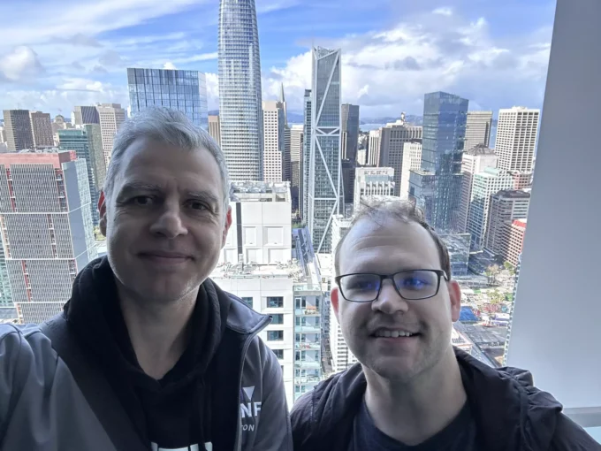
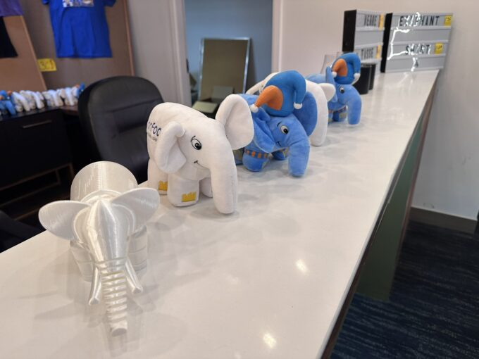
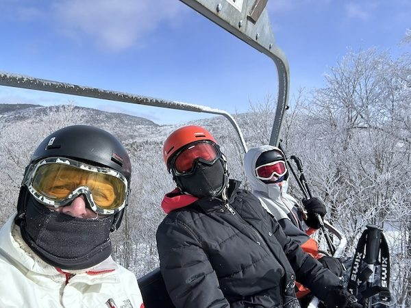
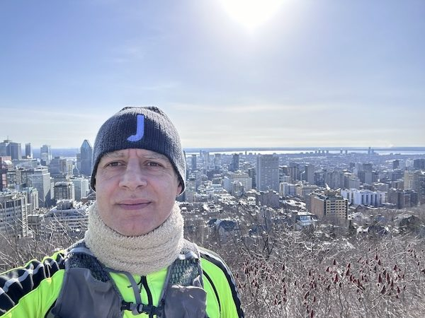
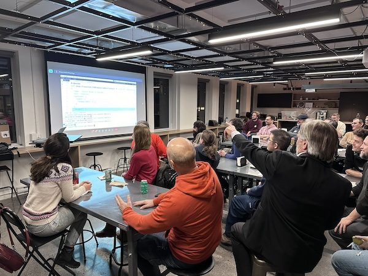
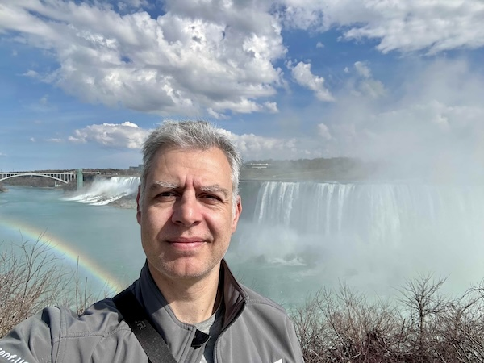
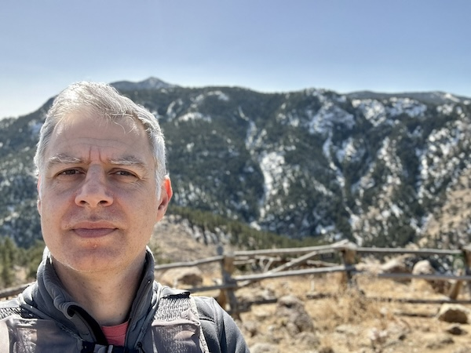
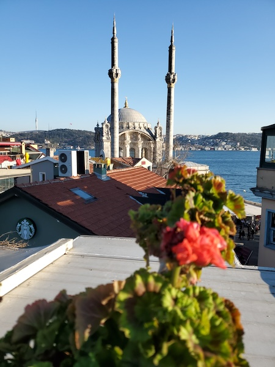
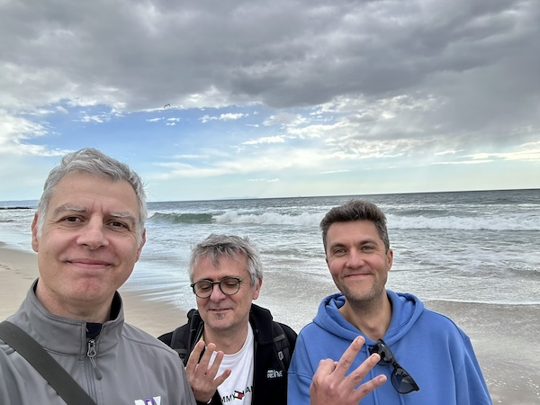

**Once in a while, I write non-technical blog posts when I've something worth sharing. Today, I'd like to write about my North America "Tour" across several conferences and user groups.**

The first leg of my journey started in Oakland, California, with [Developer Week](https://developerweek2024.sched.com/event/1WpId). Developer Week is an established conference with different editions in several locations and online during the year. Though I'm on their advisory board, this is only the second time I've spoken at one of their events. Pro-tip: Avoid being on any board of a conference where you speak. It's bad taste and casts doubt on whether you validated yourself.

I flew from Geneva the day before my talk and crashed into my hotel bed. Of course, I woke up very early in the morning and decided to check the demo of a talk planned for the end of the tour. It didn't work, so I tried to remove the stopped containers. Tired as I was, I deleted **all** my Docker images, including the ones I'd need a few hours later for my talk on [Open](https://blog.frankel.ch/end-to-end-tracing-opentelemetry/) [Telemetry](https://blog.frankel.ch/improve-otel-demo/)!
> Kicking off [@DeveloperWeek](https://twitter.com/DeveloperWeek?ref_src=twsrc%5Etfw) by learning about Telemetry from [@nicolas_frankel](https://twitter.com/nicolas_frankel?ref_src=twsrc%5Etfw) [pic.twitter.com/rLCDPCzExV](https://t.co/rLCDPCzExV)
>
> --- Scott McAllister (@stmcallister) [February 21, 2024](https://twitter.com/stmcallister/status/1760397694282121559?ref_src=twsrc%5Etfw)

The talk is heavily based on a demo. When I tried to start the latter, I noticed the issue immediately and realized my mistake, but it was too late. Even though I had a Docker Compose file with `build` statements, one of the components is in Rust---there was no time to compile it.

Long story short, it was an epic fail. I apologize again for this to the attendees if any of them read this post; I hope the explanations and slides were enough for them to play with the GitHub repository.

Afterward, my friend [Josh](https://mastodon.online/@starbuxman) drove me to San Francisco for lunch and a lovely walk along the piers.

The next day, I woke early to fly to Montréal, Canada. It was a pretty long flight; the day after, I had to talks at [ConFoo](https://confoo.ca/en/speaker/nicolas-fraenkel), one of my favorite conferences in North America. ConFoo started as a PHP conference, hence the elephant mascot, but has now widened its horizon *a lot*.

I had two talks there: Open Telemetry (again) and [Chopping](https://blog.frankel.ch/chopping-monolith/) [the Monolith](https://blog.frankel.ch/chopping-monolith-smarter-way/). I had rebuilt my images, and both talks went flawlessly this time.
> [@nicolas_frankel](https://twitter.com/nicolas_frankel?ref_src=twsrc%5Etfw) talking about decomposing the monolith. The first step on the micro services journey is reorg /cc [@adrianco](https://twitter.com/adrianco?ref_src=twsrc%5Etfw) [pic.twitter.com/YU6yFR8IJF](https://t.co/YU6yFR8IJF)
>
> --- Spencer Gibb (@[\[email protected\]](/cdn-cgi/l/email-protection)) (@spencerbgibb) [February 23, 2024](https://twitter.com/spencerbgibb/status/1761046658303877615?ref_src=twsrc%5Etfw)

Over the weekend, my friend [Anthony](https://framapiaf.org/@anthonydahanne) invited me to ski in Sutton. The temperature was very low compared to what I'm used to, around-10°C. Fortunately, Anthony was prepared and gave me self-heating thingies for my hands; unfortunately, he only had one - but it was enough nonetheless. Anthony also connected me with all the meetups I have the pleasure of presenting at in Canada, so I'm fortunate to count him as a friend.

Having survived the Canadian cold, I ran one of my favourite runs on Monday: from the Bonaventure Hotel to the top of the Mount Royal. The slope is pretty steep at the foot of the mount, so you either choose to use the twisty path to the top or the multiple stairs that cut a more direct route. I managed to use all the stairs but the last (and longest) one and caught my breath running along the regular path.

In the evening of the same day, I talked at the [Software Crafters Montréal](https://www.meetup.com/fr-FR/software-crafters-montreal/events/298710071/) meetup. It's interesting because though I've been a developer for a long time, I never belonged to the "crafter" movement, though it resonates. The talk chosen was [Evolving your APIs](https://blog.frankel.ch/evolve-apis/). The room was packed, and I believe it was pretty well received.

The next step in my journey was the [Ottawa Java User Group](https://www.meetup.com/ottawa-java-user-group/events/299043919). I spent most of my developer years on the JVM, so my network is quite developed among JUGs. The organizer is [Sebastien Pelletier](https://www.linkedin.com/in/pelletis/): he's been accommodating and has driven me from my hotel and back again. He's trying to rebuild the Ottawa JUG back to its pre-COVID attendance. If you're a speaker and plan to be around Ottawa, please get in touch with him: his organizational skills are second to none.
> I had the pleasure of watching [@nicolas_frankel](https://twitter.com/nicolas_frankel?ref_src=twsrc%5Etfw) speak at [@realOttawaJUG](https://twitter.com/realOttawaJUG?ref_src=twsrc%5Etfw) this evening. The room was packed!! [pic.twitter.com/XEotZOh95E](https://t.co/XEotZOh95E)
>
> --- Theresa Mammarella (@t_mammarella) [February 27, 2024](https://twitter.com/t_mammarella/status/1762628620193775717?ref_src=twsrc%5Etfw)

Ottawa is located between Montréal and Toronto, so the [Toronto JUG](https://www.meetup.com/toronto-java-users-group/events/298952265/) was a logical step in my tour. I stayed for a couple of days, including the weekend, so I had time to explore the city, including the CN Tower, as it was my first time there. [Therese Mammarella](https://mastodon.social/@t_mammarella) is the organizer there, and I'm sure she'll be happy to host you. You may have noticed she liked my talks so much that she drove to Ottawa on purpose the week before to attend the one I did at the JUG. The talk was well-attended but less than I expected for a city of this size. Anyway, I had a lot of fun presenting Evolving your APIs - I hope the attendees had too.
> Great have [@nicolas_frankel](https://twitter.com/nicolas_frankel?ref_src=twsrc%5Etfw) drop into the [#Toronto](https://twitter.com/hashtag/Toronto?src=hash&ref_src=twsrc%5Etfw) JUG on his [#APISIXNorthAmericaTour](https://twitter.com/hashtag/APISIXNorthAmericaTour?src=hash&ref_src=twsrc%5Etfw)! [pic.twitter.com/KcRhA2nOpm](https://t.co/KcRhA2nOpm)
>
> --- Shaun Smith 🇨🇦❤️🇺🇦 (@shaunmsmith) [March 5, 2024](https://twitter.com/shaunmsmith/status/1764812180992426409?ref_src=twsrc%5Etfw)

Toronto is quite close to Niagara Falls. It would have been a shame not to go there, but I felt sick the weekend, so I decided to skip it. Yet, some things are just bound to happen. After the talk, a couple of us went to have dinner. There, I met a Ukrainian guy who had moved to Toronto years before the war and knew about me and my support for Ukraine. After talking together, we realized we had friends in common. He offered to drive me there as he was not working the next day. I happily took a day off myself and didn't regret it one bit! Thanks, Ihor, for the drive and the conversation.

Afterward, I returned to the USA, namely Chicago, Illinois, to speak at [Chicago JUG](https://www.meetup.com/chicagojug/events/299412641/). I have known the JUG leader, [Mary Grygleski](https://mastodon.social/@mgrygles), for over a decade. She took the time to organize the meetup despite her busy schedule.
> Our meetup with the amazing [@nicolas_frankel](https://twitter.com/nicolas_frankel?ref_src=twsrc%5Etfw) has just started [#ApacheAPISIX](https://twitter.com/hashtag/ApacheAPISIX?src=hash&ref_src=twsrc%5Etfw)! Thanks [@IBM](https://twitter.com/IBM?ref_src=twsrc%5Etfw)-Chicago [@arunavaibm](https://twitter.com/arunavaibm?ref_src=twsrc%5Etfw) for hosting us tonight, and [@ChehHoo](https://twitter.com/ChehHoo?ref_src=twsrc%5Etfw) @software29927 for helping! There's still time to join us: <https://t.co/qiy8WXYXBR> [pic.twitter.com/9iiCtvPT4a](https://t.co/9iiCtvPT4a)
>
> --- Mary Grygleski (@mgrygles) [March 8, 2024](https://twitter.com/mgrygles/status/1765903150668517579?ref_src=twsrc%5Etfw)

[Matt Raible](https://github.com/mraible) is a familiar face in the Java community - and beyond. He's also the leader of the Denver Java User Group. I was lucky to know him, as he also arranged a double hit: [Boulder](https://www.meetup.com/boulderjavausersgroup/events/299454075/), then [Denver](https://www.meetup.com/denverjavausersgroup/events/gjngbtygcfbrb/). Even better, [Venkat Subramaniam](https://mastodon.social/@venkats), whom I don't need to introduce, lives close to Boulder **and** was there to invite me for a hike. But before that, I spend my weekend hiking according to his suggestion. First, I went to Boulder Moutain Park, and then, the day after, I went to Lake Bernard.

The not-so-fun part about the second hike: for a reason unknown, mid-way, my head started to hurt. The headache lasted for the whole day. I checked online, and since I had my water bag and kept drinking, it might have been mountain sickness. It's weird since I live close to the mountains and go on top regularly, but it's the only explanation I could find. Fortunately, it went away the next day, and the talks went well.
> March [@denverjug](https://twitter.com/denverjug?ref_src=twsrc%5Etfw) - [@nicolas_frankel](https://twitter.com/nicolas_frankel?ref_src=twsrc%5Etfw) discussing "Evolving your APIs, a pragmatic approach" at Thrive in Cherry Creek. [pic.twitter.com/cOksUDihVm](https://t.co/cOksUDihVm)
>
> --- Greg Ostravich (@GregOstravich) [March 14, 2024](https://twitter.com/GregOstravich/status/1768070218855612800?ref_src=twsrc%5Etfw)

It was time for me to leave for the last leg of my journey, the [Southern California Linux Expo](https://www.socallinuxexpo.org/scale/21x/presentations/back-basics-getting-traffic-your-kubernetes-cluster) in Pasadena. Before that, life took an interesting turn of events: the forecast warned about a snowstorm in the area. The airline rebooked me twice: from 6 AM to 7 AM, then from 7 AM to 11 AM. I was lucky enough to get a seat, and though spraying the plane with unfreezing liquid took a bit of time, it managed to leave anyway. I left Denver under the snow and landed a handful of hours later in Los Angeles under the sun.

It was my second time at SCaLE, *aka*, SoCalLinux; the first time was the year of Covid. I need to explain why speaking at SCaLE during this journey was necessary. At the time, I was to speak at two different meetups in San Francisco, then SCaLe, fly to Romania, then Istanbul, get back home on Saturday, and leave on Monday for Australia. Granted, it was not terrific planning, but I like to think that I lived and learned since then. Anyway, one of the meetups was canceled, and I did the other online from my hotel room. At SCaLe, the venue was pretty empty for an event this size. Some people were wearing masks, and antiseptic gel dispensers were everywhere. I had around ten people in my room, which was my record at the time - I've done worse since then.

Later, the Romanian conference announced they would cancel the event. I called the Istanbul one, but they confirmed the event would occur. I rebooked to Istanbul, then one day later, they canceled as well. When life gives you lemons, you make lemonade; I decided to keep it that way to avoid more rebooking fees and spend the days in Istanbul anyway.

For the record, on Sunday, the whole world stopped. The Australian conference was also canceled, and I had no chance to go there since. Thus, that was what went in my head by preparing for my talk at SCaLE: I wanted to exorcise my previous experience. I'm happy to say it worked!
> [@nicolas_frankel](https://twitter.com/nicolas_frankel?ref_src=twsrc%5Etfw) is starting a great talk on the basics of network traffic options on Kubernetes at [#Scale21x](https://twitter.com/hashtag/Scale21x?src=hash&ref_src=twsrc%5Etfw) in the [#kcdla](https://twitter.com/hashtag/kcdla?src=hash&ref_src=twsrc%5Etfw) track in ballroom B [@socallinuxexpo](https://twitter.com/socallinuxexpo?ref_src=twsrc%5Etfw) [pic.twitter.com/vIQckW5QYt](https://t.co/vIQckW5QYt)
>
> --- Steve Wong (@cantbewong) [March 15, 2024](https://twitter.com/cantbewong/status/1768725626306150526?ref_src=twsrc%5Etfw)

Before leaving for home, though, I met with my friends from Yugabites: [Denis Magda](https://github.com/dmagda) and [Franck Pachot](https://mastodon.social/@FranckPachot). We had lunch, then enjoyed an hour or so walking on the shore of Venice Beach. Here, you can see them counting on their fingers:

Did you notice that you count on your fingers differently depending on where you were raised? Hint: find out how the English spies unwillingly reveal themselves in the Inglorious Basterds movie, despite speaking flawless German.

It was time to get home after this last pause on American soil. Many hours later, I was at home, tired but happy from all those events. Many thanks to all the organizers who made them possible, especially Anthony, who worked as my agent for Canada. I also want to thank the people who came to my talks: speakers are nobody if there's no audience to listen to them. Finally, I want to thank my employer [api7.ai](https://api7.ai/), who made it all possible.

See you soon [somewhere](https://blog.frankel.ch/speaking/)!

PS: I tried to document my journey via #APISIXNorthAmericaTour. Find more pictures on [Twitter](https://twitter.com/search?q=%23APISIXNorthAmericaTour&src=typed_query&f=live), [LinkedIn](https://www.linkedin.com/search/results/all/?keywords=%23APISIXNorthAmericaTour&origin=GLOBAL_SEARCH_HEADER), [Mastodon](https://mastodon.top/tags/APISIXNorthAmericaTour) and [BlueSky](https://bsky.app/search?q=%23APISIXNorthAmericaTour).

*Originally published at [A Java Geek](https://blog.franke.ch/apisix-north-america-tour/) on March 24^th^, 2024*
