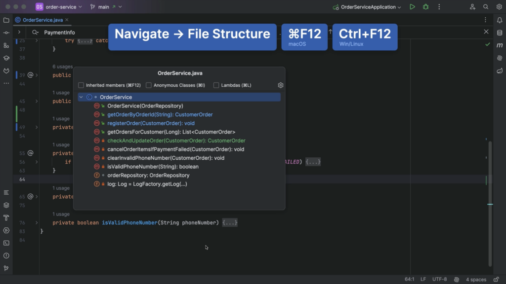
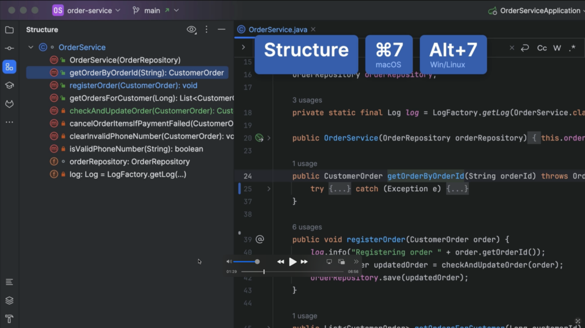
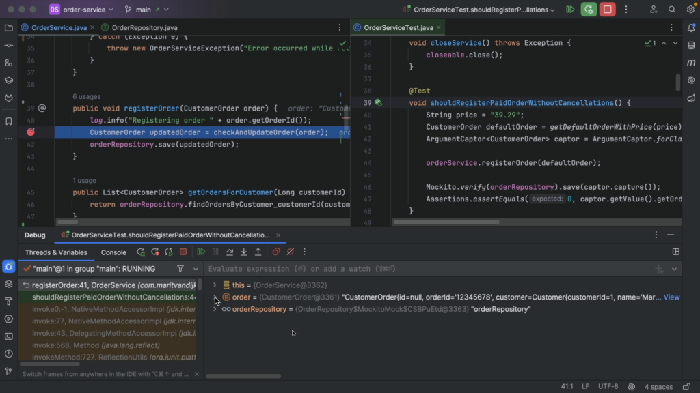

**As developers, we read code more than we write it. When adding new features or fixing bugs, we first need to understand existing code, so we can make the right changes in the right place.**

When reading code inside the IDE, [IntelliJ IDEA](https://www.jetbrains.com/idea/) helps us to read and understand code by providing helpful features like syntax highlighting and inlay hints. But there are more features to help us understand a piece of code.

## **Formatting**

We don't read code like we do text, from start to finish. Code doesn't run linearly! We scan code to get a feel for the shape, and to find the part we're interested in.

IntelliJ IDEA will take care of formatting the code while we're writing code. If we encounter code that is not properly formatted, we can have IntelliJ IDEA reformat the code for us. In the file you want to reformat, use the shortcut **⌘⌥L** on macOS or **Ctrl+Alt+L** on Windows/Linux.
*Reformat code*

We can restructure the code by moving code blocks around to match our mental model, preferred style or coding conventions.
*Move Statement Up and Down*

## **Structure**

There are several ways to get a quick overview of a piece of code. For example, we can collapse the code, so we only see the names of methods and not their implementation. This can help us find the specific code we are looking for more quickly. We can then expand that particular section.
*Collapse and Expand Code*

Note that we can still search the code when it is collapsed, and if needed the relevant section will expand.
*Search Collapsed Code*

Alternatively, we can look at the **File Structure** for a file using **⌘ F12** on macOS or **Ctrl+F12** on Windows/Linux. We can navigate to the section of the code we're interested in from here.
 *File Structure*

We can get the same information by opening the **Structure** tool window, using **⌘ 7** on macOS or **Alt+7** on Windows/Linux.
 *Structure tool window*

## **Searching**

We can search the code for specific names of variables, methods, or Strings, for example a log message. IntelliJ IDEA will highlight the results of your search in the file.

We can also search for other occurrences from the editor. For example, we can select this variable name, and press **⌘F** on macOS or **Ctrl+F** on Windows/Linux to search for the selected string. IntelliJ IDEA will place the selected string into the search field and highlight all occurrences in the file.
*Find String In File*

## **Additional hints: Quick Documentation \& Type Information**

We can also ask for additional hints from our IDE. For example, we might want more information about a particular class or method that is used in the code we are looking at, but defined elsewhere in the codebase. We can navigate to other locations in the code base, and back again, but we might end up getting lost in a large code base. Even though we can ask IntelliJ IDEA to locate a file in the project structure, jumping around too much can get overwhelming.
*Select In: Project tool window*

Instead, we can use **Quick Documentation** (**F1** on macOS or **Ctrl+Q** on Windows/Linux) to pull up the information we need in our current location.
*Quick Documentation*

We can also pull up **Type Information** using **⌃⇧P** on macOS or **Ctrl+Shift+P** on Windows/Linux if we're unsure of what type is returned by a particular method.
*Type Information*

## **Reader mode**

Code might contain comments that explain the code. We can toggle to reader mode in the editor using **\^⌥Q** (on macOS) or **Ctrl+Alt+Q** (on Windows/Linux). Right-click the icon in the gutter to select **Render All Doc Comments** if you want all comments to show in reader mode.
*Toggle Rendered Mode*

## **Testing and debugging**

To understand intended behavior of the code, we can look at the tests in the code base. To look at the code and its tests side by side, right-click the tab and select **Split and Move Right**.
*Split and Move Right*

We can run a test (or our application) through the debugger to actually see how the code is executed. First, we need to place a breakpoint at the location in the code we're interested in. Click the gutter next to the line of code where you want to place the breakpoint, or use **⌘ F8** on macOS or **Ctrl+F8** on Windows/Linux to toggle the breakpoint.

Next, we run our test (or application) using the **Debug** option. Execution will stop at the breakpoint, so we can investigate the state of our application. Once code execution stops at the breakpoint, we can see current values of variables and objects.
 *Debug information*

We can also evaluate an expression, to see its current value and look at more details. We can even change the expressions to evaluate different results.
*Evaluate Expression*

We can continue execution by either stepping into (**F7** ) a line to see what happens inside a called method or stepping over (**F8** ) a line to go to the next line even if a method is called, depending on what we're interested in. Finally, we can resume the program, using the shortcut **⌥⌘R** on macOS or **F9** on Windows/Linux, to finish the execution of the test (or continue execution of the application).
*Step into, step over, resume.*

If there is no test that exercises the piece of code you are interested in, you might want to add one. This can also help you verify any assumptions you might have about the code.

## **Refactoring for understanding**

While trying to understand the code, you may want to perform small refactorings, like renaming a variable or method (using the shortcut **⇧F6** on macOS or **Shift+F6** on Windows/Linux), extracting a method and giving it a meaningful name (using the shortcut **⌥⌘M** on macOS or **Ctrl+Alt+M** on Windows/Linux), or refactor the code to a style you are more familiar with to make it easier for you to read and understand the code.
*Refactor code style*

Playing with the code can help you verify your assumptions and improve your understanding. Remember though, that these changes are not meant to be committed! Revert them when you're done.
*Revert changes*

## **Version control (Git) history**

We might be interested in when the code was last changed and why. We can find out by looking at the history in our version control system. If we are using Git, we can click the gutter to enable **Annotate with Git Blame** . Or, if you don't like using the mouse, you can open the **VCS Popup** using **⌃V** on macOS or **Alt+\`** on Windows/Linux and enable or disable this option from there.
*VCS Popup*

In the gutter, we can now see when a line was last changed and by whom. We can hover over this information to see the commit this change was a part of and its corresponding commit message. Or we can click a line in the gutter to open the **Git** tool window, with the selected commit highlighted. Here, we can see the commit, its commit message and which files were changed. We can open the diff of the files to see exactly what was changed.

## **JetBrains AI Assistant**

If you are using JetBrains AI Assistant, you can ask AI Assistant to explain the commit to you.
*Explain Commit*

[JetBrains AI Assistant](https://www.jetbrains.com/ai/) is an additional service available in IntelliJ IDEA from version 2023.3. It has several features that can help us understand our code. For example, we can ask AI Assistant to explain code, write documentation, or generate unit tests.
*AI Actions*

If we use the AI action **Explain code** without selecting any code, the entire file is selected and AI Assistant opens a chat window where it will explain the code in this file. Alternatively, we can select a specific piece of code, like a method, and perform the same action to get an explanation of that section of code.
*Explain Code*

We can write documentation for a class or method. Note that our cursor needs to be in the class or method for this to work. We can't write documentation for a blank line.
*Write Documentation*

And of course, we can ask AI Assistant questions in the chat. For example, to explain the project.
*Explain Project*

Keep in mind that even if you use AI Assistant to write code for you, you'll still need to be able to read code! You'll need to evaluate the code provided, and understand whether that is the code you want.

## Conclusion

In this tutorial we've looked at the many ways IntelliJ IDEA can help you read and understand code. Hopefully these tips for reading code will have you reading code like a pro.

<figure class="wp-block-embed is-type-rich is-provider-embed-handler wp-block-embed-embed-handler wp-embed-aspect-16-9 wp-has-aspect-ratio">
 

  
PRESERVEDHTMLBLOCKZZ0ZZEND

 

</figure>

## Links

* [Code style and formatting](https://www.jetbrains.com/help/idea/code-style.html)
* [Inlay hints](https://www.jetbrains.com/help/idea/inlay-hints.html)
* [Structure popup](https://www.jetbrains.com/help/idea/viewing-structure-of-a-source-file.html#structure-popup)
* [Structure tool window](https://www.jetbrains.com/help/idea/viewing-structure-of-a-source-file.html#structure-tool-window)
* [Search for a target within a file](https://www.jetbrains.com/help/idea/finding-and-replacing-text-in-file.html)
* [Code reference information](https://www.jetbrains.com/help/idea/viewing-reference-information.html)
* [Reader mode](https://www.jetbrains.com/help/idea/reader-mode.html)
* [Render Javadocs](https://www.jetbrains.com/help/idea/javadocs.html#toggle-rendered-view)
* [Testing in IntelliJ IDEA](https://www.jetbrains.com/help/idea/tests-in-ide.html)
* [Debug code](https://www.jetbrains.com/help/idea/debugging-code.html)
* [Step through the program](https://www.jetbrains.com/help/idea/stepping-through-the-program.html)
* [Code refactoring](https://www.jetbrains.com/help/idea/refactoring-source-code.html)
* [Version control](https://www.jetbrains.com/help/idea/version-control-integration.html)
* [JetBrains AI Assistant](https://www.jetbrains.com/help/idea/ai-assistant.html)

