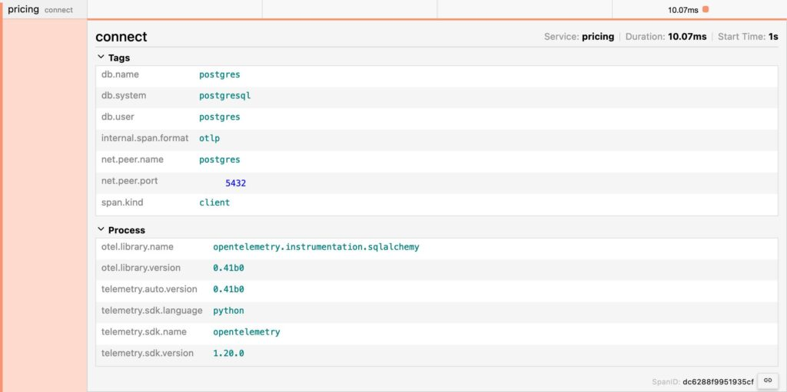
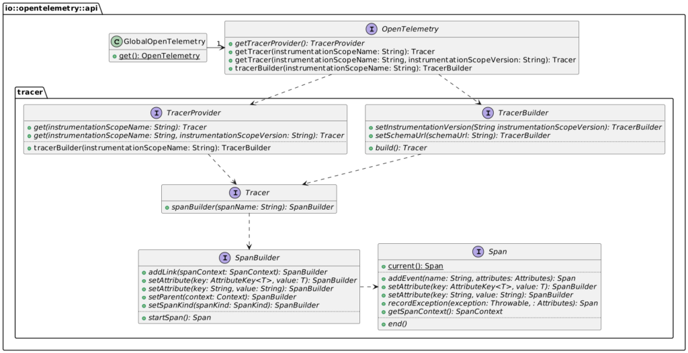

Last year, I wrote a [post](https://blog.frankel.ch/end-to-end-tracing-opentelemetry/) on Open Telemetry Tracing to understand more about the subject. I also created a demo around it, which featured the following components:

* The Apache APISIX API Gateway
* A Kotlin/Spring Boot service
* A Python/Flask service
* And a Rust/Axum service

I've recently improved the demo to deepen my understanding and want to share my learning.

Using a regular database {#h2-0-using-a-regular-database}
---------------------------------------------------------

In the initial demo, I didn't bother with a regular database. Instead:

* The Kotlin service used the embedded Java H2 database
* The Python service used the embedded SQLite
* The Rust service used hard-coded data in a hash map

I replaced all of them with a regular PostgreSQL database, with a dedicated schema for each.

The OpenTelemetry agent added a new span when connecting to the database on the JVM and in Python. For the JVM, it's automatic when one uses the Java agent. One needs to install the relevant package in Python - see next section.

OpenTelemetry integrations in Python libraries {#h2-1-opentelemetry-integrations-in-python-libraries}
-----------------------------------------------------------------------------------------------------

Python requires you to explicitly add the package that instruments a specific library for OpenTelemetry. For example, the demo uses Flask; hence, we should add the Flask integration package. However, it can become a pretty tedious process.

Yet, once you've installed `opentelemetry-distro`, you can "sniff" installed packages and install the relevant integration.

```bash
pip install opentelemetry-distro

opentelemetry-bootstrap -a install
```


For the demo, it installs the following:

```
opentelemetry_instrumentation-0.41b0.dist-info
opentelemetry_instrumentation_aws_lambda-0.41b0.dist-info
opentelemetry_instrumentation_dbapi-0.41b0.dist-info
opentelemetry_instrumentation_flask-0.41b0.dist-info
opentelemetry_instrumentation_grpc-0.41b0.dist-info
opentelemetry_instrumentation_jinja2-0.41b0.dist-info
opentelemetry_instrumentation_logging-0.41b0.dist-info
opentelemetry_instrumentation_requests-0.41b0.dist-info
opentelemetry_instrumentation_sqlalchemy-0.41b0.dist-info
opentelemetry_instrumentation_sqlite3-0.41b0.dist-info
opentelemetry_instrumentation_urllib-0.41b0.dist-info
opentelemetry_instrumentation_urllib3-0.41b0.dist-info
opentelemetry_instrumentation_wsgi-0.41b0.dist-info
```


The above setup adds a new automated trace for connections.



Gunicorn on Flask {#h2-2-gunicorn-on-flask}
-------------------------------------------

Every time I started the Flask service, it showed a warning in red that it shouldn't be used in production. While it's unrelated to OpenTelemetry, and though nobody complained, I was not too fond of it. For this reason, I added a "real" HTTP server. I chose [Gunicorn](https://gunicorn.org/), for no other reason than because my knowledge of the Python ecosystem is still shallow.

The server is a runtime concern. We only need to change the `Dockerfile` slightly:

```dockerfile
RUN pip install gunicorn

ENTRYPOINT ["opentelemetry-instrument", "gunicorn", "-b", "0.0.0.0", "-w", "4", "app:app"]
```


* The `-b` option refers to binding; you can attach to a specific IP. Since I'm running Docker, I don't know the IP, so I bind to any.
* The `-w` option specifies the number of workers
* Finally, the `app:app` argument sets the module and the application, separated by a colon

Gunicorn usage doesn't impact OpenTelemetry integrations.

Heredocs for the win {#h2-3-heredocs-for-the-win}
-------------------------------------------------

You may benefit from this if you write a lot of `Dockerfile`.

Every Docker layer has a storage cost. Hence, inside a `Dockerfile`, one tends to avoid unnecessary layers. For example, the two following snippets yield the same results.

```dockerfile
RUN pip install pip-tools 
RUN pip-compile
RUN pip install -r requirements.txt
RUN pip install gunicorn
RUN opentelemetry-bootstrap -a install

RUN pip install pip-tools \
  && pip-compile \
  && pip install -r requirements.txt \
  && pip install gunicorn \
  && opentelemetry-bootstrap -a install
```


The first snippet creates five layers, while the second only one; however, the first is more readable than the second. With [heredocs](https://www.docker.com/blog/introduction-to-heredocs-in-dockerfiles/), we can access a more readable syntax that creates a single layer:

```dockerfile
RUN <<EOF

  pip install pip-tools 
  pip-compile
  pip install -r requirements.txt
  pip install gunicorn
  opentelemetry-bootstrap -a install

EOF
```


Heredocs are a great way to have more readable and more optimized Dockerfiles. Try them!

Explicit API call on the JVM {#h2-4-explicit-api-call-on-the-jvm}
-----------------------------------------------------------------

In the initial demo, I showed two approaches:

* The first using auto-instrumentation, which requires no additional action
* The second using manual instrumentation, with Spring annotations

I wanted to demo an explicit call with the API in the improved version. The use-case is analytics and uses a message queue: I get the trace data from the HTTP call and create a message with such data so the subscriber can use it as a parent.

First, we need to add the OpenTelemetry API dependency to the project. We inherit the version from the Spring Boot Starter parent POM:

```xml
<dependency>
    <groupId>io.opentelemetry</groupId>
    <artifactId>opentelemetry-api</artifactId>
</dependency>
```


At this point, we can access the API. OpenTelemetry offers a static method to get an instance:

```kotlin
val otel = GlobalOpenTelemetry.get()
```

At runtime, the agent will work its magic to return the instance. Here's a simplified class diagram focused on tracing:



In turn, the flow goes something like this:

```kotlin
val otel = GlobalOpenTelemetry.get()                                   //1
val tracer = otel.tracerBuilder("ch.frankel.catalog").build()          //2
val span = tracer.spanBuilder("AnalyticsFilter.filter")                //3
                 .setParent(Context.current())                         //4
                 .startSpan()                                          //5
// Do something here
span.end()                                                             //6
```


1. Get the underlying `OpenTelemetry`
2. Get the tracer builder and "build" the tracer
3. Get the span builder
4. Add the span to the whole chain
5. Start the span
6. End the span; after this step, send the data to the OpenTelemetry endpoint configured

Adding a message queue {#h2-5-adding-a-message-queue}
-----------------------------------------------------

When I did the talk based on the post, attendees frequently asked whether OpenTelemetry would work with messages such as MQ or Kafka. While I thought it was the case in theory, I wanted to make sure of it: I added a message queue in the demo under the pretense of analytics.

The Kotlin service will publish a message to an MQTT topic on each request. A NodeJS service will subscribe to the topic.

### Attaching OpenTelemetry data to the message {#h3-6-attaching-opentelemetry-data-to-the-message}

So far, OpenTelemetry automatically reads the context to find out the trace ID and the parent span ID. Whatever the approach, auto-instrumentation or manual, annotations-based or explicit, the library takes care of it. I didn't find any existing similar automation for messaging; we need to code our way in. The gist of OpenTelemetry is the `traceparent` HTTP header. We need to read it and send it along with the message.

First, let's add MQTT API to the project.

```xml
<dependency>
    <groupId>org.eclipse.paho</groupId>
    <artifactId>org.eclipse.paho.mqttv5.client</artifactId>
    <version>1.2.5</version>
</dependency>
```


Interestingly enough, the API doesn't allow access to the `traceparent` directly. However, we can reconstruct it via the `SpanContext` class.

I'm using MQTT v5 for my message broker. Note that the v5 allows for metadata attached to the message; when using v3, the message itself needs to wrap them.

```javascript
val spanContext = span.spanContext                                                //1
val message = MqttMessage().apply {

  properties = MqttProperties().apply {
    val traceparent = "00-${spanContext.traceId}-${spanContext.spanId}-${spanContext.traceFlags}" //2
    userProperties = listOf(UserProperty("traceparent", traceparent))             //3
  }
  qos = options.qos
  isRetained = options.retained

  val hostAddress = req.remoteAddress().map { it.address.hostAddress }.getOrNull()
  payload = Json.encodeToString(Payload(req.path(), hostAddress)).toByteArray()   //4
}
val client = MqttClient(mqtt.serverUri, mqtt.clientId)                            //5
client.publish(mqtt.options, message)                                             //6
```


1. Get the span context
2. Construct the `traceparent` from the span context, according to the W3C Trace Context specification
3. Set the message metadata
4. Set the message body
5. Create the client
6. Publish the message

### Getting OpenTelemetry data from the message {#h3-7-getting-opentelemetry-data-from-the-message}

The subscriber is a new component based on NodeJS.

First, we configure the app to use the OpenTelemetry trace exporter:

```javascript
const sdk = new NodeSDK({
  resource: new Resource({[SemanticResourceAttributes.SERVICE_NAME]: 'analytics'}),
  traceExporter: new OTLPTraceExporter({
    url: `${collectorUri}/v1/traces`
  })
})

sdk.start()
```


The next step is to read the metadata, recreate the context from the `traceparent`, and create a span.

```javascript
client.on('message', (aTopic, payload, packet) => {
  if (aTopic === topic) {

    console.log('Received new message')

    const data = JSON.parse(payload.toString())

    const userProperties = {}
    if (packet.properties['userProperties']) {                                  //1
      const props = packet.properties['userProperties']
      for (const key of Object.keys(props)) {
        userProperties[key] = props[key]
      }
    }

    const activeContext = propagation.extract(context.active(), userProperties) //2
    const tracer = trace.getTracer('analytics')
    const span = tracer.startSpan(                                              //3
      'Read message',
      {attributes: {path: data['path'], clientIp: data['clientIp']}},
      activeContext,
    )
    span.end()                                                                  //4
  }
})
```


1. Read the metadata
2. Recreate the context from the `traceparent`
3. Create the span
4. End the span

For the record, I tried to migrate to TypeScript, but when I did, I didn't receive the message. Help or hints very welcome!

Apache APISIX for messaging {#h2-8-apache-apisix-for-messaging}
---------------------------------------------------------------

Though it's not common knowledge, Apache APISIX can proxy HTTP calls as well as UDP and TCP messages. It only offers a few plugins at the moment, but it will add more in the future. An OpenTelemetry one will surely be part of it. In the meantime, let's prepare for it.

The first step is to configure Apache APISIX to allow both HTTP and TCP:

```yaml
apisix:
  proxy_mode: http&stream                                                       #1
  stream_proxy:
    tcp:
      - addr: 9100                                                              #2
        tls: false
```


1. Configure APISIX for both modes
2. Set the TCP port

The next step is to configure TCP routing:

```yaml
upstreams:
  - id: 4
    nodes:
      "mosquitto:1883": 1                                                       #1

stream_routes:                                                                  #2
  - id: 1
    upstream_id: 4
    plugins:
      mqtt-proxy:                                                               #3
        protocol_name: MQTT
        protocol_level: 5                                                       #4
```


1. Define the MQTT queue as the upstream
2. Define the "streaming" route. APISIX defines everything that's not HTTP as streaming
3. Use the MQTT proxy. Note APISIX offers a Kafka-based one
4. Address the MQTT version. For version above 3, it should be 5

Finally, we can replace the MQTT URLs in the Docker Compose file with APISIX URLs.

Conclusion {#h2-9-conclusion}
-----------------------------

I've described several items I added to improve my OpenTelemetry demo in this post. While most are indeed related to OpenTelemetry, some of them aren't. I may add another component in another different stack, a front-end.

The complete source code for this post can be found on [GitHub](https://github.com/nfrankel/opentelemetry-tracing).


*Originally published at [A Java Geek](https://blog.frankel.ch/improve-otel-demo/) on January 28^th^, 2024*
