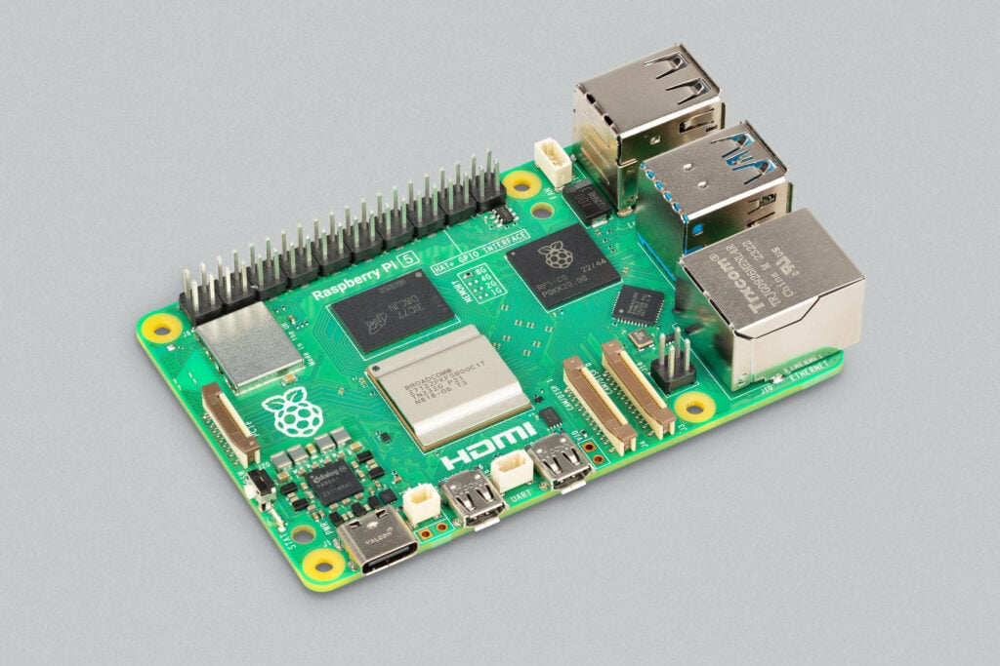
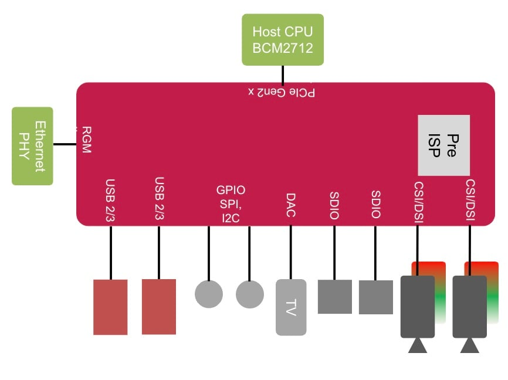
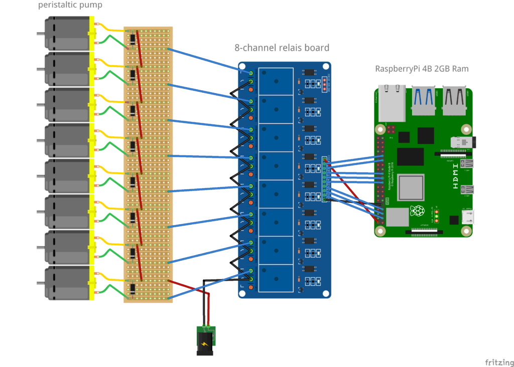
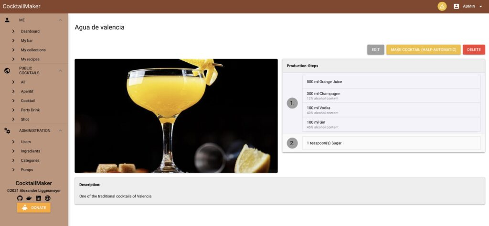

In October 2023, [Raspberry Pi announced version 5](https://www.raspberrypi.com/news/introducing-raspberry-pi-5/) of its affordable single-board computer with 4GB (60$) or 8GB (80$) of memory.

Soon after the first boards were delivered, it turned out the Pi4J library wasn't compatible with this new board. Pi4J is a library to create Java applications for the Raspberry Pi that can interact with electronic components through the GPIO pins.

But because the Raspberry Pi 5 uses a new approach, with the [new RP1 chip](https://www.raspberrypi.com/documentation/microcontrollers/rp1.html), to connect the SoC with these pins. Thanks to the RP1, it was possible to seperate GPIO, SPI, I2C, USB, ethernet,... from the SoC to make it easier to develop newer boards. However, this new approach wasn't supported by the PiGpio library used in Pi4J V2.

Luckily Alexander Liggesmeyer, a Pi4J user, took up the challenge to find a solution!

<figure class="wp-block-gallery has-nested-images columns-default is-cropped wp-block-gallery-1 is-layout-flex wp-block-gallery-is-layout-flex">
 <figure class="wp-block-image size-large">
  
 </figure>
 <figure class="wp-block-image size-large">
  
 </figure>
</figure>

(Images from https://www.raspberrypi.com)

## What is Pi4J?

Here on Foojay.io, you can already find [many different articles and examples](https://foojay.io/?s=pi4j) of what can be done with Java on the Raspberry Pi. As it is a full Linux computer -- with a small size -- it can run any Java application. But this board has the additional benefit of the GPIO pins which allow you to connect sensors, buttons, displays, servos, LEDs, and any kind of electronic component.

The [Pi4J project](https://pi4j.com/) aims to make the interaction with such components as easy as possible for a Java developer, as described on the website: "This project is intended to provide **a friendly object-oriented I/O API and implementation libraries for Java Programmers** to access the **full I/O capabilities of the Raspberry Pi platform**.

This project abstracts the low-level native integration and interrupt monitoring to enable Java programmers to **focus on implementing their application business logic**." This is not only achieved by providing a Java library, but also with an extended website containing extra info about how to use Java and JavaFX on the Raspberry Pi.

## New Version of Pi4J to Support the Raspberry Pi 5

The second version of Pi4J (first released on Aug 26, 2021) is based on a l[ayered approach, aiming to separate the GPIOs' logic from the underlying native code](https://pi4j.com/architecture/). This is achieved with Plugins that can support one or more different protocols.

This approach has the drawback that it's a bit harder to understand the source code and get familiar with the project if you want to contribute by fixing a bug or adding a feature. However, it turned out to be a good approach, as adding support for the Raspberry Pi 5 and RP1 was possible by adding a new plugin, while most of the other code could remain untouched.

**Alexander Liggesmeyer** contributed a [new plugin: **GpioDPlugin**](https://github.com/Pi4J/pi4j-v2/tree/develop/plugins/pi4j-plugin-gpiod/src/main/java/com/pi4j/plugin/gpiod). As a Pi4J-user, he wanted to run his applications on the Raspberry Pi 5. With the support of other core members of the project, **Robert von Burg** and **Thomas Aarts**, not only did this new plugin get added, but the whole plugin approach was improved to make the library easier to use.

On March 18th, 2024, version 2.5 of Pi4J was released. In this version, the support for the Raspberry Pi 5 is a highlight, of course, but it also brings many other improvements. The full list is available in the [release notes](https://pi4j.com/about/release-notes/), and these are some of the other important changes:

* The GpioD plugin doesn't require the Java application to be started with sudo, a much-requested feature!
* Mock plugins, which are used for testing, are not loaded anymore when running on a Raspberry Pi.
* A priority system has been introduced into the plugins, making the initialization of GPIO objects easier.
* Many fixes and small improvements in the existing code.

## Interview with Alexander Liggesmeyer

Let's find out why Alexander decided to contribute support for the Raspberry Pi 5 to Pi4J.

***Thanks, Alexander, for your amazing work! Can you introduce yourself?***

I'm Alexander, and I'm currently doing a Ph.D. at Saarland University's HCI Lab.

The research chair works in the area of human-computer interaction, which also often involves prototyping hardware.

***What is your interest in the Pi4J project, and how are you using it?***

I first used it to develop a [Cocktail mixing machine](https://pi4j.com/featured-projects/cocktail-maker-by-alex9849/), whose software is based on Spring Boot.

Spring Boot is a well-known Java framework for developing APIs.

Pi4J allows me to control the Raspberry Pi's GPIO interfaces directly from Java.

<figure class="wp-block-gallery has-nested-images columns-default is-cropped wp-block-gallery-2 is-layout-flex wp-block-gallery-is-layout-flex">
 <figure class="wp-block-image size-large">
  
 </figure>
 <figure class="wp-block-image size-large">
  
 </figure>
 <figure class="wp-block-image size-large">
  
 </figure>
</figure>

***When you discovered that Pi4J wasn't compatible with this new chip, what made you decide to dive into the problem and add a new provider?***

I got the new Raspberry Pi 5 and ran a few applications on it. I saw that the CocktailPi application, which could take about 60 seconds to start on a Raspberry Pi 4, can now start in less than 15 seconds. So I wanted to use the new Raspberry. Unfortunately, Pi4J wasn't yet compatible with the new platform.

I also saw that nobody was actively working on changing this, so I thought, why shouldn't I do that myself? I'm actively using this library and wanted a feature that hasn't been implemented yet. The library is open source, and one of its advantages is that everybody can contribute. So why not do that? In the end, everybody profits.

***This new provider is backwards compatible with earlier Raspberry Pi boards, how did you achieve this?***

The new provider interfaces with LibGpioD, and the library directly interacts with Gpio devices. I didn't dig into how it actually manipulates the gpiochip device files, but I don't think that they differ significantly (if at all) between Raspberry Pi versions.

This is more something on the operating system level. The only thing the provider needs to do is find the correct gpiochip device. On the Raspberry Pi, this device always contains the name `pinctrl` in its name, so finding it is straightforward.

***An OOS project can only improve thanks to the community's contributions. Was it easy to understand how to add functionality to the Pi4J project? How can the code or website be improved to attract more contributors?***

I think Pi4J is very well documented. Adding a new provider was a bit tricky since I needed some libraries that were not part of the builder Docker images initially.

However, this could be solved by cloning and updating the builders. The only thing that I see that could be improved is making the link to Slack more prominent.

***How do you see the future of Java on embedded devices like the Raspberry Pi?***

It depends on what a person wants to achieve. I personally like to use Python to develop small prototypes. I prefer type-safe programming languages for larger projects because they already prevent most type errors at compile time.

Java requires the developer to add the type of a variable every time it is defined, which adds to readability. On the other hand, Python does not force the developer to add type hints, leading to many developers not adding them. This makes refactoring code harder and more prone to errors.

## Conclusion

Thanks to this new version of Pi4J, the newest Raspberry Pi board, version 5, is now also supported.

On top of that, the GpioD is future-proof, as it can interact with the new RP1 chip that will be used in future boards.

V2.5.1 of Pi4J is the first release with this new GpioD plugin, and we are looking forward to seeing how it is going to be used by the community in their many projects and how we can further improve Pi4J to make JavaOnRaspberryPi an, even more, fun and exciting topic!
