**As developer, you would think we would spend all our time in an IDE doing development. The reality is a bit different. We may need to analyze logs, test our web services, generate test data, do security tests, analyze data in the database, and so on. Text processing os also part of a developer job. Let's see a few free text tools to simplify your job.**

Using online tools makes me wonder if I'm leaking company data to the website, so I wrote a desktop freeware [Japplis Toolbox](https://www.japplis.com/toolbox/) containing a collection of text tools.

All my applications are written in Java (Swing), so everything below will work on Windows, macOS and Linux.

## 1️⃣ URL Encoding and Decoding

If you analyze logs or are writing integration tests or are trying to test SQL injection or path traversal, you're most like need to use url parameters and their values that are URL encoded.  
[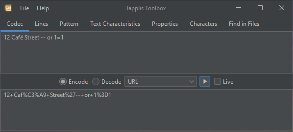](https://www.japplis.com/toolbox/) *Japplis Toolbox URL Encoding tool in dark mode*

## 2️⃣ Query Parameters

In the same scenario, most likely URLs will use more than one query parameter, so instead of doing per value URL encoding and decoding, you can use query parameters.  
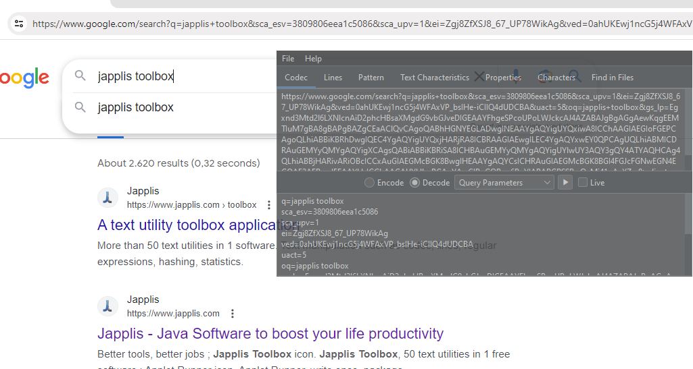 *Japplis Toolbox Query Parameters decoding tool in always on top mode (Shift F12) and translucent (Ctrl Shift F12 \& Shift Alt Mouse Wheel)*

## 3️⃣ Match Regular Expression

Regular expressions are a powerful tool to validate text. You may want to test your regular expression with some different text before adding it to your code.

Japplis Toolbox contains such tool that use the Java regular expression library. If the regular expression is invalid, it will appear in red with a tool tip containing the error message.  
[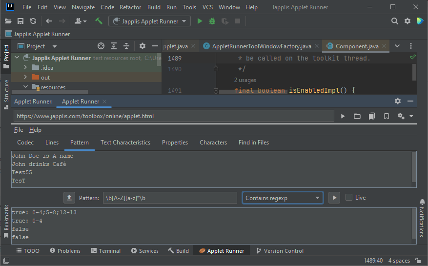](https://plugins.jetbrains.com/plugin/16682-applet-runner/) *Japplis Toolbox Contains regexp tool running inside JetBrains Intellij IDEA using the [Applet Runner plugin](https://plugins.jetbrains.com/plugin/16682-applet-runner/)*

In this example removing the '*\\b*' would find more matches.

## 4️⃣ Find Regular Expression

Regular expressions are also useful to extract text. Japplis Toolbox has tools to keep lines containing the regular expression or just to extract the regular expression from the lines.  
[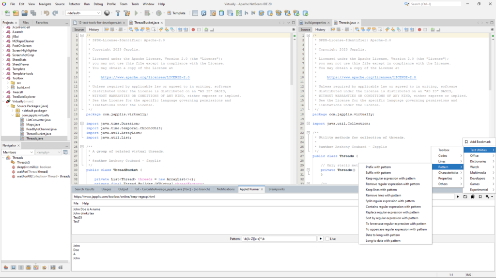](toolbox-extract-regexp-netbeans.png) *Japplis Toolbox Keep regexp tool running inside Apache NetBeans using the [NetBeans Applet Runner plugin](https://plugins.netbeans.apache.org/catalogue/?id=57)*

Note that it can also run embedded in Eclipse using the [Eclipse Applet Runner plugin](https://marketplace.eclipse.org/content/applet-runner-eclipse/) and that all tools mentioned in this article are available in the bookmarks of Applet Runner.

## 5️⃣ Unicode Encoding and Decoding

Unicode format is used in Java for text. You sometimes may need to convert like `\u20AC <-> €`. For example you may need to put the values in a *.properties* file.  
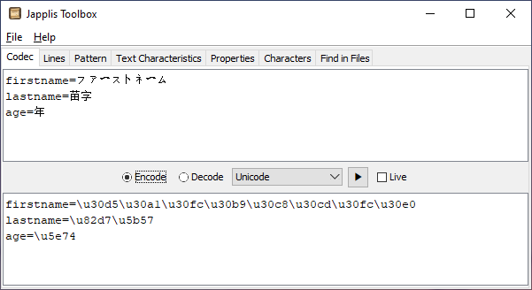 *Japplis Toolbox converting Japanese text to unicode for a user_ja.properties file*

## 6️⃣ UTF-8

Let's say you want to use the Greek alphabet but you don't have a Greek keyboard and you don't know the Unicode numbers for the alphabet.  
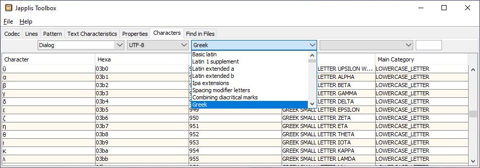 *Japplis Toolbox Characters tool with Font, Charset, Block and type choices*

Note that you can copy the character to the clipboard.

## 7️⃣ 1710942147063

If you see this number in log files, some of you may now what it means: the number of milliseconds since UNIX epoch (January 1, 1970 00:00:00 UTC).

You may be more interested to know the date/time from this number. Japplis Toolbox has a tool to convert it to a date/time using pattern as defined in the [DateTimeFormatter](https://docs.oracle.com/en/java/javase/21/docs/api/java.base/java/time/format/DateTimeFormatter.html).  
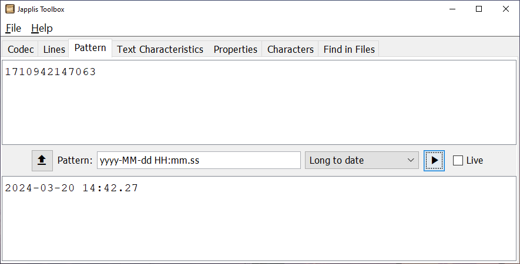 *Japplis Toolbox converting epoch time to a more human readable date/time (Zoomed UI 1.5)*

## 8️⃣ JSON and XML Formatter

When testing a web service, you may receive an unformatted answer. Japplis Toolbox includes an XML and JSON formatter.  
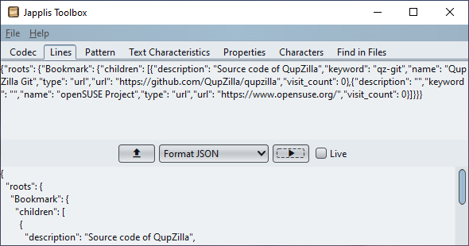 *Japplis Toolbox doing JSON formatting*

## 9️⃣ JSON and XML Explorer

Is it a lot of XML or JSON and you would like to navigate it easier? I've also released another freeware called [Tree Data Explorer](https://www.japplis.com/tree-data-explorer/) to help you visualize tree data structures.  
[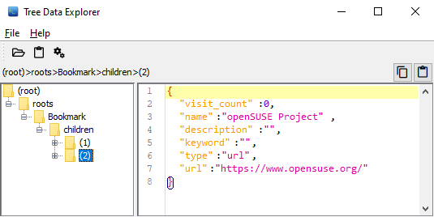](https://www.japplis.com/tree-data-explorer/) *Screenshot of Tree Data Explorer exploring a JSON*

Note that Tree Data Explorer is also available in the bookmarks of [Applet Runner IDE plug-in](https://www.japplis.com/applet-runner/).

## 🔟 Characters Count

Data needs to fit in the database. Often there could be a limitation in the number of characters. Japplis Toolbox includes a tool for it. If you have the '**Live**' checkbox checked, the value will be updated while you type.  
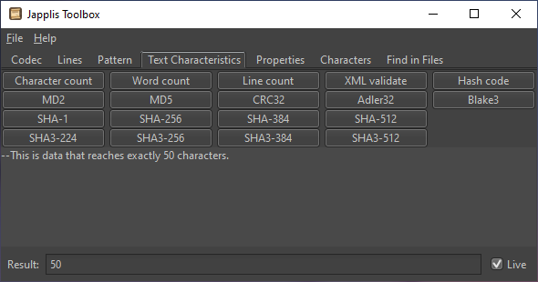 *Japplis Toolbox Text Characterics tools*

## 1️⃣1️⃣ Number Lines

You may need to explain code or data and to reference the line numbers.  
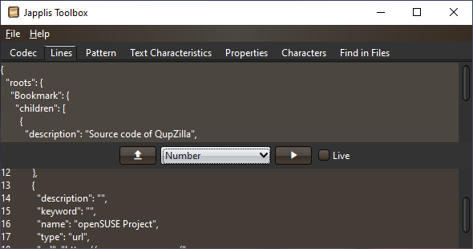 *Japplis Toolbox adding line numbers*

For example to specify '*description at line 14 is empty* '. Or maybe a tool is reporting '*missing value at line 15*' and you're wondering which line it is.

## 1️⃣2️⃣ Combine Tools

You can also create new text tools by combining tools. For example, I recently needed to extract keys from a *.properties* file for a YouTube thumbnail.

I used the following combinaison:

* Pattern -\> *Remove regexp* with pattern '=.\*' then **🔝**
* Pattern -\> *Remove lines* with pattern '#' then **🔝**
* Lines -\> *Remove empty* then **🔝**
* Pattern -\> *Suffix* with pattern ', ' then **🔝**
* Lines -\> Join

And since I wanted the list of a YouTube thumbnail, I used another of my tool [Poster Font](https://www.japplis.com/poster-font/) (Freemium) to make the text more beautiful.  
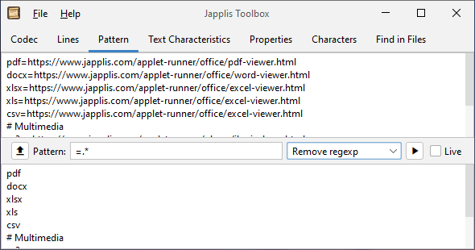  
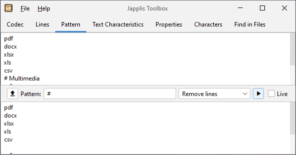  
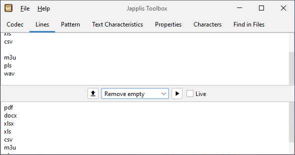  
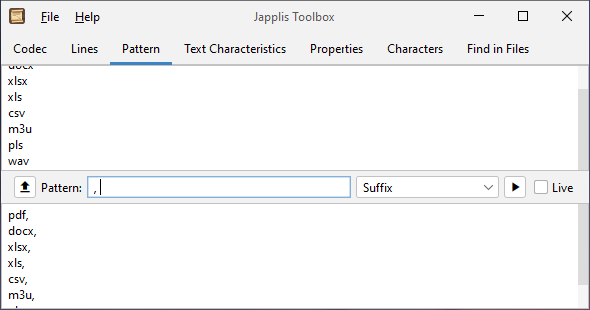  
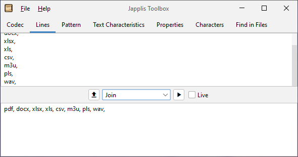  
[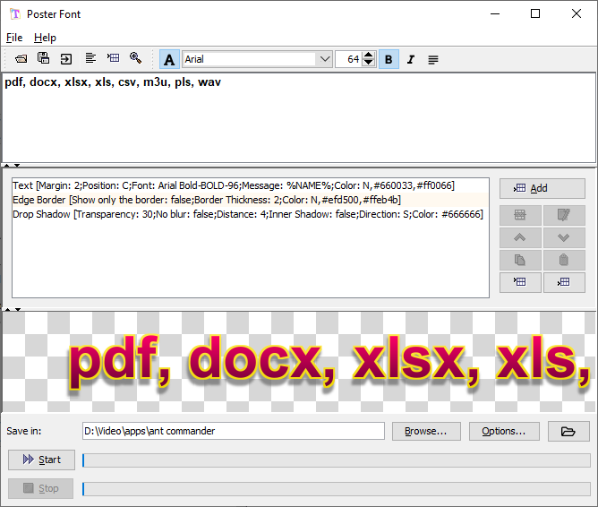](https://www.japplis.com/poster-font/) *[Poster Font](https://www.japplis.com/poster-font/) for text to image*

## Going Further

Is text manipulation something you do frequently? There is also [Japplis Toolbox Pro](https://www.japplis.com/toolbox/pro/) with

* Macros support
* Text area with history, undo/redo, disabled line wrap
* Input also from clipboard, files, urls
* Output to clipboard, file, directory, console
* And [more](https://www.japplis.com/toolbox/pro/index.html#features)

Note that [all my software](https://www.japplis.com/) are either freeware, freemium or free to try. And all are totally free for all Java Champions.

## Conclusion

In this article, I've shown you a few tools that hopefully will ease your work.

Note that Japplis Toolbox contains more than 50 tools.

It can be easily installed with the installers, homebrew, chocolatey, winget or in your Java IDE with the Applet Runner plugin.
