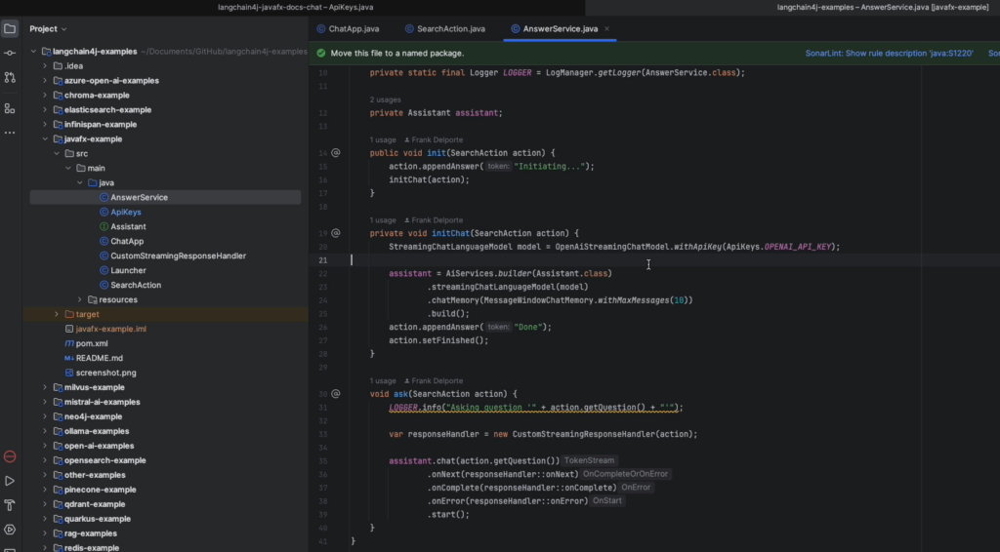
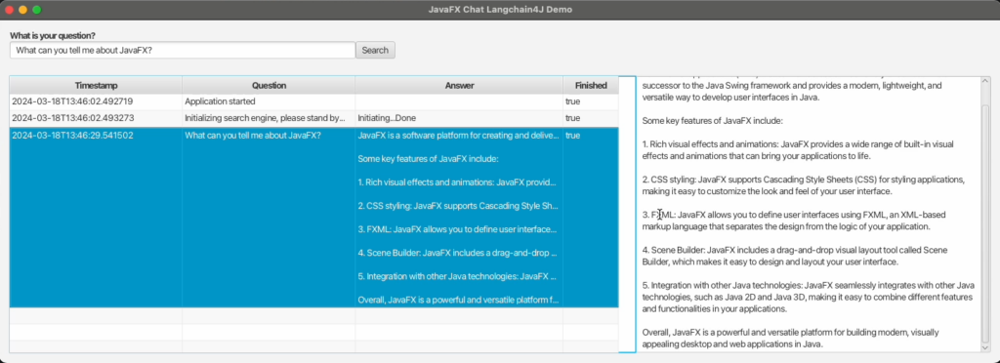
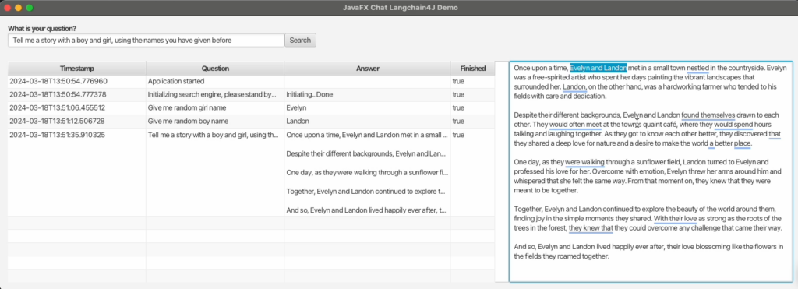
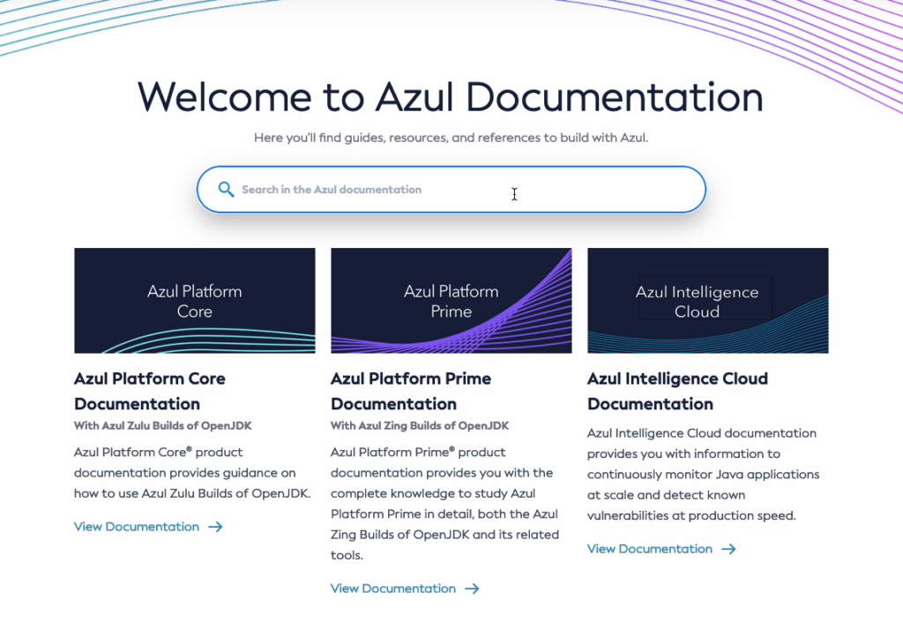
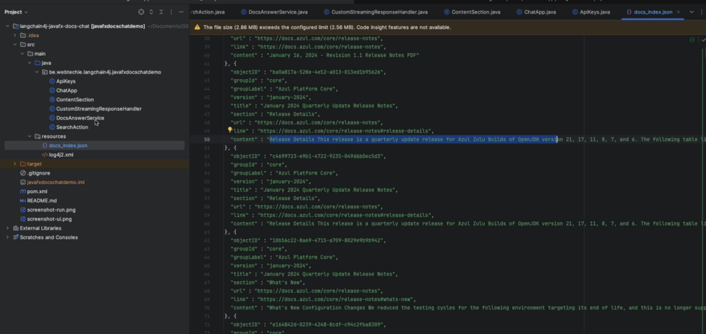
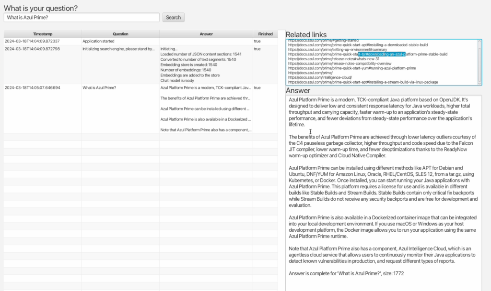

At the Fosdem conference in Brussels on February 3rd, I gave a presentation about using an existing documentation set as the data for a ChatGPT-like application, created with JavaFX and LangChain4J.

The [video and links of that presentation are available here](https://webtechie.be/post/2024-02-02-links-presentation-experiment-ai-llm-chat-with-docs/), and this post is a more detailed explanation of that application.

## What is LangChain4j

The goal of LangChain4j is to simplify the integration of AI and LLM capabilities into Java applications. The [project lives on GitHub](https://github.com/langchain4j/langchain4j/), and has a separate [repository with demo applications](https://github.com/langchain4j/langchain4j-examples).

I first learned about LangChain4j at the Devoxx conference in Antwerp in October last year. [Lize Raes gave an impressive presentation with 12 demos](https://www.youtube.com/watch?v=BD1MSLbs9KE).

In the last demo, she asked the application to give some answers based on a provided text. And that was exactly what I was looking for to be able to interact with an existing dataset.

### JavaFX LangChain4J Example Application

As a first step, I added a [JavaFX example application to the LangChain4j examples project](https://github.com/langchain4j/langchain4j-examples/tree/main/javafx-example).

This demo application uses OpenAI to get answers and the `StreamingChatLanguageModel` provided by LangChain4j to keep the previous questions so a chat can be created that has a memory of the previous questions.



The JavaFX code is rather limited as it only needs to provide a text input box to ask a question. By adding a `TableView` and `TextArea` you can see a list of the previous questions and the currently incoming answer, but of course, it's up to you to modify the look and feel depending on your needs.

When a question is asked, it gets stored in a `SearchAction`, which has JavaFX bindable properties to visualize the values in the JavaFX components in the user interface.

```
public class SearchAction {

    private final StringProperty timestamp;
    private final StringProperty question;
    private final StringProperty answer;
    private final BooleanProperty finished;

    public SearchAction(String question) {
        this(question, false);
    }

    public SearchAction(String question, Boolean finished) {
        this.timestamp = new SimpleStringProperty(LocalDateTime.now().toString());
        this.question = new SimpleStringProperty(question);
        this.answer = new SimpleStringProperty("");
        this.finished = new SimpleBooleanProperty(finished);
    }

    public StringProperty getTimestampProperty() {
        return timestamp;
    }

    public String getQuestion() {
        return question.getValue();
    }

    public StringProperty getQuestionProperty() {
        return question;
    }

    ...

    public void appendAnswer(String token) {
        this.answer.set(this.answer.getValue() + token);
    }
}
```

The `CustomStreamingResponseHandler.java` appends the incoming answer by using `Platform.runLater` to prevent thread issues between the code interacting with OpenAI and the JavaFX User Interface thread.

```
public class CustomStreamingResponseHandler {

    private final SearchAction action;

    public CustomStreamingResponseHandler(SearchAction action) {
        this.action = action;
    }

    public void onNext(String token) {
        Platform.runLater(() -> action.appendAnswer(token));
    }

    public void onComplete(Response<AiMessage> response) {
        Platform.runLater(() -> {
            action.setFinished();
        });
    }

    public void onError(Throwable error) {
        Platform.runLater(() -> {
            action.appendAnswer("\nSomething went wrong: " + error.getMessage());
            action.setFinished();
        });
    }
}
```

<figure class="wp-block-gallery has-nested-images columns-default is-cropped wp-block-gallery-1 is-layout-flex wp-block-gallery-is-layout-flex">
 <figure class="wp-block-image size-large">
  <a href="langchain4j-code.png" target="_blank" rel="noopener"></a>
 </figure>
 <figure class="wp-block-image size-large">
  <a href="langchain4j-question-javafx.png" target="_blank" rel="noopener"></a>
 </figure>
 <figure class="wp-block-image size-large">
  <a href="langchain4j-question-story.png" target="_blank" rel="noopener"></a>
 </figure>
</figure>

## Chat With the Azul Documentation

As a docs writer, and someone who loves to experiment with code from time to time, I wanted to find out if I could have an application that uses a real documentation set and provide answers based on it. The solution described here is not unique, as a lot of people are researching this kind of project.

See, for example, this [blog post by Marcus Hellberg](https://marcushellberg.dev/how-to-build-a-custom-chatgpt-assistant-for-your-documentation) who set up an experiment based on the [Vaadin documentation](https://vaadin.com/docs/latest/). It made me wonder if I could build something similar in Java, based on the [Azul documentation website](https://docs.azul.com/).



### Problems to Solve

Based on experience with ChatGPT, these are some of the problems that should be handled by building a custom application:

* Only answer Java-related questions.
* Only answer questions about Azul products, not competitors.
* Don't come up with answers if no info is found.
* Provide links to the documentation pages where more info is available.
* Be polite.

### Structured Documentation

At Azul, our documentation is created from different AsciiDocs projects per product, with a fully automated build pipeline to generate the HTML files and a JSON dataset for the Algolia search integration. And that JSON file is exactly what we need to feed into a search application to provide correct answers.

As it contains a data block per HTML-header element, it's fine-grained with a link to a specific part on a documentation page. In total, at this moment, there are more than 1500 of these blocks for the full documentation website in this format:

```
{
  "objectID" : "eb74e1cd-2f1d-4f32-9634-222492608070",
  "groupId" : "core",
  "groupLabel" : "Azul Platform Core",
  "version" : "january-2024",
  "title" : "Install Azul Zulu on macOS",
  "section" : "Install using a DMG installer",
  "url" : "https://docs.azul.com/core/install/macos",
  "link" : "https://docs.azul.com/core/install/macos#install-using-a-dmg-installer",
  "content" : "Install using a DMG installer Download a DMG installer for Azul Zulu from Azul Downloads. Double-click the file to start the installation and follow the wizard instructions. The default installation folder is:  /Library/Java/JavaVirtualMachines/<zulu_folder>/Contents/Home The <zulu_folder> placeholder represents the type of the Azul Zulu package (JDK or JRE) and its version: Package Azul Zulu folder name Example JDK zulu-<major_version>.jdk zulu-11.jdk JRE zulu-<major_version>.jre zulu-11.jre For example, the default installation folder for Azul Zulu JDK 11 is:  /Library/Java/JavaVirtualMachines/zulu-11.jdk/Contents/Home To verify your Azul Zulu installation, run the java command in a terminal window:  java -version You should see output similar to the following:  openjdk version \"11.0.11\" 2021-04-20 LTS\nOpenJDK Runtime Environment Zulu11.48+21-CA (build 11.0.11+9-LTS)\nOpenJDK 64-Bit Server VM Zulu11.48+21-CA (build 11.0.11+9-LTS, mixed mode)"
}
```

By using FasterXML Jackson, a record, and an ObjectMapper, this JSON can easily be converted to a list of Java objects:

```
public record ContentSection(
        @JsonProperty("objectID") UUID objectID,
        @JsonProperty("groupId") String groupId,
        @JsonProperty("groupLabel") String groupLabel,
        @JsonProperty("version") String version,
        @JsonProperty("title") String title,
        @JsonProperty("section") String section,
        @JsonProperty("url") String url,
        @JsonProperty("link") String link,
        @JsonProperty("content") String content) {
}

String json = Files.readString(Paths.get(fileUrl.toURI()));
ObjectMapper objectMapper = new ObjectMapper();
List<ContentSection> contentSections = objectMapper.readValue(json, new TypeReference<>() {});
```

### Java Application

The full [sources are available on GitHub](https://github.com/FDelporte/langchain4j-javafx-docs-chat). Most of the code is identical to the JavaFX demo application described above, which you can find in the LangChain4j examples repository.

The main differences can be found in `DocsAnswerService.java`. Here, all methods to load the documentation JSON and interact with OpenAI, are bundled.

#### Service Initialization

After all the `ContentSection` blocks are read, they are used to initialize an embedding model `AllMiniLmL6V2EmbeddingModel` that contains all these sections.

Also here, the chat model to interact with OpenAI gets initialized. This all takes some time depending on the number of items in the JSON. Once this is done, the application is ready to answer questions.

```
private void initChat(SearchAction action, List<ContentSection> contentSections) {
    List<TextSegment> textSegments = new ArrayList<>();
    for (var contentSection : contentSections.stream().filter(c -> !c.content().isEmpty()).toList()) {
        Map<String, String> metadataMap = new HashMap<>();
        metadataMap.put("OBJECT_ID", contentSection.objectID().toString());
        metadataMap.put("LINK", contentSection.link());
        metadataMap.put("GROUP_ID", contentSection.groupId());
        textSegments.add(TextSegment.from(contentSection.content(), Metadata.from(metadataMap)));
    }
    appendAnswer(action, "\nConverted to number of text segments: " + textSegments.size());

    embeddingModel = new AllMiniLmL6V2EmbeddingModel();
    embeddingStore = new InMemoryEmbeddingStore<>();
    appendAnswer(action, "\nEmbedding store is created: " + textSegments.size());

    List<Embedding> embeddings = embeddingModel.embedAll(textSegments).content();
    appendAnswer(action, "\nNumber of embeddings: " + embeddings.size());

    embeddingStore.addAll(embeddings, textSegments);
    appendAnswer(action, "\nEmbeddings are added to the store");

    chatModel = OpenAiStreamingChatModel.builder()
            .apiKey(ApiKeys.OPENAI_API_KEY)
            .modelName("gpt-4")
            .build();
    appendAnswer(action, "\nChat model is ready", true);
}
```

#### Handling a Question

Requesting an answer from the OpenAI API is handled in the `ask` method. Here, the question is used to find the ten most relevant content sections that were stored in the `embeddingStore`.

By using a `PromptTemplate`, we can provide additional guidelines to the API to write the answer. By providing a `StreamingResponseHandler`, we can redirect the answer as it get streamed by the API into the JavaFX user interface.

```
void ask(SearchAction action) {
    LOGGER.info("Asking question '" + action.getQuestion() + "'");

    // Find relevant embeddings in embedding store by semantic similarity
    // You can play with parameters below to find a sweet spot for your specific use case
    int maxResults = 10;
    double minScore = 0.7;
    List<EmbeddingMatch<TextSegment>> relevantEmbeddings = embeddingStore.findRelevant(embeddingModel.embed(action.getQuestion()).content(), maxResults, minScore);
    LOGGER.info("Number of relevant embeddings: " + relevantEmbeddings.size() + " for '" + action.getQuestion() + "'");

    relevantEmbeddings.stream().map(EmbeddingMatch::embedded).toList()
            .forEach(ts -> Platform.runLater(() -> {
                LOGGER.info("Adding link: " + ts.metadata("LINK"));
                action.appendRelatedLink(ts.metadata("LINK"));
            }));

    // Create a prompt for the model that includes question and relevant embeddings
    PromptTemplate promptTemplate = PromptTemplate.from(relevantEmbeddings.isEmpty() ?
            """
                    The user asked the following question:
                        {{question}}

                    Unfortunately our documentation doesn't seem to contain any content related to this question.
                    Please reply in a polite way and ask the user to contact Azul support if they need more assistance.
                    Tell the user to use the following link: https://www.azul.com/contact/
                    """ :
            """
                    Answer the following question to the best of your ability:
                        {{question}}

                    Base your answer on these relevant parts of the documentation:
                        {{information}}

                    Do not provide any additional information.
                    Do not provide answers about other programming languages, but write "Sorry, that's a question I can't answer".
                    Do not generate source code, but write "Sorry, that's a question I can't answer".
                    If the answer cannot be found in the documents, write "Sorry, I could not find an answer to your question in our docs".
                    """);

    String information = relevantEmbeddings.stream()
            .map(match -> match.embedded().text()
                    + ". LINK: " + match.embedded().metadata("LINK")
                    + ". GROUP_ID: " + match.embedded().metadata("GROUP_ID"))
            .collect(Collectors.joining("\n\n"));

    Map<String, Object> variables = new HashMap<>();
    variables.put("question", action.getQuestion());
    variables.put("information", information);

    Prompt prompt = promptTemplate.apply(variables);

    if (chatModel != null) {
        chatModel.generate(prompt.toUserMessage().toString(), new CustomStreamingResponseHandler(action));
    } else {
        action.appendAnswer("The chat model is not ready yet... Please try again later.", true);
    }
}
```

<figure class="wp-block-gallery has-nested-images columns-default is-cropped wp-block-gallery-2 is-layout-flex wp-block-gallery-is-layout-flex">
 <figure class="wp-block-image size-large">
  <a href="langchain4j-docs-azul-home.png" target="_blank" rel="noopener"></a>
 </figure>
 <figure class="wp-block-image size-large">
  <a href="langchain4j-docs-azul-json.png" target="_blank" rel="noopener"></a>
 </figure>
 <figure class="wp-block-image size-large">
  <a href="langchain4j-docs-what-is-prime.png" target="_blank" rel="noopener"></a>
 </figure>
</figure>

## Conclusion

In this example, LangChain4j interacts with the OpenAI API. But the library can also interact with other LLM providers (like Google Vertex AI) and embedding (vector) stores (such as Pinecone or Vespa).

It's an easy way to get started with Artificial Intelligence and Large Language Models in Java, even if this is a very new topic for you.

Thanks to the many examples provided in a separate repository, you can start easily and get results in a fast way.

At the time of writing, the main LangChain4j repository has almost 70 contributors and many daily commits. It's a very active project that keeps evolving and is worth trying out and keeping an eye on.
